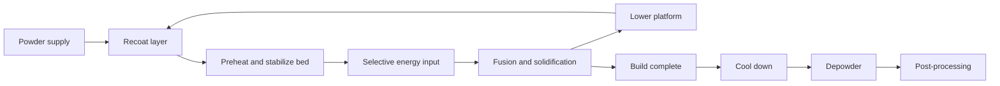
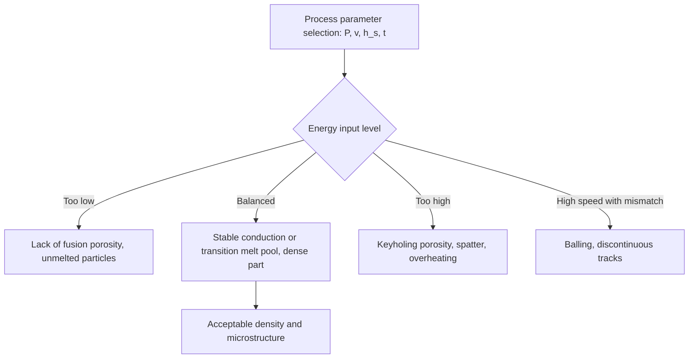

## Powder Bed Fusion Classification

### Introduction

Powder bed fusion (PBF) is one of the seven additive manufacturing (AM) process categories defined in ISO/ASTM 52900, described as a process in which thermal energy selectively fuses regions of a powder bed. It is the dominant category for high-performance metal AM and for functional polymer parts in low to medium volume, and it underpins applications in aerospace, medical implants, tooling, and industrial end-use components.

The ISO/ASTM 52900 framework treats PBF as a single category. Finer sub-classification is not formally standardized to the same depth, so the literature and industry classify PBF along several independent axes:

1. **Material family** (polymer, metal, ceramic, composite)
2. **Energy source** (laser, electron beam, infrared lamp, other)
3. **Fusion mechanism** (solid-state sintering, liquid-phase sintering, full melting, agent-assisted fusion)
4. **Selective heating strategy** (direct beam scanning versus area-wise agent-and-lamp approaches)
5. **Atmosphere and thermal environment** (inert gas, vacuum, preheated bed)
6. **Beam and machine architecture** (single-laser, multi-laser, beam shaping, scanning approach)
7. **Feedstock handling and recoating** (blade, roller, hopper, powder reuse strategy)

Many sub-variant names (SLS, SLM, DMLS, EBM, MJF, and others) are trademarks or vendor-specific terms that overlap in meaning. Generic descriptions are used below, with common names mapped where helpful. Readers should verify current standard editions and vendor specifics, since terminology and product lines evolve.

```mermaid
flowchart TD
    A[Powder Bed Fusion - ISO/ASTM 52900] --> B[By material family]
    A --> C[By energy source]
    A --> D[By fusion mechanism]
    A --> E[By selective heating strategy]
    A --> F[By atmosphere and thermal environment]
    A --> G[By machine architecture]

    B --> B1[Polymer PBF]
    B --> B2[Metal PBF]
    B --> B3[Ceramic and composite PBF]

    C --> C1[Laser: CO2, fiber, diode]
    C --> C2[Electron beam]
    C --> C3[Infrared lamp with agents]

    D --> D1[Solid-state sintering]
    D --> D2[Liquid-phase sintering]
    D --> D3[Full melting]
    D --> D4[Agent-assisted fusion]

    E --> E1[Point scanning]
    E --> E2[Area-wise agent plus lamp]

    F --> F1[Inert gas: argon, nitrogen]
    F --> F2[Vacuum]
    F --> F3[Preheated bed]

    G --> G1[Single laser]
    G --> G2[Multi-laser]
    G --> G3[Beam shaping and modulation]
```

### Fundamental Principle

Every PBF machine repeats a common cycle:

1. A recoater spreads a thin, uniform layer of powder over the build area.
2. A thermal energy source selectively heats regions corresponding to the layer cross-section, fusing particles to each other and to the layer below.
3. The build platform lowers by one layer thickness (or the powder delivery system shifts).
4. The cycle repeats until the build completes.
5. The part is removed from surrounding unfused powder and post-processed.

**Core energy and heat-transfer relationships**

The most widely used first-order descriptor for laser-based PBF is **volumetric energy density** (VED):

$$E_v = \frac{P}{v \cdot h_s \cdot t}$$

where $P$ is laser power (W), $v$ is scan speed (mm/s), $h_s$ is hatch spacing (mm), and $t$ is layer thickness (mm), giving J/mm³. **Example:** With $P = 250$ W, $v = 1000$ mm/s, $h_s = 0.11$ mm, and $t = 0.04$ mm:

$$E_v = \frac{250}{1000 \times 0.11 \times 0.04} = \frac{250}{4.4} \approx 56.8 \text{ J/mm}^3$$

VED is convenient for comparing parameter sets, but it does not capture melt pool dynamics, and different combinations that give the same $E_v$ can produce different densities and microstructures. Optimal windows are material and machine specific.

A related single-track descriptor is **linear energy density**:

$$E_l = \frac{P}{v}$$

The thermal penetration and melt pool size depend on absorbed power, thermal properties, and scan speed. A widely used analytical approximation for melt pool behavior is the Rosenthal moving point-source solution, in which the temperature at position $r$ from a moving source is:

$$T - T_0 = \frac{\eta P}{2 \pi k r} \exp\!\left(-\frac{v \,(r + \xi)}{2\alpha}\right)$$

where $\eta$ is absorptivity, $k$ is thermal conductivity, $\alpha$ is thermal diffusivity, $\xi$ is the coordinate along the scan direction, and $T_0$ is the initial temperature. This relation assumes a semi-infinite body, constant properties, and a point source, so it is an order-of-magnitude guide rather than a predictive model for thin powder layers.

### Classification 1: By Material Family

#### 1a. Polymer Powder Bed Fusion

Thermoplastic powders are heated close to their melting (semicrystalline) or softening (amorphous) point, and selected regions are fused. The surrounding unfused powder supports overhangs, so support structures for geometry are generally not needed.

| Attribute | Typical Characteristics |
| --- | --- |
| Common materials | Polyamide 12 (PA12), PA11, glass-filled and carbon-filled polyamides, TPU, PP, PEEK and PEKK (high-temperature systems) |
| Bed temperature | Held just below the melting or crystallization onset to reduce thermal gradients |
| Processing window | The gap between melting onset and crystallization onset; wide windows are favorable |
| Powder reuse | Partial refresh with virgin powder is required because aging changes viscosity and coalescence |
| Typical applications | Functional prototypes, end-use parts in low to medium volume, ducts, housings, orthotics |

**Sintering window concept.** For semicrystalline polymers the usable processing window is often quantified as the difference between melting onset and crystallization onset temperatures measured on heating and cooling (for example by DSC):

$$\Delta T_{\text{window}} = T_{m,\text{onset}} - T_{c,\text{onset}}$$

A larger $\Delta T_{\text{window}}$ allows the bed to be held at a temperature where unfused powder does not cake while fused regions remain molten long enough to coalesce, reducing warpage. Actual machine setpoints depend on equipment and material.

**Coalescence (viscous sintering).** Neck growth between two polymer particles at temperatures above melting is often described using the Frenkel model:

$$\left(\frac{x}{r}\right)^{2} = \frac{3 \, \sigma \, t}{2 \, \eta_v \, r}$$

where $x$ is the neck radius, $r$ is particle radius, $\sigma$ is surface tension, $\eta_v$ is viscosity, and $t$ is time. This early-stage relation applies to Newtonian viscous flow, whereas real polymers are viscoelastic, so it provides a qualitative guide only.

#### 1b. Metal Powder Bed Fusion

Metal powders are fully or largely melted by a focused beam, giving near-fully dense parts with properties often comparable to (or in some conditions different from) wrought or cast counterparts, depending on alloy, parameters, and heat treatment.

| Attribute | Typical Characteristics |
| --- | --- |
| Common materials | Ti-6Al-4V, stainless steels (316L, 17-4 PH), Inconel 718 and 625, aluminum alloys (AlSi10Mg, others), cobalt-chromium, tool steels, copper alloys, refractory metals (specialized) |
| Feedstock | Gas-atomized spherical powder, typically tens of micrometers in diameter (particle size distribution is machine specific) |
| Supports | Required for overhangs, anchoring to the platform, and heat conduction |
| Post-processing | Stress relief, support removal, hot isostatic pressing (HIP) in critical applications, machining, surface finishing |
| Typical applications | Aerospace brackets, lattice and topology-optimized parts, medical implants, tooling with conformal cooling |

Residual stress arises from rapid, localized heating and cooling. A first-order thermal stress estimate for a constrained layer cooling by $\Delta T$ is:

$$\sigma_{\text{res}} \approx E \, \alpha_{\text{th}} \, \Delta T$$

where $E$ is Young's modulus and $\alpha_{\text{th}}$ is the coefficient of thermal expansion. Because this expression assumes full constraint and elastic behavior, it typically overestimates the stress that survives after yielding; in practice residual stress is limited near the yield strength at elevated temperature.

#### 1c. Ceramic and Composite Powder Bed Fusion

Ceramic PBF is challenging because of high melting points, low thermal shock resistance, and low absorptivity for some wavelengths. Common approaches include:

- **Indirect routes**: ceramic powder coated or mixed with a polymer binder that is fused by the laser; the green part is then debinded and sintered in a furnace.
- **Direct routes**: high-power lasers melt ceramics (for example alumina-zirconia eutectic compositions) with substantial thermal cracking risk; these are largely research-stage.
- **Composite powders**: polymer matrix with ceramic or metal fillers, or metal matrix composites with ceramic reinforcement.

[Inference: Direct ceramic PBF is expected to remain more limited in industrial adoption than metal and polymer PBF until crack and porosity control improve.]

### Classification 2: By Energy Source

| Energy Source | Wavelength / Mode | Typical Use | Key Characteristics |
| --- | --- | --- | --- |
| **CO₂ laser** | Far infrared, about 10.6 µm | Polymer PBF | Strongly absorbed by most polymers; poorly absorbed by many metals |
| **Fiber laser** | Near infrared, about 1.07 µm | Metal PBF (and some polymer systems) | Good absorptivity in many metals; high beam quality; compact and efficient |
| **Diode and other lasers** | Various (including blue and green in emerging systems) | Copper and other high-reflectivity metals (green and blue), polymer PBF | Shorter wavelengths improve absorption in copper and gold |
| **Electron beam** | Accelerated electrons in vacuum | Metal PBF (EBM) | Deep energy deposition; high beam power; preheated bed; vacuum environment |
| **Infrared lamp with agents** | Broad infrared | Polymer PBF (agent-based) | Absorbers jetted in selected regions raise local heating; area-wise exposure |

**Absorptivity considerations.** Absorptivity $A$ of the powder bed is generally higher than that of bulk metal because multiple reflections between particles trap light. The absorbed power is:

$$P_{\text{abs}} = A \, P$$

and the value of $A$ varies with wavelength, material, powder morphology, oxide layer, and whether the surface is powder or melt. Using shorter wavelengths (green or blue) for copper is motivated by the substantially higher absorptivity of copper at those wavelengths relative to near-infrared.

### Classification 3: By Fusion Mechanism

| Mechanism | Description | Typical Materials | Comments |
| --- | --- | --- | --- |
| **Solid-state sintering** | Particles bond by atomic diffusion below the melting point | Some polymers, ceramics, and metals (slow in laser timescales) | Rarely the sole mechanism at laser scan speeds; more relevant in furnace sintering |
| **Liquid-phase sintering (partial melting)** | A low-melting phase melts and binds solid particles | Polymer powders (partial melting of surfaces), bronze-steel mixes, ceramic-polymer composites | Often leaves residual porosity |
| **Full melting** | Powder fully melts to form a melt pool that solidifies | Most modern metal PBF | Produces near-fully dense parts; sensitive to defects such as keyholing and lack of fusion |
| **Agent-assisted fusion** | Jetted agents change local absorption so lamp exposure fuses selected regions | Polymer PBF (for example fusing and detailing agents) | Area-wise fusion; detailing agents control edges |

**Naming note.** Trade names such as *selective laser sintering* (SLS) and *direct metal laser sintering* (DMLS) reflect historical terminology; modern metal PBF is typically full-melting rather than sintering. The generic ISO/ASTM term for the laser metal process is *laser powder bed fusion of metals* (PBF-LB/M), and for polymers is *PBF-LB/P*. For electron beam metal PBF the term is PBF-EB/M. These designations combine the category with the energy source and material, and are used in more recent standards and literature (verify against current ISO/ASTM documents).

### Classification 4: By Selective Heating Strategy

#### 4a. Point-Scanning (Beam-Based) Systems

A focused beam is scanned along vectors, melting material along tracks. Scan strategy (stripe, chessboard, island, contour offsets, rotation between layers) controls thermal history and residual stress.

- Spot diameter (commonly tens to a few hundred micrometers) governs minimum feature size
- Build time scales with the total scanned length and layer count
- Multi-laser machines split the build area among lasers and require careful overlap zone management

#### 4b. Area-Wise (Agent-and-Lamp) Systems

An inkjet-style print carriage deposits **fusing agent** (an infrared absorber) in the cross-section and **detailing agent** near edges. A lamp sweeps the whole layer, heating agent-coated regions above melting while uncoated powder stays below.

- Build rate is largely independent of the amount of geometry within a layer, so dense nesting is efficient
- Resolution is influenced by droplet placement, agent spreading, and thermal bleed
- Because heating relies on absorptivity contrast, part color and properties are affected by the agent

**Approximate absorbed energy contrast.** The temperature rise depends on absorbed lamp energy per unit area $q_{\text{abs}}$:

$$\Delta T \approx \frac{q_{\text{abs}}}{\rho \, c_p \, t}$$

where $\rho$ is bulk powder density, $c_p$ is specific heat, and $t$ is layer thickness. The fusing agent raises $q_{\text{abs}}$ in selected regions so that $\Delta T$ exceeds the melting requirement there, while unagented regions remain below it. This is a simplified adiabatic estimate that neglects conduction losses.

### Classification 5: By Atmosphere and Thermal Environment

| Environment | Description | Typical Process | Notes |
| --- | --- | --- | --- |
| **Inert gas (argon or nitrogen)** | Continuous flow of inert gas over the bed | Laser metal PBF, laser polymer PBF | Removes spatter and condensate; limits oxidation; oxygen level monitored |
| **Vacuum** | Chamber evacuated (with small helium bleed in some systems) | Electron beam PBF | Required for electron beam propagation; reduces oxidation; suited to reactive metals |
| **Preheated bed** | Bed held at elevated temperature | Polymer PBF; EBM; some metal PBF systems | Reduces thermal gradients and residual stress; can sinter surrounding powder into a cake |
| **Ambient or lightly heated bed** | Platform heated modestly (for example 80 to 200 °C for some metal systems) | Many laser metal PBF machines | Moderate stress reduction |

Electron beam PBF commonly operates with a bed preheated to elevated temperatures (often in the hundreds of degrees Celsius to above 1000 °C depending on alloy), which tends to reduce residual stress but produces a partially sintered powder cake that requires powder recovery systems. The electron beam also requires electrically conductive powder to avoid charging effects, sometimes called "smoke" or powder scattering; preheating to lightly sinter the bed mitigates this.

### Classification 6: By Machine Architecture

| Attribute | Variants | Considerations |
| --- | --- | --- |
| **Number of energy sources** | Single, dual, quad, or more lasers | Multi-laser increases throughput; requires stitching, overlap control, and gas flow management |
| **Beam shaping** | Gaussian, ring, top-hat, adjustable mode beams | Beam shaping can reduce spatter and improve productivity; effects depend on alloy and parameters |
| **Beam delivery** | Galvanometer scanners with f-theta lens, dynamic focus systems | Determines usable area, spot uniformity, and edge distortion |
| **Recoater type** | Rigid blade, flexible or brush blade, roller, ceramic blade | Recoating quality controls layer density and defects; blade collisions with warped parts cause failures |
| **Build volume class** | Small (about 100 mm scale), medium (about 250 mm), large (about 400 mm to 1 m or more) | Scale affects gas flow, thermal management, and cost |
| **Powder handling** | Open loop or closed loop, sieving stations, inert transfer | Affects safety, contamination risk, and reuse |
| **In-situ monitoring** | Melt pool photodiodes, coaxial cameras, layerwise imaging, thermal cameras, acoustic sensing | Supports defect detection and qualification |

### Sub-Variant Mapping Table

| Generic Designation | Common or Vendor Names | Energy Source | Material | Environment |
| --- | --- | --- | --- | --- |
| PBF-LB/P | SLS, laser sintering | CO₂ or other laser | Polymer | Heated bed, nitrogen |
| PBF-LB/M | SLM, DMLS, LPBF, LMF (vendor terms) | Fiber laser (mostly) | Metal | Argon or nitrogen |
| PBF-EB/M | EBM | Electron beam | Metal | Vacuum, hot bed |
| Agent-based polymer PBF | MJF, HSS, and similar (vendor terms) | Infrared lamp | Polymer | Heated bed, inert or controlled |
| Selective laser melting of ceramics or indirect ceramic PBF | Research and niche | Laser | Ceramic or ceramic composite | Varies |

[Inference: exact category assignment of agent-based systems may vary in informal usage, but they are generally grouped within PBF because the powder bed is thermally fused; consult current ISO/ASTM terminology for authoritative wording.]

### Comparative Table of Principal PBF Variants

| Attribute | PBF-LB/P | PBF-LB/M | PBF-EB/M | Agent-based polymer PBF |
| --- | --- | --- | --- | --- |
| Energy delivery | Point-scanned laser | Point-scanned laser | Scanned electron beam | Lamp with jetted agents |
| Typical layer thickness | About 0.08 to 0.15 mm | About 0.02 to 0.08 mm | About 0.05 to 0.2 mm | About 0.08 to 0.12 mm |
| Support structures | Not needed for overhang support | Needed for anchoring and heat flow | Fewer needed due to hot bed | Not needed for overhang support |
| Surface roughness | Grainy, moderate | Moderate, as-built rough | Rougher | Moderate |
| Residual stress | Low | High | Low to moderate | Low |
| Material range | Polyamides and a few others | Wide (many alloys) | Narrower (conductive metals, mainly Ti, Co-Cr, Ni alloys) | Polyamides, TPU |
| Nesting efficiency | High (3D nesting in powder) | Limited by supports and platform | Moderate | High |
| Typical post-processing | Depowder, bead blast, dye or coat | Stress relief, cut-off, machine, HIP | Powder recovery, machine, HIP | Depowder, bead blast, dye |

Layer thickness and other values above are typical ranges only and depend on machine and material.

### Process Parameters and Their Roles

| Parameter | Effect | Typical Consideration |
| --- | --- | --- |
| **Laser power** | Sets absorbed energy; too high causes keyholing and spatter; too low causes lack of fusion | Tuned with scan speed for a stable melt pool |
| **Scan speed** | Sets interaction time; affects melt pool geometry and cooling rate | High speed with high power increases productivity but risks balling |
| **Hatch spacing** | Overlap between adjacent tracks | Too wide leaves unfused gaps; too narrow overheats and wastes time |
| **Layer thickness** | Sets resolution and build time; must be less than melt depth | Thicker layers raise productivity but need more energy |
| **Scan strategy** | Rotation, stripes, islands, contours | Manages heat accumulation, residual stress, and texture |
| **Preheat temperature** | Reduces thermal gradients | Polymers: set from the sintering window; metals: system dependent |
| **Gas flow** | Removes spatter and fumes | Uniform flow across the build area is important |
| **Powder characteristics** | Flowability, particle size distribution, morphology, oxygen content | Control through sieving, storage, and reuse tracking |

**Melt pool stability and defect mapping.** The key defect regimes are commonly mapped in power-speed space:

An often-used dimensionless indicator of melt pool regime is the normalized enthalpy:

$$\frac{\Delta H}{h_s^{*}} = \frac{A \, P}{h_m \sqrt{\pi \, \alpha \, v \, \sigma_b^{3}}}$$

where $h_m$ is the enthalpy at melting, $\alpha$ is thermal diffusivity, $\sigma_b$ is the beam radius, and $A P$ is absorbed power. Higher normalized enthalpy corresponds to deeper, keyhole-prone melt pools, while lower values indicate conduction-mode or insufficient melting. The exact thresholds vary by alloy and are established experimentally, so they should be treated as approximate.

### Defects and Quality Concerns by Classification

| Defect | Most Relevant Variants | Cause | Mitigation |
| --- | --- | --- | --- |
| **Lack of fusion porosity** | Laser metal and polymer PBF | Insufficient energy, poor overlap | Increase energy density, adjust hatch spacing and layer thickness |
| **Keyhole porosity** | Laser metal PBF | Excess energy causing vapor depression collapse | Reduce power or speed, beam shaping |
| **Balling** | Laser metal PBF | Unstable melt track from high speed and low power | Lower speed, increase power, improve powder spreading |
| **Warping and delamination** | Metal PBF (laser), polymer PBF (thermal gradients) | Residual stress, thermal contraction | Supports, orientation, preheating, stress relief |
| **Cracking** | Crack-susceptible alloys (some nickel superalloys, high-strength aluminum, ceramics) | Solidification cracking and thermal stress | Composition modification, preheating, scan strategy |
| **Recoater collisions** | Metal PBF | Part curl above layer level | Support design, recoater material, orientation |
| **Powder aging** | Polymer PBF | Repeated thermal exposure changes viscosity and coalescence | Refresh ratio, track powder history |
| **Powder contamination and oxidation** | All | Moisture, oxygen, cross-contamination | Controlled storage, inert handling, sieving |
| **Rough surface and orange peel** | Polymer PBF | Incomplete melt and particle adhesion | Parameter tuning, post-process finishing |
| **Spatter and condensate redeposition** | Laser metal PBF | Vaporization and ejected droplets | Gas flow optimization, filter maintenance |

### Post-Processing Chains by Classification

**Polymer PBF**

1. Cool-down inside the machine (slow cooling reduces warpage)
2. Part extraction from powder cake
3. Depowdering (brushing, air, media blasting)
4. Optional surface finishing (bead blasting, tumbling, chemical vapor smoothing, dyeing, coating)
5. Inspection

**Metal PBF (laser)**

1. Depowder the build plate
2. Stress relief heat treatment while still attached to the platform
3. Part removal (wire EDM, band saw)
4. Support removal
5. Heat treatment or HIP to reduce porosity and tailor microstructure
6. Machining of critical surfaces
7. Surface finishing (blasting, polishing, electropolishing, chemical or abrasive flow)
8. Inspection (CT, dimensional, mechanical testing)

**Electron beam PBF**

1. Cool down under controlled conditions
2. Powder recovery system removes the lightly sintered cake
3. Part cleaning
4. Optional HIP and machining

### Design and Selection Guidance

**Key Points**

- Choose **polymer PBF** for complex, support-free geometries in engineering thermoplastics with efficient nesting; choose **agent-based polymer systems** for high throughput of many parts.
- Choose **laser metal PBF** for fine features and high-resolution metal components; plan for supports, stress relief, and machining of critical interfaces.
- Choose **electron beam PBF** for reactive or crack-prone alloys and for lower residual stress, accepting rougher surfaces and vacuum operation.
- Design for orientation: overhang angle limits (often around 45° from the platform for metals without supports), minimum wall thickness, and feature size depend on machine and material (verify with manufacturer guidelines).
- Include **powder removal paths** for internal channels and cavities; closed voids trap powder.
- Use **lattice and topology-optimized** designs to exploit geometric freedom, while ensuring they can be depowdered and inspected.
- Qualify **powder lifecycle**: track reuse cycles, oxygen and moisture content, particle size distribution, and flowability.
- Consider **safety**: metal powders can be combustible or explosive (particularly fine reactive powders such as aluminum and titanium), and fine polymer and metal powders pose respiratory hazards; follow applicable regulations and standards.

**Example: selecting a PBF variant.** An aerospace supplier needs a titanium bracket with internal lattice structure, a tolerance of ±0.1 mm on interfaces, and certified material properties. Laser metal PBF (PBF-LB/M) in Ti-6Al-4V is a common choice for fine detail and mechanical properties, with stress relief, HIP, and machining of interfaces. If the same part is a larger, simpler shape and the supplier accepts rougher surfaces to reduce residual stress and build time, electron beam PBF may be considered. The choice ultimately depends on part geometry, required surface finish, qualification pathways, and cost.

### Standards and Terminology Context

- **ISO/ASTM 52900** defines powder bed fusion as a process category and provides terminology.
- Designations such as PBF-LB/M, PBF-LB/P, and PBF-EB/M encode the category, energy source, and material family and are increasingly used in standards and literature (verify current usage in the latest editions).
- Process- and material-specific standards exist for qualification, feedstock (powder) characterization, and part testing, including ASTM F-series material specifications for common PBF alloys and polymers and the ISO/ASTM 529xx series for design, qualification, and testing. Editions and scope change, so consult current ISO and ASTM catalogs.
- Regulated industries (aerospace, medical, energy) add their own qualification and certification requirements on top of the general standards.

### Emerging Directions

- Higher-power multi-laser systems and larger build volumes for productivity
- Green and blue laser sources for copper and precious metals
- Beam shaping and dynamic beam control to tailor melt pool and microstructure
- In-situ monitoring and closed-loop control for defect detection and qualification
- Novel alloys designed for PBF's rapid solidification (for example crack-resistant aluminum and nickel compositions)
- High-temperature polymer and composite PBF (PEEK, PEKK, carbon-filled)
- Alternative fusion approaches (for example laser-free sintering with binders) that blur the boundary with binder jetting

[Inference: as processes evolve, category boundaries between PBF, binder jetting with sintering, and hybrid technologies may require clarification in future standard revisions.]

### Conclusion

Powder bed fusion is formally a single ISO/ASTM 52900 category, but it is practically classified along multiple axes: material family (polymer, metal, ceramic and composite), energy source (CO₂ laser, fiber laser, other lasers, electron beam, infrared lamp with agents), fusion mechanism (sintering, liquid-phase sintering, full melting, agent-assisted fusion), selective heating strategy (point scanning versus area-wise exposure), atmosphere and thermal environment (inert gas, vacuum, preheated bed), and machine architecture (laser count, beam shaping, recoating, monitoring). These axes explain why vendor names such as SLS, SLM, DMLS, EBM, and MJF map onto a small number of underlying physical mechanisms, and they drive trade-offs in resolution, residual stress, material range, nesting efficiency, and post-processing. Effective use of the classification pairs the generic designation with material, parameter set, powder management, and post-processing route.

### Next Steps

- Laser-material interaction and melt pool physics in metal PBF
- Powder characterization, reuse strategy, and qualification
- Scan strategy optimization and residual stress control
- Support design and build orientation for metal PBF
- Polymer PBF powder aging and refresh strategies
- Defect detection: in-situ monitoring, CT inspection, and qualification approaches
- Heat treatment and HIP for PBF metals
- Comparing PBF with directed energy deposition and binder jetting for metal parts