## Material Extrusion Classification

### Introduction

Material extrusion (MEX) is one of the seven additive manufacturing (AM) process categories defined in ISO/ASTM 52900, described as a process in which material is selectively dispensed through a nozzle or orifice. It is the most widely deployed AM category by installed machine count, spanning hobbyist desktop printers, industrial thermoplastic systems, large-format pellet extruders, ceramic and metal paste systems, concrete construction printers, food printers, and bioprinters.

ISO/ASTM 52900 treats MEX as a single category. Finer sub-classification is not standardized to the same depth, so the literature and industry classify MEX along several independent axes:

1. **Feedstock form** (filament, pellet or granule, paste or slurry, ink or gel, highly filled composite filament, continuous fiber)
2. **Material-flow and solidification mechanism** (thermal melt-and-solidify, evaporation or solvent removal, chemical or photo-cure, gelation or yield-stress recovery, cure-on-demand)
3. **Material family** (thermoplastic, thermoset, ceramic, metal, cementitious, biological, food)
4. **Extrusion drive mechanism** (filament pinch drive, screw, piston or syringe, pneumatic, progressive cavity)
5. **Motion and kinematic architecture** (Cartesian, delta, CoreXY, gantry, robotic arm, multi-axis, rotating or conveyor bed)
6. **Nozzle and toolhead configuration** (single, multi-nozzle, tool-changing, mixing, coaxial, multi-material)
7. **Thermal environment and scale** (open, heated bed, heated chamber, large-format, micro-scale)

Sub-variant names such as FDM, FFF, FGF, DIW, and CEM are commonly used; some are trademarks (FDM is a Stratasys trademark) or community terms. Generic descriptions are used below, with common names mapped where helpful. Readers should verify current standard editions and vendor specifics, since terminology and products evolve.

```mermaid
flowchart TD
    A[Material Extrusion - ISO/ASTM 52900] --> B[By feedstock form]
    A --> C[By solidification mechanism]
    A --> D[By material family]
    A --> E[By drive mechanism]
    A --> F[By kinematic architecture]
    A --> G[By toolhead configuration]
    A --> H[By thermal environment and scale]

    B --> B1[Filament]
    B --> B2[Pellet or granule]
    B --> B3[Paste or slurry]
    B --> B4[Ink or gel]

    C --> C1[Thermal melt and cool]
    C --> C2[Solvent evaporation]
    C --> C3[Chemical or photo-cure]
    C --> C4[Yield-stress recovery or gelation]

    D --> D1[Thermoplastics and composites]
    D --> D2[Ceramic and metal filled]
    D --> D3[Cementitious]
    D --> D4[Biological and food]

    E --> E1[Pinch-roller filament drive]
    E --> E2[Screw extruder]
    E --> E3[Piston or syringe]
    E --> E4[Pneumatic]

    F --> F1[Cartesian, CoreXY, delta]
    F --> F2[Gantry and robotic arm]
    F --> F3[Multi-axis and non-planar]

    G --> G1[Single nozzle]
    G --> G2[Multi-nozzle and tool-changer]
    G --> G3[Mixing and coaxial]

    H --> H1[Open or heated bed]
    H --> H2[Heated chamber]
    H --> H3[Large-format and micro-scale]
```

### Fundamental Principle

Every MEX process repeats a common cycle:

1. Feedstock is conveyed to a conditioning zone (heated liquefier, barrel, or reservoir).
2. Material is pressurized and forced through a nozzle, forming a continuous bead (also called a road or raster).
3. The toolhead and build platform move relative to each other along toolpaths generated from the sliced model.
4. The deposited bead bonds to neighboring beads and to the layer below.
5. The bead solidifies (by cooling, drying, cure, or gelation).
6. The platform indexes by one layer height, and the cycle repeats.

**Core process relationships**

The volumetric deposition rate is set by bead cross-section and print speed:

$$\dot{V} = w \cdot h \cdot v$$

where $w$ is extrusion width, $h$ is layer height, and $v$ is print speed. **Example:** With $w = 0.45$ mm, $h = 0.20$ mm, and $v = 80$ mm/s:

$$\dot{V} = 0.45 \times 0.20 \times 80 = 7.2 \text{ mm}^3/\text{s}$$

Mass conservation between the feedstock inlet and the bead links filament feed rate to print speed. For filament of diameter $d_f$ feeding at velocity $v_f$:

$$\frac{\pi d_f^{2}}{4} \, v_f = w \cdot h \cdot v \cdot \varepsilon_{\text{flow}}$$

where $\varepsilon_{\text{flow}}$ is a flow multiplier (extrusion multiplier) that is set near 1 and calibrated to account for bead cross-section shape, material compressibility, and measured filament diameter. **Example:** For $d_f = 1.75$ mm and the deposition rate above ($7.2$ mm³/s) with $\varepsilon_{\text{flow}} = 1$:

$$v_f = \frac{7.2}{\pi \times 1.75^{2}/4} = \frac{7.2}{2.405} \approx 2.99 \text{ mm/s}$$

The required feed rate must not exceed what the hot end can melt. A common first-order limit on melting capacity is:

$$\dot{V}_{\max} \approx \frac{P_{\text{heater}} \, \eta_{\text{th}}}{\rho \left( c_p \, \Delta T + \Delta H_f \right)}$$

where $P_{\text{heater}}$ is heater power, $\eta_{\text{th}}$ is thermal transfer efficiency, $\rho$ is melt density, $c_p$ is specific heat, $\Delta T$ is the temperature rise from feed temperature to nozzle temperature, and $\Delta H_f$ is the latent heat of fusion (for semicrystalline polymers). This ignores conduction losses and residence-time effects, so it is an upper-bound estimate, and real limits depend on hot end geometry and material.

**Pressure drop through the nozzle.** For a power-law (shear-thinning) melt in a cylindrical capillary of radius $R$ and length $L$, the pressure drop is:

$$\Delta P = \frac{2 L K}{R} \left( \frac{(3n+1)\,Q}{n \pi R^{3}} \right)^{n}$$

where $Q$ is volumetric flow rate, $K$ is the consistency index, and $n$ is the power-law index (with $n < 1$ for shear-thinning polymers). The equation shows why smaller nozzles and higher flow rates sharply raise required drive force, and why shear-thinning helps. Entrance pressure losses and viscoelastic effects are neglected, so it is a guide rather than a precise prediction.

### Classification 1: By Feedstock Form

#### 1a. Filament-Based Extrusion (Fused Filament Fabrication, FFF)

A continuous thermoplastic filament (commonly 1.75 mm or 2.85 mm nominal diameter) is driven by a pinch-roller or gear mechanism into a heated liquefier and through a nozzle.

- The solid filament acts as a piston to pressurize the melt, so buckling of the filament in the cold zone limits pushing force
- Dimensional consistency of filament diameter directly affects flow accuracy
- Filament must be dry for hygroscopic polymers (nylon, PETG, PVA, and others) because absorbed moisture causes bubbling and poor bonding
- Widely used for desktop, professional, and industrial systems

The critical buckling load of the filament column between the drive gear and the liquefier entrance can be approximated with the Euler relation:

$$F_{\text{cr}} = \frac{\pi^{2} E I}{(K_e L_u)^{2}}, \qquad I = \frac{\pi d_f^{4}}{64}$$

where $E$ is filament modulus, $L_u$ is the unsupported length, and $K_e$ is the effective-length factor for the end conditions. Stiffer filaments (for example filled or high-modulus grades) tolerate higher drive force, whereas soft filaments (TPU) buckle easily and need short, guided paths or direct-drive extruders.

#### 1b. Pellet and Granule Extrusion (Fused Granulate or Fused Granular Fabrication, FGF or FPF)

Thermoplastic pellets are fed into a heated barrel with a screw that conveys, melts, mixes, and pressurizes the polymer through a nozzle.

- Much higher throughput than filament systems (kilograms per hour on large-format machines)
- Lower feedstock cost and access to a broad material range, including recycled and filled polymers
- Suited to large-format parts such as tooling, furniture, and architectural components
- Screw drives allow larger nozzle diameters (millimeters to centimeters), producing thicker beads and a coarser surface finish

Screw output is often estimated from drag flow:

$$Q_d = \tfrac{1}{2} \, \pi^{2} D^{2} N \, h_c \sin\phi \cos\phi$$

where $D$ is screw diameter, $N$ is rotational speed, $h_c$ is channel depth in the metering section, and $\phi$ is helix angle. Actual output is reduced by pressure flow and leakage, so the relation gives the maximum drag-flow contribution.

#### 1c. Paste, Slurry, and Highly Filled Feedstock (Direct Ink Writing, DIW, and Related Processes)

Viscoelastic pastes with a yield stress are extruded by piston, syringe, screw, or pneumatic pressure. Solidification occurs by evaporation, gelation, cure, or thermal transition.

- Material examples include ceramic pastes, metal pastes, cementitious mixtures, silicone, polymer solutions, conductive inks, hydrogels, and food purees
- Filament-like beads retain their shape when the material has a sufficiently high yield stress at rest but shear-thins under flow
- Post-processing often includes drying, debinding, and sintering (for ceramic and metal pastes)

A widely used rheological model for these materials is the **Herschel-Bulkley** relation:

$$\tau = \tau_y + K \dot{\gamma}^{\,n}$$

where $\tau$ is shear stress, $\tau_y$ is yield stress, $K$ is consistency index, $\dot{\gamma}$ is shear rate, and $n$ is the flow index. Shape retention after deposition requires that the yield stress support the self-weight of subsequent layers. A rough estimate of the maximum self-supporting stack height $H_{\max}$ from yield stress is:

$$H_{\max} \approx \frac{\tau_y \, \sqrt{3}}{\rho g} \cdot c_s$$

where $\rho$ is density, $g$ is gravitational acceleration, and $c_s$ is a geometry-dependent constant (commonly in the range of a few units for wall-like structures). This estimate follows from a von Mises-type criterion for a plastic column and neglects thixotropic build-up and time-dependent strength gain, so it should be used qualitatively.

#### 1d. Composite and Continuous-Fiber Feedstock

- **Short-fiber-filled filaments and pellets** (carbon fiber, glass fiber, or other fillers) increase stiffness and reduce warpage but raise nozzle wear and can lower interlayer strength.
- **Continuous-fiber reinforced MEX** co-extrudes or embeds continuous carbon, glass, or aramid fiber with a thermoplastic matrix, giving substantially higher stiffness and strength along fiber directions; fiber placement is planned in the slicer.
- **Metal-filled and ceramic-filled filaments** contain a high volume fraction of powder in a polymer binder; the printed green part is debinded and sintered.

### Classification 2: By Solidification Mechanism

| Mechanism | Description | Typical Materials | Key Traits |
| --- | --- | --- | --- |
| **Thermal melt and cool** | Polymer is heated above its softening or melting point, extruded, and solidifies by cooling below $T_g$ or $T_c$ | ABS, PLA, PETG, nylon, PC, PEEK, PEKK, ULTEM-type PEI | Interlayer bonding depends on temperature history; anisotropy in strength |
| **Solvent evaporation or drying** | Solvent leaves the deposited bead, leaving a solid network | Polymer solutions, ceramic slips, some bio-inks | Shrinkage on drying; distortion and cracking risk |
| **Chemical or thermal cure** | Reactive system cross-links after extrusion | Silicone (RTV), epoxy, two-part polyurethane, thermoset composites | Pot life and cure rate must match print speed |
| **Photo-cure during or after extrusion** | UV light triggers cross-linking | Photocurable inks, hybrid systems | Bridges toward vat photopolymerization concepts; often coupled with DIW |
| **Yield-stress recovery or gelation** | Thixotropic material recovers structure after shear stops, or gels by temperature or ionic change | Cementitious pastes, hydrogels, clay, food, alginate | Buildability depends on rheology recovery time |
| **Sintering after printing** | Printed green part is debinded and sintered | Metal-filled or ceramic-filled filaments and pastes | Large shrinkage; compensation needed |

**Interlayer bonding in thermal MEX.** Bond formation between adjacent beads occurs by molecular interdiffusion (reptation) while the interface remains above $T_g$ (or the melting temperature for semicrystalline polymers). A common approximation for the degree of healing $D_h$ is:

$$D_h = \left( \frac{t_w}{t_r} \right)^{1/4}$$

where $t_w$ is the time the interface spends above the critical temperature (the welding time) and $t_r$ is the reptation time (a strong function of temperature and molecular weight), with $D_h = 1$ at full healing. Because this equation is derived for an isothermal case, non-isothermal MEX requires integrating along the actual cooling history. It nevertheless explains why higher nozzle temperature, heated chambers, slower cooling, and enclosed builds improve interlayer strength.

A first-order lumped estimate of bead cooling uses Newton's law:

$$T(t) = T_\infty + (T_0 - T_\infty)\, e^{-t/\tau_c}, \qquad \tau_c = \frac{\rho \, c_p \, V_b}{h_{c} \, A_s}$$

where $T_0$ is initial deposition temperature, $T_\infty$ is ambient temperature, $V_b$ is bead volume, $A_s$ is exposed surface area, and $h_c$ is the convective heat transfer coefficient. This ignores conduction to neighboring beads and the bed, so it overestimates cooling speed; it is a qualitative guide for time above $T_g$.

### Classification 3: By Material Family

| Family | Examples | Notes |
| --- | --- | --- |
| **Commodity thermoplastics** | PLA, ABS, PETG, ASA, HIPS, PP | Widely available; PLA is bio-based and low-warpage; ABS and ASA need warm enclosures |
| **Engineering thermoplastics** | PA (nylon) 6, 12, PC, PC-ABS, PBT, PEI (ULTEM-type) | Higher heat resistance; often need heated chambers and dry feedstock |
| **High-performance thermoplastics** | PEEK, PEKK, PPSU, PPS | High-temperature nozzles (commonly above 350 °C), hot chambers, and control of crystallinity |
| **Elastomers** | TPU, TPE | Difficult in long bowden tube systems; direct-drive extruders preferred |
| **Composites** | Carbon-fiber, glass-fiber, or particulate-filled polymers; continuous fiber | Abrasive to nozzles; anisotropic properties |
| **Support materials** | PVA (water-soluble), HIPS (limonene-soluble), breakaway materials | Enable overhangs and multi-material printing |
| **Ceramic pastes and filaments** | Alumina, zirconia, porcelain, clay | Debinding and sintering; drying shrinkage |
| **Metal pastes and filaments** | 316L, 17-4 PH, copper, and others | Bound-metal deposition; debinding and sintering, comparable to metal injection molding steps |
| **Cementitious and geopolymer** | Concrete, mortar, clay-based mixtures | Large-scale construction printing; rheology and set-time control |
| **Biological and food** | Hydrogels, cell-laden bio-inks, chocolate, purees | Temperature, sterility, and viability constraints |
| **Thermoset and reactive** | Silicone, epoxy, polyurethane | Cure kinetics matched to print speed |

### Classification 4: By Extrusion Drive Mechanism

| Drive | Principle | Suitable For | Considerations |
| --- | --- | --- | --- |
| **Pinch-roller or gear (filament drive)** | Toothed gear or dual gears push solid filament | Filament FFF | Simple; limited pushing force; slip and grinding with abrasive or soft filaments |
| **Direct-drive versus Bowden** | Extruder mounted on the toolhead versus remote with PTFE tube | Filament FFF | Direct-drive gives better control of flexibles and retraction; Bowden reduces moving mass |
| **Single-screw extruder** | Rotating screw melts and conveys pellets | Pellet FGF | High throughput; melting, mixing, and pressure generation in one unit |
| **Twin-screw** | Intermeshing screws | Compounding-capable systems | Better mixing and devolatilization; more complex and costly |
| **Piston or plunger** | Ram displaces material from a cartridge | Pastes, high-viscosity materials, some pellets | Good pressure and precision; finite cartridge volume |
| **Syringe (mechanical or pneumatic)** | Plunger or gas pressure on a syringe | Bio-inks, inks, small volumes | Simple; flow depends on viscosity and pressure stability |
| **Progressive cavity (Moineau) pump** | Rotor-stator delivers pastes continuously | Cement, high-solids slurries, continuous supply | Continuous, pulsation-reduced flow |
| **Positive-displacement gear pump or metering** | Constant volume per revolution | Melt streams needing accurate flow | Improves flow consistency downstream of a screw |

### Classification 5: By Motion and Kinematic Architecture

| Architecture | Description | Characteristics |
| --- | --- | --- |
| **Cartesian (bed-slinger or gantry)** | Independent X, Y, Z linear axes; often the bed moves in Y | Simple, cost-effective; moving bed limits acceleration for tall parts |
| **CoreXY / H-bot** | Belt system where the toolhead moves in XY, and the bed moves in Z | Fast, stiff, lightweight toolhead; popular in enclosed machines |
| **Delta** | Three vertical towers with arms moving an effector | Fast, tall cylindrical volumes; kinematic complexity |
| **Large gantry** | Portal frame spanning large area | Large-format printing for tooling and construction |
| **Robotic arm (6-axis or more)** | Industrial robot carries the extruder | Non-planar and multi-axis toolpaths; larger workspace; lower stiffness than gantry |
| **Multi-axis and tilting-bed systems** | Additional rotary axes on toolhead or bed | Reduces supports; allows conformal deposition |
| **Cable-driven and mobile platforms** | Cables or mobile robots position the head | Very large workspaces (construction) |
| **Continuous (belt) printers** | Conveyor belt bed enables unlimited length in one axis | Batch production and long parts |

**Non-planar and multi-axis printing** change classification along a different dimension: rather than depositing flat layers, the toolpath follows curved surfaces or fiber directions, improving mechanical performance and surface quality on curved geometries. These methods remain within the ISO/ASTM MEX category because the fundamental mechanism (dispensing through a nozzle) is unchanged.

### Classification 6: By Toolhead Configuration

| Configuration | Description | Applications |
| --- | --- | --- |
| **Single nozzle** | One extruder and nozzle | General-purpose printing |
| **Dual or multi-nozzle (independent dual extrusion, IDEX)** | Two or more independent toolheads | Support material, multi-color, mirrored and duplicate printing |
| **Tool-changing system** | Toolheads swapped automatically | Multi-material and multi-nozzle-size workflows |
| **Multi-material single nozzle** | Filament switching or blending in a single hot end | Multi-color; purge waste and transition control needed |
| **Mixing nozzle** | Two or more streams mixed before extrusion | Color blending, gradient composition, reactive mixing |
| **Coaxial (core-shell) nozzle** | Concentric channels deposit core and sheath materials | Fiber-reinforced beads, hollow struts, vascular structures |
| **Interchangeable nozzle sizes** | Different diameters and materials (hardened steel, ruby, brass) | Trade-off between resolution and speed; abrasive material compatibility |
| **Hybrid heads (extrusion plus milling, laser, or other)** | Additive plus subtractive or secondary process | Improved surface and accuracy [hybrid classification may involve non-MEX categories depending on the added process] |

Nozzle diameter $d_n$ influences both resolution and throughput. Layer height is commonly selected in the range:

$$0.25\, d_n \;\lesssim\; h \;\lesssim\; 0.75\, d_n$$

and extrusion width is typically close to or slightly above the nozzle diameter ($w \approx 1.0$ to $1.2\, d_n$). Values outside these guideline ranges can cause poor bead bonding or under-extrusion, though exact limits depend on material and machine.

### Classification 7: By Thermal Environment and Scale

| Class | Description | Typical Use |
| --- | --- | --- |
| **Open-frame, unheated bed** | Ambient air, minimal bed heating | Low-warpage materials such as PLA |
| **Heated bed** | Platform heated to promote adhesion and reduce warping | PETG, ABS, nylon on many desktop and professional systems |
| **Heated chamber** | Enclosure held at elevated temperature (from about 40 to well above 100 °C, machine dependent) | ABS, PC, PEI, PEEK, PEKK; improved interlayer bonding and dimensional stability |
| **Actively heated build volume** | Very high chamber temperature control | High-performance polymers requiring crystallinity control |
| **Large-format (meter scale)** | Pellet-fed, often robotic or gantry | Tooling, molds, furniture, automotive and marine parts |
| **Construction-scale** | Cementitious or geopolymer extrusion at building scale | Walls, structural elements, formwork |
| **Micro-scale** | Fine nozzles (tens of micrometers) or electrohydrodynamic methods | Microfluidics, sensors, electronics, biomedical scaffolds |

### Sub-Variant Mapping Table

| Generic Description | Common or Vendor Names | Feedstock | Typical Material |
| --- | --- | --- | --- |
| Filament-based material extrusion | FFF (community term), FDM (trademark) | Filament | Thermoplastics, filled filaments |
| Pellet-based material extrusion | FGF, FPF, large-format pellet printing | Pellets | Thermoplastics, recycled, filled |
| Paste or ink extrusion | DIW, robocasting, direct write | Paste, ink | Ceramics, metals, silicones, electronics inks |
| Cementitious extrusion | Contour crafting (specific approach), 3D concrete printing (3DCP) | Mortar, concrete | Construction materials |
| Bioprinting by extrusion | Extrusion bioprinting | Bio-ink | Hydrogels, cell-laden materials |
| Bound-metal or filament-based metal extrusion | Bound metal deposition, filament-based metal AM (vendor terms) | Polymer-bound metal rods or filaments | Stainless steels, tool steels, others |
| Continuous-fiber extrusion | Continuous fiber fabrication (vendor terms) | Filament plus continuous fiber | Carbon, glass, aramid with thermoplastic |
| Food extrusion | Food 3D printing | Purees, chocolate, dough | Food materials |

[Inference: category assignment of some hybrid or vendor-specific systems may vary in informal usage, but they are generally grouped within material extrusion when material is dispensed through a nozzle; consult current ISO/ASTM terminology for authoritative wording.]

### Comparative Table of Principal MEX Variants

| Attribute | Filament (FFF) | Pellet (FGF) | Paste / DIW | Cementitious | Continuous fiber |
| --- | --- | --- | --- | --- | --- |
| Feedstock | Filament spool | Pellets or granules | Paste in cartridge or reservoir | Pumped mortar | Filament plus fiber tow |
| Drive | Pinch gears | Screw | Piston, pneumatic, or progressive cavity | Pump | Dual drive |
| Typical nozzle diameter | About 0.2 to 1.0 mm | About 1 to 10 mm or more | About 0.05 to several mm | About 10 to 50 mm | About 0.4 to 1 mm |
| Throughput | Low to medium | High | Low to medium | Very high (volume) | Low to medium |
| Resolution and surface | Moderate; visible layers | Coarse | Fine to moderate depending on ink | Coarse | Moderate |
| Post-processing | Support removal, smoothing | Machining, trimming | Drying, debinding, sintering, cure | Curing, finishing | Support removal |
| Typical parts | Prototypes, jigs, functional parts | Tooling, large parts | Ceramics, electronics, scaffolds | Buildings, structural elements | Structural lightweight parts |
| Typical anisotropy | High (Z weaker) | High | Depends on rheology | Interlayer strength depends on timing | Very high along fibers |

All values are indicative and depend on machine, material, and settings.

### Process Parameters and Their Roles

| Parameter | Effect | Typical Consideration |
| --- | --- | --- |
| **Nozzle temperature** | Melt viscosity and interlayer bonding; too high causes degradation and stringing | Match to material data and hot end capability |
| **Bed and chamber temperature** | Adhesion, warping, and interlayer bond | Set with reference to $T_g$ and crystallization behavior |
| **Layer height** | Resolution, bond area, print time | Guideline range relative to nozzle diameter |
| **Extrusion width** | Bead overlap and strength | Slightly above nozzle diameter is common |
| **Print speed** | Throughput; affects flow, bond time, and accuracy | Limited by melting capacity and acceleration |
| **Cooling fan** | Bridge and overhang quality; may reduce interlayer strength | Use selectively by material |
| **Infill density and pattern** | Mass, stiffness, and strength | Pattern and density trade-off |
| **Wall count and shell thickness** | Dominates strength for many load cases | Load-path aware settings |
| **Raster orientation** | Directional strength | Align with expected loads |
| **Flow multiplier and calibration** | Dimensional accuracy, avoiding gaps or over-extrusion | Calibrate per material and nozzle |
| **Retraction and pressure advance** | Stringing, blobs, and corner quality | Tuned by material and extruder system |

**Anisotropy in mechanical properties.** MEX parts are typically weakest across layers (Z direction) because bonding relies on interlayer diffusion, whereas properties along deposited beads approach those of the extruded polymer. The ratio of interlayer to in-plane strength depends on material and temperature history, and can range from well under half to a substantial fraction of in-plane strength [values vary widely by material, machine, and parameters].

For a transversely isotropic simplification, the strength across the layer boundary can be bounded by the bonded area fraction $\phi_b$ of the interface:

$$\sigma_{Z} \approx \phi_b \, D_h \, \sigma_{\text{bulk}}$$

where $\sigma_{\text{bulk}}$ is bulk polymer strength and $D_h$ is the degree of healing from the reptation model. Voids between beads reduce $\phi_b$ (rounded bead edges leave gaps), so lower layer heights, higher flow, and warmer deposition raise $\sigma_Z$.

### Defects and Quality Concerns

| Defect | Cause | Mitigation |
| --- | --- | --- |
| **Warping and corner lift** | Thermal contraction and residual stress | Heated bed and chamber, brims and rafts, adhesion promoters, material selection |
| **Delamination and weak interlayer bonding** | Insufficient temperature at interface, fast cooling, thick layers | Higher nozzle temperature, enclosure, reduced cooling, adjusted layer height |
| **Under-extrusion** | Partial clog, low temperature, filament grinding, insufficient flow | Clean nozzle, raise temperature, verify feed, check drive tension |
| **Over-extrusion and blobs** | Excess flow multiplier | Calibrate flow and filament diameter |
| **Stringing and oozing** | Melt drips during travel | Retraction tuning, temperature reduction, drying filament |
| **Poor bridging and sagging overhangs** | Low cooling, long unsupported spans | Fan cooling, supports, orientation |
| **Layer shifting** | Missed steps, belt slip, mechanical collision | Tension belts, reduce acceleration, ensure stiff frame |
| **Elephant's foot** | Compression of initial layers from bed heat and weight | First-layer compensation |
| **Nozzle clogging** | Debris, heat creep, degraded polymer, abrasive wear | Filtration, appropriate materials and temperatures, hardened nozzles for abrasives |
| **Moisture-induced defects** | Hygroscopic filament | Drying and dry storage |
| **Slumping and collapse (pastes and cement)** | Insufficient yield stress or premature layer loading | Rheology modifiers, print timing, accelerators |
| **Cracking on drying or sintering** | Shrinkage gradients | Controlled drying, staged debinding, geometry design |

### Post-Processing Chains

**Thermoplastic MEX**

1. Part removal from the build plate
2. Support removal (mechanical breakaway or dissolution)
3. Surface finishing: sanding, filling, priming, painting, vapor smoothing (material specific), or machining of critical surfaces
4. Optional annealing to relieve stress or raise crystallinity, with dimensional change considerations
5. Inspection

**Metal or ceramic MEX (bound feedstock)**

1. Print green part (oversized to compensate for shrinkage)
2. Solvent, catalytic, or thermal debinding to remove binder
3. Sintering in furnace with controlled atmosphere and support geometry
4. Optional HIP, machining, or surface finishing
5. Dimensional and density verification

Isotropic linear shrinkage compensation for sintering uses:

$$L_{\text{green}} = \frac{L_{\text{final}}}{1 - \varepsilon_s}$$

where $\varepsilon_s$ is the fractional linear shrinkage. **Example:** For $\varepsilon_s = 0.16$ and a target dimension of 40 mm, $L_{\text{green}} = 40/0.84 \approx 47.6$ mm. Shrinkage is often anisotropic (different in the build direction) and depends on solids loading and sintering profile, so it must be calibrated experimentally.

### Design and Selection Guidance

**Key Points**

- Choose **filament FFF** for accessible, flexible, low-cost prototyping and functional parts up to medium performance levels.
- Choose **pellet FGF** for large parts, high deposition rates, and access to low-cost or recycled materials.
- Choose **paste or DIW** for ceramics, electronics, biomaterials, and materials without a filament form.
- Choose **continuous-fiber MEX** where directional stiffness and strength are needed in lightweight components.
- Choose **heated-chamber, high-temperature systems** for PEEK, PEKK, and PEI when thermal and chemical performance are required.
- Orient parts so principal loads act along bead direction rather than across layers; avoid loading interlayer interfaces in tension.
- Design for **overhang limits** (commonly around 45° from vertical without supports, machine and material dependent), minimum feature size relative to nozzle diameter, and bridging length.
- Use **fillets and gradual transitions** to reduce stress concentrations at layer boundaries.
- Dry hygroscopic materials before printing and store them sealed.
- Note that behavior varies with equipment, materials, and settings, so validate properties by testing representative coupons produced with the same parameters and orientation as production parts.

**Example: selecting a MEX variant.** A manufacturer needs a 1.5 m long vacuum-forming mold with modest surface requirements and rapid turnaround. A large-format pellet extruder on a gantry or robot printing carbon-fiber-filled thermoplastic can deposit at high rates and permits post-machining of the surface. A filament desktop machine would require assembling many segments and would be slower, while cementitious or paste-based systems would not suit the thermal and dimensional needs. The final choice depends on required tolerance, heat deflection temperature, machining allowance, and cost.

### Standards and Terminology Context

- **ISO/ASTM 52900** defines material extrusion as a process category and provides terminology.
- Designations such as MEX-TRB/P (material extrusion of thermoplastic polymers using a rotating screw or belt mechanism, for example) appear in more recent ISO/ASTM 52900 and related terminology work, where process names combine the category with feedstock or energy details; verify the exact designations and scope in the current editions.
- Terms such as *FDM* are trademarks; generic terms *FFF* (filament) or *MEX* are preferred in technical documents and specifications.
- Material specifications, test methods (for example, tensile testing of MEX specimens with defined build orientations), and qualification guidance exist in the ISO/ASTM 529xx family and ASTM F-series documents; consult current catalogs since editions and coverage change.
- Regulated applications (medical, aerospace, food contact) impose additional requirements on materials, process control, and validation.

### Emerging Directions

- High-throughput multi-nozzle and multi-toolhead systems for industrial production
- Closed-loop control with in-situ monitoring of flow, temperature, and bead geometry
- Non-planar and multi-axis toolpaths to improve strength and surface quality
- Continuous-fiber and in-situ consolidation methods for structural composites
- Recycled and bio-based feedstocks, and closed-loop recycling with pellet systems
- Bound-metal and ceramic MEX as lower-cost routes to metal and ceramic parts
- Construction-scale printing with reinforcement integration and low-carbon binders
- Bioprinting with improved cell viability, vascularization, and multi-material control

[Inference: as capabilities converge, boundaries between MEX, binder-based sintering routes, and hybrid multi-process machines may require clarification in future standard revisions.]

### Conclusion

Material extrusion is formally a single ISO/ASTM 52900 category, but it is practically classified along multiple axes: feedstock form (filament, pellet, paste, ink, composite), solidification mechanism (thermal, evaporation, cure, gelation, sintering after printing), material family (thermoplastics, ceramics, metals, cementitious, biological, food), extrusion drive (pinch, screw, piston, pneumatic, progressive cavity), kinematic architecture (Cartesian, CoreXY, delta, gantry, robotic, multi-axis), toolhead configuration (single, multi-nozzle, mixing, coaxial), and thermal environment and scale (open, heated chamber, large-format, micro-scale). These axes explain why names such as FFF, FDM, FGF, DIW, and 3D concrete printing map onto one underlying principle of dispensing material through a nozzle, while producing very different capabilities in throughput, resolution, material range, anisotropy, and post-processing. Effective use of the classification pairs the generic designation with feedstock, thermal strategy, toolpath approach, and post-processing route, and validates properties experimentally for the intended orientation and parameters.

### Next Steps

- Hot end design, melt-zone thermal modeling, and pressure-flow relationships
- Interlayer bonding, polymer healing, and thermal history control
- Toolpath planning: infill strategies, raster orientation, and non-planar slicing
- Continuous-fiber composite design and fiber path optimization
- Ceramic and metal bound-feedstock processing: debinding and sintering schedules
- Large-format and pellet extrusion: screw design and process control
- Cementitious printing: rheology, buildability, and reinforcement strategies
- Comparing material extrusion with material jetting and vat photopolymerization for polymer parts