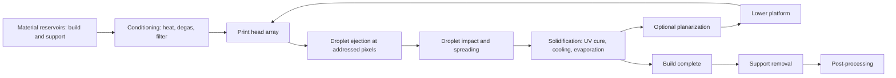
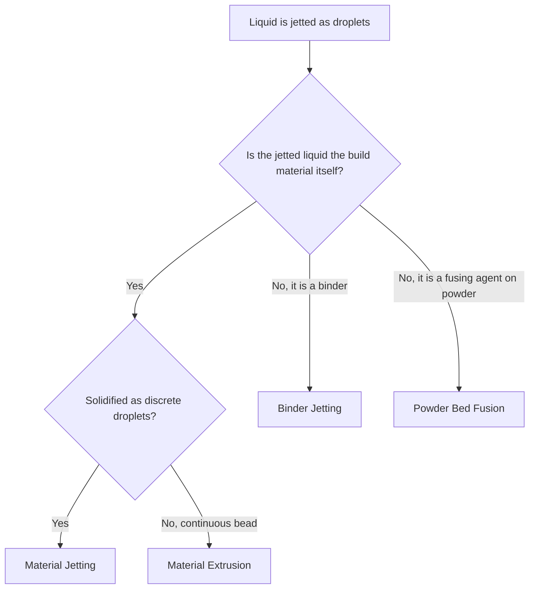

## Material Jetting Classification

### Introduction

Material jetting (MJT) is one of the seven additive manufacturing (AM) process categories defined in ISO/ASTM 52900, described as a process in which droplets of build material are selectively deposited. The build material itself is jetted, and the droplets are typically solidified immediately after deposition by UV curing, cooling, or solvent evaporation. Because the print heads derive from industrial inkjet technology, MJT is capable of very fine resolution, smooth surfaces, and multi-material and multi-color parts in a single build.

ISO/ASTM 52900 treats MJT as a single category. Finer sub-classification is not standardized to the same depth, so the literature and industry classify MJT along several independent axes:

1. **Droplet generation and deposition mode** (continuous inkjet, drop-on-demand, aerosol, electrohydrodynamic)
2. **Actuation mechanism** (piezoelectric, thermal, electrostatic, acoustic, valve-based)
3. **Solidification mechanism** (photopolymerization, thermal phase change, solvent evaporation, sintering after printing, chemical reaction)
4. **Material family** (photopolymer, wax, thermoplastic ink, ceramic and metal nanoparticle ink, bio-ink, conductive ink, reactive systems)
5. **Deposition strategy** (droplet-on-droplet layering, planar layered deposition, multi-axis and conformal jetting)
6. **Head and machine architecture** (single head, multi-head arrays, multi-material, support material strategy)
7. **Scale and resolution class** (macro-scale production, micro-scale printed electronics, nano-scale electrohydrodynamic jetting)

Trade names such as PolyJet, MultiJet Modeling, and NanoParticle Jetting are vendor-specific. Generic descriptions are used below, with common names mapped where helpful. Readers should verify current standard editions and vendor specifics, since terminology and products evolve.

```mermaid
flowchart TD
    A[Material Jetting - ISO/ASTM 52900] --> B[By droplet generation mode]
    A --> C[By actuation mechanism]
    A --> D[By solidification mechanism]
    A --> E[By material family]
    A --> F[By deposition strategy]
    A --> G[By head and machine architecture]
    A --> H[By scale and resolution]

    B --> B1[Drop-on-demand]
    B --> B2[Continuous inkjet]
    B --> B3[Aerosol jetting]
    B --> B4[Electrohydrodynamic jetting]

    C --> C1[Piezoelectric]
    C --> C2[Thermal bubble]
    C --> C3[Electrostatic and acoustic]
    C --> C4[Valve-based]

    D --> D1[Photopolymerization]
    D --> D2[Thermal solidification]
    D --> D3[Solvent evaporation]
    D --> D4[Sintering after printing]

    E --> E1[Photopolymers]
    E --> E2[Waxes]
    E --> E3[Nanoparticle inks]
    E --> E4[Bio-inks and conductive inks]

    F --> F1[Layered deposition]
    F --> F2[Droplet-on-droplet]
    F --> F3[Conformal and multi-axis]

    G --> G1[Multi-head arrays]
    G --> G2[Support material strategy]
    G --> G3[Multi-material voxel control]
```

### Fundamental Principle

Every MJT process repeats a common cycle:

1. Liquid build material (and support material, if used) is conditioned in a reservoir at controlled temperature and viscosity.
2. Print heads eject droplets on demand at addresses determined by the sliced bitmap or voxel data.
3. Droplets land, coalesce, and spread on the substrate or previous layer.
4. Solidification is triggered: UV lamps cure photopolymer, cooling solidifies wax, or solvent evaporates.
5. A leveling device (roller or blade) may planarize the layer surface in some systems.
6. The platform indexes down by one layer thickness, and the cycle repeats.
7. Support material is removed after the build.

**Core process relationships**

Droplet formation and jetting stability are governed by dimensionless groups. The **Reynolds**, **Weber**, and **Ohnesorge** numbers are:

$$Re = \frac{\rho \, v_d \, d_n}{\mu}, \qquad We = \frac{\rho \, v_d^{2} \, d_n}{\sigma}, \qquad Oh = \frac{\sqrt{We}}{Re} = \frac{\mu}{\sqrt{\rho \, \sigma \, d_n}}$$

where $\rho$ is density, $v_d$ is droplet velocity, $d_n$ is nozzle diameter, $\mu$ is dynamic viscosity, and $\sigma$ is surface tension. The inverse Ohnesorge number is often called the **Z number**:

$$Z = \frac{1}{Oh} = \frac{\sqrt{\rho \, \sigma \, d_n}}{\mu}$$

Stable drop-on-demand printing is commonly reported for $Z$ roughly between 1 and 10 (with some sources quoting a somewhat wider window such as about 1 to 14). Below the lower limit, viscous dissipation suppresses drop ejection; above the upper limit, satellite droplets and unstable jets appear. These windows are empirical and depend on head design and waveform, so they should be treated as guidelines rather than fixed limits.

**Example:** For a fluid with $\rho = 1100$ kg/m³, $\sigma = 0.030$ N/m, $\mu = 0.012$ Pa·s, and nozzle diameter $d_n = 30$ µm ($3 \times 10^{-5}$ m):

$$Z = \frac{\sqrt{1100 \times 0.030 \times 3 \times 10^{-5}}}{0.012} = \frac{\sqrt{9.9 \times 10^{-4}}}{0.012} = \frac{0.03146}{0.012} \approx 2.6$$

This lies within the commonly cited printable range. Jettable viscosity in many piezoelectric heads is on the order of 10 to 20 mPa·s at jetting temperature, which is why many photopolymer and wax formulations are heated to reduce viscosity.

**Droplet volume and voxel resolution.** For an approximately spherical droplet of diameter $d_d$:

$$V_d = \frac{\pi d_d^{3}}{6}$$

A 30 µm droplet has $V_d \approx 14$ pL. The lateral addressability of the print head is set by nozzle spacing and firing frequency. For a linear nozzle array with pitch $p_n$ and a carriage velocity $v_c$, the maximum droplet placement pitch along the scan direction is:

$$p_x = \frac{v_c}{f_d}$$

where $f_d$ is the firing frequency (often in the range of several kHz to tens of kHz for industrial heads). **Example:** At $v_c = 0.5$ m/s and $f_d = 20$ kHz, $p_x = 0.5/20000 = 25$ µm.

**Layer thickness control.** The layer thickness $t$ depends on droplet volume, droplet spacing, and spreading:

$$t \approx \frac{V_d \, N_d}{A_{\text{pixel}}}$$

where $N_d$ is the number of droplets deposited per pixel area $A_{\text{pixel}}$. Cured layer thicknesses in commercial systems are commonly in the range of about 10 to 50 µm (machine and material dependent), which is thinner than most other AM categories.

**Droplet impact and spreading.** Whether a droplet splashes or spreads is characterized by the Weber number at impact and by the substrate wettability. The maximum spread factor is often approximated as:

$$\beta_{\max} = \frac{d_{\max}}{d_d} \approx \sqrt{\frac{We + 12}{3\left(1 - \cos\theta_a\right) + 4\, We/\sqrt{Re}}}$$

where $\theta_a$ is the advancing contact angle. This is a widely used empirical correlation and is approximate; it explains why lower viscosity and surface tension increase spreading, and why controlling surface energy (or partially curing droplets in flight or upon landing, sometimes called "pinning") improves dimensional accuracy.

### Classification 1: By Droplet Generation and Deposition Mode

#### 1a. Drop-on-Demand (DOD) Jetting

A droplet is ejected only when a pulse is applied. This is the dominant mode for AM because it wastes no material and offers precise placement.

- Each nozzle fires individually according to the layer bitmap
- Suitable for photopolymers, waxes, and many functional inks
- Jetting quality depends on waveform tuning, viscosity, and nozzle condition

#### 1b. Continuous Inkjet (CIJ)

A continuous stream breaks into droplets through Rayleigh-Plateau instability. Droplets are charged and deflected either to the substrate or to a gutter for recirculation.

- Very high droplet frequencies (hundreds of kHz)
- Requires conductive, solvent-based inks and recirculation
- Less common in AM; more common in marking, coding, and some printed electronics

The Rayleigh breakup wavelength for a jet of diameter $d_j$ is approximately:

$$\lambda \approx 4.51\, d_j$$

giving the optimum wavelength for uniform droplet formation. Actual behavior depends on fluid properties and disturbance amplitude.

#### 1c. Aerosol Jetting

Ink is atomized into a dense aerosol that is carried by a gas stream and focused by a sheath gas into a narrow beam directed at the substrate.

- Wide viscosity range (about 1 to 1000 mPa·s in some reports)
- Standoff distance can be several millimeters, enabling printing on non-flat surfaces
- Feature sizes of about 10 µm and above are typical
- Used in printed electronics, antennas, and conformal sensors

#### 1d. Electrohydrodynamic (EHD) Jetting

An electric field applied between the nozzle and substrate draws a fine jet or droplet from a Taylor cone at the meniscus, allowing droplets much smaller than the nozzle diameter.

- Sub-micron to a few micrometers feature sizes
- Handles higher viscosity inks than thermal or piezoelectric inkjet in some configurations
- Requires substrate or fluid electrical considerations and careful voltage control
- Used for micro- and nanofabrication of electronics, biosensors, and optics

### Classification 2: By Actuation Mechanism

| Mechanism | Principle | Advantages | Limitations |
| --- | --- | --- | --- |
| **Piezoelectric** | Voltage deforms a piezo element, generating a pressure pulse in the chamber | Wide fluid compatibility; no heating of the fluid required; precise waveform control | Higher head cost; sensitive to air bubbles and viscosity |
| **Thermal (bubble jet)** | A heater vaporizes a small fluid volume, and the expanding bubble expels a droplet | Low cost, compact | Limited to thermally stable, volatile-compatible fluids; not suited for most photopolymers |
| **Electrostatic** | Electrostatic force deflects a membrane | Efficient for certain MEMS head designs | Less common in AM |
| **Acoustic** | Focused acoustic waves eject droplets from a free surface | Nozzle-free operation; handles particle-laden and cell-laden fluids | Complexity; lower throughput per source |
| **Valve-based (solenoid or microvalve)** | An electromagnetic or pneumatic valve opens briefly under pressure | Handles higher viscosities and larger droplets | Larger droplet volumes and lower resolution |
| **Electrohydrodynamic** | Electric field pulls fluid | Very small droplets | Setup and stability sensitivity |

Piezoelectric drop-on-demand heads are the most common actuation choice in commercial MJT systems because they tolerate a broad range of formulations, including UV-curable resins and molten waxes.

**Pressure pulse and droplet velocity.** In a piezoelectric chamber, droplet velocity scales with the pressure amplitude $\Delta P_a$ of the acoustic pulse:

$$v_d \propto \sqrt{\frac{\Delta P_a}{\rho}}$$

Droplet velocities in commercial systems are commonly on the order of several meters per second. The proportionality follows from a Bernoulli-type energy balance and ignores viscous and capillary losses, so it is qualitative.

### Classification 3: By Solidification Mechanism

| Mechanism | Description | Typical Materials | Key Traits |
| --- | --- | --- | --- |
| **Photopolymerization (UV cure)** | UV or visible light triggers polymerization of jetted droplets | Acrylate-based photopolymers, hybrid resins | Fast solidification; high resolution; oxygen inhibition of surface; post-cure often used |
| **Thermal phase change (hot-melt jetting)** | Molten droplets freeze on contact with a cooler substrate | Waxes, low-melting thermoplastics, some hot-melt inks | Very rapid solidification; support-friendly (wax supports melt out) |
| **Solvent evaporation or drying** | Carrier solvent evaporates from deposited ink | Polymer solutions, ceramic and metal nanoparticle inks, conductive inks | Shrinkage on drying; coffee-ring effects; multiple passes needed |
| **Chemical reaction or two-part cure** | Droplets of reactive components mix and cure on the substrate | Reactive systems (epoxy-amine, polyurethane, gels) | Mixing and pot-life control needed |
| **Thermal or laser sintering after printing** | Printed nanoparticle inks are sintered to form solid materials | Silver and other metallic nanoparticle inks, ceramic inks | Low-temperature sintering possible for nanoparticles; densification needed |
| **Ionic or gelation** | Jetted droplets trigger gelation on contact | Alginate and other hydrogels | Used in bioprinting |

**UV curing kinetics.** The cure depth per pass follows the same working-curve logic as vat photopolymerization:

$$C_d = D_p \ln\!\left(\frac{E}{E_c}\right)$$

where $D_p$ is penetration depth, $E$ is exposure dose, and $E_c$ is the critical exposure for gelation. In MJT the layer is much thinner than $D_p$ for typical formulations, so curing is generally through the layer, and interlayer bonding depends on partial cure of the layer below and on any oxygen inhibition layer at the surface. Incomplete cure leaves tacky or uncured material, so post-processing and exposure control are important.

**Thermal solidification time.** For a molten droplet contacting a substrate, a rough solidification time scale from conduction is:

$$t_s \approx \frac{h_d^{2}}{\pi \alpha}\left( \frac{\rho \, \Delta H_f}{\,\rho_s c_{p,s} (T_m - T_s)\,} \right)^{2}$$

where $h_d$ is droplet height, $\alpha$ is thermal diffusivity, and the bracketed term compares latent heat to the substrate's sensible heat capacity. This is a Stefan-type scaling estimate and neglects contact resistance and convection, so it is order-of-magnitude only.

### Classification 4: By Material Family

| Family | Composition | Post-Processing | Applications |
| --- | --- | --- | --- |
| **Rigid and transparent photopolymers** | Acrylate oligomers and monomers with photoinitiators | Support removal, optional post-cure | Visual models, lenses and light guides, prototypes |
| **Flexible and rubber-like photopolymers** | Elastomeric oligomers | Support removal | Gaskets, soft-touch prototypes, wearables |
| **Digital materials (voxel-blended composites)** | Combinations of two or more photopolymers jetted in controlled ratios | Support removal | Graded stiffness, overmolded prototypes, multi-hardness assemblies |
| **Full-color and multi-color photopolymers** | Pigmented photopolymer inks combined with clear resins | Support removal | Anatomical and color-accurate models, packaging prototypes |
| **Wax and castable patterns** | Low-melting waxes and castable formulations | Support melt-out, casting burnout | Jewelry, investment casting patterns |
| **Biocompatible photopolymers** | Formulated for dental and medical models | Validated cleaning and handling | Dental models, surgical guides [certification depends on the product and regulatory regime] |
| **Ceramic nanoparticle inks** | Ceramic nanoparticles dispersed in fluid vehicle | Debinding and sintering | Ceramic components, dielectric layers [emerging] |
| **Metal nanoparticle inks** | Metal nanoparticles (for example silver, copper, stainless steel) in a fluid carrier | Debinding and sintering | Small metal parts, conductive traces [emerging] |
| **Conductive and functional inks** | Silver, copper, carbon, PEDOT:PSS, dielectric, semiconductor inks | Drying, curing, or sintering | Printed electronics, sensors, antennas |
| **Bio-inks** | Hydrogels, cell-laden formulations | Culture, crosslinking | Tissue engineering research |
| **Reactive and other polymer systems** | Silicone and other reactive inks | Cure | Soft robotics, microfluidics [emerging] |

**Voxel-level composition.** A distinguishing feature of MJT is that each droplet (voxel) can be assigned to a specific material. For a mixture of two materials A and B with droplet fractions $x_A$ and $x_B = 1 - x_A$, a first-order estimate of effective modulus for a fine-scale mixture uses bounds:

$$E_{\text{Reuss}} \le E_{\text{eff}} \le E_{\text{Voigt}}$$

$$E_{\text{Voigt}} = x_A E_A + x_B E_B, \qquad \frac{1}{E_{\text{Reuss}}} = \frac{x_A}{E_A} + \frac{x_B}{E_B}$$

The actual value lies between the bounds and depends on the spatial arrangement of the droplets and interphase behavior, which is why properties of digital materials are characterized experimentally.

### Classification 5: By Deposition Strategy

| Strategy | Description | Typical Use |
| --- | --- | --- |
| **Layered planar deposition** | Print heads scan over a horizontal platform; each layer cured before the next | Most commercial photopolymer and wax systems |
| **Droplet-on-droplet (3D stacking)** | Droplets are stacked in the Z direction with rapid solidification to form vertical structures | High aspect-ratio micro-structures, pillars, printed electronics interconnects |
| **Layer planarization** | A roller or blade removes excess material to level the layer surface | Improves flatness and layer thickness uniformity in many photopolymer systems |
| **Conformal and multi-axis jetting** | Head or substrate moves in additional axes to deposit on curved surfaces | Printed electronics on 3D surfaces, coatings |
| **Hybrid substrate-based printing** | Jetting onto textiles, films, or existing components | Decorative and functional additions |
| **Continuous roll-to-roll jetting** | Web substrate moves under fixed heads | Printed electronics manufacturing at volume |

### Classification 6: By Head and Machine Architecture

| Attribute | Variants | Considerations |
| --- | --- | --- |
| **Number of heads** | Single head, multiple heads in parallel, page-wide arrays | More heads raise throughput and materials per build; alignment (head-to-head registration) becomes critical |
| **Material channels** | 1 to 8 or more independent channels (build materials, support, colors) | Dictates multi-material capability and color gamut |
| **Support material strategy** | Removable gel-like support (water jet removal), dissolvable support, or wax support | Support removal method affects surface finish and part fragility |
| **Curing lamps** | UV LED or mercury lamps mounted on the carriage | LED sources allow narrower spectrum and lower heat; wavelength must match photoinitiators |
| **Leveling system** | Roller, blade, or none | Controls layer thickness; excess material is recycled or discarded |
| **Build volume class** | Desktop, industrial, or large-format | Larger volumes add gantry, thermal, and head-registration challenges |
| **Environmental control** | Heated resin lines, heated reservoirs, enclosed chamber | Maintains stable viscosity and cure conditions |
| **In-situ monitoring** | Nozzle-out detection, drop watching cameras, layer inspection | Detects clogged nozzles, misfires, and registration errors |

**Nozzle failure impact.** Because heads contain hundreds or thousands of nozzles, an individual clogged or misfiring nozzle produces a line defect. Strategies include multi-pass printing (interlaced passes so that no single nozzle prints a continuous line), nozzle compensation (a neighboring nozzle fires additional droplets), and periodic purge and wipe cycles.

### Classification 7: By Scale and Resolution Class

| Class | Typical Feature Size (guideline) | Typical Methods |
| --- | --- | --- |
| **Macro-scale production** | Layer thickness about 10 to 50 µm; parts from millimeters to several hundred millimeters | Commercial photopolymer and wax jetting systems |
| **Micro-scale functional printing** | Tens of micrometers line widths | Piezoelectric inkjet for electronics, biosensors, and microfluidics |
| **Fine-feature aerosol jetting** | Around 10 µm and above | Aerosol jet printing for conformal electronics |
| **Nano-scale EHD jetting** | Sub-micron to a few micrometers | Electrohydrodynamic printing |

Values are indicative and depend on head design, fluid, and substrate.

### Sub-Variant Mapping Table

| Generic Description | Common or Vendor Names | Material | Solidification |
| --- | --- | --- | --- |
| Photopolymer material jetting | PolyJet, MultiJet Modeling (MJM), other vendor terms | Photopolymers | UV cure |
| Wax jetting (thermal) | Wax-based MJT (vendor terms) | Wax | Cooling |
| Nanoparticle jetting | NanoParticle Jetting (vendor term) | Ceramic or metal nanoparticle suspensions | Evaporation then sintering |
| Drop-on-demand inkjet printed electronics | DOD inkjet printing, direct write | Conductive and dielectric inks | Drying, sintering or UV cure |
| Aerosol jet printing | Aerosol jet (vendor term) | Wide ink range | Drying and cure |
| Electrohydrodynamic printing | E-jet, EHD printing | Inks, polymer solutions, nanoparticle inks | Evaporation and cure |
| Bioprinting by inkjet | Inkjet bioprinting | Bio-inks | Gelation |
| Voxel-level multi-material jetting | Digital material printing (vendor terms) | Photopolymer blends | UV cure |

[Inference: the category assignment of some hybrid or vendor-specific systems may vary in informal usage, but they are generally grouped within material jetting when droplets of the build material are selectively deposited; consult current ISO/ASTM terminology for authoritative wording.]

### Distinguishing Material Jetting from Adjacent Categories

- **Material jetting versus binder jetting**: in material jetting, the jetted droplets *are* the build material; in binder jetting, the jetted liquid is only a binder that joins separate powder particles.
- **Material jetting versus vat photopolymerization**: both use photopolymers, but vat processes cure a resin bath by light patterning, whereas material jetting deposits discrete droplets that are then cured.
- **Material jetting versus material extrusion**: MJT ejects discrete droplets, typically of low-viscosity fluids, whereas material extrusion dispenses continuous beads through a nozzle, generally at higher viscosity; direct ink writing and aerosol jetting sit near the boundary, and classification depends on whether droplets or continuous filaments are formed.
- **Multi Jet Fusion and similar powder bed processes**: these jet fusing and detailing agents onto a powder bed and are classified as powder bed fusion, not material jetting, because the jetted liquid is not the build material and the powder bed is thermally fused.

### Process Parameters and Their Roles

| Parameter | Effect | Typical Consideration |
| --- | --- | --- |
| **Jetting temperature** | Controls viscosity and droplet formation | Heated heads and lines; stable temperature is critical |
| **Waveform (pulse amplitude, width, shape)** | Determines droplet volume, velocity, and satellite formation | Tuned per fluid and head |
| **Firing frequency** | Sets throughput and droplet spacing | Limited by refill time and acoustic resonance |
| **Droplet spacing (dots per inch)** | Determines coverage and resolution | Must balance overlap and layer thickness |
| **Layer thickness** | Sets Z resolution and build time | Thin layers improve smoothness but increase build time |
| **UV dose and lamp timing** | Controls cure state and interlayer adhesion | Under-cure causes tackiness; over-cure causes brittleness or curl |
| **Platform and substrate temperature** | Influences spreading, adhesion, and wax solidification | Tuned per material |
| **Print direction and pass strategy** | Manages nozzle defects, banding, and registration | Multi-pass interlacing reduces visible lines |
| **Leveling settings** | Layer flatness and material waste | Roller speed and offset |
| **Material mixing ratios** | Sets effective properties and color | Calibrated per digital material |

### Defects and Quality Concerns

| Defect | Cause | Mitigation |
| --- | --- | --- |
| **Nozzle clogging or misfiring** | Particulates, dried ink, air bubbles, damaged nozzle plate | Filtration, degassing, purge and wipe cycles, nozzle compensation |
| **Satellite droplets and misting** | Waveform or fluid mismatch ($Z$ out of range) | Adjust waveform, viscosity, and temperature |
| **Droplet misregistration** | Head misalignment, carriage vibration, droplet velocity variation | Head calibration, motion control, standoff optimization |
| **Banding (line artifacts)** | Nozzle-to-nozzle variation, pass boundaries | Multi-pass strategies, head calibration |
| **Coffee-ring effect (nanoparticle and functional inks)** | Evaporation-driven flow toward droplet edge | Solvent mixtures, Marangoni flow tuning, substrate heating |
| **Incomplete cure or surface tackiness** | Oxygen inhibition, insufficient dose | Increase dose, use inert environment, post-cure |
| **Curl and warpage** | Cure shrinkage stress in thin cross-sections | Orientation, support strategy, formulation choice |
| **Support residue and surface damage** | Aggressive support removal, incomplete dissolution | Choose appropriate support type and cleaning method |
| **Color bleeding or mixing** | Droplet spreading, insufficient pinning | Adjust cure timing and droplet volume |
| **Cracking or delamination (ceramic and metal inks)** | Shrinkage gradients during drying or sintering | Controlled drying, staged sintering, geometry design |
| **Property variability in digital materials** | Voxel arrangement and interphase effects | Characterize by test, control mixing patterns |

### Post-Processing Chains

**Photopolymer material jetting**

1. Remove parts from the platform
2. Remove support material (water jet for gel-like supports, dissolution, or manual removal)
3. Optional secondary UV post-cure to complete conversion
4. Optional surface finishing (sanding, polishing, coating, clear coat)
5. Inspection

**Wax jetting**

1. Remove pattern from the platform
2. Melt-out or dissolve support wax if used
3. Investment casting: sprue, invest, burn out, cast metal
4. Finish the cast part

**Nanoparticle jetting (ceramic or metal)**

1. Print green part in suspension-based ink
2. Drying and debinding to remove solvent and dispersant
3. Sintering in controlled atmosphere
4. Optional machining or finishing

Isotropic sintering shrinkage compensation is:

$$L_{\text{green}} = \frac{L_{\text{final}}}{1 - \varepsilon_s}$$

where $\varepsilon_s$ is the fractional linear shrinkage. **Example:** For $\varepsilon_s = 0.20$ and a target of 25 mm, $L_{\text{green}} = 25 / 0.80 = 31.25$ mm. Shrinkage depends on solids loading and sintering profile and is often anisotropic, so it must be calibrated experimentally.

**Printed electronics**

1. Print conductive and dielectric layers in sequence on the substrate
2. Dry or cure each layer (thermal, UV, photonic, or laser sintering)
3. Encapsulate and test electrical performance

### Comparative Table of Principal MJT Variants

| Attribute | Photopolymer jetting | Wax jetting | Nanoparticle jetting | Aerosol jet | EHD jetting |
| --- | --- | --- | --- | --- | --- |
| Droplet mode | DOD (piezo) | DOD (piezo, heated) | DOD (piezo) | Aerosol stream | Electric-field-driven |
| Typical layer or feature size | About 10 to 50 µm layers | About 20 to 50 µm layers | Tens of µm layers | Around 10 µm lines and above | Sub-µm to few µm |
| Material range | Photopolymers, digital blends | Waxes | Ceramic, metal nanoparticle suspensions | Wide ink range | Wide range of polymer and nanoparticle inks |
| Multi-material | Strong | Limited | Limited to support plus build | Possible | Limited |
| Post-processing | Support removal, post-cure | Support melt-out | Debinding, sintering | Cure, sinter | Cure, sinter |
| Typical use | Prototypes, dental and medical models, tooling patterns | Casting patterns | Small ceramic and metal parts | Conformal electronics | Micro- and nanofabrication |
| Throughput | Medium | Medium | Low to medium | Low | Very low |
| Maturity | Established | Established | Emerging commercial | Established niche | Research and emerging |

All values are indicative and depend on head, machine, and material.

### Design and Selection Guidance

**Key Points**

- Choose **photopolymer jetting** for high-resolution, smooth-surface, multi-material, and full-color models where dimensional detail and visual fidelity matter more than long-term mechanical or thermal performance.
- Choose **wax jetting** for investment casting patterns where clean burnout and fine detail are needed.
- Consider **nanoparticle jetting** where fine-scale ceramic or metal parts are required and the post-sintering process chain is acceptable.
- Choose **aerosol jet, inkjet, or EHD printing** for functional electronics, sensors, and microstructures on flat or curved substrates.
- Design for **support removal**: provide access for water jets or dissolution, avoid trapped support in narrow channels, and specify minimum wall thickness and feature size according to manufacturer guidelines.
- Account for **material aging**: many jetted photopolymers can creep, yellow, or embrittle with UV exposure and elevated temperature, so functional durability should be validated for the intended environment.
- Use **voxel-level grading** to design gradients in stiffness, color, or transparency, and verify graded properties experimentally.
- Handle uncured resin with appropriate protective equipment, since uncured photopolymers can be skin sensitizers, and dispose of waste according to local regulations.
- Note that behavior varies with equipment, materials, and settings, so validate dimensional accuracy and properties with representative test specimens.

**Example: selecting an MJT variant.** A medical device company wants a life-size anatomical model with soft tissue regions, rigid bone regions, and translucent vessels, for surgical planning. Photopolymer material jetting with digital material blending can deposit rigid, flexible, and transparent materials in a single build, giving realistic tactile and visual feedback. A vat photopolymerization system would need separate builds and assembly for different material regions, and a material extrusion system would lack the fine detail and multi-material gradation. Regulatory and biocompatibility requirements would determine whether the model is used for visualization only or in contact with patients.

### Standards and Terminology Context

- **ISO/ASTM 52900** defines material jetting as a process category and provides terminology.
- Designations that combine category with feedstock or mechanism (for example, MJT with photopolymer or wax, as in newer terminology discussions) may appear in more recent standards and literature; verify exact designations and scope in the current editions.
- Terms such as *PolyJet* and *MultiJet* are vendor trademarks; generic terms *material jetting* or *photopolymer material jetting* are preferred in technical specifications.
- Test methods, design guidance, and qualification frameworks exist in the ISO/ASTM 529xx family, while material standards for jetted photopolymers are comparatively less mature than those for metals [Inference: standardization may expand as industrial adoption grows]. Consult current ISO and ASTM catalogs, since editions and scope change.
- Regulated applications (medical, dental, aerospace) impose additional requirements on materials, process control, and validation.

### Emerging Directions

- Higher-resolution and higher-throughput print-head arrays with more material channels
- Voxel-level multi-material and graded-property printing with improved material libraries
- Ceramic, metal, and glass nanoparticle jetting for functional end-use parts
- Printed electronics integrated with structural parts (embedded conductors, sensors, and antennas)
- Bio-inks and jetting for tissue engineering and drug delivery
- Closed-loop control with in-situ imaging of droplets and layers
- Improved durability, thermal performance, and sustainability of jettable photopolymers
- Multi-axis and conformal jetting on curved and pre-existing surfaces

[Inference: as capabilities converge, boundaries between material jetting, direct ink writing, and hybrid printed-electronics processes may require clarification in future standard revisions.]

### Conclusion

Material jetting is formally a single ISO/ASTM 52900 category, but it is practically classified along multiple axes: droplet generation mode (drop-on-demand, continuous inkjet, aerosol, electrohydrodynamic), actuation mechanism (piezoelectric, thermal, electrostatic, acoustic, valve-based), solidification mechanism (photopolymerization, thermal phase change, solvent evaporation, sintering, chemical reaction), material family (photopolymers, waxes, nanoparticle inks, functional and bio-inks), deposition strategy (layered planar, droplet-on-droplet, conformal), head and machine architecture (head count, material channels, support strategy, curing and leveling), and scale (macro production to nano-scale). These axes explain why names such as PolyJet, MultiJet, NanoParticle Jetting, aerosol jetting, and inkjet printed electronics map onto one underlying principle of selectively depositing droplets of build material, while producing very different capabilities in resolution, material range, multi-material control, and post-processing. Effective use of the classification pairs the generic designation with jetting physics, solidification method, material system, and post-processing route, and validates dimensional accuracy and properties experimentally for the intended application.

### Next Steps

- Print head design, waveform tuning, and jetting stability windows
- Photopolymer ink formulation: viscosity, surface tension, cure kinetics, and aging
- Multi-material and voxel-level design methods and property prediction
- Nanoparticle ink formulation, debinding, and sintering schedules
- Printed electronics: conductive ink processing and integration strategies
- Support material selection and removal methods
- Droplet impact, wetting, and contact-line dynamics for accuracy control
- Comparing material jetting with vat photopolymerization and material extrusion for polymer parts