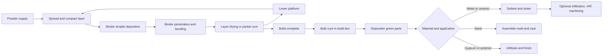
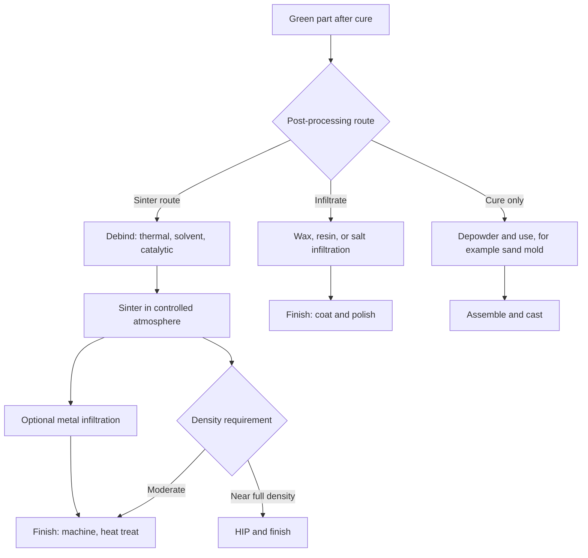
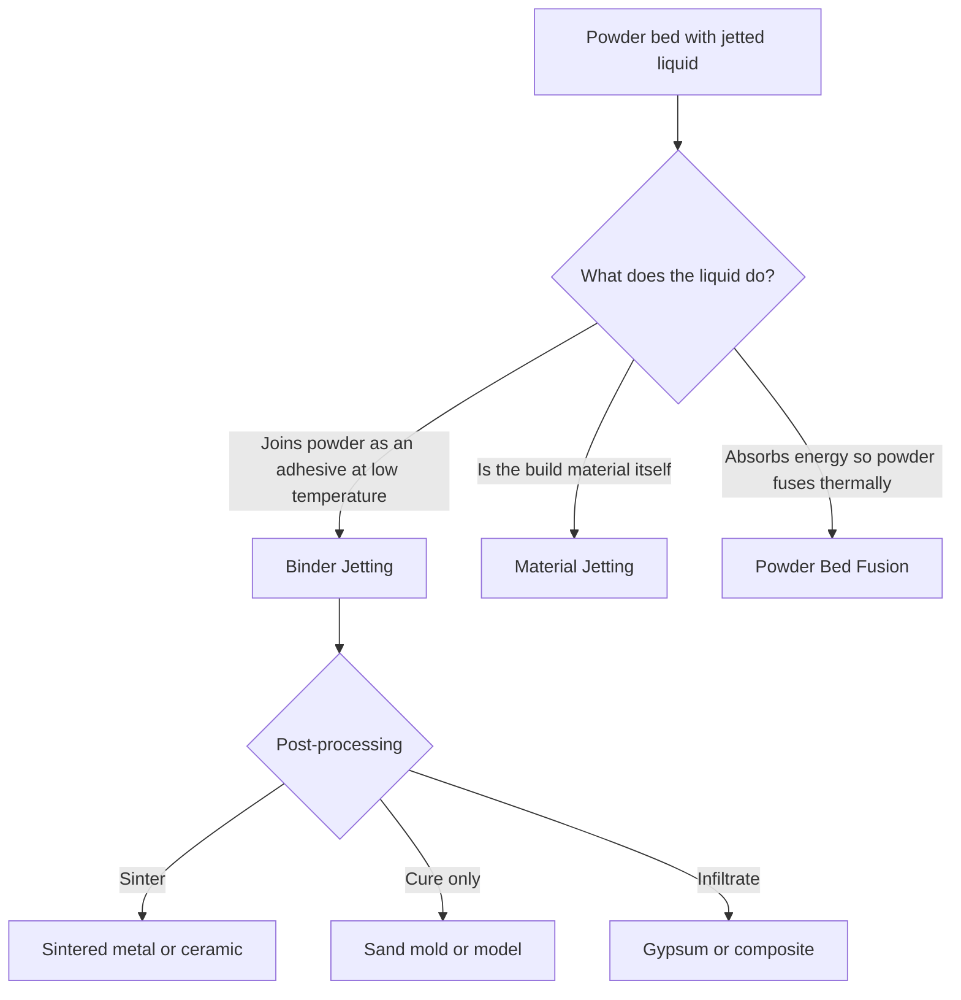

## Binder Jetting Classification

### Introduction

Binder jetting (BJT) is one of the seven additive manufacturing (AM) process categories defined in ISO/ASTM 52900, described as a process in which a liquid bonding agent is selectively deposited to join powder materials. A recoater spreads a thin powder layer, an inkjet-style print head deposits binder droplets in the cross-sectional pattern, and the cycle repeats. The resulting **green part** is held together by binder and supported by surrounding loose powder. Because no thermal energy source acts on the powder bed during the build, BJT avoids the melt-pool physics and steep thermal gradients of powder bed fusion, but it shifts much of the process burden to downstream steps: curing, depowdering, debinding, sintering, or infiltration.

ISO/ASTM 52900 treats BJT as a single category. Finer sub-classification is not standardized to the same depth, so the literature and industry classify BJT along several independent axes:

1. **Powder material family** (metal, ceramic, sand and mineral, polymer, composite and cementitious)
2. **Binder chemistry and bonding mechanism** (organic polymer, inorganic silicate or furan, water-based adhesive, reactive or activator-based, and sacrificial versus permanent binders)
3. **Post-processing route** (cure only, infiltration, debinding and sintering, hot isostatic pressing, sand-mold assembly and casting)
4. **Print head and binder delivery** (piezoelectric drop-on-demand, thermal, continuous, single-pass versus multi-pass, color heads)
5. **Powder spreading and layer formation** (roller, blade, hopper, dry versus slurry or paste deposition, dispersal aids)
6. **Machine architecture and scale** (research and desktop, production-scale metal, foundry-scale sand printers, full-color gypsum systems)
7. **Application family** (foundry molds and cores, sintered metal parts, ceramic components, architectural and visual models)

Trade names such as ExOne, Voxeljet, and HP Metal Jet are vendor-specific. Generic descriptions are used below, with common names mapped where helpful. Readers should verify current standard editions and vendor specifics, since terminology and products evolve.

```mermaid
flowchart TD
    A[Binder Jetting - ISO/ASTM 52900] --> B[By powder material family]
    A --> C[By binder chemistry and bonding]
    A --> D[By post-processing route]
    A --> E[By print head and binder delivery]
    A --> F[By powder spreading method]
    A --> G[By machine architecture and scale]
    A --> H[By application family]

    B --> B1[Metal]
    B --> B2[Ceramic]
    B --> B3[Sand and mineral]
    B --> B4[Polymer and gypsum]

    C --> C1[Organic polymer binder]
    C --> C2[Inorganic silicate or furan]
    C --> C3[Water-based or activator systems]
    C --> C4[Sacrificial versus permanent]

    D --> D1[Cure and depowder only]
    D --> D2[Infiltration]
    D --> D3[Debind and sinter]
    D --> D4[Sand mold casting]

    E --> E1[Piezoelectric DOD]
    E --> E2[Thermal inkjet]
    E --> E3[Single-pass arrays]

    F --> F1[Roller recoating]
    F --> F2[Blade or hopper]
    F --> F3[Slurry or paste deposition]

    G --> G1[Desktop and research]
    G --> G2[Production metal]
    G --> G3[Foundry scale]

    H --> H1[Molds and cores]
    H --> H2[Sintered metal parts]
    H --> H3[Ceramic parts]
    H --> H4[Visual and architectural models]
```

### Fundamental Principle

Every BJT machine repeats a common cycle:

1. A recoater spreads a thin, uniform powder layer over the build box.
2. Print heads pass over the bed and jet binder droplets onto the regions corresponding to the layer cross-section.
3. Binder wets the powder, wicks into pore spaces, and forms bonds between particles (by adhesive, chemical reaction, or dissolution and recrystallization).
4. A drying or partial cure step (heat lamp, heated bed, or airflow) may follow each layer or group of layers.
5. The platform lowers by one layer thickness.
6. The cycle repeats until the build completes.
7. The build box is cured (often thermally), depowdered, and the green parts are extracted and post-processed.

**Core process relationships**

The binder must penetrate and bond powder without excessive spreading. The **Washburn** relation describes capillary penetration of a liquid into a porous powder bed:

$$h_p^{2} = \frac{r_{\text{eff}} \, \gamma \cos\theta}{2 \mu} \, t$$

where $h_p$ is penetration depth, $r_{\text{eff}}$ is an effective pore radius, $\gamma$ is binder surface tension, $\theta$ is the contact angle, $\mu$ is binder viscosity, and $t$ is time. The relation assumes uniform cylindrical capillaries, so it is a qualitative guide, but it explains why binder viscosity, powder particle size, and wetting drive both bonding strength and lateral bleed.

**Binder saturation** is the fraction of pore volume filled by binder and is a central process parameter:

$$S = \frac{V_{\text{binder}}}{V_{\text{pore}}} = \frac{V_{\text{binder}}}{V_{\text{voxel}} \left(1 - \phi_p\right)}$$

where $V_{\text{voxel}}$ is the bulk volume addressed by the deposited droplets and $\phi_p$ is the powder packing fraction (solid volume fraction). Low saturation gives weak green strength and fragile parts; high saturation causes bleed, poor dimensional accuracy, and distortion. Typical working ranges depend on powder and binder, so they are established experimentally per material system.

**Example:** A bed with packing fraction $\phi_p = 0.50$ and layer thickness $t = 50$ µm has pore volume per unit area of $t(1-\phi_p) = 25$ µm (that is, $25 \times 10^{-6}$ m³/m²). If the print head deposits $12 \times 10^{-6}$ m³/m² of binder (an equivalent film thickness of 12 µm), the saturation is $S = 12/25 = 0.48$.

**Droplet formation.** Jetting stability follows the same Ohnesorge or Z-number logic as material jetting:

$$Z = \frac{1}{Oh} = \frac{\sqrt{\rho \, \sigma \, d_n}}{\mu}$$

Stable drop-on-demand printing is commonly reported for $Z$ roughly between 1 and 10 (empirical, head and fluid dependent), so binder formulations are tuned in viscosity and surface tension to fall within this window while still wetting the powder.

**Powder packing and layer density.** Packing fraction of spread powder is typically in the range of about 0.4 to 0.6 for dry spread powders (material and morphology dependent), so green parts have substantial porosity that sintering must eliminate. Green density is:

$$\rho_g = \rho_{\text{th}} \, \phi_g$$

where $\rho_{\text{th}}$ is theoretical density of the powder material and $\phi_g$ is the green relative density (the powder packing fraction adjusted for binder fill and any compaction). Higher green density reduces sintering shrinkage and improves dimensional predictability.

**Sintering shrinkage compensation.** For approximately isotropic linear shrinkage:

$$L_{\text{green}} = \frac{L_{\text{final}}}{1 - \varepsilon_s}$$

and linear shrinkage is related to density change (assuming isotropic shrinkage and constant mass) by:

$$\varepsilon_s = 1 - \left(\frac{\rho_g}{\rho_s}\right)^{1/3}$$

where $\rho_s$ is sintered density. **Example:** If green relative density is 0.52 and sintered relative density is 0.97, $\varepsilon_s = 1 - (0.52/0.97)^{1/3} = 1 - 0.8125 \approx 0.19$ (about 19 % linear shrinkage). Real shrinkage is often anisotropic (typically larger in the build direction because of layered structure and gravity during sintering), so calibration factors are established per axis.

### Classification 1: By Powder Material Family

#### 1a. Metal Binder Jetting

Metal powders (typically fine, gas- or water-atomized, with median particle size often in the range of about 5 to 50 µm) are bonded with a polymer binder, debinded, and sintered to high density.

| Attribute | Typical Characteristics |
| --- | --- |
| Common materials | 316L and 17-4 PH stainless steels, tool steels (H13, M2), low-alloy steels, Inconel 625 and 718, cobalt-chromium, copper, titanium (challenging), tungsten and hard-metal systems |
| Feedstock | Fine powders with good flowability and sinterability; finer powders sinter faster but flow and spread less easily |
| Green strength | Low to moderate; handling is delicate |
| Sintering | Controlled atmosphere (hydrogen, vacuum, argon) with staged debinding then sintering |
| Typical applications | Medium to high volume small and medium parts, complex geometries not practical by machining, tooling inserts, consumer and industrial components |

Advantages relative to powder bed fusion include high build rates (area-wise binder deposition rather than serial scanning), no build plate anchoring, no thermally driven residual stress during the build, and efficient 3D nesting of parts in the powder bed. Limitations include sintering shrinkage and distortion, final densities that are typically below fully dense wrought material unless further densified, and property dependence on the sintering process.

#### 1b. Ceramic Binder Jetting

Ceramic powders (alumina, zirconia, silica, silicon carbide, calcium phosphates, and others) are bonded, debinded, and sintered.

- Green bodies have low strength and are prone to cracking during drying, debinding, and sintering
- Fine ceramic powders spread poorly when dry, so slurry-based or dispersed-powder deposition approaches are used in some systems
- Applications include foundry cores, filters, biomedical scaffolds, and technical ceramics

#### 1c. Sand and Mineral Binder Jetting

Silica, chromite, zircon, or ceramic sand is bonded with a chemical binder to form foundry molds and cores directly, bypassing patterns.

| Attribute | Typical Characteristics |
| --- | --- |
| Common materials | Silica sand, synthetic ceramic sand, chromite, zircon |
| Binder systems | Furan resin with acid catalyst, phenolic resins, inorganic silicate binders |
| Post-processing | Cure, depowder, assemble, coat, pour metal, break out mold |
| Applications | Sand casting molds and cores with complex internal passages, low-volume and prototype castings, large molds |

Because the sand mold is consumed, dimensional tolerance is set by print accuracy and casting shrinkage. Inorganic binders reduce gas and smoke emissions and can improve environmental performance, but have different collapsibility and moisture behavior; specifics depend on the formulation.

#### 1d. Polymer, Gypsum, and Full-Color Binder Jetting

Gypsum or plaster-based powders are bonded with water-based binders that include color inks, enabling full-color models. Polymer powders can also be bonded, though this is less common.

- Green parts are fragile and are infiltrated with wax, cyanoacrylate, epoxy, or salt-based agents to increase strength and color vibrancy
- Applications include architectural models, figurines, visual and educational models
- Mechanical performance is limited relative to sintered metals and engineering polymers

#### 1e. Composite and Cementitious Binder Jetting

- Cementitious powders with water-based activators for construction and architectural elements (particle-bed 3D printing)
- Composite powders (for example, ceramic-metal cermets or metal-ceramic mixtures) for wear parts and specialized materials

### Classification 2: By Binder Chemistry and Bonding Mechanism

| Binder Type | Bonding Mechanism | Typical Materials | Key Traits |
| --- | --- | --- | --- |
| **Organic polymer binders (thermoplastic or thermoset)** | Polymer adhesive bridges between particles; cured or dried by heat | Metal and ceramic powders | Debinding required; residual carbon control matters for metals |
| **Water-based polymeric binders** | Polymer solution or dispersion dries or crosslinks | Metals, ceramics, gypsum | Lower emissions; drying time and moisture sensitivity |
| **Solvent-based binders** | Polymer dissolved in solvent; solvent evaporates | Ceramics, some metals | Faster drying; volatile organic compound handling |
| **Furan and phenolic resins with catalysts** | Acid-catalyzed polycondensation | Foundry sand | Strong molds; emissions and gas evolution during casting |
| **Inorganic silicate binders** | Silicate gelation or chemical reaction | Foundry sand, ceramics | Low organic emission; hardness and collapsibility considerations |
| **Reactive or activator-based systems** | Binder reacts with activator pre-mixed in powder (for example, cement hydration, gypsum setting) | Cement, gypsum | Chemistry-controlled strength development |
| **Sacrificial versus permanent binders** | Sacrificial: fully removed during debinding; permanent: remains as part of final material | Sacrificial: metals and ceramics; permanent: gypsum, some composites | Determines whether debinding is needed |
| **Nanoparticle-laden binders** | Binder carries nanoparticles that aid sintering or fill pores | Emerging metal and ceramic systems | Research and emerging; improves green density and sinterability |

**Binder burnout considerations.** Sacrificial organic binders decompose over a temperature range during debinding, generating gases. Excessively fast heating causes internal pressure and cracking, so debinding is staged. A qualitative gas-escape criterion relates permeability to gas generation rate:

$$\Delta P \approx \frac{\mu_g \, \dot{n}_g \, R_g T}{\kappa \, A_e} \, L_e$$

where $\mu_g$ is gas viscosity, $\dot{n}_g$ is molar gas generation rate, $\kappa$ is permeability, $A_e$ is escape area, and $L_e$ is escape path length. This Darcy-type relation is a scaling guide showing why thick sections and fine, low-permeability compacts require slower heating; real debinding involves complex multistage decomposition, so schedules are established experimentally.

### Classification 3: By Post-Processing Route

| Route | Steps | Typical Use |
| --- | --- | --- |
| **Cure and depowder only** | Thermal or ambient cure, depowdering, optional coating | Foundry sand molds and cores; low-strength visual models |
| **Infiltration of green parts** | Wax, resin, cyanoacrylate, or salt infiltration to strengthen porous parts | Gypsum and color models; functional prototypes |
| **Debinding and sintering** | Remove binder (thermal, solvent, or catalytic) then sinter at high temperature | Metals and ceramics |
| **Sinter plus infiltration with a second metal** | Sinter to a partially dense skeleton then infiltrate with a lower melting metal (for example bronze infiltrating steel) | Metal parts with controlled dimensional change and near-full density |
| **Sinter plus hot isostatic pressing (HIP)** | Additional densification to close residual porosity | Critical or fatigue-sensitive parts |
| **Sinter plus machining, heat treatment, and finishing** | Conventional post-processing on sintered parts | Precision components |
| **Mold assembly and metal casting** | Assemble printed sand mold, pour molten metal, break out | Foundry parts |

**Sintering densification.** Densification during solid-state sintering depends on temperature, time, powder size, and diffusion mechanisms. A simplified early-stage relation for neck growth between spheres of radius $r$ is:

$$\left(\frac{x}{r}\right)^{n_s} = \frac{B(T)}{r^{m_s}} \, t$$

where $x$ is neck radius, $t$ is time, $B(T)$ is a temperature-dependent constant (Arrhenius form), and the exponents $n_s$ and $m_s$ depend on the dominant mechanism (for example, volume diffusion, grain boundary diffusion, or surface diffusion). Finer powders sinter faster because the exponent on $r$ makes rate scale strongly with particle size, but this trades off against poorer spreadability and higher surface oxide content; the exponents vary by mechanism, so they must be established for a given system.

### Classification 4: By Print Head and Binder Delivery

| Attribute | Variants | Considerations |
| --- | --- | --- |
| **Print head technology** | Piezoelectric drop-on-demand (dominant), thermal inkjet (mostly for water-based binders), continuous | Fluid compatibility, droplet volume, and lifetime differ |
| **Scan versus single-pass** | Multi-pass scanning carriages versus page-wide single-pass arrays | Single-pass arrays give very high throughput but require uniform nozzle performance across a wide array |
| **Droplet volume** | Picoliter-scale (for example about 1 to 80 pL) | Sets saturation, resolution, and bleed |
| **Binder channels** | Single binder, multiple binders, or color plus binder | Multi-binder allows functional grading or color |
| **Nozzle redundancy and compensation** | Multiple passes and nozzle compensation | Mitigates line defects from failed nozzles |
| **Binder recirculation and conditioning** | Degassing, filtering, temperature control | Stable viscosity and reduced nozzle clogging |
| **Drying and cure hardware** | IR lamps, heated bed, hot air | Controls layer drying time and moisture |

Print head parameters and jetting physics are analogous to those discussed for material jetting; the key difference is that the jetted fluid is a binder (often with high solids or polymer content), not the build material.

**Print resolution and droplet spreading.** The final dot diameter on powder is larger than in-flight droplet diameter because binder wicks into the bed. The **feature resolution** is bounded by droplet spread and powder particle size. A general guideline is that the minimum feature size scales with several particle diameters and with the wetted spot size, so finer powders and smaller droplets improve resolution while increasing sensitivity to spreading and powder cohesion.

### Classification 5: By Powder Spreading and Layer Formation

| Method | Description | Notes |
| --- | --- | --- |
| **Counter-rotating roller** | Roller spreads and compacts powder | Improves packing; widely used for fine powders; roller wear and cleaning matter |
| **Blade or doctor blade** | Rigid or flexible blade scrapes powder into a layer | Simple; drag forces can disturb printed layers |
| **Hopper and vibrating spreader** | Powder is metered from a hopper with vibration or ultrasound | Used for larger sand particles and some metals |
| **Slurry or paste deposition** | Ceramic or metal slurry is cast or doctor-bladed and dried per layer | Achieves finer powders and higher green density; slower layer cycle |
| **Dry dispersed powder with flow aids** | Additives or granulation improve flowability | Additive residue must be considered in sintering |
| **Vibration and compaction** | Ultrasonic or mechanical compaction of the bed | Raises packing density |

Layer density and uniformity strongly affect green part quality. Powder spreadability depends on particle size distribution, morphology, moisture, and interparticle forces. The **Hausner ratio** is a common flowability indicator:

$$H_R = \frac{\rho_{\text{tap}}}{\rho_{\text{bulk}}}$$

where $\rho_{\text{tap}}$ is tapped density and $\rho_{\text{bulk}}$ is bulk (apparent) density. Values approaching or exceeding about 1.25 are commonly associated with poor flow, though thresholds are guidelines and depend on the measurement standard and powder system. Finer powders typically show higher ratios, which is the basic trade-off between sinterability and spreadability in BJT.

### Classification 6: By Machine Architecture and Scale

| Class | Description | Typical Use |
| --- | --- | --- |
| **Research and desktop systems** | Small build boxes, open parameter control | Material development, education |
| **Production metal systems** | Large build volume, single-pass heads, automated powder handling, integrated furnaces or services | Series production of small and medium metal parts |
| **Foundry-scale sand printers** | Very large build boxes (meter scale), high-volume sand handling | Large molds and cores, wind energy and heavy industry castings |
| **Full-color gypsum systems** | Color heads plus binder, small to medium build volume | Visual and architectural models |
| **Cementitious and construction-scale systems** | Large gantry systems, cementitious powders | Architectural elements, formwork |
| **Continuous or multi-box systems** | Exchangeable build boxes, parallel curing and depowdering | Higher throughput and utilization |

Auxiliary equipment forms part of the classification of a full production chain: curing ovens, depowdering stations (brushing, air, vibration, ultrasonic), powder recovery and sieving, debinding furnaces, sintering furnaces (with atmosphere control), and inspection systems.

### Sub-Variant Mapping Table

| Generic Description | Common or Vendor Names | Powder | Binder | Post-Processing |
| --- | --- | --- | --- | --- |
| Metal binder jetting | Vendor-specific (for example, production metal systems from several manufacturers) | Metal | Polymer binder | Cure, depowder, debind, sinter, optional HIP |
| Sand binder jetting | Foundry sand printing | Silica or ceramic sand | Furan, phenolic, or inorganic | Cure, assemble, cast |
| Ceramic binder jetting | Vendor and research systems | Ceramic | Polymer binder | Debind, sinter |
| Full-color gypsum binder jetting | Color jet printing (vendor terms) | Gypsum plaster | Water-based binder with colors | Infiltration |
| Cementitious particle-bed printing | D-shape (specific approach), particle-bed cement printing | Cement and sand | Activator or water-based binder | Cure |
| Slurry-based binder jetting | Research and specialized systems | Ceramic or metal slurry | Polymer binder | Dry, debind, sinter |

[Inference: the category assignment of some hybrid or vendor-specific systems may vary in informal usage, but they are generally grouped within binder jetting when a liquid bonding agent is selectively deposited to join powder; consult current ISO/ASTM terminology for authoritative wording.]

### Distinguishing Binder Jetting from Adjacent Categories

- **Binder jetting versus material jetting**: in binder jetting, the jetted liquid is only a binder that joins separate powder particles, whereas in material jetting the jetted droplets are the build material itself.
- **Binder jetting versus powder bed fusion**: both use powder beds, but BJT bonds particles chemically with binder at ambient or low temperature, while PBF fuses powder thermally by laser, electron beam, or infrared energy. Multi Jet Fusion and related systems jet fusing agents but fuse the powder thermally and are therefore classified as powder bed fusion.
- **Binder jetting versus material extrusion of bound metal or ceramic**: both need debinding and sintering, but BJT forms parts in a powder bed with a jetted binder, whereas material extrusion dispenses a filled feedstock through a nozzle.
- **Binder jetting versus sand casting with printed molds**: the printed sand mold is a BJT product, but the subsequent metal casting step belongs to conventional foundry processes.

### Process Parameters and Their Roles

| Parameter | Effect | Typical Consideration |
| --- | --- | --- |
| **Layer thickness** | Resolution, build time, and binder penetration | Must exceed several particle diameters; commonly tens of micrometers for fine metal powders and larger for sand |
| **Binder saturation** | Green strength versus bleed and distortion | Tuned per powder and binder; too low weakens parts, too high reduces accuracy |
| **Droplet volume and spacing** | Coverage and saturation uniformity | Set by head and print mode |
| **Powder packing density** | Green density, shrinkage, and strength | Higher is favorable; affected by spreading method and powder characteristics |
| **Layer drying or cure time and temperature** | Prevents binder migration and allows layer stacking | Balance productivity and accuracy |
| **Powder particle size distribution and morphology** | Flowability, packing, sinterability | Trade-off between fine (sinterability) and coarse (spreadability) |
| **Recoater speed and compaction** | Layer uniformity and disturbance of printed layers | Excess speed can dislodge powder or drag the layer |
| **Binder viscosity and surface tension** | Jetting stability and penetration | Tuned within the printable window |
| **Build orientation and part nesting** | Shrinkage direction, distortion, depowdering access | Consider sintering support and setter design |
| **Debinding and sintering profile** | Density, distortion, carbon and oxygen content, microstructure | Established by trial and validation per material |

### Defects and Quality Concerns

| Defect | Cause | Mitigation |
| --- | --- | --- |
| **Low green strength and handling damage** | Low saturation or poor binder-powder bonding | Increase saturation, improve binder cure, use appropriate handling and support |
| **Binder bleed and loss of dimensional accuracy** | Excess saturation, low powder packing, high binder wettability | Reduce droplet volume, adjust drying, tune powder |
| **Layer shifting or delamination** | Recoater drag, poor interlayer bonding | Adjust recoater speed, compaction, and saturation |
| **Powder spreading defects (streaks, voids)** | Poor powder flow, cohesive fines, moisture | Powder conditioning, humidity control, spreading parameters |
| **Sintering distortion and slumping** | Gravity, friction against setter, nonuniform shrinkage | Support and setter design, orientation, compensation |
| **Anisotropic shrinkage** | Layered powder structure, orientation effects | Axis-specific compensation factors |
| **Cracking during debinding or sintering** | Rapid gas evolution, thermal gradients | Slower, staged debinding and heating |
| **Residual porosity and lower density** | Low green density, incomplete sintering | Finer powder, longer or hotter sintering, HIP, or infiltration |
| **Carbon and oxygen contamination (metals)** | Incomplete binder burnout, atmosphere reactions | Atmosphere control (hydrogen, vacuum), controlled debinding |
| **Trapped powder in internal channels** | Insufficient access or geometry | Design drain and depowdering paths |
| **Nozzle clogging or misfiring** | Binder residue, air bubbles, particulates | Filtration, degassing, purge and wipe cycles, nozzle compensation |
| **Metal powder handling hazards** | Fine reactive powders can be combustible or explosive; respirable dust | Follow applicable safety regulations and standards, inert handling where required |

### Design and Selection Guidance

**Key Points**

- Choose **metal binder jetting** when medium to high volumes of small and medium complex metal parts are needed and the sintered density and properties of the chosen material meet requirements; anticipate shrinkage compensation, sintering setters, and possible secondary operations.
- Choose **sand binder jetting** for complex foundry molds and cores that are difficult or slow to make with conventional pattern-based tooling, or when lead time and design freedom outweigh unit cost.
- Choose **ceramic binder jetting** for porous or complex ceramic components where sintering and cracking can be managed; expect large shrinkage and careful drying.
- Choose **gypsum or full-color binder jetting** for visual and architectural models where color and cost matter more than mechanical performance.
- Design for **sintering**: uniform wall thickness, avoid large flat unsupported spans that sag, add sacrificial supports or use setters, and allow for shrinkage in all dimensions with axis-specific factors.
- Include **powder removal paths** for internal channels and cavities, since trapped powder is difficult to remove from green parts and can sinter into the part.
- Specify **material, powder lot, binder, and sintering conditions** together, since final properties depend on the whole chain.
- Note that behavior varies with equipment, materials, and settings, so validate dimensional accuracy, density, and mechanical properties with representative test specimens produced through the full process chain.

**Example: selecting a BJT variant.** A manufacturer needs 10,000 stainless-steel brackets per year with internal channels and a maximum dimension of 60 mm, with density near 96 to 98 % and moderate tolerance requirements. Metal binder jetting is well suited: parts nest densely in the powder bed with no supports or build plate, many parts print per build, and sintering yields dense stainless steel. Powder bed fusion could achieve higher density and tighter as-built features but at a higher cost per part for this volume, and machining from bar stock could not produce the internal channels. The decision would also consider required fatigue performance (which might favor HIP after sintering), tolerance (which may require machining critical surfaces), and qualification requirements.

### Standards and Terminology Context

- **ISO/ASTM 52900** defines binder jetting as a process category and provides terminology.
- Designations that combine category with feedstock or mechanism may appear in more recent standards and literature; verify exact designations and scope in the current editions.
- Terms for specific products and printers are vendor-specific; generic terms such as *binder jetting of metals*, *binder jetting of sand*, or *binder jetting of ceramics* are preferable in technical specifications.
- Material specifications for sintered (powder metallurgy and metal injection molding) materials, such as MPIF and ASTM standards, are often used as reference points for sintered BJT parts, but applicability should be confirmed for each material system and process chain.
- Test methods, design guidance, and qualification frameworks exist in the ISO/ASTM 529xx family, and standards specific to binder jetted parts are still developing [Inference: standardization may expand as industrial adoption grows]. Consult current ISO, ASTM, and MPIF catalogs, since editions and scope change.
- Regulated applications (medical, aerospace, energy) impose additional requirements on materials, process control, and validation.

### Emerging Directions

- Single-pass, page-wide print head architectures for higher productivity
- Finer and more sinterable powders, nanoparticle-laden binders, and improved spreading approaches to raise green density
- Closed-loop control of binder saturation, powder layer quality, and in-process monitoring
- Improved sintering simulation and distortion prediction for first-time-right compensation
- Expansion of materials: titanium, refractory metals, hard metals, copper, and advanced ceramics
- Sustainable and low-emission inorganic foundry binders and recycled sand reuse
- Cementitious and geopolymer particle-bed printing for construction
- Hybrid workflows combining binder jetting with HIP, machining, and surface engineering

[Inference: as capabilities converge, boundaries between binder jetting, slurry-based printing, and other sintering-based routes may require clarification in future standard revisions.]

### Conclusion

Binder jetting is formally a single ISO/ASTM 52900 category, but it is practically classified along multiple axes: powder material family (metal, ceramic, sand and mineral, polymer and gypsum, composite and cementitious), binder chemistry and bonding mechanism (organic, water-based, furan and phenolic, inorganic silicate, reactive, sacrificial versus permanent), post-processing route (cure only, infiltration, debinding and sintering, sinter plus infiltration or HIP, mold assembly and casting), print head and binder delivery (piezoelectric, thermal, single-pass, multi-channel), powder spreading (roller, blade, hopper, slurry), machine architecture and scale (desktop to foundry and construction scale), and application family. These axes explain why names such as metal binder jetting, sand printing, and full-color gypsum printing map onto one underlying principle of selectively depositing a liquid bonding agent to join powder, while producing very different capabilities in achievable density, dimensional accuracy, material range, throughput, and post-processing burden. Effective use of the classification pairs the generic designation with powder, binder, spreading strategy, and the complete downstream chain, and validates shrinkage, density, and properties experimentally for the intended application.

### Next Steps

- Powder characterization and spreadability: particle size distribution, flowability, and packing
- Binder formulation and binder-powder interaction: wetting, penetration, and saturation control
- Debinding mechanisms and schedule design (thermal, solvent, catalytic)
- Sintering science and distortion compensation for metal and ceramic parts
- Sand printing for foundry applications: binder systems, mold design, and casting quality
- Infiltration and secondary densification: metal infiltration and HIP
- Print head selection, droplet dynamics, and nozzle compensation strategies
- Comparing binder jetting with powder bed fusion and metal material extrusion for metal parts