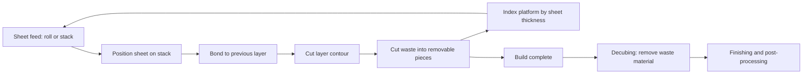
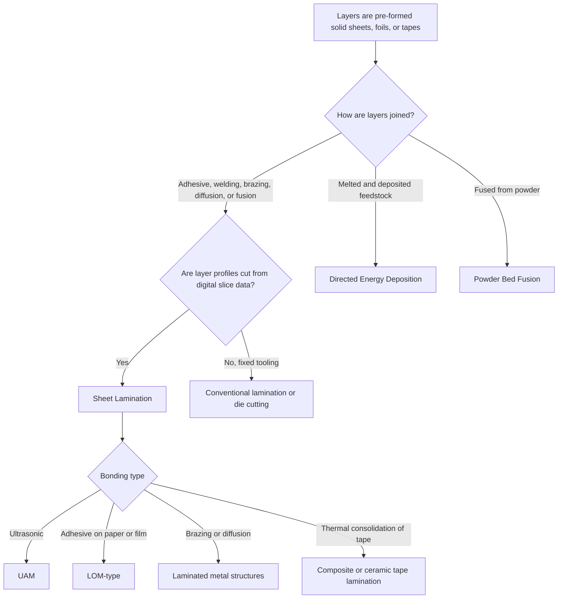

## Sheet Lamination Classification

### Introduction

Sheet lamination (SHL) is one of the seven additive manufacturing (AM) process categories defined in ISO/ASTM 52900, described as a process in which sheets of material are bonded to form a part. Each layer is a pre-fabricated sheet, foil, film, or tape rather than a deposited bead, droplet, or powder layer. Layer geometry is produced by cutting the sheet to the cross-sectional profile, either before or after bonding, and layers are joined by adhesive, ultrasonic welding, brazing, diffusion bonding, thermal fusion, or chemical bonding.

The category is historically important because Laminated Object Manufacturing (LOM) was one of the earliest commercial AM processes, but it is less prevalent industrially today than powder bed fusion or material extrusion. It survives and grows in specific niches: ultrasonic additive manufacturing of metals with embedded electronics, full-color paper-based models, composite laminate tooling, and large-format hybrid additive-subtractive systems.

ISO/ASTM 52900 treats SHL as a single category. Finer sub-classification is not standardized to the same depth, so the literature and industry classify SHL along several independent axes:

1. **Sheet material family** (paper, polymer film, metal foil or sheet, composite prepreg and tape, ceramic tape)
2. **Bonding mechanism** (adhesive, ultrasonic solid-state welding, brazing, diffusion bonding, thermal fusion, solvent or chemical bonding, laser welding)
3. **Cutting method and sequence** (laser, blade, milling, water jet, ultrasonic knife; cut-then-bond versus bond-then-cut)
4. **Sheet handling and feed** (roll-fed web, individual sheet stacking, tape laying)
5. **Layer thickness and geometry strategy** (constant sheet thickness, variable-thickness stacks, contour-following layers)
6. **Machine architecture and hybridization** (dedicated SHL, integrated CNC hybrid, roll-to-roll)
7. **Application family** (visual models, sand casting patterns, metal parts with embedded components, composite tooling, laminated electronics and microfluidics)

Trade names such as LOM, UAM, and SDL are established process names but some are vendor-specific. Generic descriptions are used below, with common names mapped where helpful. Readers should verify current standard editions and vendor specifics, since terminology and products evolve.

```mermaid
flowchart TD
    A[Sheet Lamination - ISO/ASTM 52900] --> B[By sheet material family]
    A --> C[By bonding mechanism]
    A --> D[By cutting method and sequence]
    A --> E[By sheet handling and feed]
    A --> F[By layer geometry strategy]
    A --> G[By machine architecture]
    A --> H[By application family]

    B --> B1[Paper]
    B --> B2[Polymer film]
    B --> B3[Metal foil and sheet]
    B --> B4[Composite tape and ceramic tape]

    C --> C1[Adhesive]
    C --> C2[Ultrasonic welding]
    C --> C3[Brazing and diffusion bonding]
    C --> C4[Thermal fusion and chemical bonding]

    D --> D1[Laser cutting]
    D --> D2[Blade and knife]
    D --> D3[Milling and water jet]
    D --> D4[Cut-then-bond versus bond-then-cut]

    E --> E1[Roll-fed web]
    E --> E2[Individual sheet stacking]
    E --> E3[Tape laying]

    F --> F1[Constant thickness layers]
    F --> F2[Variable-thickness stacks]

    G --> G1[Dedicated SHL machine]
    G --> G2[Hybrid with CNC]
    G --> G3[Roll-to-roll]

    H --> H1[Visual models]
    H --> H2[Metal parts with embedded elements]
    H --> H3[Composite tooling]
    H --> H4[Laminated electronics and microfluidics]
```

### Fundamental Principle

Every SHL process repeats a common cycle, with the order of cutting and bonding varying by variant:

1. A sheet is fed onto the build stack (from a roll or by individual placement).
2. The sheet is bonded to the previous layer (adhesive activation, ultrasonic welding, thermal bonding, brazing, or other).
3. The sheet is cut to the layer contour (laser, blade, or milling), or it was cut before placement.
4. Excess material (waste or support) is cut into a crosshatch pattern or otherwise retained to support the stack and enable later removal.
5. The platform indexes by one sheet thickness, and the cycle repeats.
6. After the build, waste material is removed (decubing), and the part is finished or, for metals, post-processed.

**Core process relationships**

The stair-stepping error on inclined or curved surfaces depends directly on sheet thickness $t_s$. For a surface inclined at angle $\theta$ from the horizontal, the maximum cusp height (deviation from the nominal surface) is:

$$h_c = t_s \cos\theta$$

so thicker sheets give larger surface deviations, and steep (near-vertical) walls have small stair-step error. **Example:** For a paper sheet with $t_s = 0.10$ mm and a surface inclined at $\theta = 30^\circ$ from horizontal, $h_c = 0.10 \times \cos 30^\circ \approx 0.087$ mm. For a 0.5 mm metal foil stack, the same surface has $h_c \approx 0.43$ mm unless the process is combined with machining to smooth contours.

Because layer thickness is dictated by available sheet stock rather than a process setting, SHL has limited freedom to vary layer height compared with vat photopolymerization or powder bed fusion. Variable-thickness stacks are possible by mixing sheet gauges, but adjacent layer registration and bonding must accommodate the difference.

**Adhesive bond strength.** For adhesive-bonded stacks, the interlaminar strength is limited by adhesive properties and by the bonded area fraction $\phi_b$ (accounting for voids, wrinkles, and contamination):

$$\sigma_z \approx \phi_b \, \sigma_{\text{adh}}$$

where $\sigma_{\text{adh}}$ is the adhesive (or cohesive) strength. This relationship is a simplification that neglects peel and stress concentrations, but it shows why sheet flatness, uniform pressure, and clean surfaces matter for properties in the build direction.

**Adhesive activation.** In hot-melt or thermally activated adhesive systems, a heated roller applies temperature $T_r$ and pressure $p_r$ for contact time $t_c$ set by roller speed $v_r$ and contact length $L_c$:

$$t_c = \frac{L_c}{v_r}$$

Adequate wetting and flow require sufficient temperature, pressure, and time; too little produces weak bonds, too much causes squeeze-out and distortion.

**Waste volume.** Because each layer is cut from a full sheet, the fraction of sheet material that becomes waste is:

$$f_{\text{waste}} = 1 - \frac{V_{\text{part}}}{V_{\text{stack}}}$$

where $V_{\text{part}}$ is part volume and $V_{\text{stack}}$ is the total stack volume consumed. Compact, solid parts within a tight stack have lower waste fractions than thin-walled or lattice geometries. Some hybrid systems reuse offcuts, but waste remains a defining economic factor of SHL.

### Classification 1: By Sheet Material Family

#### 1a. Paper-Based Sheet Lamination

Sheets of paper, often with a thermally activated adhesive coating, are laminated and cut with a laser or blade.

| Attribute | Typical Characteristics |
| --- | --- |
| Common materials | Coated or uncoated paper (about 0.05 to 0.2 mm thick), sometimes plastic-laminated paper |
| Bonding | Heat-activated adhesive or water-based adhesive |
| Cutting | CO₂ laser or knife |
| Output | Wood-like or paper-composite parts; full-color models when printed sheets are used |
| Typical applications | Low-cost visual models, architectural models, packaging mockups, sand casting patterns (historical) |

Full-color variants print each sheet before lamination so that the finished part has color on its exterior contours, and the cut edges reveal the printed layers. Paper-based parts are sensitive to moisture and have limited mechanical and thermal properties, so they are mostly used for visual and low-load applications.

#### 1b. Polymer Film and Plastic Sheet Lamination

Thermoplastic films (PVC, PET, PE, and others) are bonded by heat or adhesive.

- Suitable for low-cost functional prototypes and models
- Bonding can be thermal fusion, adhesive, or solvent
- Also used for microfluidic devices, where thin patterned film layers are stacked to form channels and chambers

#### 1c. Metal Foil and Sheet Lamination

Metal foils (aluminum, copper, stainless steel, titanium, and others) are bonded by ultrasonic welding, brazing, diffusion bonding, or adhesive.

| Attribute | Typical Characteristics |
| --- | --- |
| Common materials | Aluminum alloys, copper, stainless steel, titanium, nickel, some dissimilar metal combinations |
| Sheet thickness | Foils of tens to hundreds of micrometers; sheets up to about a millimeter in some systems |
| Bonding | Ultrasonic solid-state welding (UAM), brazing, diffusion bonding, adhesive |
| Typical applications | Heat exchangers with internal channels, structures with embedded sensors and fibers, lightweight metal tooling, multi-material metal stacks |

Because ultrasonic bonding and diffusion bonding are solid-state or low-temperature processes, they avoid melting, so they can join dissimilar metals that are difficult to weld by fusion, and they can embed temperature-sensitive components.

#### 1d. Composite Prepreg and Tape Lamination

Fiber-reinforced prepreg sheets or tapes are cut and stacked, then consolidated (autoclave, press, or in-process heating). Some SHL variants use thermoplastic composite tapes with in-situ heating and compaction. Where automated fiber placement or tape laying is used for structural laminates, the process straddles traditional composite manufacturing and additive manufacturing terminology, and classification depends on whether the source or standard treats it as AM [Inference: categorization of automated tape laying as sheet lamination is context-dependent and not universal].

#### 1e. Ceramic Tape Lamination

Green ceramic tapes (tape-cast sheets of ceramic powder in binder) are cut, stacked, and laminated under heat and pressure, then debinded and sintered.

- Widely used in electronics manufacturing as low-temperature co-fired ceramic (LTCC) and high-temperature co-fired ceramic (HTCC) technologies
- Layers can carry printed conductors and vias, forming multilayer circuits and microfluidic or sensor structures
- Shrinkage during sintering must be controlled and compensated

### Classification 2: By Bonding Mechanism

| Mechanism | Description | Typical Materials | Key Traits |
| --- | --- | --- | --- |
| **Adhesive bonding** | Adhesive (pressure sensitive, hot melt, thermoset, or water-based) joins sheets | Paper, polymer, composites, some metals | Simple and low cost; bond line limits temperature and strength; adhesive layer affects properties |
| **Ultrasonic welding (solid state)** | High-frequency vibration under pressure disrupts oxide layers and creates metallurgical bonds | Aluminum, copper, some other ductile metals | No bulk melting; low process temperature; allows embedding; requires ductile foils and sufficient normal force |
| **Brazing** | Filler metal melts between sheets and forms a joint | Stainless steel, nickel, copper, titanium | High joint strength; furnace cycle; possible distortion |
| **Diffusion bonding** | Heat and pressure over time enable atomic diffusion across interfaces | Titanium, stainless steel, aluminum (with surface preparation) | Near-parent-material joint; long cycles; surface cleanliness critical |
| **Thermal fusion** | Heat softens or melts surfaces of thermoplastic sheets | Thermoplastic films and tapes | Adhesive-free; requires uniform heating and pressure |
| **Solvent or chemical bonding** | Solvent softens surfaces, or a chemical reaction joins them | Some polymers | Fast; residual solvent and dimensional effects |
| **Laser welding** | Laser melts and joins thin metal or polymer sheets | Metal and polymer sheets | Localized heat; contour welding around edges |
| **Mechanical fastening or interlocking** | Stacked sheets held by pins, rivets, or bolts | Various | Used in some large or low-cost laminated structures |

**Ultrasonic bonding physics.** In ultrasonic additive manufacturing, a rotating sonotrode presses on a foil while vibrating at typically about 20 kHz (transverse to the surface). Oxide films fracture and local plastic deformation brings clean metal surfaces into contact, forming solid-state bonds. The friction power dissipated at the interface can be approximated as:

$$P_f \approx \mu_f \, F_n \, v_{\text{rel}}$$

where $\mu_f$ is the friction coefficient, $F_n$ is the normal force, and $v_{\text{rel}} = 2\pi f \, A_v$ is the peak relative velocity for vibration at frequency $f$ with amplitude $A_v$. This lumped estimate ignores changing friction during bonding and acoustic softening, so it is a scaling guide. Bond quality (linear weld density, the fraction of the interface length that is bonded) increases with normal force, amplitude, and lower travel speed, and it depends on foil hardness, surface roughness, and temperature. Parameter windows must be established for each material system.

**Diffusion bonding kinetics.** Interface void closure and bonding depend on temperature, pressure, and time. A common scaling is that bonding time falls sharply as temperature rises according to an Arrhenius dependence:

$$t_{\text{bond}} \propto \frac{1}{p^{\,m_p}} \exp\!\left(\frac{Q_d}{R_g T}\right)$$

where $p$ is bonding pressure, $m_p$ is a pressure exponent depending on the void-closure mechanism, $Q_d$ is an effective activation energy, $R_g$ is the gas constant, and $T$ is temperature. The exponent and activation energy are material and surface dependent, so this is a qualitative guide.

### Classification 3: By Cutting Method and Sequence

| Cutting Method | Principle | Suitable Materials | Notes |
| --- | --- | --- | --- |
| **CO₂ laser cutting** | Focused laser vaporizes or burns through the sheet | Paper, polymer film, some composites | Fast contour cutting; edge charring and fumes; power must be controlled to avoid cutting into the layer below |
| **Fiber or other laser cutting** | Higher-power lasers cut metals | Metal foil and sheet | Heat-affected zone and kerf must be managed |
| **Mechanical blade or knife** | Drag or oscillating blade cuts the profile | Paper, film, prepreg | Low cost and no thermal damage; blade wear and kerf compensation |
| **Milling (CNC)** | End mill machines the profile | Metals (UAM hybrid), some plastics | High accuracy and surface finish; chips and coolant; cannot cut inside sharp inside corners smaller than the tool radius |
| **Water jet** | Abrasive or pure water cutting | Wide range | No heat; slower; wet handling |
| **Ultrasonic knife** | Vibrating blade cuts soft or layered materials | Composites, foams | Reduced cutting force |
| **Die cutting or stamping** | Pre-formed die cuts sheet shapes | High-volume laminated parts | Not a freeform AM approach; high tooling cost |

**Cutting sequence variants.**

| Sequence | Description | Advantages | Limitations |
| --- | --- | --- | --- |
| **Bond then cut** | Full sheet is bonded to the stack, then the contour is cut | Simple registration; the stack is rigid during cutting | Cutting depth control is critical to avoid damaging lower layers; waste removal by crosshatching |
| **Cut then bond** | Sheet contour is cut first, then the cut sheet is placed and bonded | Allows different materials per layer and internal features; avoids cutting into previous layers | Requires precise placement and handling of loose pieces; islands must be held during transfer |
| **Bond, cut, and machine (hybrid)** | UAM-style: foils are bonded, then CNC milling trims the profile | High accuracy; supports internal channels | More complex machine; chips and tool wear |

**Laser cut-depth control.** When cutting a sheet already bonded to the stack, cut depth $d_c$ must equal sheet thickness with minimal penetration into the lower layer. Depth depends on power $P$, speed $v$, and absorptivity, and is often modeled by an energy-balance relation:

$$d_c \approx \frac{A \, P}{v \, w_k \, \rho \left( c_p \Delta T + \Delta H_v \right)}$$

where $A$ is absorptivity, $w_k$ is kerf width, $\rho$ is density, $c_p$ is specific heat, $\Delta T$ is temperature rise to vaporization, and $\Delta H_v$ is the latent heat of vaporization. This crude energy balance neglects conduction, plume shielding, and reflections, so actual depth is calibrated by trial cuts.

### Classification 4: By Sheet Handling and Feed

| Method | Description | Typical Use |
| --- | --- | --- |
| **Roll-fed web** | Continuous sheet or web is fed from a supply roll and taken up by a waste roll | Paper LOM, foil UAM, roll-to-roll laminates |
| **Individual sheet stacking** | Pre-cut sheets are placed by a pick-and-place or feeder | Multi-material stacks, ceramic tapes, prepreg |
| **Tape laying** | Narrow tapes are laid and consolidated by a head | Composite tape-based SHL |
| **Sheet transfer with carrier** | Sheets on a carrier are transferred and released onto the stack | Thin films and delicate materials |
| **Roll-to-roll continuous processing** | Web moves continuously through cutting, stacking, and bonding stations | High-volume laminated structures and electronics |

Web tension and registration accuracy determine layer alignment. Misregistration between layers produces stair-step, offset, or discontinuity errors, and registration marks or vision systems are commonly used in advanced systems.

### Classification 5: By Layer Thickness and Geometry Strategy

| Strategy | Description | Considerations |
| --- | --- | --- |
| **Constant sheet thickness** | All layers use the same stock thickness | Simple; surface stair-stepping fixed by stock |
| **Variable thickness stack** | Different sheet gauges are used for different regions or stages | Higher resolution where needed; increased complexity |
| **Contour-following or slanted layers** | Layers are cut with tapered edges or the stack is angled to reduce stair steps | Requires 5-axis cutting or angled stacking |
| **Selective material layers** | Different materials per layer or per region | Enables multi-material and functionally graded constructions |
| **Embedded component layers** | Sheets are cut to form cavities for sensors, fibers, or electronics before covering | Requires careful thermal and mechanical compatibility |
| **Thickness compensation by machining** | Milling after bonding corrects surface and layer thickness | Improves accuracy and surface finish |

### Classification 6: By Machine Architecture and Hybridization

| Class | Description | Typical Use |
| --- | --- | --- |
| **Dedicated paper and film laminators (LOM-type)** | Roll-fed system with heated roller and laser or blade cutter | Visual models, low-cost prototyping |
| **Ultrasonic additive manufacturing (UAM) systems** | Sonotrode welding of metal foils with integrated CNC milling | Metal parts with embedded elements, dissimilar metal joins |
| **Hybrid additive-subtractive machines** | Bonding plus high-precision machining in one platform | Improved accuracy and surface quality |
| **Composite laminating and tape systems** | Automated cutting, kitting, and stacking of prepreg | Composite tooling and structures |
| **Ceramic tape lamination lines (LTCC/HTCC)** | Tape cutting, via punching, printing, stacking, and lamination | Multilayer ceramic electronics |
| **Roll-to-roll laminating lines** | Continuous web-based lamination and cutting | Microfluidics, flexible electronics, packaging |
| **Large-format laminated structures** | Stacked plates with CNC contour cutting | Architectural forms, molds, furniture |

### Sub-Variant Mapping Table

| Generic Description | Common or Vendor Names | Sheet Material | Bonding | Cutting |
| --- | --- | --- | --- | --- |
| Adhesive-bonded paper or film lamination | Laminated Object Manufacturing (LOM), Selective Deposition Lamination (SDL, vendor term) | Paper, plastic film | Heat-activated or applied adhesive | Laser or blade |
| Ultrasonic additive manufacturing | UAM (vendor and community term); sometimes described as ultrasonic consolidation | Metal foils | Ultrasonic solid-state welding | CNC milling |
| Brazed or diffusion-bonded metal laminate | Laminated metal manufacturing, stacked-foil heat exchangers | Metal sheets | Brazing or diffusion bonding | Laser, water jet, or etching |
| Composite laminate additive processes | Sheet-based composite lamination, some tape-laying systems | Prepreg sheets or tapes | Thermal consolidation | Blade, ultrasonic knife, laser |
| Ceramic tape lamination | LTCC, HTCC processes | Green ceramic tapes | Thermal lamination, then sintering | Punching, laser, or knife |
| Laminated microfluidic devices | Layer-by-layer microfluidic lamination | Polymer films with adhesive | Adhesive or thermal | Laser or knife |

[Inference: the category assignment of some hybrid or vendor-specific systems, particularly composite tape laying and multilayer ceramic electronics, may vary in informal usage; they are grouped within sheet lamination when sheets or tapes are bonded to form the part, but consult current ISO/ASTM terminology for authoritative wording.]

### Distinguishing Sheet Lamination from Adjacent Categories

- **Sheet lamination versus material extrusion**: sheet lamination adds pre-formed sheets and cuts them to profile, whereas extrusion deposits continuous beads of material through a nozzle.
- **Sheet lamination versus powder bed fusion and binder jetting**: those processes build layers from powder, whereas SHL uses solid sheets, and the layer thickness is determined by stock rather than by a recoater setting.
- **Sheet lamination versus directed energy deposition**: DED melts feedstock into a melt pool, whereas UAM and other SHL variants join sheets in the solid state or with a bonding layer.
- **Sheet lamination versus conventional laminated tooling and die cutting**: SHL builds freeform geometry from digital data layer by layer, whereas conventional lamination or stamping requires part-specific tooling; stacking pre-cut plates by hand from a CAD slice is often described as "laminated" construction but sits at the boundary of AM depending on the level of automation and data-driven process control.
- **Hybrid machines**: a machine that bonds sheets and mills the contour combines additive and subtractive steps; the additive portion is classified as SHL.

### Process Parameters and Their Roles

| Parameter | Effect | Typical Consideration |
| --- | --- | --- |
| **Sheet thickness and flatness** | Sets Z resolution and stair-step error; flatness affects bond uniformity | Choose stock based on required accuracy |
| **Bonding temperature (heated roller or plate)** | Adhesive activation and flow; thermal fusion | Balance bond strength against distortion and squeeze-out |
| **Bonding pressure or normal force** | Contact, oxide disruption (UAM), void closure | Higher pressure improves bonding but can deform foils or the stack |
| **Roller or sonotrode speed** | Contact time and bond quality | Slower speeds usually improve bonding but reduce throughput |
| **Ultrasonic amplitude and frequency** | Interface friction and bond formation in UAM | Tuned per foil material and thickness |
| **Cutting power and speed** | Cut depth, edge quality, heat-affected zone | Calibrate to cut exactly through the sheet |
| **Kerf compensation** | Dimensional accuracy | Offset toolpaths by kerf width |
| **Waste crosshatch pattern** | Ease of decubing versus support stiffness | Cell size chosen for part geometry |
| **Registration accuracy** | Layer alignment and contour continuity | Vision systems and fiducials |
| **Adhesive type and coating weight** | Interlayer strength and property limits | Thin, uniform coating preferred |
| **Environmental control** | Humidity for paper, temperature for adhesives | Stable conditions reduce warpage and bond variability |
| **Post-bond heat treatment or sintering profile (metal, ceramic)** | Final density, bond strength, and dimensional change | Established by trial for the material system |

### Defects and Quality Concerns

| Defect | Cause | Mitigation |
| --- | --- | --- |
| **Delamination or weak interlayer bonding** | Insufficient temperature, pressure, or contact time; contaminated or oxidized surfaces; poor adhesive coating | Optimize bonding parameters, clean surfaces, control adhesive application |
| **Lack of bonding at UAM interfaces (voids, low linear weld density)** | Low normal force or amplitude, rough or hard foils, oxide layers | Increase force and amplitude, adjust speed, use annealed foils, control surface roughness |
| **Overcut or undercut** | Cut depth error, sheet thickness variation | Calibrate cutting power, monitor sheet thickness, use depth control |
| **Charring and edge burn (laser-cut paper and polymer)** | Excess laser power or slow speed | Lower power, adjust focus, use assist gas |
| **Misregistration and layer offset** | Web tension variation, positioning errors, thermal expansion | Improve registration, vision alignment, tension control |
| **Warpage and curl** | Thermal or moisture-induced stresses, nonuniform bonding | Control environment, use balanced layups, apply uniform pressure |
| **Stair-stepping on curved surfaces** | Sheet thickness limits vertical resolution | Use thinner stock, machining, or angled layers |
| **Trapped waste and difficult decubing** | Complex internal cavities and undercuts | Design access paths, adjust crosshatch pattern |
| **Adhesive squeeze-out and residue** | Excess adhesive or pressure | Reduce coating weight and pressure, clean up post-build |
| **Distortion or slumping during brazing or diffusion bonding** | High temperature, gravity, and nonuniform loading | Fixturing, controlled thermal cycles, support design |
| **Sintering shrinkage variation in ceramic laminates** | Nonuniform binder distribution, lamination pressure variation | Uniform lamination, controlled debinding and sintering, shrinkage compensation |
| **Embedded component damage (UAM)** | Excess pressure or vibration on fragile elements | Reduced amplitude and force, protective encapsulation, careful placement |
| **Moisture sensitivity (paper parts)** | Hygroscopic paper | Seal with coatings or sealants after build |

### Post-Processing Chains

**Paper and polymer LOM-type parts**

1. Remove the build stack from the platform
2. Decubing: break away crosshatched waste
3. Sand, seal, and finish surfaces (sealants, paints, or coatings)
4. Inspection

**Ultrasonic additive manufacturing (metal)**

1. Remove part from the build plate (machined or cut)
2. Remove residual foil or machine internal features as designed
3. Optional heat treatment to relieve stress or enhance bond properties
4. Machining of critical surfaces and inspection (for example, ultrasonic testing or metallography of bond lines)

**Brazed or diffusion-bonded laminates**

1. Clean and stack sheets with fixturing
2. Braze or diffusion bond in furnace with controlled atmosphere and pressure
3. Machine, finish, and inspect (leak testing for heat exchangers)

**Ceramic tape lamination (LTCC/HTCC-type)**

1. Cut, punch, and print tapes
2. Stack and laminate under heat and pressure
3. Debind and sinter (co-fire)
4. Finish, metallize, and test

Sintering shrinkage compensation for isotropic linear shrinkage follows:

$$L_{\text{green}} = \frac{L_{\text{final}}}{1 - \varepsilon_s}$$

where $\varepsilon_s$ is the fractional linear shrinkage. **Example:** With $\varepsilon_s = 0.15$ and a target of 30 mm, $L_{\text{green}} = 30/0.85 \approx 35.3$ mm. In laminated ceramic tapes, in-plane shrinkage often differs from thickness-direction shrinkage, so axis-specific factors are established experimentally.

### Comparative Table of Principal SHL Variants

| Attribute | LOM-type (paper, film) | UAM (metal) | Brazed/diffusion-bonded metal laminate | Composite tape lamination | Ceramic tape lamination |
| --- | --- | --- | --- | --- | --- |
| Sheet material | Paper, polymer | Metal foil | Metal sheet | Prepreg or thermoplastic tape | Green ceramic tape |
| Bonding | Adhesive or heat | Ultrasonic solid-state | Brazing or diffusion | Thermal consolidation | Thermal lamination then sintering |
| Cutting | Laser or blade | CNC milling | Laser, etch, or water jet | Blade or ultrasonic knife | Punch, laser, or knife |
| Layer thickness | About 0.05 to 0.2 mm | About 0.1 to 0.15 mm (typical foil) | About 0.1 to 1 mm | About 0.1 to 0.3 mm (per ply) | About 0.05 to 0.3 mm |
| Property level | Low to moderate | Metallurgical bonds; properties depend on interface | Near parent material with good bonding | Composite laminate properties | Ceramic after sintering |
| Multi-material capability | Limited | Strong (dissimilar metals, embedded elements) | Possible | Possible (hybrid layups) | Strong (with printed conductors) |
| Waste | High | Moderate (foil remnants and chips) | Moderate to high | Moderate | Moderate |
| Typical use | Visual models | Embedded sensors, heat exchangers | Compact heat exchangers, structures | Tooling, structures | Multilayer electronics, sensors |
| Maturity | Established, declining | Established niche | Established manufacturing route | Specialized | Established manufacturing route |

Values are indicative and depend on machine, material, and process settings.

### Design and Selection Guidance

**Key Points**

- Choose **paper or film LOM-type lamination** for low-cost, large visual or architectural models where mechanical properties are secondary; consider moisture sealing.
- Choose **UAM** when multi-material metal construction, embedded sensors, fibers, or electronics, or dissimilar metal joints are needed, and where internal channels can be accessed by the milling and foil layout.
- Choose **brazed or diffusion-bonded laminates** for compact heat exchangers and stacked-plate structures where high joint strength and leak-tightness are required.
- Choose **composite tape or prepreg lamination** for tooling and structural laminates where fiber orientation control matters.
- Choose **ceramic tape lamination** for multilayer electronic and microfluidic ceramic devices where via connections and printed layers are needed.
- Orient parts so that critical surfaces and load paths are considered relative to the layer direction: interlaminar strength is typically lower than in-plane strength, and stair-stepping affects surfaces inclined at shallow angles.
- Include **waste-removal paths** and design crosshatch patterns compatible with internal cavities, since trapped waste is difficult to remove.
- Account for **kerf, registration, and thickness tolerances** when specifying dimensional accuracy, and consider machining critical surfaces.
- Verify **thermal and chemical compatibility** of adhesives and embedded components with operating conditions, since adhesive bond lines often limit temperature and environmental resistance.
- Note that behavior varies with equipment, materials, and settings, so validate bond strength, dimensional accuracy, and properties with representative test specimens made through the full process chain.

**Example: selecting an SHL variant.** A thermal management company needs an aluminum cold plate with internal serpentine channels and an embedded thermocouple network, in low volumes. UAM can bond aluminum foils, mill channel profiles layer by layer, and embed sensors during the build, all without melting the aluminum around the sensors. Powder bed fusion could produce the channels but would not naturally embed temperature-sensitive sensors, and conventional machining would require a multi-part brazed assembly. The decision would also consider leak-tightness verification, required thermal performance, foil-to-foil bond quality, and cost relative to conventional stacked-plate brazing for higher volumes.

### Standards and Terminology Context

- **ISO/ASTM 52900** defines sheet lamination as a process category and provides terminology.
- Terms such as *LOM*, *SDL*, and *UAM* are established names that may be tied to specific vendors or communities; generic terms *sheet lamination*, *ultrasonic sheet lamination*, or *laminated object manufacturing* are preferable in technical specifications, with the vendor name noted where necessary.
- Designations that combine category with bonding mechanism or material may appear in more recent standards and literature; verify exact designations and scope in the current editions.
- Standards specific to sheet-lamination parts are less developed than for powder bed fusion or material extrusion [Inference: limited industrial volume has slowed dedicated standardization]. General AM standards for design, data formats, and testing in the ISO/ASTM 529xx family, along with established standards from adjacent fields (brazing, diffusion bonding, LTCC/HTCC electronics, composite laminates), are often used as references.
- Regulated applications (aerospace, medical, electronics) impose additional requirements on materials, process control, and validation.

### Emerging Directions

- Ultrasonic additive manufacturing of dissimilar metal and metal-matrix composite structures, with embedded fibers, sensors, and electronics
- Hybrid machines combining sheet bonding, CNC machining, and in-situ inspection
- Automated tape-based and prepreg lamination for tooling and structures with digitally planned fiber orientation
- Roll-to-roll lamination for flexible electronics, microfluidics, and sensors
- Improved adhesives and low-temperature bonding for embedded components
- Multi-material and graded laminates, including metal-polymer and ceramic-metal combinations
- Sustainability improvements: waste reduction, recyclable sheet stock, and reuse of offcuts
- Integration with digital twins and closed-loop registration and bond-quality monitoring

[Inference: as capabilities converge, boundaries between sheet lamination, automated composite layup, and multilayer electronics manufacturing may require clarification in future standard revisions.]

### Conclusion

Sheet lamination is formally a single ISO/ASTM 52900 category, but it is practically classified along multiple axes: sheet material family (paper, polymer film, metal foil and sheet, composite tape, ceramic tape), bonding mechanism (adhesive, ultrasonic welding, brazing, diffusion bonding, thermal fusion, chemical bonding, laser welding), cutting method and sequence (laser, blade, milling, water jet; cut-then-bond versus bond-then-cut), sheet handling (roll-fed, stacked sheets, tape laying), layer geometry strategy, machine architecture (dedicated laminators, UAM with milling, hybrid and roll-to-roll systems), and application family. These axes explain why names such as LOM, UAM, laminated metal manufacturing, and LTCC lamination map onto one underlying principle of bonding pre-formed sheets to build a part, while producing very different capabilities in material properties, resolution, multi-material capability, waste generation, and post-processing. Effective use of the classification pairs the generic designation with sheet stock, bonding method, cutting strategy, and downstream processing, and validates bond quality, dimensional accuracy, and properties experimentally for the intended application.

### Next Steps

- Ultrasonic additive manufacturing: bond mechanics, parameter windows, and embedded component integration
- Adhesive selection and bond-line design for laminated structures
- Brazing and diffusion bonding of stacked metal laminates
- Laser and mechanical cutting strategies: kerf, depth control, and edge quality
- Composite tape and prepreg lamination for tooling and structures
- LTCC and HTCC ceramic lamination: tape casting, via formation, and co-firing
- Decubing strategies, waste reduction, and design for waste removal
- Comparing sheet lamination with powder bed fusion and directed energy deposition for metal parts