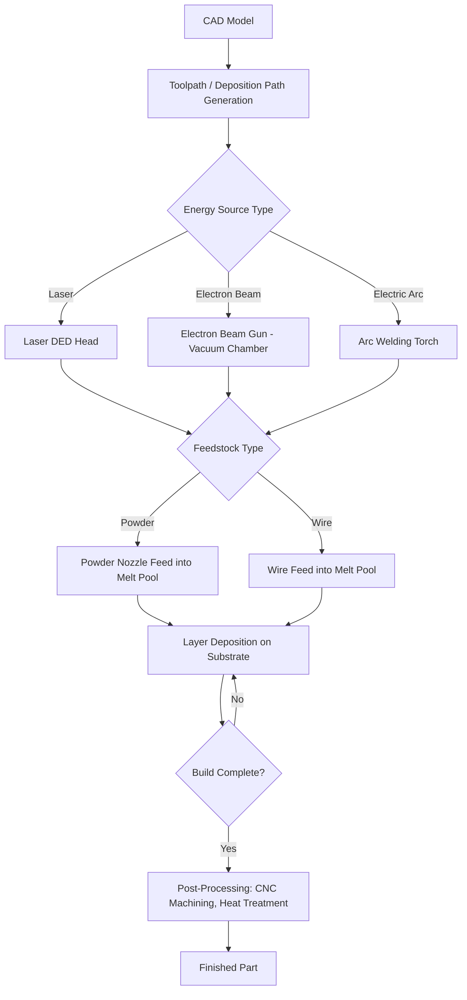

## Directed Energy Deposition Classification

### Definition and Scope

Directed Energy Deposition (DED) is an additive manufacturing process in which focused thermal energy is used to fuse materials by melting them as they are being deposited, per the ASTM/ISO 52900 standard terminology. The feedstock (metal wire or powder) is melted and deposited simultaneously through a nozzle or deposition head, typically mounted on a multi-axis robotic arm or gantry system. DED is distinguished from Powder Bed Fusion (PBF) by its feedstock delivery method: material is fed directly into the melt pool rather than pre-spread in a powder bed.

DED is also known by several trade and legacy names, including:

- Laser Engineered Net Shaping (LENS)
- Direct Metal Deposition (DMD)
- Laser Metal Deposition (LMD)
- Laser Cladding (when used for repair/coating)
- Electron Beam Freeform Fabrication (EBF3)
- Wire Arc Additive Manufacturing (WAAM)
- 3D Laser Cladding

### Classification by Energy Source

**Laser-Based DED**

Uses a focused laser beam (typically fiber, Nd:YAG, or CO2) as the heat source to create a melt pool. Laser DED offers the finest control over energy input and the smallest melt pool sizes among DED variants, enabling better dimensional accuracy (typically ±0.25 mm to ±0.5 mm) at the cost of lower deposition rates.

**Electron Beam DED**

Uses a focused electron beam in a vacuum chamber as the heat source. Electron beam DED achieves high energy density and deep penetration, and the vacuum environment minimizes oxidation, making it well-suited for reactive metals such as titanium alloys. However, the vacuum chamber requirement limits build volume and increases equipment cost.

**Arc-Based DED (WAAM)**

Uses an electric arc (Gas Metal Arc Welding/GMAW, Gas Tungsten Arc Welding/GTAW, or Plasma Arc Welding/PAW) as the heat source. Arc-based DED provides the highest deposition rates (up to several kg/hr) among DED variants but the lowest dimensional accuracy and roughest surface finish, generally requiring post-process machining.

### Classification by Feedstock Type

**Powder-Fed DED**

Metal powder is delivered coaxially or laterally through nozzles into the melt pool, typically using an inert carrier gas (argon or nitrogen). Powder-fed systems allow multi-material and functionally graded deposition by blending powder streams from multiple hoppers in real time.

**Wire-Fed DED**

Solid wire feedstock is fed into the melt pool, similar to conventional welding wire feed mechanisms. Wire-fed DED offers near-100% material utilization efficiency (compared to 20–95% for powder systems) and lower material cost, but is generally limited to single-material deposition and coarser feature resolution.

### Comparison Table

| Variant | Energy Source | Feedstock | Deposition Rate | Accuracy | Typical Applications |
| --- | --- | --- | --- | --- | --- |
| Laser Powder DED | Laser | Powder | 0.1–1 kg/hr | High (±0.25–0.5 mm) | Repair, cladding, functional grading |
| Laser Wire DED | Laser | Wire | 0.5–2 kg/hr | Medium | Aerospace structural components |
| Electron Beam DED | Electron beam | Wire (primary) | 2–9 kg/hr | Medium | Titanium/reactive metal large parts |
| Arc DED (WAAM) | Electric arc | Wire | 1–10+ kg/hr | Low (requires machining) | Large structural parts, near-net shapes |

### Process Mechanics

The general DED process sequence:

1. **CAD/toolpath generation** — Slicing software generates deposition toolpaths, often as continuous beads rather than discrete layers.
2. **Substrate preparation** — A base plate or existing component is fixtured; DED is uniquely capable of depositing onto existing parts for repair.
3. **Simultaneous melt and deposit** — The energy source creates a melt pool while feedstock is fed in; the head/nozzle moves along the toolpath, and the substrate/deposition head has 3–5 axes of motion.
4. **Layer-by-layer buildup** — The process repeats, with each pass fusing metallurgically to the prior layer.
5. **Post-processing** — Near-net-shape parts typically require CNC machining to achieve final tolerances, plus potential heat treatment for residual stress relief.

$$Q = \eta \cdot P$$

Where $Q$ is effective heat input into the melt pool, $\eta$ is process/absorption efficiency, and $P$ is the source power (laser, arc, or beam power). Energy density and travel speed jointly govern melt pool geometry, dilution ratio, and resulting microstructure.

### Process Flow Diagram

### Melt Pool Cross-Section (SVG)

<svg xmlns="http://www.w3.org/2000/svg" viewBox="0 0 500 300">
<text x="250" y="25" font-size="16" font-weight="bold" text-anchor="middle" fill="#222">DED Melt Pool Cross-Section (svg_diagram)</text>
<rect x="50" y="200" width="400" height="60" fill="#a9a9a9" stroke="#333" stroke-width="2" />
<text x="60" y="280" font-size="12" fill="#333">Substrate</text>
<ellipse cx="250" cy="195" rx="60" ry="25" fill="#ff6b35" stroke="#c1440e" stroke-width="2" />
<text x="250" y="200" font-size="11" text-anchor="middle" fill="#fff">Melt Pool</text>
<line x1="250" y1="60" x2="250" y2="170" stroke="#333" stroke-width="4" />
<polygon points="230,60 270,60 250,20" fill="#4a90d9" stroke="#2a5f8f" stroke-width="1" />
<text x="250" y="45" font-size="11" text-anchor="middle" fill="#fff">Energy Source</text>
<line x1="180" y1="100" x2="235" y2="185" stroke="#2ecc71" stroke-width="6" />
<polygon points="175,95 195,95 180,75" fill="#2ecc71" />
<text x="130" y="90" font-size="11" fill="#1e8449">Powder/Wire Feed</text>
<path d="M 250 170 L 250 195" stroke="#333" stroke-width="1" stroke-dasharray="3,3" />
<text x="320" y="150" font-size="10" fill="#555">Deposition Direction →</text>
<line x1="300" y1="145" x2="380" y2="145" stroke="#555" stroke-width="1" marker-end="url(#arrow)" />
</svg>

### Key Points

- DED enables **multi-material and functionally graded deposition** through real-time control of powder feed ratios, a capability not shared by PBF processes.
- DED is uniquely suited for **repair and remanufacturing** of high-value components (e.g., turbine blades) because it can deposit new material directly onto existing worn parts.
- Build volume in DED is generally not constrained by a fixed chamber size (except for electron beam variants), since deposition heads mounted on robotic arms or gantries can move over large or irregular substrates.
- Dimensional accuracy is inversely related to deposition rate: arc-based systems trade accuracy for speed, while laser-powder systems trade speed for precision.
- [Inference] Selection between DED variants in industrial practice is typically driven by part size and required precision: laser-powder DED for high-precision aerospace repair, and arc-based WAAM for large-scale structural near-net shapes where post-machining budget is available.

### Example

A turbine blade tip repair using **laser powder DED**: A worn Inconel 718 blade tip is fixtured, and a 5-axis laser deposition head builds up new material layer-by-layer using Inconel 718 powder fed coaxially into the laser-generated melt pool, restoring the original geometry with a metallurgical bond, followed by CNC finishing to blueprint tolerances.

### Applications by Industry

- **Aerospace** — Structural titanium components, turbine blade/vane repair, functionally graded coatings
- **Oil & Gas** — Corrosion-resistant cladding on valves and drilling components
- **Tooling** — Mold and die repair, hardfacing of wear surfaces
- **Defense/Maritime** — Large-scale WAAM structural components, field-deployable repair systems

### Related Topics

- Powder Bed Fusion classification (LPBF vs. EBM)
- Wire Arc Additive Manufacturing (WAAM) process parameters
- Metallurgical bonding and dilution ratio in DED
- Functionally graded materials (FGM) via multi-hopper DED
- Post-processing requirements for near-net-shape DED parts
- DED machine architectures (hybrid CNC-DED systems)