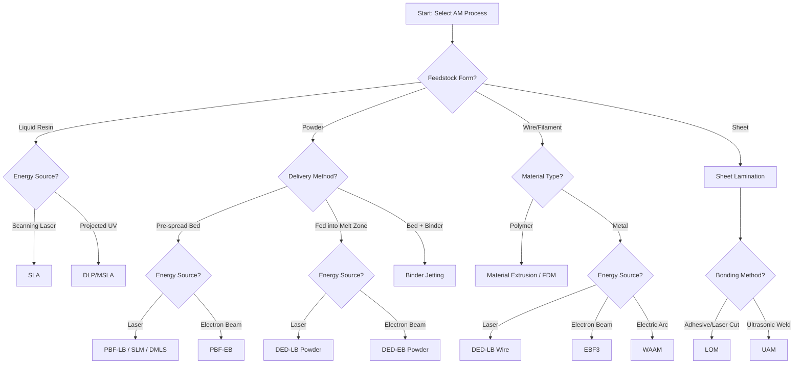

## Classification by Feedstock Form and Energy Source

### Definition and Scope

Additive Manufacturing (AM) processes can be systematically classified along two orthogonal axes: **feedstock form** (the physical state and geometry in which material is supplied to the process) and **energy source** (the mechanism used to fuse, bind, or solidify that material). This classification framework is a common taxonomy for comparing and selecting AM technologies, complementing the seven-process-category system defined in ASTM/ISO 52900. Understanding these two axes independently — rather than only the process category name — is essential for evaluating trade-offs in accuracy, throughput, material compatibility, and part performance.

### Classification by Feedstock Form

**Liquid/Resin-Based**

Feedstock exists as a liquid photopolymer resin held in a vat or reservoir, cured selectively into solid form. Common in Vat Photopolymerization (SLA, DLP, CDLP) processes. Feedstock is uncured until exposed to the energy source, allowing very high feature resolution (down to tens of microns) but generally lower mechanical/thermal performance than thermoplastics.

**Powder-Based**

Feedstock exists as fine particulate (typically 15–150 μm for metals, 20–100 μm for polymers), either pre-spread as a bed (Powder Bed Fusion) or fed directly into a melt zone (Directed Energy Deposition, Binder Jetting). Powder form enables fine resolution and complex geometries but introduces handling, safety (combustible dust), and recycling considerations.

**Wire/Filament-Based**

Feedstock is a continuous solid strand, either polymer filament (Material Extrusion/FDM) or metal wire (Wire-DED, EBF3, WAAM). Wire/filament feedstock offers the highest material utilization efficiency (approaching 100%) and lower cost per kilogram relative to powder, at the expense of coarser resolution.

**Sheet/Laminate-Based**

Feedstock is supplied as solid sheets or foils, bonded layer-by-layer and cut to contour (Sheet Lamination — e.g., Laminated Object Manufacturing/LOM, Ultrasonic Additive Manufacturing/UAM). Sheet feedstock allows use of pre-qualified bulk material properties (e.g., wrought metal sheet) since no melting occurs in some variants.

**Liquid Binder + Powder Bed (Composite Feedstock)**

Used specifically in Binder Jetting: a liquid binder is selectively deposited onto a powder bed, distinct from resin-based processes since the powder itself is not melted or cured directly.

### Classification by Energy Source

**Laser**

Focused coherent light (fiber, CO2, Nd:YAG, or UV lasers) used for melting (PBF-LB, DED-LB), curing (SLA), or cutting (some Sheet Lamination variants). Lasers provide fine control of energy density and small spot sizes (25–100 μm), enabling high-resolution features.

**Electron Beam**

A focused beam of accelerated electrons in a vacuum environment, used in Electron Beam Melting (PBF-EB) and Electron Beam Freeform Fabrication (DED-EB). Electron beams achieve rapid scanning speeds and reduced residual stress via preheating, but require vacuum chambers that constrain build size and increase capital cost.

**Electric Arc**

A sustained electrical arc (GMAW, GTAW, PAW) used as the heat source in Wire Arc Additive Manufacturing (a DED variant). Arc energy sources provide the highest deposition rates among metal AM processes but the coarsest resolution.

**Thermal/Extrusion Heat (Resistive)**

Localized resistive heating elements that melt thermoplastic filament just before extrusion, used in Material Extrusion (FDM/FFF). This is a lower-energy-density approach compared to beam-based sources, and does not involve beam focusing or scanning optics.

**UV Light (Non-Laser)**

Projected UV light (DLP) or masked UV arrays (LCD/MSLA) used to cure entire resin layers simultaneously, rather than point-by-point scanning as in SLA. This enables faster layer times independent of cross-sectional complexity.

**Chemical/Binder Reaction (Non-Thermal)**

In Binder Jetting, no melting energy source is used; instead, a chemical binding agent is jetted onto powder, with bonding driven by adhesive/capillary action rather than thermal fusion. A separate sintering furnace step (thermal, but decoupled from the primary build process) is required afterward for metal/ceramic parts.

**Ultrasonic Energy**

Used in Ultrasonic Additive Manufacturing (a Sheet Lamination variant) to create solid-state metallurgical bonds between metal foils via high-frequency vibration, without melting — enabling multi-material lamination of dissimilar metals at low temperatures.

### Cross-Reference Matrix: Feedstock Form × Energy Source

| Feedstock Form | Laser | Electron Beam | Electric Arc | Resistive Heat | UV (Non-Laser) | Chemical Binder | Ultrasonic |
| --- | --- | --- | --- | --- | --- | --- | --- |
| Liquid/Resin | SLA | — | — | — | DLP/MSLA | — | — |
| Powder Bed | PBF-LB (SLM/DMLS) | PBF-EB | — | — | — | Binder Jetting | — |
| Powder Fed | DED-LB | DED-EB | — | — | — | — | — |
| Wire | DED-LB (wire) | EBF3 | WAAM | FDM (polymer) | — | — | — |
| Sheet | Laser LOM | — | — | — | — | — | UAM |

### Selection Logic Diagram

### Comparative Overview (SVG)

<svg xmlns="http://www.w3.org/2000/svg" viewBox="0 0 600 320">
<text x="300" y="25" font-size="16" font-weight="bold" text-anchor="middle" fill="#222">Feedstock Form vs. Resolution/Rate Trade-off (svg_diagram)</text>
<line x1="80" y1="270" x2="550" y2="270" stroke="#333" stroke-width="2" />
<line x1="80" y1="270" x2="80" y2="50" stroke="#333" stroke-width="2" />
<text x="300" y="300" font-size="12" text-anchor="middle" fill="#333">Deposition Rate →</text>
<text x="40" y="160" font-size="12" text-anchor="middle" fill="#333" transform="rotate(-90 40 160)">Resolution →</text>
<circle cx="140" cy="90" r="10" fill="#4a90d9" />
<text x="140" y="75" font-size="11" text-anchor="middle" fill="#2a5f8f">Resin (SLA)</text>
<circle cx="220" cy="130" r="10" fill="#2ecc71" />
<text x="220" y="115" font-size="11" text-anchor="middle" fill="#1e8449">Powder Bed</text>
<circle cx="330" cy="190" r="10" fill="#f39c12" />
<text x="330" y="175" font-size="11" text-anchor="middle" fill="#a86a0a">Powder-Fed DED</text>
<circle cx="420" cy="220" r="10" fill="#e67e22" />
<text x="420" y="205" font-size="11" text-anchor="middle" fill="#b35a0f">Wire DED (Laser/EB)</text>
<circle cx="500" cy="250" r="10" fill="#e74c3c" />
<text x="500" y="235" font-size="11" text-anchor="middle" fill="#a93226">Arc (WAAM)</text>
</svg>

### Key Points

- Feedstock form and energy source are **independent classification axes**; the same energy source (e.g., laser) can pair with multiple feedstock forms (resin, powder bed, powder-fed, wire), producing entirely different process categories.
- **Powder-based feedstocks** dominate metal AM due to the fine resolution achievable, but require the most stringent safety controls (inert atmosphere, explosion-proof handling) due to dust hazards.
- **Wire-based feedstocks** offer superior material utilization (~100%) and are increasingly favored for large-scale, high-deposition-rate metal AM where post-machining is economically acceptable.
- Non-thermal energy sources (**chemical binder**, **ultrasonic**) avoid melt-related issues like residual stress and distortion, but each introduces its own downstream requirement (sintering furnace, solid-state diffusion bonding).
- [Inference] In industrial process selection, feedstock form is often the first filter applied (based on material availability and part size), with energy source chosen second based on required resolution, speed, and residual stress tolerance.

### Example

Classifying a hypothetical new process: a system using **metal powder fed through a nozzle** (feedstock form = powder-fed) and **fused by a focused laser** (energy source = laser) would be correctly classified as a **Directed Energy Deposition – Laser Beam (DED-LB)** process, distinguishing it from Powder Bed Fusion (same energy source, different feedstock delivery) and from Wire-DED (same category, different feedstock form).

### Related Topics

- ASTM/ISO 52900 seven-category process classification
- Powder Bed Fusion classification (LPBF, EBM, SLS)
- Directed energy deposition classification (revisited via feedstock/energy lens)
- Vat photopolymerization: SLA vs. DLP vs. LCD/MSLA
- Binder jetting and post-process sintering
- Material utilization efficiency and feedstock recycling in metal AM
- Safety classification of combustible metal powders