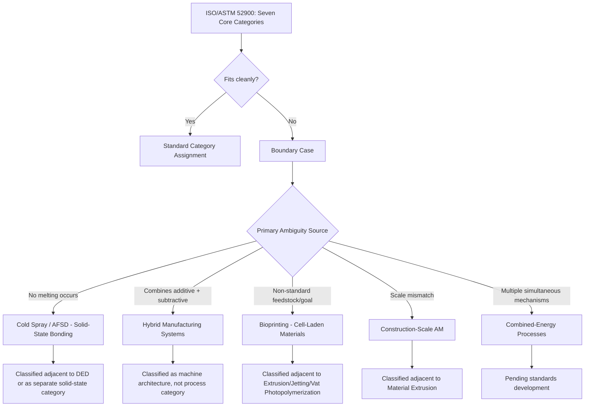

## Boundary Cases Outside the Seven Categories

### Definition and Scope

The ASTM/ISO 52900 standard defines seven core process categories for additive manufacturing: Vat Photopolymerization, Powder Bed Fusion, Material Extrusion, Material Jetting, Binder Jetting, Sheet Lamination, and Directed Energy Deposition. However, a growing set of technologies — hybrid systems, novel bio- and bioprinting techniques, multi-mechanism processes, and emerging research-stage methods — do not map cleanly onto a single category. These boundary cases are important to document because they reveal the limitations of a rigid seven-bucket taxonomy and inform how standards bodies (ISO/ASTM 52900 series, ISO/TC 261) continue to evolve classification frameworks.

### Category 1: Hybrid Manufacturing Systems

**Definition**: Machines that combine additive deposition with subtractive (CNC machining) or other conventional processes within a single integrated workflow, often on the same machine tool.

Hybrid systems (e.g., DED-plus-milling machines) do not fit purely into DED because the subtractive step is not merely "post-processing" but an interleaved, in-process operation. [Inference] Standards discussions have generally treated the additive portion as classifiable under its base category (e.g., DED-LB) while treating the hybrid *system* itself as a separate machine-architecture classification outside the pure process taxonomy.

**Example**: A 5-axis machine that alternates between laser-DED metal deposition passes and CNC face-milling passes to achieve near-net-shape accuracy without a separate finishing operation.

### Category 2: Bioprinting and Cell-Laden Fabrication

**Definition**: Additive processes that deposit living cells, biomaterials, or hydrogels to create tissue constructs, organoids, or scaffolds.

Bioprinting technically uses material jetting, extrusion, or vat photopolymerization mechanisms, but the classification is complicated by the need to preserve cell viability, use bioinks with complex rheology, and operate at physiological temperatures. Because the "feedstock" (living cells suspended in hydrogel) and the process goals (biological function, not purely mechanical geometry) differ fundamentally from standard AM feedstocks, some researchers argue bioprinting warrants an eighth category rather than being folded into Material Extrusion or Material Jetting.

**Sub-variants**:

- **Extrusion-based bioprinting** — closest to Material Extrusion, but with pneumatic/mechanical bioink dispensing rather than thermal melting
- **Droplet/inkjet bioprinting** — closest to Material Jetting, using piezoelectric or thermal droplet ejection of bioink
- **Light-based bioprinting (stereolithography/DLP bioprinting)** — closest to Vat Photopolymerization, using photocrosslinkable hydrogels
- **Laser-assisted bioprinting (LAB)** — uses laser-induced forward transfer (LIFT), a mechanism without a direct analog in the seven core categories

### Category 3: Cold Spray Additive Manufacturing

**Definition**: A solid-state deposition process where metal powder particles are accelerated to supersonic velocities and plastically deform on impact with a substrate, bonding without melting.

Cold spray is sometimes classified as a DED variant (it deposits powder feedstock directionally, following the DED definition of "focused thermal energy" loosely), but strictly, **no melting occurs** — bonding is achieved through kinetic/mechanical deformation, not thermal fusion. This makes cold spray a genuine boundary case: it satisfies DED's feedstock-delivery pattern but violates the "melting" criterion embedded in DED's formal definition.

$$v_p > v_{cr}$$

Where $v_p$ is particle impact velocity and $v_{cr}$ is the critical velocity required for adiabatic shear instability and bonding — a criterion unique to solid-state deposition, without equivalent in the thermal-based seven categories.

### Category 4: Friction Stir Additive Manufacturing (Additive Friction Stir Deposition, AFSD)

**Definition**: A solid-state process using frictional heat and severe plastic deformation (via a rotating, non-consumable or consumable tool) to deposit material layer-by-layer without melting.

Similar to cold spray, AFSD produces metallurgical bonding through solid-state plastic deformation rather than melting, placing it outside the strict DED definition despite superficial process similarity (layer-by-layer metal deposition via a moving tool head).

### Category 5: Large-Scale/Construction-Scale AM (Contour Crafting, 3D Concrete Printing)

**Definition**: Extrusion-based deposition of cementitious or composite materials at architectural/construction scale.

While mechanically similar to Material Extrusion (paste/gel extrusion through a nozzle), construction-scale AM introduces classification tension due to: (1) feedstock curing via chemical reaction (cement hydration) rather than thermal solidification, (2) massively different scale (meters vs. millimeters), and (3) use of reinforcement co-deposition (rebar, fiber) not addressed in the base Material Extrusion definition.

### Category 6: Multi-Mechanism/Combined-Energy Processes

**Definition**: Emerging processes that combine two or more distinct energy or bonding mechanisms within a single layer-formation step.

**Example**: Some experimental processes combine binder jetting with subsequent in-situ laser sintering per layer (rather than a separate furnace step), creating a process that straddles Binder Jetting and Powder Bed Fusion definitions simultaneously. [Speculation] As such combined-mechanism systems mature commercially, standards bodies may need to define composite or hybrid-category designations rather than forcing single-category assignment.

### Boundary Case Classification Diagram

### Boundary Case Positioning (SVG)

<svg xmlns="http://www.w3.org/2000/svg" viewBox="0 0 600 340">
<text x="300" y="25" font-size="16" font-weight="bold" text-anchor="middle" fill="#222">Boundary Cases Relative to Core Categories (svg_diagram)</text>
<circle cx="300" cy="180" r="130" fill="#eaf2fb" stroke="#4a90d9" stroke-width="2" />
<text x="300" y="180" font-size="12" text-anchor="middle" fill="#2a5f8f" font-weight="bold">Seven Core</text>
<text x="300" y="196" font-size="12" text-anchor="middle" fill="#2a5f8f" font-weight="bold">ISO/ASTM 52900</text>
<text x="300" y="212" font-size="12" text-anchor="middle" fill="#2a5f8f" font-weight="bold">Categories</text>
<circle cx="120" cy="90" r="55" fill="#fdecea" stroke="#e74c3c" stroke-width="2" fill-opacity="0.85" />
<text x="120" y="85" font-size="11" text-anchor="middle" fill="#a93226">Cold Spray /</text>
<text x="120" y="100" font-size="11" text-anchor="middle" fill="#a93226">AFSD</text>
<circle cx="480" cy="90" r="55" fill="#fdecea" stroke="#e74c3c" stroke-width="2" fill-opacity="0.85" />
<text x="480" y="85" font-size="11" text-anchor="middle" fill="#a93226">Bioprinting</text>
<circle cx="120" cy="280" r="55" fill="#fdecea" stroke="#e74c3c" stroke-width="2" fill-opacity="0.85" />
<text x="120" y="275" font-size="11" text-anchor="middle" fill="#a93226">Hybrid</text>
<text x="120" y="290" font-size="11" text-anchor="middle" fill="#a93226">Manufacturing</text>
<circle cx="480" cy="280" r="55" fill="#fdecea" stroke="#e74c3c" stroke-width="2" fill-opacity="0.85" />
<text x="480" y="275" font-size="11" text-anchor="middle" fill="#a93226">Construction-</text>
<text x="480" y="290" font-size="11" text-anchor="middle" fill="#a93226">Scale AM</text>
</svg>

### Key Points

- The defining criterion that most reliably places a process outside the seven categories is **absence of melting or curing as the bonding mechanism** (as in cold spray and AFSD), since both rely on solid-state plastic deformation.
- **Bioprinting** is a boundary case not because its physical deposition mechanism is novel, but because its feedstock (living cells) and success criteria (viability, biological function) fall outside the geometry/mechanical-property framing of ISO/ASTM 52900.
- **Hybrid systems** are boundary cases at the *machine/system* level rather than the *process-mechanism* level — the additive step itself is often still classifiable, but the integrated workflow is not.
- [Unverified] The exact number and taxonomy of "official" additional categories under active ISO/ASTM consideration is subject to change as working groups (e.g., ISO/TC 261, ASTM F42) publish updated standard revisions; readers should consult current standards documentation for the latest status.
- Construction-scale AM and combined-energy processes illustrate that classification boundaries are often strained by **scale** and **simultaneity of mechanisms**, not just by novel physics.

### Example

Classifying **Additive Friction Stir Deposition (AFSD)**: though it deposits material layer-by-layer via a moving tool (superficially resembling DED), the bonding mechanism is frictional heat plus severe plastic deformation without melting. Applying the "does melting occur?" test correctly excludes AFSD from the DED category, positioning it instead as a solid-state boundary case alongside cold spray.

### Related Topics

- Directed energy deposition classification
- Classification by feedstock form and energy source
- Solid-state additive manufacturing mechanisms (cold spray, AFSD, ultrasonic AM)
- ISO/ASTM 52900 standard revision history and working groups
- Bioprinting process classification and bioink rheology
- Hybrid manufacturing machine architectures
- Emerging AM process taxonomy proposals (eighth-category discussions)