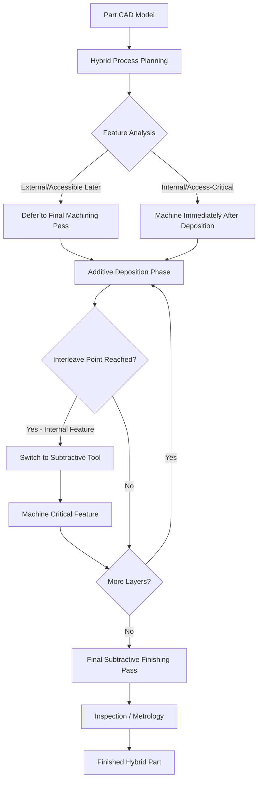

## Hybrid Manufacturing: Combined Additive-Subtractive Classification

### Definition and Scope

Hybrid manufacturing refers to systems that integrate additive (material-adding) and subtractive (material-removing) processes within a single machine platform, workflow, or work envelope, without requiring the part to be transferred between separate machines. Unlike conventional AM-then-post-machine workflows (where subtractive finishing is a discrete downstream step), hybrid manufacturing interleaves additive and subtractive operations — often multiple times per part — to combine near-net-shape build speed with machined-surface precision in a single setup. Classification of hybrid systems occurs at the **machine architecture** level, layered on top of (not replacing) the base additive process classification.

### Classification by Integration Architecture

**Sequential Hybrid (Single Machine, Discrete Phases)**

Additive and subtractive operations occur in separate, non-interleaved phases on the same machine, but the part is not removed or re-fixtured between phases. Example: a machine that completes an entire DED build, then switches tool heads to perform a single finishing machining pass.

**Interleaved/Concurrent Hybrid (Alternating Per-Layer or Per-Feature)**

Additive deposition and subtractive machining alternate repeatedly — e.g., machining after every N layers, or machining specific features immediately after they are deposited while still accessible. This architecture is the most common commercial hybrid configuration, since it allows internal features to be machined before being enclosed by subsequent additive layers.

**Simultaneous Hybrid (True Concurrent Operation)**

Additive and subtractive tools operate at effectively the same time on different regions of the part, requiring sophisticated toolpath collision avoidance and process planning. [Inference] True simultaneous hybrid operation remains less common in commercial systems than interleaved architectures, due to thermal interaction and tool-collision complexity.

### Classification by Additive Process Integrated

Hybrid systems are further classified by which base AM process category supplies the additive capability:

**DED-Based Hybrid (most common)**

Combines laser-DED or wire-arc DED with CNC milling on a shared multi-axis platform (5-axis machining centers with a deposition head as an additional tool). This is the dominant hybrid architecture because DED's near-net-shape, moderate-accuracy output pairs naturally with the precision-finishing role of CNC machining.

**PBF-Based Hybrid**

Combines Powder Bed Fusion (typically laser-PBF) with in-chamber milling, used to machine internal channels, undercuts, or critical mating surfaces layer-by-layer before they become inaccessible under subsequent powder layers.

**Material Extrusion-Based Hybrid**

Combines polymer FDM/FFF deposition with CNC trimming or milling, primarily for prototyping applications requiring tighter tolerances than as-printed FDM surfaces provide.

### Comparison Table

| Architecture | Integration Style | Typical Additive Base | Primary Benefit | Primary Challenge |
| --- | --- | --- | --- | --- |
| Sequential Hybrid | Discrete phases, no re-fixturing | DED, Material Extrusion | Simplicity, easier process control | Limited access to internal features post-build |
| Interleaved Hybrid | Alternating per-layer/feature | DED, PBF | Machines internal features before enclosure | Increased cycle time, complex process planning |
| Simultaneous Hybrid | True concurrent operation | DED (emerging) | Maximum cycle time reduction | Collision avoidance, thermal management complexity |

### Process Flow Diagram

### Machine Architecture Comparison (SVG)

<svg xmlns="http://www.w3.org/2000/svg" viewBox="0 0 600 300">
<text x="300" y="25" font-size="16" font-weight="bold" text-anchor="middle" fill="#222">Hybrid Machine Tool Head Configuration (svg_diagram)</text>
<rect x="50" y="60" width="200" height="180" fill="#f5f5f5" stroke="#333" stroke-width="2" />
<text x="150" y="80" font-size="12" text-anchor="middle" fill="#333" font-weight="bold">Tool Changer</text>
<rect x="80" y="100" width="50" height="30" fill="#4a90d9" stroke="#2a5f8f" />
<text x="105" y="120" font-size="9" text-anchor="middle" fill="#fff">DED Head</text>
<rect x="170" y="100" width="50" height="30" fill="#e67e22" stroke="#b35a0f" />
<text x="195" y="120" font-size="9" text-anchor="middle" fill="#fff">Mill Spindle</text>
<rect x="80" y="150" width="50" height="30" fill="#2ecc71" stroke="#1e8449" />
<text x="105" y="170" font-size="9" text-anchor="middle" fill="#fff">Probe</text>
<rect x="170" y="150" width="50" height="30" fill="#9b59b6" stroke="#6c3483" />
<text x="195" y="170" font-size="9" text-anchor="middle" fill="#fff">Powder Nozzle</text>
<line x1="150" y1="60" x2="150" y2="20" stroke="#333" stroke-width="2" marker-end="url(#arr2)" />
<rect x="330" y="200" width="220" height="40" fill="#a9a9a9" stroke="#333" stroke-width="2" />
<text x="440" y="225" font-size="11" text-anchor="middle" fill="#222">Shared Work Envelope / Fixture</text>
<rect x="360" y="160" width="60" height="40" fill="#c9baf8" stroke="#6c3483" stroke-width="1" />
<text x="390" y="184" font-size="9" text-anchor="middle" fill="#333">Part In-Process</text>
<line x1="440" y1="130" x2="440" y2="160" stroke="#333" stroke-width="2" stroke-dasharray="4,2" />
<text x="440" y="145" font-size="9" text-anchor="middle" fill="#555">5-Axis Motion</text>
</svg>

### Key Points

- Hybrid classification occurs **on top of** the base ISO/ASTM 52900 process category — a DED-based hybrid machine is still fundamentally classified as DED at the process level, with "hybrid" as a machine-architecture modifier.
- **Interleaved hybrid architectures** provide the key technical advantage of machining internal features (cooling channels, undercuts) before they become enclosed by subsequent additive layers, which is impossible in a purely sequential post-machining workflow.
- Thermal management is a critical design consideration in interleaved/simultaneous hybrids, since machining chips and coolant can contaminate subsequent deposition passes, and residual heat from deposition can affect machining tool life and surface finish.
- [Inference] Hybrid systems are generally justified economically for high-value, complex-geometry parts (aerospace, tooling, injection molds with conformal cooling) where the reduced setup/handling time outweighs the higher capital cost of combined-process machines, rather than for high-volume simple geometries.
- Process planning complexity is significantly higher in hybrid systems than in pure AM or pure subtractive systems, since toolpath sequencing must account for feature accessibility windows that change as the build progresses.

### Example

A **DED-based interleaved hybrid** workflow for an injection mold with conformal cooling channels: the machine deposits a base layer group via laser-DED wire feed, then switches to a milling spindle to machine the internal cooling channel geometry (which would be inaccessible once enclosed by further deposition), then resumes DED deposition to enclose the channel, repeating this cycle until the mold insert is complete, followed by a final external machining pass for surface finish and tolerance.

### Next Steps

- Boundary cases outside the seven categories (revisited: hybrid systems as machine-level, not process-level, classification)
- Micro-scale additive manufacturing process classification
- Multi-material and functionally graded hybrid process planning
- Toolpath collision avoidance strategies in simultaneous hybrid systems
- Thermal management and in-process metrology for hybrid machines
- Economic justification models for hybrid vs. sequential AM-plus-CNC workflows