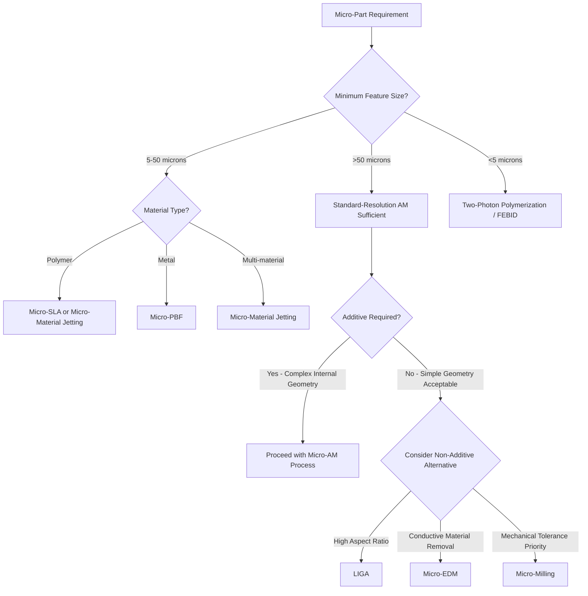

## Micro-Manufacturing Process Classification

### Definition and Scope

Micro-manufacturing encompasses processes capable of fabricating features, components, or entire parts with characteristic dimensions in the micrometer-to-sub-millimeter range (typically features below 100 μm, with overall part sizes ranging from sub-millimeter to a few centimeters). Micro-manufacturing process classification spans both **micro-scale additive manufacturing** (miniaturized/high-resolution variants of the seven ISO/ASTM 52900 categories) and **micro-scale subtractive/formative processes** that are not additive at all but are frequently discussed alongside micro-AM due to overlapping application domains (MEMS, microfluidics, medical devices, micro-optics). This item focuses primarily on classification of micro-AM, with brief contextual coverage of adjacent non-additive micro-manufacturing routes.

### Classification by Base Additive Mechanism (Micro-AM)

**Micro-Stereolithography (μSLA) / Two-Photon Polymerization (TPP)**

A Vat Photopolymerization derivative using either tightly focused UV lasers (μSLA, sub-10 μm resolution) or femtosecond laser two-photon absorption (TPP, sub-micron/nanoscale resolution, well below the diffraction limit of the excitation wavelength). TPP achieves the finest resolution of any commercial AM process and is widely used for micro-optics, microfluidic mold masters, and biomedical scaffolds.

**Micro-Powder Bed Fusion (μPBF)**

A miniaturized PBF variant using fine powder (typically <20 μm particle size) and small laser spot sizes to achieve feature resolutions in the tens-of-microns range, used for micro-metal components such as micro-gears and medical implant lattices.

**Micro-Material Jetting**

High-precision piezoelectric droplet jetting (picoliter-scale droplets) of photopolymer or wax, enabling multi-material micro-parts with feature resolution in the 10–20 μm range, commonly used for micro-molds and jewelry/dental applications.

**Focused Electron/Ion Beam Induced Deposition (FEBID/FIBID)**

A nanoscale DED-analog process in which a focused electron or ion beam decomposes a precursor gas locally, depositing material with nanometer-scale resolution. FEBID/FIBID sits at the extreme fine end of the micro/nano-manufacturing spectrum and is used primarily for nanostructure prototyping and circuit repair rather than production parts.

**Micro-Binder Jetting**

A scaled-down Binder Jetting variant using fine powders and precision inkjet printheads to achieve smaller feature sizes than conventional binder jetting, though generally coarser resolution than μSLA or μPBF.

### Classification by Resolution Regime

| Regime | Typical Feature Resolution | Representative Processes | Typical Applications |
| --- | --- | --- | --- |
| Meso/Mini-scale AM | 50–200 μm | Standard SLA, high-res FDM | Small mechanical prototypes |
| Micro-scale AM | 5–50 μm | μSLA, μPBF, Micro-Jetting | MEMS packaging, micro-molds, dental |
| Sub-micro/Nano-scale AM | <5 μm (down to ~100 nm) | Two-Photon Polymerization, FEBID | Photonic crystals, micro-optics, nanostructures |

### Adjacent Non-Additive Micro-Manufacturing Processes

These are frequently classified alongside micro-AM in broader "micro-manufacturing" taxonomies but are **not** additive processes:

- **Micro-EDM (Electrical Discharge Machining)** — subtractive, spark erosion at micro-scale
- **Micro-milling/micro-turning** — subtractive, mechanical material removal with miniaturized tooling
- **LIGA (Lithographie, Galvanoformung, Abformung)** — a formative/replication process combining X-ray lithography, electroplating, and molding
- **Focused Ion Beam (FIB) milling** — subtractive, ion-beam sputtering for nanoscale material removal

[Inference] These adjacent processes are typically included in "micro-manufacturing" curricula and taxonomies for completeness and comparative context, even though they fall outside the additive manufacturing definition, because product designers at the micro-scale often choose between additive and non-additive routes based on feature geometry and material constraints rather than treating them as separate disciplines.

### Process Selection Diagram

### Resolution Spectrum (SVG)

<svg xmlns="http://www.w3.org/2000/svg" viewBox="0 0 600 220">
<text x="300" y="25" font-size="16" font-weight="bold" text-anchor="middle" fill="#222">Micro-AM Resolution Spectrum (svg_diagram)</text>
<line x1="60" y1="120" x2="560" y2="120" stroke="#333" stroke-width="2" />
<text x="60" y="145" font-size="10" text-anchor="middle" fill="#333">1 nm</text>
<text x="200" y="145" font-size="10" text-anchor="middle" fill="#333">100 nm</text>
<text x="340" y="145" font-size="10" text-anchor="middle" fill="#333">10 μm</text>
<text x="480" y="145" font-size="10" text-anchor="middle" fill="#333">100 μm</text>
<circle cx="140" cy="120" r="8" fill="#9b59b6" />
<text x="140" y="95" font-size="10" text-anchor="middle" fill="#6c3483">FEBID/FIBID</text>
<circle cx="200" cy="120" r="8" fill="#4a90d9" />
<text x="200" y="80" font-size="10" text-anchor="middle" fill="#2a5f8f">Two-Photon</text>
<text x="200" y="65" font-size="10" text-anchor="middle" fill="#2a5f8f">Polymerization</text>
<circle cx="330" cy="120" r="8" fill="#2ecc71" />
<text x="330" y="95" font-size="10" text-anchor="middle" fill="#1e8449">μSLA</text>
<circle cx="360" cy="120" r="8" fill="#f39c12" />
<text x="360" y="80" font-size="10" text-anchor="middle" fill="#a86a0a">μPBF</text>
<circle cx="390" cy="120" r="8" fill="#e67e22" />
<text x="390" y="65" font-size="10" text-anchor="middle" fill="#b35a0f">Micro-Jetting</text>
<circle cx="470" cy="120" r="8" fill="#e74c3c" />
<text x="470" y="95" font-size="10" text-anchor="middle" fill="#a93226">Standard SLA/FDM</text>
</svg>

### Key Points

- Micro-AM classification largely **mirrors the seven ISO/ASTM 52900 categories**, with resolution-driving miniaturization of optics, powder, and droplet mechanisms rather than fundamentally new process physics — the exception being FEBID/FIBID, which has no direct macro-scale process analog.
- **Two-photon polymerization** achieves sub-diffraction-limit resolution through nonlinear absorption physics, allowing feature sizes smaller than the wavelength of light used, a capability unique among light-based AM processes.
- Micro-manufacturing taxonomies commonly group additive and non-additive processes together (micro-AM alongside micro-EDM, LIGA, micro-milling) for practical engineering decision-making, even though only a subset are formally additive under ISO/ASTM 52900.
- Material constraints tighten significantly at the micro-scale: powder-based micro-AM requires much finer, more expensive, and harder-to-handle powders than standard AM, and resin-based micro-AM requires photoinitiators/resins formulated for the specific laser wavelength and exposure characteristics used.
- [Unverified] Achievable resolution figures cited for any specific commercial micro-AM system are highly machine- and vendor-dependent; readers should consult current manufacturer specifications rather than treating regime boundaries as fixed physical limits.

### Example

Fabricating a microfluidic mold master with 15 μm channel features: **two-photon polymerization** would be selected over standard SLA because standard SLA's typical 50–100 μm resolution cannot reliably reproduce 15 μm channels, while TPP's sub-micron capability provides substantial resolution margin, at the cost of significantly slower build speed due to point-by-point voxel exposure.

### Related Topics

- Hybrid manufacturing: combined additive-subtractive classification
- Classification by feedstock form and energy source
- MEMS and microfluidic device fabrication routes
- Two-photon polymerization physics and photoinitiator chemistry
- Non-additive micro-manufacturing: micro-EDM, LIGA, micro-milling
- Powder characterization for fine-powder μPBF processes