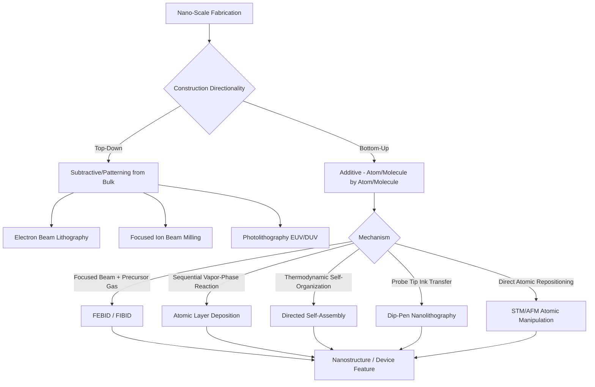

## Nano-Scale Fabrication Process Classification

### Definition and Scope

Nano-scale fabrication encompasses processes capable of creating features, structures, or materials with characteristic dimensions below approximately 100 nanometers, extending down to the atomic/molecular scale (sub-nanometer, single-atom manipulation). Classification of nano-fabrication processes is organized along a fundamentally different axis than macro/micro-AM: rather than classifying by feedstock form and energy source alone, nano-fabrication is most commonly classified by **directionality of construction** — top-down (subtractive/patterning from bulk material) versus bottom-up (additive/self-assembly from atomic or molecular building blocks) — with additive nano-manufacturing representing the subset most directly relevant to AM taxonomy.

### Classification by Construction Directionality

**Top-Down Nano-Fabrication**

Starts with a bulk material and removes or patterns material to create nanostructures. This category is predominantly subtractive/formative rather than additive, but is included here for classification completeness since it shares application domains with bottom-up additive nano-processes.

- Electron Beam Lithography (EBL)
- Focused Ion Beam (FIB) milling
- Photolithography (deep-UV, EUV)
- Nanoimprint lithography

**Bottom-Up Nano-Fabrication (Additive)**

Builds nanostructures by adding, depositing, or self-assembling material atom-by-atom or molecule-by-molecule. This category aligns most directly with additive manufacturing principles, extending the "material is added to create a part" definition down to the atomic scale.

- Focused Electron/Ion Beam Induced Deposition (FEBID/FIBID)
- Atomic Layer Deposition (ALD)
- Molecular self-assembly / directed self-assembly (DSA)
- Dip-Pen Nanolithography (DPN)
- Scanning probe-based atomic manipulation (STM-tip manipulation)

### Classification by Bottom-Up Mechanism

**Beam-Induced Deposition (FEBID/FIBID)**

A focused electron or ion beam locally decomposes a precursor gas adsorbed on a substrate surface, depositing solid material only where the beam scans. This is the most direct nano-scale analog to Directed Energy Deposition, sharing the "focused energy source drives localized material deposition" principle, but operating at nanometer rather than micrometer-to-millimeter resolution.

**Atomic Layer Deposition (ALD)**

A vapor-phase, self-limiting chemical process that deposits material one atomic monolayer at a time through sequential, alternating precursor gas pulses and surface reactions. ALD achieves extremely conformal, uniform thickness control (sub-nanometer precision) but is a planar/blanket deposition technique rather than a spatially-patterned, geometry-defining process — it typically requires combination with lithographic patterning to create discrete 3D structures.

**Molecular Self-Assembly / Directed Self-Assembly (DSA)**

Relies on the intrinsic thermodynamic tendency of certain molecules (block copolymers, DNA origami, colloidal particles) to spontaneously organize into ordered nanostructures, often guided ("directed") by pre-patterned templates or chemical/topographic cues. Unlike beam-based methods, DSA does not require a scanning energy source — pattern formation emerges from molecular interactions.

**Dip-Pen Nanolithography (DPN)**

Uses an atomic force microscope (AFM) tip coated with a "molecular ink" to directly write nanoscale patterns via controlled ink transfer to a substrate, analogous in concept to Material Extrusion/writing but operating through capillary transport at the nanoscale.

**Scanning Probe-Based Atomic Manipulation**

Uses scanning tunneling microscope (STM) or atomic force microscope (AFM) tips to physically reposition individual atoms or molecules on a surface, representing the ultimate limit of additive/formative control (true atom-by-atom construction), though presently confined to research settings due to extremely low throughput.

### Comparison Table

| Process | Directionality | Resolution | Throughput | Primary Use Case |
| --- | --- | --- | --- | --- |
| FEBID/FIBID | Bottom-up (additive) | 1–50 nm | Very low (serial writing) | Nanostructure prototyping, circuit repair |
| ALD | Bottom-up (additive, blanket) | Sub-nm (thickness) | Moderate (batch) | Conformal thin films, semiconductor gate dielectrics |
| Directed Self-Assembly | Bottom-up (additive) | 5–50 nm | High (parallel, self-organizing) | Semiconductor patterning, block-copolymer templates |
| Dip-Pen Nanolithography | Bottom-up (additive) | 10–100 nm | Low (serial, tip-based) | Biosensor patterning, custom nanoarrays |
| STM Atomic Manipulation | Bottom-up (additive) | Sub-nm (single atom) | Extremely low (research-scale) | Fundamental research, quantum device prototyping |
| Electron Beam Lithography | Top-down (subtractive) | 2–20 nm | Low (serial) | Photomask fabrication, research devices |

### Classification Diagram

### Top-Down vs. Bottom-Up Schematic (SVG)

<svg xmlns="http://www.w3.org/2000/svg" viewBox="0 0 600 280">
<text x="300" y="25" font-size="16" font-weight="bold" text-anchor="middle" fill="#222">Top-Down vs. Bottom-Up Nano-Fabrication (svg_diagram)</text>
<text x="150" y="55" font-size="13" text-anchor="middle" fill="#2a5f8f" font-weight="bold">Top-Down (Subtractive)</text>
<rect x="80" y="70" width="140" height="80" fill="#4a90d9" stroke="#2a5f8f" stroke-width="2" />
<text x="150" y="115" font-size="10" text-anchor="middle" fill="#fff">Bulk Material</text>
<line x1="250" y1="110" x2="290" y2="110" stroke="#333" stroke-width="2" marker-end="url(#arr3)" />
<rect x="90" y="170" width="30" height="30" fill="#4a90d9" stroke="#2a5f8f" />
<rect x="140" y="170" width="30" height="30" fill="#4a90d9" stroke="#2a5f8f" />
<rect x="190" y="170" width="30" height="30" fill="#4a90d9" stroke="#2a5f8f" />
<text x="150" y="215" font-size="9" text-anchor="middle" fill="#333">Patterned Structures</text>
<line x1="150" y1="150" x2="150" y2="170" stroke="#333" stroke-width="1" stroke-dasharray="3,3" />
<text x="150" y="235" font-size="9" text-anchor="middle" fill="#555">(Material Removed)</text>
<text x="450" y="55" font-size="13" text-anchor="middle" fill="#1e8449" font-weight="bold">Bottom-Up (Additive)</text>
<circle cx="420" cy="180" r="6" fill="#2ecc71" />
<circle cx="440" cy="175" r="6" fill="#2ecc71" />
<circle cx="460" cy="185" r="6" fill="#2ecc71" />
<circle cx="480" cy="170" r="6" fill="#2ecc71" />
<circle cx="430" cy="195" r="6" fill="#2ecc71" />
<circle cx="470" cy="195" r="6" fill="#2ecc71" />
<text x="450" y="220" font-size="9" text-anchor="middle" fill="#333">Atoms/Molecules Assembling</text>
<line x1="380" y1="110" x2="340" y2="110" stroke="#333" stroke-width="2" marker-end="url(#arr3)" />
<text x="450" y="90" font-size="9" text-anchor="middle" fill="#555">(Material Added)</text>
</svg>

### Key Points

- Nano-fabrication classification's primary axis — **top-down vs. bottom-up** — differs from the macro/micro-AM classification axis (feedstock form/energy source), because at the nanoscale the more fundamental engineering question becomes whether structure emerges from removal or from assembly.
- Only the **bottom-up** branch qualifies as genuinely additive under an extended AM definition; top-down methods (EBL, FIB) are subtractive/patterning processes included here for taxonomic completeness and because they are frequently used in combination with bottom-up steps.
- **FEBID/FIBID** is the clearest nano-scale conceptual extension of Directed Energy Deposition, sharing the focused-energy-source-drives-localized-deposition principle across a six-order-of-magnitude resolution difference (millimeters in DED vs. nanometers in FEBID).
- **Directed self-assembly** stands apart from all other listed processes in not requiring a scanning/serial energy source at all — pattern formation is driven by molecular thermodynamics guided by a template, enabling parallel (batch) nanopatterning at throughputs unreachable by serial beam-writing methods.
- [Inference] Because serial, beam-based bottom-up processes (FEBID, DPN, STM manipulation) have inherently low throughput, they are generally positioned as research, prototyping, or repair tools rather than production-scale manufacturing routes, while ALD and DSA are the bottom-up nano-processes most likely to appear in high-volume semiconductor manufacturing contexts.

### Example

Repairing a photomask defect using **FEBID**: a focused electron beam is directed at the specific nanoscale defect location while a metal-organic precursor gas is introduced; the beam locally decomposes the precursor, depositing conductive material only at the targeted nanometer-scale spot to restore the mask pattern — directly analogous to how laser-DED repairs a macro-scale turbine blade, but operating six orders of magnitude smaller.

### Related Topics

- Micro-manufacturing process classification
- Boundary cases outside the seven categories
- Directed energy deposition classification (macro-to-nano conceptual continuity via FEBID)
- Semiconductor lithography process fundamentals
- Self-assembly thermodynamics and block copolymer patterning
- Scanning probe microscopy techniques (STM, AFM) in fabrication contexts