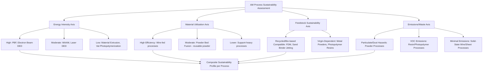

## Sustainable and Low-Impact Process Classification

### Definition and Scope

Sustainable and low-impact process classification organizes additive manufacturing processes according to their environmental footprint dimensions — energy consumption, material waste/utilization efficiency, feedstock sourcing (recycled vs. virgin), emissions (particulates, VOCs), and end-of-life recyclability — rather than by mechanism or feedstock form. Unlike the ISO/ASTM 52900 taxonomy, no single formal standard governs sustainability classification of AM processes; this framework synthesizes commonly used environmental assessment criteria (drawn from life-cycle assessment/LCA methodology, ISO 14040/14044 LCA standards, and AM-specific sustainability research) to classify processes along environmental-impact axes.

### Classification by Energy Intensity

**High Energy Intensity**

Processes requiring substantial thermal energy input per unit mass of material processed, primarily powder-bed and beam-based metal processes.

- Powder Bed Fusion (laser and electron beam) — high energy density scanning, plus energy-intensive powder chamber conditioning (vacuum, inert atmosphere heating)
- Electron Beam DED — vacuum chamber maintenance adds substantial continuous energy overhead

**Moderate Energy Intensity**

- Wire Arc Additive Manufacturing (WAAM) — high deposition rate reduces energy-per-kilogram despite high instantaneous power draw
- Laser-based DED (powder and wire) — moderate energy density, no full-chamber conditioning required

**Low Energy Intensity**

- Material Extrusion (FDM/FFF) — comparatively low process temperatures (typically 180–300°C for polymers vs. 1000°C+ melt temperatures for metals)
- Binder Jetting — no melting energy source during the build itself (energy shifts to a separate sintering furnace step, which must be accounted for in full life-cycle energy comparisons)
- Vat Photopolymerization — low-power UV/laser curing, though post-cure UV ovens add supplementary energy demand

### Classification by Material Utilization Efficiency

**High Utilization Efficiency (minimal waste)**

- Wire-fed processes (Material Extrusion, Wire-DED, WAAM) — approaching 100% material utilization since feedstock is fully consumed into the part, with minimal support/waste material in optimized designs
- Vat Photopolymerization — uncured resin can often be filtered and reused, though resin shelf-life and contamination limit indefinite reuse

**Moderate Utilization Efficiency**

- Powder Bed Fusion — unfused powder can typically be sieved and reused across multiple builds (reported reuse rates vary significantly by material and process control), though powder degradation over repeated thermal cycling eventually necessitates disposal or reprocessing
- Powder-fed DED — some powder overspray/deposition inefficiency is inherent to the nozzle-based delivery method, with material utilization efficiency ranging broadly depending on nozzle design and part geometry [Unverified: efficiency figures vary substantially by system and are best sourced from current manufacturer/process documentation]

**Lower Utilization Efficiency**

- Processes requiring extensive support structures (e.g., PBF and Material Jetting for complex overhangs) — support material is often not part-functional and may not be fully recyclable depending on material chemistry

### Classification by Feedstock Sustainability

**Recycled/Bio-Based Feedstock Compatible**

- Material Extrusion — widely compatible with recycled PLA, rPET, and bio-based filaments; represents one of the most mature ecosystems for sustainable feedstock sourcing in AM
- Binder Jetting (sand/ceramic applications) — reclaimed foundry sand can be reused in some sand-binder-jetting workflows

**Virgin Feedstock Dependent (Current State)**

- Metal Powder Bed Fusion and Powder-Fed DED — powder feedstock generally requires tightly controlled particle size distribution, sphericity, and chemistry (gas-atomized production is itself energy-intensive), limiting current use of recycled/reclaimed metal powder to blends with virgin powder rather than full substitution
- Photopolymer-based processes — most commercial resins remain petroleum-derived, though bio-based and biodegradable resin formulations are an active development area

### Classification Framework Diagram

### Multi-Axis Sustainability Profile (SVG)

<svg xmlns="http://www.w3.org/2000/svg" viewBox="0 0 600 320">
<text x="300" y="25" font-size="16" font-weight="bold" text-anchor="middle" fill="#222">Process Sustainability Comparison (svg_diagram)</text>
<line x1="80" y1="270" x2="550" y2="270" stroke="#333" stroke-width="2" />
<line x1="80" y1="270" x2="80" y2="50" stroke="#333" stroke-width="2" />
<text x="300" y="300" font-size="12" text-anchor="middle" fill="#333">Material Utilization Efficiency →</text>
<text x="35" y="160" font-size="12" text-anchor="middle" fill="#333" transform="rotate(-90 35 160)">Energy Efficiency →</text>
<circle cx="480" cy="90" r="10" fill="#2ecc71" />
<text x="480" y="75" font-size="10" text-anchor="middle" fill="#1e8449">Material Extrusion</text>
<circle cx="440" cy="130" r="10" fill="#27ae60" />
<text x="440" y="115" font-size="10" text-anchor="middle" fill="#196f3d">WAAM</text>
<circle cx="200" cy="180" r="10" fill="#f39c12" />
<text x="200" y="165" font-size="10" text-anchor="middle" fill="#a86a0a">Powder Bed Fusion</text>
<circle cx="160" cy="220" r="10" fill="#e67e22" />
<text x="160" y="205" font-size="10" text-anchor="middle" fill="#b35a0f">Powder-Fed DED</text>
<circle cx="380" cy="200" r="10" fill="#e74c3c" />
<text x="380" y="185" font-size="10" text-anchor="middle" fill="#a93226">Vat Photopolymerization</text>
</svg>

### Key Points

- No single, universally adopted standard governs AM sustainability classification; frameworks like this one synthesize criteria from **ISO 14040/14044 life-cycle assessment principles** applied to AM-specific process characteristics, and specific numeric claims should be verified against current peer-reviewed LCA studies for the exact process/material combination in question.
- **Wire-fed processes** (WAAM, Wire-DED, FDM) consistently rank highest in material utilization efficiency across classification axes, since feedstock is directly consumed into the part with minimal overspray or excess powder.
- **Powder-based metal processes** face the most significant sustainability trade-off tension: they enable complex, lightweight, topology-optimized geometries that reduce material use and improve in-service energy efficiency (e.g., lighter aerospace parts reducing fuel burn), even though the manufacturing process itself is comparatively energy- and resource-intensive — full sustainability assessment requires **whole life-cycle** comparison, not just process-stage impact.
- Emissions considerations differ fundamentally by feedstock chemistry: powder-based processes primarily raise **particulate/combustible dust** concerns, while resin-based processes raise **VOC emissions and uncured-resin toxicity** concerns, requiring different mitigation strategies (inert atmosphere/dust collection vs. ventilation/resin handling protocols).
- [Inference] As AM sustainability research matures, classification frameworks are likely to increasingly incorporate **use-phase impact** (e.g., part lightweighting benefits) alongside process-stage impact, since process-stage-only comparisons can understate the net environmental benefit of AM for weight-critical applications like aerospace.

### Example

Comparing sustainability profiles for producing a topology-optimized aerospace bracket: **Laser Powder Bed Fusion** would rank as high energy intensity and moderate material utilization at the process stage, but a full life-cycle assessment factoring in the part's 40% weight reduction (versus a conventionally machined equivalent) and resulting fuel savings over the aircraft's service life may show a net sustainability benefit despite the energy-intensive manufacturing step — illustrating why process-stage classification alone is insufficient for complete sustainability evaluation.

### Related Topics

- Classification by feedstock form and energy source
- Powder Bed Fusion classification (LPBF, EBM) and powder reuse protocols
- Life-cycle assessment (LCA) methodology for manufacturing processes (ISO 14040/14044)
- Recycled and bio-based feedstock development for AM
- Combustible dust safety classification in powder-based AM
- Topology optimization and its role in AM-driven material reduction