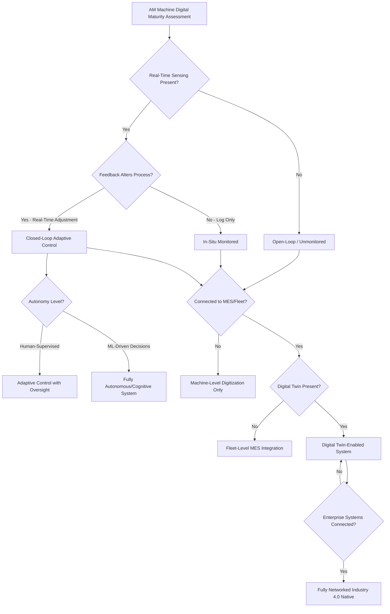

## Classification of Digitally Monitored and Industry 4.0 Processes

### Definition and Scope

Industry 4.0 process classification organizes additive manufacturing systems by their degree of digital connectivity, in-process sensing, data-driven control, and integration into networked manufacturing ecosystems — rather than by the physical mechanism of material fusion. This is an orthogonal classification axis layered on top of the base ISO/ASTM 52900 process categories: any of the seven core AM categories (and hybrid/micro variants) can be implemented at varying levels of digital maturity, from fully manual/open-loop machines to fully autonomous, closed-loop, networked "smart factory" systems. This framework draws on Industry 4.0 principles (cyber-physical systems, Industrial Internet of Things/IIoT, digital twins) as applied specifically to AM process monitoring and control.

### Classification by Monitoring Architecture

**Open-Loop (Unmonitored) Systems**

The machine executes a pre-programmed toolpath/build file with no real-time process feedback influencing execution. Process parameters (laser power, scan speed, feed rate) are fixed at setup and do not adapt during the build. This represents the baseline, pre-Industry-4.0 AM operating mode still common in lower-cost desktop and entry-level industrial systems.

**In-Situ Monitored (Sensing Without Control)**

Sensors collect real-time data during the build (melt pool temperature via pyrometry, layer imaging via cameras, acoustic emission sensors) and log it for post-build quality assessment, but the data does not feed back into active process control during the build itself. This is the most common current industrial configuration for metal AM (particularly PBF and DED), providing traceability and defect detection without full closed-loop autonomy.

**Closed-Loop Adaptive Control**

Real-time sensor data actively modulates process parameters during the build — for example, melt pool monitoring adjusting laser power or scan speed on-the-fly to maintain consistent melt pool geometry despite thermal accumulation effects. Closed-loop systems represent the current leading edge of commercial metal AM process control, particularly in laser-DED and laser-PBF platforms.

**Fully Autonomous/Cognitive Systems**

Machine learning models trained on historical process and quality data make higher-level process decisions (parameter selection, in-process rework decisions, defect-triggered build termination) with reduced or no human intervention during the build. [Inference] Fully autonomous cognitive AM systems remain predominantly at research or early-commercial maturity as of this writing, with most production deployments still requiring human oversight for final quality disposition decisions.

### Classification by Digital Integration Scope

**Machine-Level Digitization**

Monitoring and control confined to a single machine, with data used locally for that machine's build quality only.

**Fleet-Level Integration (Manufacturing Execution System/MES Connected)**

Multiple AM machines connected to a shared Manufacturing Execution System, enabling centralized job scheduling, material traceability across machines, and aggregated quality analytics across a production fleet.

**Digital Twin-Enabled Systems**

A virtual, continuously updated model of the physical build process (and often the resulting part) is maintained in parallel with the physical build, enabling simulation-based process optimization, predictive quality assessment, and virtual commissioning of new part geometries before physical build attempts.

**Fully Networked/Cloud-Connected (Industry 4.0 Native)**

Machines integrated into broader enterprise systems (ERP, PLM, supply chain platforms) with bidirectional data flow — design changes can trigger automated build-file regeneration, and build/quality data feeds back into design and supply chain decisions in near real time.

### Comparison Table

| Classification Level | Feedback Loop | Data Scope | Typical Maturity |
| --- | --- | --- | --- |
| Open-Loop | None | None/local log only | Entry-level, legacy systems |
| In-Situ Monitored | Sensing, no control feedback | Machine-level | Common in industrial metal AM |
| Closed-Loop Adaptive | Real-time parameter adjustment | Machine-level | Leading-edge commercial systems |
| Fleet-Level MES Integration | Cross-machine scheduling/traceability | Facility-level | Established in high-volume production environments |
| Digital Twin-Enabled | Simulation-informed control | Machine + virtual model | Emerging, active development |
| Fully Networked (Industry 4.0 Native) | Enterprise-wide bidirectional | Organization-wide | Emerging, sector-dependent maturity |

### Classification Diagram

### Digital Maturity Pyramid (SVG)

<svg xmlns="http://www.w3.org/2000/svg" viewBox="0 0 500 320">
<text x="250" y="25" font-size="16" font-weight="bold" text-anchor="middle" fill="#222">AM Digital Maturity Pyramid (svg_diagram)</text>
<polygon points="250,50 320,110 180,110" fill="#9b59b6" stroke="#6c3483" stroke-width="1.5" />
<text x="250" y="90" font-size="9" text-anchor="middle" fill="#fff">Networked/</text>
<text x="250" y="102" font-size="9" text-anchor="middle" fill="#fff">Digital Twin</text>
<polygon points="180,110 320,110 355,170 145,170" fill="#e67e22" stroke="#b35a0f" stroke-width="1.5" />
<text x="250" y="145" font-size="9" text-anchor="middle" fill="#fff">Closed-Loop Adaptive Control</text>
<polygon points="145,170 355,170 390,230 110,230" fill="#f39c12" stroke="#a86a0a" stroke-width="1.5" />
<text x="250" y="205" font-size="9" text-anchor="middle" fill="#fff">In-Situ Monitored (Sensing Only)</text>
<polygon points="110,230 390,230 425,290 75,290" fill="#a9a9a9" stroke="#555" stroke-width="1.5" />
<text x="250" y="265" font-size="9" text-anchor="middle" fill="#fff">Open-Loop / Unmonitored</text>
<text x="250" y="310" font-size="10" text-anchor="middle" fill="#333">Increasing Digital Maturity ↑</text>
</svg>

### Key Points

- Digital monitoring/Industry 4.0 classification is **orthogonal** to the ISO/ASTM 52900 process category — a laser-PBF machine and a WAAM machine can each independently be classified as open-loop, in-situ monitored, or closed-loop, regardless of their base process category.
- **Melt pool monitoring** (via coaxial pyrometry, high-speed cameras, or photodiodes) is currently the most widely deployed in-situ sensing modality in metal AM, serving as the primary data source for both quality logging and closed-loop control implementations.
- The distinction between **in-situ monitored** and **closed-loop adaptive** is the presence of an active feedback path altering process parameters — many commercially marketed "monitored" systems provide only logging/alerting, not autonomous correction, and this distinction is important when evaluating vendor claims.
- **Digital twin** implementations for AM typically combine physics-based thermal/mechanical simulation with real-time sensor data assimilation, enabling predictive capabilities (e.g., predicting final part distortion before the build completes) that pure in-situ monitoring cannot provide alone.
- [Inference] Adoption of higher digital maturity levels (closed-loop control, digital twins, full enterprise networking) is likely concentrated in high-value, regulated industries (aerospace, medical implants) where traceability and process qualification requirements justify the additional capital and integration investment, rather than being uniformly adopted across all AM market segments.

### Example

A closed-loop laser-PBF system for aerospace titanium components: coaxial melt pool photodiodes continuously measure melt pool intensity and size during each layer scan; when the control software detects melt pool intensity drifting outside a calibrated process window (indicating potential lack-of-fusion or keyholing porosity risk), it automatically adjusts laser power in real time to restore the target melt pool condition, with all sensor data and parameter adjustments logged for post-build traceability and part certification records.

### Related Topics

- Sustainable and low-impact process classification
- Powder Bed Fusion classification (LPBF, EBM) and melt pool physics
- Directed energy deposition classification and closed-loop DED control
- Digital twin methodology for manufacturing process simulation
- In-situ defect detection sensing modalities (pyrometry, acoustic emission, X-ray CT)
- Manufacturing Execution System (MES) integration for AM production fleets
- Part qualification and certification requirements in regulated AM industries