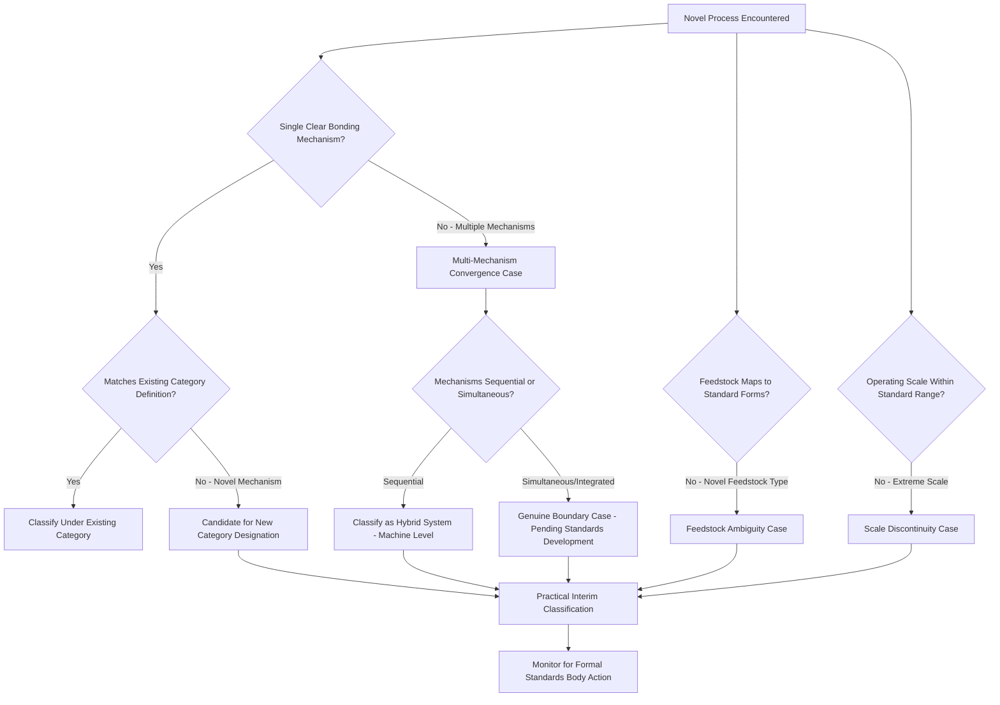

## Classification Challenges Posed by Unclassified Novel Processes

### Definition and Scope

As additive manufacturing research and commercialization accelerate, novel processes regularly emerge that resist clean assignment to the seven ISO/ASTM 52900 categories or to established boundary-case groupings. This item examines the **structural reasons** classification frameworks strain under novel processes, the recurring patterns of ambiguity that arise, and the practical/institutional consequences of extended unclassified status — synthesizing across the specific boundary cases, hybrid systems, and micro/nano processes covered elsewhere in this chapter into a general diagnostic framework.

### Root Causes of Classification Difficulty

**Multi-Mechanism Convergence**

Many novel processes deliberately combine two or more bonding/energy mechanisms to capture complementary benefits (e.g., thermal plus mechanical, or binder plus in-situ sintering), which inherently defeats a taxonomy built on single-mechanism categories. As covered under Boundary Cases, combined binder-jetting-plus-in-situ-laser-sintering processes exemplify this pattern.

**Feedstock Ambiguity**

Novel feedstocks — living cells, functionally graded material blends, hybrid liquid-solid suspensions, programmable/responsive ("4D printing") materials — do not map neatly onto the liquid/powder/wire/sheet feedstock-form taxonomy, particularly when the feedstock's defining characteristic is a post-build behavior (shape-changing, self-healing) rather than its as-deposited state.

**Scale Discontinuity**

Processes operating at scales far outside the taxonomy's implicit design range (nanometer-scale FEBID, meter-scale construction printing) stress category definitions written primarily around millimeter-to-centimeter part features, even when the underlying mechanism is a recognizable variant of an existing category.

**Absence of a Distinct Energy Source Category**

Some processes use bonding mechanisms not contemplated by the standard's energy-source framing at all — solid-state plastic deformation (cold spray, AFSD), thermodynamic self-assembly (directed self-assembly), or field-driven effects (magnetic/electric field-assisted deposition) — because the standard was developed primarily around thermal fusion, curing, and chemical binding mechanisms.

**Standards Lag Relative to Innovation Pace**

Formal standards revision (ISO/TC 261, ASTM F42 committee processes) operates on a multi-year consensus timescale, while commercial and research process innovation can outpace that cycle significantly. [Inference] This structural lag means that at any given time, some meaningful fraction of actively commercialized or heavily-researched AM processes will lack a settled, standards-body-endorsed classification, making practitioner-level synthesis (as in this framework) a necessary supplement rather than a substitute for eventual formal standardization.

### Recurring Ambiguity Patterns

| Pattern | Description | Representative Example |
| --- | --- | --- |
| Mechanism straddling | Process satisfies partial criteria of two+ categories simultaneously | Cold spray (DED-like delivery, non-thermal bonding) |
| System vs. process confusion | Ambiguity over whether to classify the integrated machine or its constituent process steps | Hybrid DED-milling systems |
| Goal-based rather than mechanism-based distinctness | Process differs primarily in intended outcome/function, not mechanism | Bioprinting (cell viability vs. geometric fidelity) |
| Emergent/non-deterministic structure formation | Final structure arises from material self-organization rather than explicit toolpath execution | Directed self-assembly |
| Post-build behavior as defining trait | Classification-relevant property only manifests after the build (4D printing shape memory/change) | Stimuli-responsive/4D-printed materials |

### Practical Consequences of Unclassified Status

**Regulatory and Qualification Uncertainty**

Industries with strict process qualification requirements (aerospace, medical devices) often anchor certification pathways to named, standardized process categories; a novel process lacking formal classification can face prolonged or ambiguous regulatory review, since qualification bodies may lack an established framework against which to benchmark process controls and acceptance criteria.

**Market Communication and Procurement Friction**

Purchasers and specifiers commonly search for, and write technical specifications around, named process categories; vendors of genuinely novel processes may need to position their offering relative to an existing category (even imperfectly) purely for market legibility, which can obscure genuine technical differentiation.

**Research Literature Fragmentation**

Absent a settled classification, published research on a novel process may be indexed and discussed under inconsistent terminology across different research groups, complicating literature synthesis and cross-study comparison. [Speculation] This fragmentation may partially explain why some solid-state processes (cold spray, AFSD) have accumulated somewhat inconsistent categorization treatment across different academic and industrial sources.

**Intellectual Property and Patent Classification**

Patent offices must assign novel processes to existing classification codes (e.g., International Patent Classification/IPC or Cooperative Patent Classification/CPC schemes for manufacturing processes), which can create tension similar to the ISO/ASTM standards-lag issue, independent of but analogous to the technical standards challenge.

### Diagnostic Framework Diagram

### Classification Pressure Points (SVG)

<svg xmlns="http://www.w3.org/2000/svg" viewBox="0 0 600 300">
<text x="300" y="25" font-size="16" font-weight="bold" text-anchor="middle" fill="#222">Sources of Classification Strain (svg_diagram)</text>
<circle cx="300" cy="170" r="90" fill="#eaf2fb" stroke="#4a90d9" stroke-width="2" />
<text x="300" y="165" font-size="11" text-anchor="middle" fill="#2a5f8f" font-weight="bold">ISO/ASTM</text>
<text x="300" y="180" font-size="11" text-anchor="middle" fill="#2a5f8f" font-weight="bold">52900</text>
<rect x="30" y="60" width="130" height="50" rx="8" fill="#fdecea" stroke="#e74c3c" stroke-width="1.5" />
<text x="95" y="80" font-size="9" text-anchor="middle" fill="#a93226">Multi-Mechanism</text>
<text x="95" y="95" font-size="9" text-anchor="middle" fill="#a93226">Convergence</text>
<rect x="440" y="60" width="130" height="50" rx="8" fill="#fdecea" stroke="#e74c3c" stroke-width="1.5" />
<text x="505" y="80" font-size="9" text-anchor="middle" fill="#a93226">Feedstock</text>
<text x="505" y="95" font-size="9" text-anchor="middle" fill="#a93226">Ambiguity</text>
<rect x="30" y="230" width="130" height="50" rx="8" fill="#fdecea" stroke="#e74c3c" stroke-width="1.5" />
<text x="95" y="250" font-size="9" text-anchor="middle" fill="#a93226">Scale</text>
<text x="95" y="265" font-size="9" text-anchor="middle" fill="#a93226">Discontinuity</text>
<rect x="440" y="230" width="130" height="50" rx="8" fill="#fdecea" stroke="#e74c3c" stroke-width="1.5" />
<text x="505" y="250" font-size="9" text-anchor="middle" fill="#a93226">Standards Lag</text>
<text x="505" y="265" font-size="9" text-anchor="middle" fill="#a93226">vs. Innovation</text>
<line x1="160" y1="90" x2="230" y2="140" stroke="#e74c3c" stroke-width="1.5" stroke-dasharray="4,2" />
<line x1="440" y1="90" x2="370" y2="140" stroke="#e74c3c" stroke-width="1.5" stroke-dasharray="4,2" />
<line x1="160" y1="250" x2="230" y2="200" stroke="#e74c3c" stroke-width="1.5" stroke-dasharray="4,2" />
<line x1="440" y1="250" x2="370" y2="200" stroke="#e74c3c" stroke-width="1.5" stroke-dasharray="4,2" />
</svg>

### Key Points

- Classification difficulty is not random or vendor-specific; it recurs along **identifiable structural fault lines** — multi-mechanism convergence, feedstock ambiguity, scale discontinuity, and absent energy-source categories — making it possible to diagnose why a given novel process resists classification rather than treating each case as sui generis.
- **Standards lag** is a structural, not incidental, feature of the classification ecosystem: consensus-based standards development is inherently slower than commercial/research innovation cycles, meaning some degree of unclassified-process backlog should be expected as an ongoing steady-state condition rather than a temporary gap to be fully closed.
- Unclassified status carries **material practical consequences** beyond academic taxonomy debates — regulatory qualification pathways, procurement specifications, patent classification, and research literature discoverability are all affected by the absence of settled categorization.
- The distinction between classifying the **process mechanism** versus the **integrated machine/system** (as seen in hybrid manufacturing) is a recurring source of confusion that, once made explicit, resolves a meaningful share of apparent boundary-case ambiguity.
- [Inference] Organizations working with genuinely novel AM processes are likely best served by explicitly documenting their process against multiple candidate classification frameworks (mechanism-based, feedstock-based, digital-maturity-based) rather than waiting for single definitive categorization, given the demonstrated multi-year lag in formal standards adoption.

### Example

A hypothetical novel process combining **directed self-assembly of nanoparticle-laden droplets** (jetted via piezoelectric dispensing) with **post-deposition magnetic field alignment**: this process would trigger multiple ambiguity patterns simultaneously — feedstock ambiguity (nanoparticle suspension is neither standard liquid resin nor conventional powder), multi-mechanism convergence (jetting plus field-assisted self-assembly), and absence of a standard energy-source category (magnetic field alignment has no direct ISO/ASTM 52900 analog) — illustrating why some emerging processes require interim, multi-framework documentation rather than forced single-category assignment.

### Related Topics

- Boundary cases outside the seven categories
- Hybrid manufacturing: combined additive-subtractive classification
- Nano-scale fabrication process classification
- ISO/ASTM 52900 standard revision history and working groups (ISO/TC 261, ASTM F42)
- 4D printing and stimuli-responsive material classification
- Patent classification systems for novel manufacturing processes (IPC/CPC)
- Process qualification and certification frameworks for emerging AM technologies