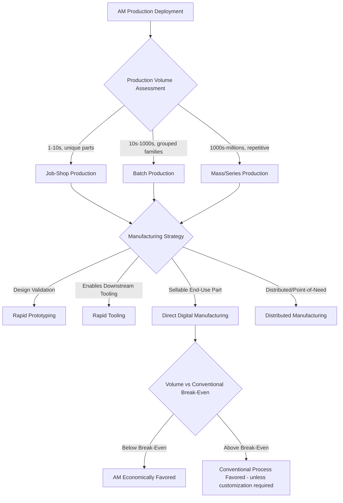

## Job-Shop, Batch, and Mass-Production Classification

### Definition and Scope

Production-context classification organizes additive manufacturing deployments according to production volume, part variety, and manufacturing strategy — a framework borrowed directly from classical manufacturing systems theory (job-shop, batch, and mass/flow production) and adapted to AM's distinctive economics. Unlike ISO/ASTM 52900's mechanism-based taxonomy, this classification axis addresses **how** AM capacity is organized and deployed commercially, which is essential for capacity planning, cost modeling, and comparing AM against conventional manufacturing routes for a given production scenario.

### Classification by Production Volume and Variety

**Job-Shop Production (One-Off / Highly Customized)**

Low volume (often single-unit), high part variety, with each job typically requiring unique process parameters, build setup, and post-processing. Job-shop AM is characterized by minimal setup-cost penalty per part change, since AM's core advantage (no dedicated tooling) means switching between completely different part geometries incurs primarily digital (CAD/toolpath) rather than physical retooling cost.

**Batch Production (Small-to-Medium Runs)**

Moderate volume (typically tens to low thousands of units), often grouped by geometric or material similarity to optimize build-plate nesting and machine utilization. Batch AM production commonly leverages **build-plate nesting** — packing multiple parts (identical or varied) into a single build to amortize fixed per-build costs (chamber heating, inert gas purge, powder bed preparation) across more parts.

**Mass/Series Production (High Volume, Repetitive)**

High volume (thousands to millions of units), typically of a single part or small family of parts, where AM competes directly against conventional mass-production methods (injection molding, stamping, casting) on a per-unit cost basis. Mass AM production is comparatively rare relative to job-shop and batch deployment, since AM's per-part cost curve does not benefit from the same economies of scale as tooling-based mass production — however, specific applications (dental aligners, hearing aid shells, certain medical device components) have achieved genuine mass-production AM deployment due to inherent part customization requirements that negate conventional mass-production's scale advantage.

### Classification by Manufacturing Strategy Alignment

**Rapid Prototyping-Aligned**

AM deployed primarily for design validation, form/fit/function testing, and iterative development, where part performance requirements (mechanical properties, surface finish, certification) are secondary to speed and geometric fidelity. This strategy aligns naturally with job-shop volume characteristics.

**Rapid Tooling-Aligned**

AM used to produce tooling (molds, jigs, fixtures, inserts) that is itself used in a downstream conventional manufacturing process, rather than producing end-use parts directly. This is a distinct economic category because the AM part's value is derived from enabling higher-volume conventional production rather than from its own unit economics.

**Direct Digital Manufacturing / Rapid Manufacturing (End-Use Parts)**

AM used to produce final, end-use, sellable parts directly, without an intervening tooling step. This strategy spans job-shop through mass-production volumes depending on the specific application, and is the category most directly comparable to conventional mass-production economics.

**Distributed/On-Demand Manufacturing**

Production capacity distributed across multiple geographic locations (or deployed at point-of-need) and triggered by demand signals rather than produced to forecast and held in inventory, enabled by AM's lack of dedicated tooling and digital-file-based reproducibility.

### Comparative Framework Table

| Classification | Typical Volume | Part Variety | Cost Driver | AM Competitive Position |
| --- | --- | --- | --- | --- |
| Job-Shop | 1–10s | Very high (unique per job) | Setup/labor time per job | Strong — AM's core advantage |
| Batch | 10s–1,000s | Moderate (grouped families) | Build-plate utilization efficiency | Strong to moderate, depends on nesting efficiency |
| Mass/Series | 1,000s–millions | Low (single part/family) | Per-unit material + machine time | Weak generally, except where customization negates tooling advantage |

### Break-Even Volume Relationship

The classical AM-versus-conventional-manufacturing break-even point can be expressed conceptually as:

$$C_{AM}(n) = C_{setup,AM} + n \cdot c_{unit,AM}$$

$$C_{conv}(n) = C_{tooling} + n \cdot c_{unit,conv}$$

Where $n$ is production volume, $C_{setup,AM}$ is comparatively low/near-zero (no dedicated tooling), $C_{tooling}$ for conventional processes is high but $c_{unit,conv}$ (per-unit cost) is typically lower than $c_{unit,AM}$ at scale. The break-even volume $n^*$ where $C_{AM}(n^*) = C_{conv}(n^*)$ typically favors AM at low-to-moderate volumes and favors conventional manufacturing beyond that threshold, though $n^*$ varies substantially by part complexity, material, and specific conventional process compared.

### Classification Diagram

### Production Strategy Positioning (SVG)

<svg xmlns="http://www.w3.org/2000/svg" viewBox="0 0 600 300">
<text x="300" y="25" font-size="16" font-weight="bold" text-anchor="middle" fill="#222">Volume vs. Variety Positioning (svg_diagram)</text>
<line x1="80" y1="260" x2="550" y2="260" stroke="#333" stroke-width="2" />
<line x1="80" y1="260" x2="80" y2="50" stroke="#333" stroke-width="2" />
<text x="300" y="285" font-size="12" text-anchor="middle" fill="#333">Production Volume →</text>
<text x="35" y="160" font-size="12" text-anchor="middle" fill="#333" transform="rotate(-90 35 160)">Part Variety →</text>
<rect x="100" y="70" width="100" height="90" fill="#4a90d9" fill-opacity="0.3" stroke="#2a5f8f" stroke-width="1.5" />
<text x="150" y="115" font-size="11" text-anchor="middle" fill="#2a5f8f" font-weight="bold">Job-Shop</text>
<rect x="230" y="140" width="120" height="80" fill="#2ecc71" fill-opacity="0.3" stroke="#1e8449" stroke-width="1.5" />
<text x="290" y="180" font-size="11" text-anchor="middle" fill="#1e8449" font-weight="bold">Batch</text>
<rect x="400" y="200" width="120" height="50" fill="#e67e22" fill-opacity="0.3" stroke="#b35a0f" stroke-width="1.5" />
<text x="460" y="228" font-size="11" text-anchor="middle" fill="#b35a0f" font-weight="bold">Mass/Series</text>
</svg>

### Key Points

- The job-shop/batch/mass-production framework is **borrowed from classical manufacturing systems theory** rather than originating within AM-specific standards, applied here because it directly addresses production economics questions that ISO/ASTM 52900's mechanism-based taxonomy does not.
- AM's fundamental economic advantage — **near-zero incremental setup cost for part variety** — makes it structurally well-suited to job-shop production and comparatively less naturally suited to mass production, inverting the cost structure of conventional manufacturing where tooling amortization rewards high-volume repetition.
- **Batch production with build-plate nesting** represents the pragmatic middle ground most commonly targeted by industrial AM service bureaus, since it balances economies of scale (amortizing fixed per-build overhead) against AM's variety advantage (nesting dissimilar parts in the same build).
- Genuine mass-production AM deployments are concentrated in applications where **per-unit customization requirements themselves negate conventional mass-production's scale advantage** (dental aligners, hearing aids), rather than in commodity parts where conventional tooling-based processes remain more economical at scale.
- [Inference] As AM machine throughput and per-unit costs continue to improve, the break-even volume threshold favoring AM over conventional manufacturing is likely to shift upward over time for a given part complexity, though the general job-shop/batch-favored, mass-production-challenged competitive positioning is expected to persist as a structural characteristic rather than a temporary limitation.

### Example

A dental clinic network using laser-PBF to produce custom implant guides: each patient's anatomy requires a unique guide geometry (job-shop characteristic — unique per job), but the clinic nests dozens of different patients' guides onto a single build plate per production run (batch characteristic — amortizing fixed build overhead), illustrating how a single AM deployment can straddle job-shop and batch classification simultaneously depending on which cost driver is being analyzed.

### Related Topics

- Sustainable and low-impact process classification
- Classification by feedstock form and energy source
- Build-plate nesting and machine utilization optimization
- Rapid tooling applications and economics
- Distributed and point-of-need manufacturing models
- Cost modeling and break-even analysis for AM vs. conventional manufacturing