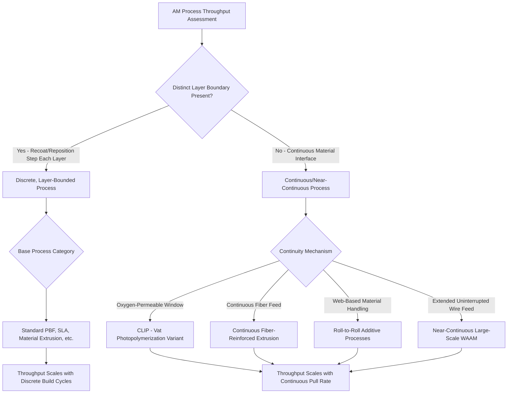

## Discrete versus Continuous Manufacturing Classification

### Definition and Scope

Discrete versus continuous manufacturing classification organizes additive manufacturing processes according to whether production occurs as **individually bounded units** (discrete parts with defined start/end points and gaps between production cycles) or as an **uninterrupted, ongoing material stream** (continuous throughput without natural part-to-part boundaries). This framework is borrowed from classical process engineering (where it distinguishes discrete manufacturing from continuous-process industries like chemical refining or paper production) and applied to AM to characterize throughput behavior, process control strategy, and economic scaling — a distinct axis from job-shop/batch/mass-production classification, which instead addresses volume and variety rather than the temporal structure of material deposition itself.

### Classification by Deposition Continuity

**Discrete, Layer-Bounded Processes (Conventional AM)**

The overwhelming majority of established AM processes operate in a fundamentally discrete, layer-by-layer mode: each layer is completed before the next begins, and each part (or build) has a defined start and completion point with idle/setup time between builds. This includes standard implementations of all seven ISO/ASTM 52900 categories — Vat Photopolymerization, Powder Bed Fusion, Material Extrusion, Material Jetting, Binder Jetting, Sheet Lamination, and Directed Energy Deposition — even though the underlying toolpath motion within a layer is continuous, the **layer-to-layer** structure itself is discrete and sequential.

**Continuous/Near-Continuous Processes**

A smaller but growing set of AM processes and process variants are designed to minimize or eliminate the discrete layer-boundary structure, aiming for genuinely continuous material solidification:

- **Continuous Liquid Interface Production (CLIP)** — a Vat Photopolymerization variant using an oxygen-permeable window to maintain a persistent liquid "dead zone" at the resin-window interface, enabling continuous part pull-up without discrete layer-by-layer recoating/curing cycles
- **Continuous Fiber-Reinforced Extrusion** — Material Extrusion variants that continuously feed reinforcing fiber alongside polymer matrix, creating continuous internal fiber pathways rather than discrete per-layer fiber placement
- **Roll-to-Roll (R2R) Additive Processes** — emerging processes adapting continuous web-handling (common in printed electronics and flexible film manufacturing) to AM-style material deposition, enabling ongoing production without discrete build-plate cycles
- **Continuous WAAM/Wire-DED for Large Structures** — in principle, wire-fed DED can approach continuous operation for very large, geometrically simple structures (e.g., continuous wall sections) where deposition proceeds largely uninterrupted over extended periods, though in practice most implementations still exhibit discrete layer/pass structure

### Classification by Throughput Boundary Characteristics

| Characteristic | Discrete Processes | Continuous/Near-Continuous Processes |
| --- | --- | --- |
| Layer boundary presence | Distinct recoating/repositioning step between layers | Minimized or eliminated interface between "layers" |
| Idle time between parts | Present (build setup, powder bed reset, resin refill) | Reduced — parts can potentially be pulled continuously |
| Throughput scaling | Roughly proportional to number of discrete build cycles | Potentially proportional to continuous pull/feed rate |
| Process control granularity | Per-layer parameter adjustment straightforward | Requires continuous, real-time parameter modulation |
| Representative processes | Standard PBF, standard SLA/DLP, standard Material Extrusion | CLIP, continuous fiber extrusion, roll-to-roll AM |

### The Layer-Boundary Distinction in Practice

Even within nominally "discrete" processes, the degree of discreteness varies. Standard DLP vat photopolymerization involves a physical peel/separation step between each cured layer and the vat window, introducing mechanical cycle time and stress at each layer boundary. CLIP's oxygen-permeable window eliminates this peel step by maintaining a thin uncured liquid layer at the window interface throughout the build, allowing the part to be pulled upward in a substantially continuous motion — this is frequently cited as CLIP's primary speed advantage over conventional layer-by-layer vat photopolymerization.

### Classification Diagram

### Discrete vs. Continuous Process Flow (SVG)

<svg xmlns="http://www.w3.org/2000/svg" viewBox="0 0 600 280">
<text x="300" y="25" font-size="16" font-weight="bold" text-anchor="middle" fill="#222">Discrete vs. Continuous Build Progression (svg_diagram)</text>
<text x="150" y="55" font-size="13" text-anchor="middle" fill="#2a5f8f" font-weight="bold">Discrete (Layer-by-Layer)</text>
<rect x="60" y="70" width="60" height="20" fill="#4a90d9" stroke="#2a5f8f" />
<rect x="60" y="100" width="60" height="20" fill="#4a90d9" stroke="#2a5f8f" />
<rect x="60" y="130" width="60" height="20" fill="#4a90d9" stroke="#2a5f8f" />
<rect x="60" y="160" width="60" height="20" fill="#4a90d9" stroke="#2a5f8f" />
<line x1="90" y1="90" x2="90" y2="100" stroke="#e74c3c" stroke-width="3" />
<line x1="90" y1="120" x2="90" y2="130" stroke="#e74c3c" stroke-width="3" />
<line x1="90" y1="150" x2="90" y2="160" stroke="#e74c3c" stroke-width="3" />
<text x="200" y="120" font-size="9" fill="#a93226">← Recoat/Peel Boundaries</text>
<text x="450" y="55" font-size="13" text-anchor="middle" fill="#1e8449" font-weight="bold">Continuous (CLIP-style)</text>
<rect x="400" y="70" width="60" height="110" fill="#2ecc71" stroke="#1e8449" />
<text x="430" y="130" font-size="8" text-anchor="middle" fill="#fff">Continuous</text>
<text x="430" y="142" font-size="8" text-anchor="middle" fill="#fff">Pull-Up</text>
<line x1="430" y1="190" x2="430" y2="210" stroke="#1e8449" stroke-width="2" marker-end="url(#arr4)" />
<text x="430" y="230" font-size="9" text-anchor="middle" fill="#1e8449">No Discrete Layer Boundaries</text>
</svg>

### Key Points

- The discrete/continuous axis is orthogonal to the ISO/ASTM 52900 mechanism-based taxonomy — **CLIP remains classified as Vat Photopolymerization** under the base standard, with "continuous" describing its layer-boundary behavior, not a separate process category.
- The primary practical benefit of continuous/near-continuous operation is **elimination of per-layer cycle-time overhead** (recoating, peeling, repositioning), which can substantially increase build speed for compatible part geometries, particularly tall, relatively simple cross-sections that benefit most from uninterrupted vertical pull.
- Continuous processes generally require **more sophisticated real-time process control** than discrete processes, since parameter adjustment cannot rely on natural per-layer checkpoints and must instead be modulated continuously against a moving/streaming build reference.
- [Inference] Continuous/near-continuous AM approaches are likely best suited to part geometries and production contexts where uninterrupted throughput genuinely translates to economic advantage (high-volume, relatively simple/repetitive geometries), while complex, highly-varied geometries may see diminished benefit from continuity since per-layer control granularity is often useful precisely for handling geometric complexity.
- Even "continuous" processes typically retain some discrete character at the **overall production level** — a continuous CLIP pull-up still produces individually separable, discrete final parts, distinguishing AM's continuous variants from truly continuous-process industries (e.g., continuous chemical flow processes) where the output itself has no natural unit boundaries.

### Example

Comparing production of a tall, simple cylindrical lattice structure via **standard DLP** versus **CLIP**: standard DLP would require a discrete peel-and-recoat cycle for each of potentially thousands of thin layers, with each cycle contributing mechanical settling time; CLIP would instead pull the part continuously upward through the oxygen-permeable window interface, substantially reducing total build time for this geometry by eliminating the cumulative per-layer cycle-time overhead, though final part throughput still depends on continuous cure-front propagation speed relative to the part's cross-sectional complexity.

### Related Topics

- Job-shop, batch, and mass-production classification
- Classification by feedstock form and energy source
- Vat photopolymerization process variants (SLA, DLP, CLIP, LCD/MSLA)
- Continuous fiber-reinforced additive manufacturing
- Roll-to-roll manufacturing adaptation for additive processes
- Process control strategies for continuous versus discrete material deposition