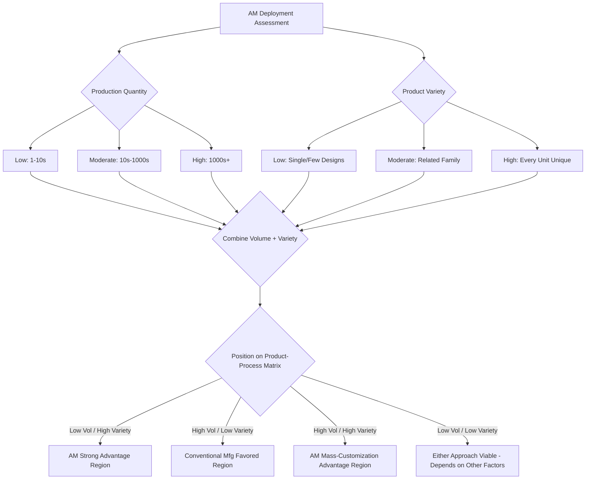

## Classification by Production Quantity and Product Variety

### Definition and Scope

Classification by production quantity and product variety organizes additive manufacturing deployments along two explicit, measurable axes — **volume** (units produced) and **variety** (number of distinct part designs) — treated as independent dimensions rather than collapsed into named categories like job-shop/batch/mass-production. This framework provides a finer-grained analytical lens than the named-category approach, enabling positioning of any AM deployment as a coordinate on a continuous volume-variety plane, and directly informs the classical manufacturing strategy matrix (the product-process matrix) used to compare AM against conventional manufacturing routes.

### The Volume-Variety Continuum

Rather than three discrete named categories, quantity and variety are more precisely understood as **two independent continuous axes**:

**Quantity Axis (Volume)**

Ranges from single-unit production (n=1) through low-volume (tens), medium-volume (hundreds to thousands), to high-volume (tens of thousands and above). Quantity classification determines the relevance of per-unit fixed-cost amortization and machine utilization optimization.

**Variety Axis (Product Mix)**

Ranges from single, invariant part designs through moderate part families (related geometries, shared material/process parameters) to extremely high variety (every unit geometrically unique, as in patient-specific medical devices). Variety classification determines the relevance of setup/changeover cost and the practical feasibility of shared tooling-based alternatives.

### The Product-Process Matrix Applied to AM

The classical product-process matrix (originating in operations management, plotting product variety against process structure/volume) positions manufacturing approaches along a diagonal from low-volume/high-variety (job-shop-type processes) to high-volume/low-variety (continuous/flow processes). AM's position on this matrix is distinctive:

**AM's Structural Advantage Region**

Low-to-moderate volume combined with high-to-extreme variety — the upper-left region of the matrix — is where AM's lack of dedicated tooling provides maximum relative advantage over conventional manufacturing, since conventional processes in this region typically suffer from poor tooling amortization (tooling cost spread over too few units) or excessive changeover downtime.

**AM's Structural Disadvantage Region**

High volume combined with low variety — the lower-right region — is where conventional mass-production processes (injection molding, stamping) typically retain a decisive per-unit cost advantage, since their tooling investment is amortized over enough units to drive per-part cost well below AM's comparatively flat per-unit material-and-machine-time cost structure.

**The Diagonal Exception: High-Volume, High-Variety**

An off-diagonal region — high volume combined with high variety (mass customization) — represents a zone where conventional manufacturing's tooling-based economics struggle most (each variant would require separate tooling), while AM's per-unit cost structure remains relatively insensitive to variety. This is the region most frequently cited as AM's most distinctive and defensible long-term competitive position, since no conventional process combines low changeover cost with high per-unit throughput as directly as AM does.

### Comparison Table

| Volume | Variety | Matrix Position | AM Competitive Position | Representative Application |
| --- | --- | --- | --- | --- |
| Low | High (unique) | Job-shop / project | Very strong | Aerospace one-off tooling, art/architecture |
| Low-Moderate | Moderate | Batch | Strong | Medical implants, replacement parts |
| High | Low | Mass/flow | Weak (generally) | Commodity plastic components |
| High | High | Mass customization | Strong (distinctive) | Dental aligners, hearing aids, customized consumer products |

### Classification Diagram

### Product-Process Matrix Positioning (SVG)

<svg xmlns="http://www.w3.org/2000/svg" viewBox="0 0 600 320">
<text x="300" y="25" font-size="16" font-weight="bold" text-anchor="middle" fill="#222">AM Positioning on Product-Process Matrix (svg_diagram)</text>
<line x1="80" y1="270" x2="550" y2="270" stroke="#333" stroke-width="2" />
<line x1="80" y1="270" x2="80" y2="50" stroke="#333" stroke-width="2" />
<text x="300" y="300" font-size="12" text-anchor="middle" fill="#333">Production Volume →</text>
<text x="35" y="160" font-size="12" text-anchor="middle" fill="#333" transform="rotate(-90 35 160)">Product Variety →</text>
<rect x="90" y="60" width="150" height="120" fill="#2ecc71" fill-opacity="0.25" stroke="#1e8449" stroke-width="1.5" />
<text x="165" y="120" font-size="10" text-anchor="middle" fill="#1e8449" font-weight="bold">AM Strong</text>
<text x="165" y="135" font-size="10" text-anchor="middle" fill="#1e8449" font-weight="bold">Advantage</text>
<rect x="380" y="60" width="150" height="120" fill="#3498db" fill-opacity="0.25" stroke="#2a5f8f" stroke-width="1.5" />
<text x="455" y="115" font-size="10" text-anchor="middle" fill="#2a5f8f" font-weight="bold">Mass</text>
<text x="455" y="130" font-size="10" text-anchor="middle" fill="#2a5f8f" font-weight="bold">Customization</text>
<text x="455" y="145" font-size="10" text-anchor="middle" fill="#2a5f8f" font-weight="bold">(AM Distinctive)</text>
<rect x="380" y="190" width="150" height="70" fill="#e74c3c" fill-opacity="0.25" stroke="#a93226" stroke-width="1.5" />
<text x="455" y="230" font-size="10" text-anchor="middle" fill="#a93226" font-weight="bold">Conventional</text>
<text x="455" y="245" font-size="10" text-anchor="middle" fill="#a93226" font-weight="bold">Mfg Favored</text>
</svg>

### Key Points

- Treating quantity and variety as **two independent continuous axes** (rather than three named buckets) provides finer analytical resolution, particularly for positioning ambiguous cases that don't cleanly fit job-shop, batch, or mass-production labels.
- The **product-process matrix** framing reveals that AM's most distinctive and defensible competitive position is not simply "low volume" but specifically the **high-volume, high-variety (mass customization) quadrant**, where conventional tooling-based manufacturing struggles most acutely.
- AM's comparatively **flat per-unit cost structure** (relatively insensitive to design variety, since no dedicated tooling exists to amortize or duplicate) is the fundamental economic mechanism underlying its favorable positioning across the low-volume region and the mass-customization quadrant alike.
- The high-volume, low-variety quadrant remains **conventional manufacturing's stronghold**, since tooling amortization drives per-unit costs below AM's typical range once volume is sufficient — this is a structural rather than temporary limitation tied to AM's fundamental per-unit material and machine-time cost basis.
- [Inference] As AM machine throughput, multi-part build density, and automation continue to improve, the boundary separating AM's favorable and unfavorable regions on this matrix is likely to shift gradually toward higher volumes over time, without necessarily eliminating conventional manufacturing's fundamental advantage in the high-volume, low-variety quadrant.

### Example

Positioning a custom orthopedic implant manufacturer on the volume-variety plane: each implant is patient-specific (variety = extremely high, essentially n=1 per design), while total production volume across all patients may reach moderate levels (hundreds to low thousands per year) — this places the deployment squarely in AM's strong-advantage region (low-to-moderate volume, high variety), explaining why patient-specific orthopedic implants have become one of AM's most commercially mature end-use application areas, in contrast to a commodity plastic bracket (low variety, potentially high volume) where injection molding would typically retain a decisive cost advantage.

### Related Topics

- Job-shop, batch, and mass-production classification
- Discrete versus continuous manufacturing classification
- Product-process matrix theory in operations management
- Mass customization strategies and AM's role in enabling them
- Cost modeling and break-even analysis for AM vs. conventional manufacturing
- Patient-specific medical device manufacturing economics