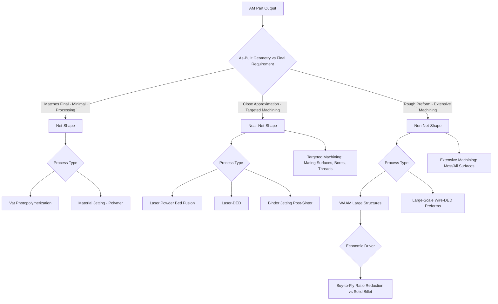

## Net-Shape, Near-Net-Shape, and Non-Net-Shape Classification

### Definition and Scope

Net-shape classification organizes additive manufacturing processes and outcomes by how closely the as-built part geometry matches the final, functional part geometry — determining the degree of post-processing required before the part is dimensionally and functionally complete. This classification is central to AM process economics, since post-processing (machining, finishing, heat treatment) often represents a substantial share of total part cost and lead time, and process selection is frequently driven as much by net-shape capability as by the base mechanism classification itself.

### Classification by Post-Process Requirement

**Net-Shape Processes**

The as-built part requires no further dimensional processing to meet final geometric and functional requirements; only cleaning, minor finishing (e.g., support removal marks), or surface treatment (e.g., dyeing, minor polishing) may be applied, without material removal affecting critical dimensions. Vat Photopolymerization and Material Jetting processes most commonly achieve net-shape or near-net-shape output for polymer parts due to their inherently fine resolution and smooth surface finish, particularly for parts without tight functional tolerances on mating surfaces.

**Near-Net-Shape Processes**

The as-built part closely approximates final geometry but requires targeted post-process machining on specific critical features (mating surfaces, bearing bores, sealing faces, threaded holes) while the bulk geometry remains as-built. This is the most common outcome for metal AM processes, particularly Powder Bed Fusion and Directed Energy Deposition, where as-built surface roughness and dimensional tolerance are typically insufficient for functional mating surfaces but adequate for non-critical geometry.

**Non-Net-Shape Processes**

The as-built output serves primarily as a rough preform or stock shape requiring substantial subsequent machining across most or all surfaces to reach final geometry — the AM process's primary value is providing a near-final-mass, complex-geometry starting stock rather than a nearly-finished part. This classification most commonly applies to large-scale metal DED deposits (particularly WAAM) used to build up oversized preforms that are then extensively machined, where the AM step's primary economic benefit is buy-to-fly ratio improvement (reducing raw material waste compared to machining from solid billet) rather than direct dimensional accuracy.

### Comparison Table

| Classification | Typical As-Built Tolerance | Post-Processing Scope | Representative Processes |
| --- | --- | --- | --- |
| Net-Shape | ±0.05–0.2 mm | Minimal (cleaning, support removal) | Vat Photopolymerization, Material Jetting (polymer) |
| Near-Net-Shape | ±0.1–0.5 mm | Targeted critical-feature machining | Laser-PBF, Laser-DED, Binder Jetting (post-sinter) |
| Non-Net-Shape | ±1–5 mm or greater | Extensive machining, most/all surfaces | WAAM, large-scale wire-DED preforms |

### Buy-to-Fly Ratio as a Net-Shape Economic Metric

For non-net-shape and near-net-shape metal AM applications, the **buy-to-fly ratio** — the ratio of raw material purchased to final part mass — is a key economic metric, particularly relevant in aerospace where machining complex titanium components from solid billet can produce buy-to-fly ratios of 10:1 to 20:1 or higher:

$$\text{Buy-to-Fly Ratio} = \frac{m_{raw}}{m_{final}}$$

Non-net-shape AM preforms aim to substantially reduce this ratio compared to machining from solid stock, even though the AM preform itself still requires extensive subsequent machining, because the AM-deposited preform's shape already approximates the final part's rough geometry rather than starting from a rectangular billet.

### Classification Diagram

### Net-Shape Spectrum (SVG)

<svg xmlns="http://www.w3.org/2000/svg" viewBox="0 0 600 240">
<text x="300" y="25" font-size="16" font-weight="bold" text-anchor="middle" fill="#222">Net-Shape Spectrum and Post-Processing Scope (svg_diagram)</text>
<line x1="60" y1="130" x2="560" y2="130" stroke="#333" stroke-width="2" />
<circle cx="120" cy="130" r="10" fill="#2ecc71" />
<text x="120" y="105" font-size="11" text-anchor="middle" fill="#1e8449" font-weight="bold">Net-Shape</text>
<text x="120" y="160" font-size="9" text-anchor="middle" fill="#333">Minimal post-process</text>
<circle cx="300" cy="130" r="10" fill="#f39c12" />
<text x="300" y="105" font-size="11" text-anchor="middle" fill="#a86a0a" font-weight="bold">Near-Net-Shape</text>
<text x="300" y="160" font-size="9" text-anchor="middle" fill="#333">Targeted feature machining</text>
<circle cx="480" cy="130" r="10" fill="#e74c3c" />
<text x="480" y="105" font-size="11" text-anchor="middle" fill="#a93226" font-weight="bold">Non-Net-Shape</text>
<text x="480" y="160" font-size="9" text-anchor="middle" fill="#333">Extensive machining, all surfaces</text>
<rect x="60" y="185" width="60" height="15" fill="#2ecc71" />
<rect x="240" y="185" width="120" height="15" fill="#f39c12" />
<rect x="420" y="185" width="140" height="15" fill="#e74c3c" />
<text x="300" y="215" font-size="9" text-anchor="middle" fill="#555">Increasing Post-Processing Requirement →</text>
</svg>

### Key Points

- Net-shape classification is **orthogonal to but interacts strongly with** hybrid manufacturing classification: non-net-shape and near-net-shape AM outputs are precisely the category where hybrid additive-subtractive systems provide the greatest integration value, since substantial machining is required regardless.
- The **buy-to-fly ratio** metric explains why non-net-shape AM (particularly WAAM preforms) can still be economically superior to conventional machining from solid billet, even though the AM output itself requires extensive subsequent machining — the comparison is against machining from raw stock, not against a hypothetical net-shape alternative.
- Achieving **net-shape** output is generally easier for polymer processes (Vat Photopolymerization, Material Jetting) than for metal processes, due to metal AM's characteristic as-built surface roughness (often 5–25 μm Ra as-built versus much finer achievable via subsequent machining/polishing) and residual-stress-driven dimensional variation.
- [Inference] Process selection decisions in metal AM commonly weigh net-shape capability directly against build speed and cost: processes offering finer as-built tolerance and surface finish (laser-PBF, laser-DED) typically have lower deposition rates than coarser processes (WAAM), meaning the choice of net-shape category is often an explicit trade-off against throughput rather than a purely technical limitation.
- Critical functional features (bearing surfaces, sealing faces, precision bores, threaded holes) are near-universally machined even on otherwise near-net-shape or nominally net-shape metal AM parts, since as-built AM surface finish and micro-scale dimensional variation rarely meet the tolerance requirements of precision mating interfaces.

### Example

Producing a titanium aerospace bracket via **laser-DED near-net-shape deposition**: the DED process builds the bracket's overall complex geometry to within roughly ±0.3 mm of final dimensions across most surfaces (near-net-shape), but the bolt-hole bores and a flat mounting interface require dedicated CNC machining passes to achieve the tight tolerances and surface finish required for structural bolted assembly — illustrating how a single part can combine net-shape-adjacent bulk geometry with near-net-shape-driven targeted machining on specific functional features.

### Related Topics

- Directed energy deposition classification
- Hybrid manufacturing: combined additive-subtractive classification
- Job-shop, batch, and mass-production classification
- Surface roughness and as-built tolerance characterization in metal AM
- Buy-to-fly ratio and material efficiency in aerospace manufacturing
- Post-processing requirements by AM process category (machining, heat treatment, sintering)