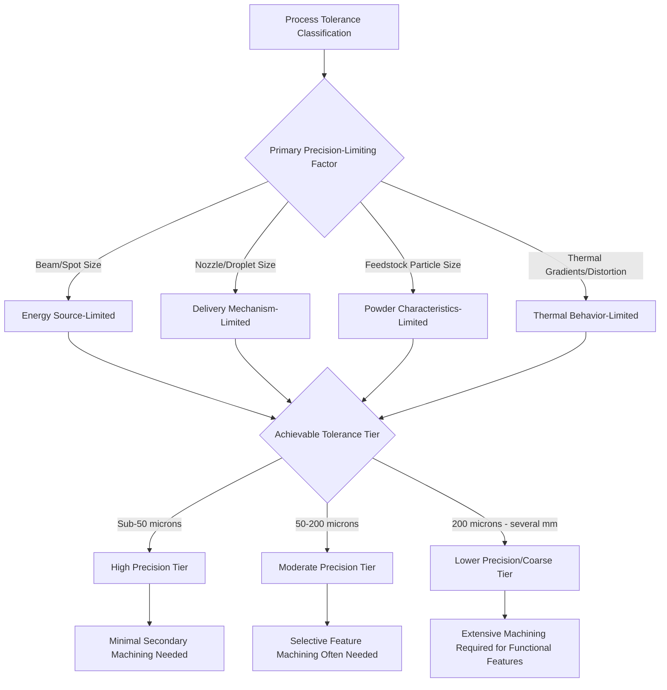

## Classification by Achievable Tolerance and Dimensional Capability

### Definition and Scope

Classification by achievable tolerance and dimensional capability organizes additive manufacturing processes according to the precision they can reliably deliver in as-built form — encompassing dimensional accuracy (how closely a feature matches its nominal design dimension), repeatability (consistency across multiple builds), minimum feature resolution, and surface finish. This framework is closely related to, but distinct from, net-shape classification: net-shape classification addresses *how much post-processing is required*, while tolerance/dimensional classification addresses *the underlying precision capability* that drives that post-processing requirement in the first place. Tolerance capability is frequently the deciding factor in AM process selection once material and geometry requirements have narrowed the candidate field.

### Classification by Dimensional Accuracy Tier

**High Precision (Sub-50 μm feature accuracy)**

Processes capable of holding tight dimensional tolerances directly, typically leveraging fine energy-source spot sizes, high-resolution optics, or precision droplet/jetting mechanisms.

- Two-Photon Polymerization / Micro-SLA — sub-micron to low-micron accuracy
- Material Jetting (PolyJet-type) — typically ±20–50 μm for small features
- High-resolution DLP/LCD Vat Photopolymerization — pixel-resolution-dependent, commonly 20–50 μm in-plane

**Moderate Precision (50–200 μm feature accuracy)**

The majority of industrial polymer and metal AM processes fall into this tier, sufficient for most functional prototyping and many end-use applications without critical mating tolerances.

- Standard SLA/DLP Vat Photopolymerization — ±0.1–0.2 mm typical
- Laser Powder Bed Fusion (metal) — ±0.1–0.2 mm typical, feature-size dependent
- Material Extrusion (industrial-grade FDM) — ±0.1–0.3 mm typical

**Lower Precision / Coarse (200 μm to several mm)**

Processes optimized for deposition rate, build volume, or material properties over dimensional precision, typically requiring substantial secondary machining for critical features.

- Wire Arc Additive Manufacturing (WAAM) — ±1–5 mm typical, geometry-dependent
- Large-format Material Extrusion (big-area additive manufacturing) — ±0.5–2 mm typical
- Sand Binder Jetting (foundry patterns/molds) — ±0.3–1 mm typical

### Classification by Precision-Determining Factor

**Energy/Beam Spot Size-Limited Processes**

Dimensional resolution is fundamentally bounded by the focused energy source's spot diameter (laser or electron beam), since the melt pool or cure spot cannot be smaller than the beam's effective interaction zone. This applies to laser-PBF, laser-DED, and laser-based vat photopolymerization.

**Nozzle/Orifice-Limited Processes**

Dimensional resolution is bounded by the physical nozzle or droplet-generation orifice diameter, applying to Material Extrusion (nozzle diameter sets minimum bead width) and Material Jetting (droplet volume sets minimum feature size).

**Particle Size-Limited Processes**

Dimensional resolution is bounded by feedstock particle size, since features smaller than roughly 2–3 particle diameters cannot be reliably formed. This applies to Powder Bed Fusion and Binder Jetting, where finer powder generally enables finer features but with trade-offs in flowability and cost.

**Thermal Distortion-Limited Processes**

Dimensional accuracy is constrained less by the deposition mechanism's inherent resolution and more by thermally-induced distortion, warping, and residual stress accumulated over the build — particularly relevant to metal PBF and DED processes with large thermal gradients, where achievable tolerance can degrade for large or thermally complex geometries even though the underlying beam spot size would theoretically support finer accuracy.

### Comparison Table

| Precision Tier | Typical Tolerance | Limiting Factor | Representative Processes |
| --- | --- | --- | --- |
| High Precision | <50 μm | Beam spot / droplet size | Two-Photon Polymerization, PolyJet, high-res DLP |
| Moderate Precision | 50–200 μm | Beam spot + thermal effects | Standard SLA, Laser-PBF, industrial FDM |
| Lower Precision | 200 μm–several mm | Deposition rate priority, particle/nozzle size | WAAM, large-format extrusion, sand binder jetting |

### Dimensional Capability Relationship

Achievable feature resolution can be conceptually related to the governing physical limiter:

$$d_{min} \approx k \cdot \max(d_{beam}, d_{particle}, d_{nozzle})$$

Where $d_{min}$ is minimum reliably formed feature size, $k$ is a process-dependent multiplier (typically 2–5) accounting for melt pool spreading, thermal effects, or droplet coalescence, and $d_{beam}$, $d_{particle}$, $d_{nozzle}$ represent the beam spot diameter, feedstock particle diameter, or nozzle orifice diameter respectively, with the dominant (largest-effect) factor governing overall achievable resolution for a given process.

### Classification Diagram

### Precision Tier Comparison (SVG)

<svg xmlns="http://www.w3.org/2000/svg" viewBox="0 0 600 260">
<text x="300" y="25" font-size="16" font-weight="bold" text-anchor="middle" fill="#222">Achievable Tolerance by Process (svg_diagram)</text>
<line x1="80" y1="220" x2="550" y2="220" stroke="#333" stroke-width="2" />
<text x="300" y="245" font-size="11" text-anchor="middle" fill="#333">Log Scale: Tolerance (μm) →</text>
<circle cx="130" cy="220" r="8" fill="#2ecc71" />
<text x="130" y="200" font-size="9" text-anchor="middle" fill="#1e8449">Two-Photon (~0.1μm)</text>
<circle cx="220" cy="220" r="8" fill="#4a90d9" />
<text x="220" y="200" font-size="9" text-anchor="middle" fill="#2a5f8f">PolyJet (~30μm)</text>
<circle cx="310" cy="220" r="8" fill="#f39c12" />
<text x="310" y="200" font-size="9" text-anchor="middle" fill="#a86a0a">Laser-PBF (~150μm)</text>
<circle cx="400" cy="220" r="8" fill="#e67e22" />
<text x="400" y="200" font-size="9" text-anchor="middle" fill="#b35a0f">FDM (~200μm)</text>
<circle cx="500" cy="220" r="8" fill="#e74c3c" />
<text x="500" y="200" font-size="9" text-anchor="middle" fill="#a93226">WAAM (~2000μm)</text>
</svg>

### Key Points

- Achievable tolerance classification is governed by **four distinct limiting-factor categories** — beam/spot size, nozzle/droplet size, feedstock particle size, and thermal distortion — and identifying which factor dominates for a given process explains why simply "using a finer laser" or "using finer powder" does not always proportionally improve achievable accuracy once a different factor becomes limiting.
- **Thermal distortion** is a uniquely important limiter for metal AM processes specifically, since it means achievable tolerance is not a fixed, geometry-independent process specification but degrades for larger, thermally complex parts even when using the same equipment and nominal parameters.
- The precision-vs-deposition-rate trade-off observed here directly parallels the trade-off seen in DED classification by energy source: finer-resolution processes (laser-based) consistently exhibit lower material deposition/build rates than coarser processes (arc-based), representing a recurring structural trade-off across multiple AM classification axes.
- [Unverified] Specific numeric tolerance figures cited for any process vary significantly by machine model, calibration, material, part geometry, and vendor; the ranges provided here represent general industry-typical figures for comparative classification purposes and should be verified against current machine-specific specifications for engineering decisions.
- Selecting an appropriately precise process for a given application involves matching **achievable tolerance to functional requirement**, since specifying an unnecessarily high-precision (and typically slower, more expensive) process for features with generous tolerance requirements represents avoidable cost and lead-time penalty.

### Example

Selecting a process for a consumer product housing with a snap-fit feature requiring ±0.15 mm tolerance on the fit geometry: **industrial-grade Material Extrusion or standard Vat Photopolymerization** (moderate precision tier, ~0.1–0.2 mm typical) would be appropriately matched to this requirement, whereas specifying **two-photon polymerization** (sub-micron precision tier) would represent significant unnecessary cost and build-time penalty for a tolerance requirement the coarser, faster process already satisfies.

### Related Topics

- Net-shape, near-net-shape, and non-net-shape classification
- Micro-manufacturing process classification
- Classification by feedstock form and energy source
- Directed energy deposition classification (energy source and resolution trade-offs)
- Surface roughness characterization and measurement in AM
- Thermal distortion and residual stress in metal additive manufacturing