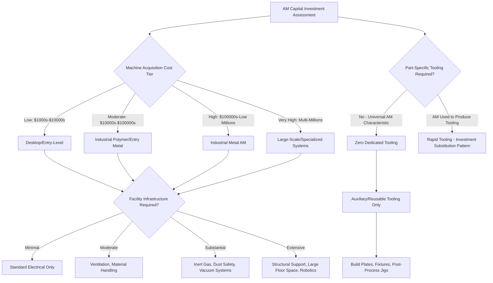

## Classification by Capital Intensity and Tooling Investment

### Definition and Scope

Classification by capital intensity and tooling investment organizes additive manufacturing processes according to the magnitude and structure of upfront and ongoing capital expenditure required to deploy them — spanning machine acquisition cost, facility/infrastructure requirements (inert atmosphere systems, vacuum chambers, ventilation, powder handling safety systems), and the near-total absence of part-specific tooling that distinguishes AM from conventional manufacturing. This classification axis is essential for capacity planning, make-versus-buy decisions, and financial justification of AM adoption, complementing the volume/variety and net-shape frameworks by focusing specifically on the investment structure rather than per-unit production economics.

### Classification by Machine Capital Cost Tier

**Low Capital Intensity (Desktop/Entry-Level)**

Machine acquisition cost typically in the low thousands to tens of thousands of dollars range, minimal facility infrastructure requirements (standard electrical service, no specialized atmosphere control).

- Desktop Material Extrusion (FDM/FFF)
- Entry-level Vat Photopolymerization (resin-based)
- Low-end Material Jetting

**Moderate Capital Intensity (Industrial Polymer/Entry Metal)**

Machine acquisition cost typically in the tens to low hundreds of thousands of dollars range, moderate facility requirements (ventilation, some material handling infrastructure).

- Industrial-grade Vat Photopolymerization and Material Jetting
- Industrial Material Extrusion (large-format, engineering polymers)
- Entry-level Binder Jetting (polymer/sand)

**High Capital Intensity (Industrial Metal AM)**

Machine acquisition cost typically in the several hundred thousand to multi-million dollar range, substantial facility infrastructure required (inert gas supply and recovery systems, powder handling and combustible dust safety systems, in some cases vacuum chamber support).

- Laser Powder Bed Fusion (metal)
- Electron Beam Powder Bed Fusion
- Laser and Electron Beam Directed Energy Deposition
- Metal Binder Jetting (including downstream sintering furnace capital)

**Very High Capital Intensity (Large-Scale/Specialized Systems)**

Machine acquisition cost frequently in the multi-million dollar range, extensive facility requirements including large floor space, structural/crane support for large build volumes, and specialized robotic integration.

- Large-scale Wire Arc Additive Manufacturing (WAAM) robotic cells
- Large-format construction-scale 3D concrete printing systems
- Electron Beam DED systems requiring large vacuum chambers

### Classification by Tooling Investment Structure

**Zero Dedicated Part-Specific Tooling (Universal AM Characteristic)**

Across all AM process categories, the machine itself is not part-specific — the same physical equipment produces different part geometries purely through digital toolpath changes, in fundamental contrast to conventional processes (injection molding, stamping, die casting) where each distinct part geometry typically requires dedicated mold/die tooling representing a substantial, part-specific capital investment separate from the base machine.

**Indirect/Auxiliary Tooling Requirements**

While AM avoids part-specific production tooling, most industrial AM processes still require **auxiliary, reusable tooling and fixtures**: build plates, support structure removal fixtures, post-processing jigs for machining reference surfaces, and in some cases process-specific consumables (build plate coatings, resin vats, print heads) that carry ongoing but non-part-specific cost.

**Rapid Tooling as Tooling-Investment Substitution**

As discussed under job-shop/batch/mass-production classification, AM can itself be used to *produce* conventional tooling (rapid tooling), representing a distinct capital-investment pattern where AM's own capital cost is leveraged specifically to reduce the tooling investment otherwise required for a downstream conventional manufacturing process.

### Comparison Table

| Capital Tier | Machine Cost Range | Facility Infrastructure | Representative Processes |
| --- | --- | --- | --- |
| Low | Low $1,000s–$10,000s | Minimal | Desktop FDM, entry resin printing |
| Moderate | $10,000s–$100,000s | Ventilation, moderate handling | Industrial polymer VPP/MJT, entry binder jetting |
| High | $100,000s–low millions | Inert gas, dust safety, vacuum (some) | Metal PBF, metal DED, metal binder jetting |
| Very High | Multi-millions | Large floor space, structural support, robotics | Large WAAM cells, construction-scale printing |

### Total Capital Cost Structure

Total capital investment for an AM deployment can be conceptually decomposed as:

$$C_{total} = C_{machine} + C_{facility} + C_{auxiliary} - C_{tooling,avoided}$$

Where $C_{machine}$ is base equipment cost, $C_{facility}$ is infrastructure investment specific to that process class, $C_{auxiliary}$ covers reusable fixtures/consumables, and $C_{tooling,avoided}$ represents the part-specific tooling cost that would have been required under a comparable conventional manufacturing route — this last term is frequently the primary financial justification cited for AM adoption in low-to-moderate volume applications, per the job-shop/batch economics discussed elsewhere in this chapter.

### Classification Diagram

### Capital Investment Pyramid (SVG)

<svg xmlns="http://www.w3.org/2000/svg" viewBox="0 0 500 300">
<text x="250" y="25" font-size="16" font-weight="bold" text-anchor="middle" fill="#222">Capital Intensity Tiers (svg_diagram)</text>
<rect x="80" y="60" width="340" height="45" fill="#e74c3c" fill-opacity="0.7" stroke="#a93226" stroke-width="1.5" />
<text x="250" y="88" font-size="11" text-anchor="middle" fill="#fff">Very High: Large WAAM Cells, Construction Printing</text>
<rect x="110" y="110" width="280" height="45" fill="#e67e22" fill-opacity="0.7" stroke="#b35a0f" stroke-width="1.5" />
<text x="250" y="138" font-size="11" text-anchor="middle" fill="#fff">High: Metal PBF, Metal DED</text>
<rect x="150" y="160" width="200" height="45" fill="#f39c12" fill-opacity="0.7" stroke="#a86a0a" stroke-width="1.5" />
<text x="250" y="188" font-size="11" text-anchor="middle" fill="#fff">Moderate: Industrial Polymer AM</text>
<rect x="190" y="210" width="120" height="45" fill="#2ecc71" fill-opacity="0.7" stroke="#1e8449" stroke-width="1.5" />
<text x="250" y="238" font-size="11" text-anchor="middle" fill="#fff">Low: Desktop FDM</text>
<text x="250" y="280" font-size="10" text-anchor="middle" fill="#333">Increasing Capital Investment ↑</text>
</svg>

### Key Points

- The **absence of part-specific production tooling** is the single most structurally distinctive capital-investment characteristic of AM relative to conventional manufacturing, fundamentally altering the capital-versus-volume relationship: conventional processes require increasing tooling investment as part variety increases, while AM's capital structure remains largely invariant to part variety.
- Metal AM's high capital intensity stems substantially from **facility infrastructure** (inert gas systems, combustible dust safety, vacuum chambers) rather than machine cost alone, meaning total deployment capital cost can significantly exceed the base machine price quoted by equipment vendors.
- **Auxiliary tooling** (build plates, fixtures, post-processing jigs) represents an important but frequently underestimated ongoing capital and consumable cost category that persists even though AM avoids part-specific production tooling in the traditional sense.
- The **rapid tooling** application category represents a distinct capital-investment pattern worth classifying separately: here AM capital investment is deliberately deployed to reduce tooling investment elsewhere in the manufacturing chain, rather than to directly produce end-use parts.
- [Inference] Capital intensity classification correlates closely with, but is not identical to, the achievable-tolerance and net-shape classifications covered elsewhere in this chapter — high-capital-intensity metal AM processes generally (though not universally) trend toward the near-net-shape and moderate-precision tiers, reflecting a broader industry pattern where capital investment is directed disproportionately toward processes capable of producing certifiable, functional end-use metal parts.

### Example

Evaluating capital investment for a metal aerospace bracket program: adopting **laser Powder Bed Fusion** requires not only the base machine (high capital tier, several hundred thousand dollars) but also inert argon gas supply and recovery infrastructure, powder handling and combustible dust safety systems (explosion-proof enclosures, grounding, PPE protocols), and a downstream stress-relief heat treatment furnace — representing total facility capital investment that can substantially exceed the machine's list price, but avoiding the multi-hundred-thousand-dollar dedicated forging die or casting tooling that a conventional production route for the same low-volume, high-variety bracket family would otherwise require.

### Related Topics

- Job-shop, batch, and mass-production classification
- Classification by production quantity and product variety
- Net-shape, near-net-shape, and non-net-shape classification
- Sustainable and low-impact process classification
- Rapid tooling applications and economics
- Combustible dust safety classification in powder-based AM
- Facility infrastructure requirements for industrial metal AM deployment