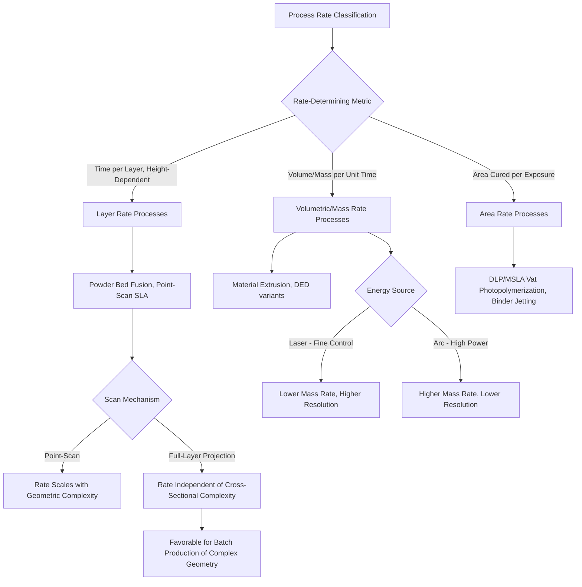

## Classification by Cycle Time and Production Rate

### Definition and Scope

Classification by cycle time and production rate organizes additive manufacturing processes according to how quickly they convert feedstock into finished (or near-finished) geometry, spanning per-build cycle time, volumetric/mass deposition rate, and the relationship between build rate and achievable resolution. This framework is closely coupled to several other classification axes covered in this chapter — capital intensity, achievable tolerance, and job-shop/batch/mass-production positioning — since production rate is frequently the limiting factor determining which volume/variety region of the market a given process can economically serve.

### Classification by Rate-Determining Metric

**Linear/Layer Rate (Time per Layer or Vertical Build Speed)**

Most relevant for Vat Photopolymerization and Powder Bed Fusion processes, where build time is dominated by the number of layers and time-per-layer (scan time plus recoat/reposition time), largely independent of the part's overall mass.

**Volumetric Deposition Rate (Volume/Mass per Unit Time)**

Most relevant for Directed Energy Deposition and Material Extrusion processes, where build time is dominated by the total volume or mass of material that must be deposited, expressed typically in cm³/hr or kg/hr, largely independent of the specific geometric complexity (within reasonable bounds).

**Area Rate (Area Cured/Fused per Unit Time)**

Most relevant for processes using projection-based or parallel exposure mechanisms (DLP, MSLA/LCD Vat Photopolymerization), where an entire layer cross-section is cured simultaneously regardless of its geometric complexity, making build time primarily a function of layer count and height rather than cross-sectional area or feature density.

### Comparison Table by Process Category

| Process Category | Rate Metric | Typical Rate Range | Rate-Limiting Factor |
| --- | --- | --- | --- |
| Laser Powder Bed Fusion | Volumetric (scan-limited) | 5–20 cm³/hr | Laser scan speed, layer thickness, hatch spacing |
| DLP/MSLA Vat Photopolymerization | Layer rate (area-independent) | Seconds per layer | Layer cure time, part height (layer count) |
| Point-Scan SLA | Area rate (scan-limited) | Slower than DLP for complex cross-sections | Laser spot scan speed, cross-sectional area/complexity |
| Material Extrusion (FDM) | Volumetric | 10–100 cm³/hr | Nozzle diameter, extrusion speed, layer height |
| Laser-DED (powder) | Mass rate | 0.1–1 kg/hr | Powder feed rate, laser power, melt pool stability |
| Wire Arc AM (WAAM) | Mass rate | 1–10+ kg/hr | Wire feed rate, arc power, thermal management |
| Binder Jetting | Layer rate (area-independent) | Fast per layer, batch-scalable | Printhead pass speed, layer spreading time |

### The Rate-Resolution Trade-Off

A consistent pattern across AM process classification — already observed in DED energy-source classification and achievable-tolerance classification — is that **production rate and dimensional resolution trade off against each other** within most process families:

$$R \propto \frac{1}{\tau_{res}}$$

Where $R$ represents production rate and $\tau_{res}$ represents a resolution-related time constant (finer beam spot requires more scan passes per unit area; finer powder layers require more layers per unit height; slower, more controlled deposition reduces thermal distortion but reduces mass throughput). This relationship explains why no single AM process dominates across both extremes of the rate-resolution spectrum simultaneously, and why process selection frequently requires explicit trade-off analysis between the two.

### Parallel Exposure as a Rate-Resolution Trade-Off Exception

**DLP and MSLA/LCD-based Vat Photopolymerization** partially break the rate-resolution trade-off pattern by curing an entire layer cross-section simultaneously via projected light, rather than scanning point-by-point — meaning build time becomes primarily a function of part height (layer count) rather than cross-sectional geometric complexity or feature density. This is a key reason parallel-exposure vat photopolymerization has gained adoption for batch production of geometrically complex, moderate-precision parts (e.g., dental aligners), where point-scanning SLA's rate would scale unfavorably with feature density.

### Classification Diagram

### Rate vs. Resolution Trade-Off (SVG)

<svg xmlns="http://www.w3.org/2000/svg" viewBox="0 0 600 300">
<text x="300" y="25" font-size="16" font-weight="bold" text-anchor="middle" fill="#222">Production Rate vs. Resolution Trade-off (svg_diagram)</text>
<line x1="80" y1="260" x2="550" y2="260" stroke="#333" stroke-width="2" />
<line x1="80" y1="260" x2="80" y2="50" stroke="#333" stroke-width="2" />
<text x="300" y="285" font-size="12" text-anchor="middle" fill="#333">Production Rate →</text>
<text x="35" y="160" font-size="12" text-anchor="middle" fill="#333" transform="rotate(-90 35 160)">Resolution →</text>
<path d="M 120 80 Q 300 150 520 240" fill="none" stroke="#4a90d9" stroke-width="2" stroke-dasharray="5,3" />
<circle cx="140" cy="90" r="9" fill="#2ecc71" />
<text x="140" y="72" font-size="9" text-anchor="middle" fill="#1e8449">Two-Photon</text>
<circle cx="230" cy="130" r="9" fill="#4a90d9" />
<text x="230" y="112" font-size="9" text-anchor="middle" fill="#2a5f8f">Point-Scan SLA</text>
<circle cx="330" cy="170" r="9" fill="#9b59b6" />
<text x="330" y="152" font-size="9" text-anchor="middle" fill="#6c3483">DLP/MSLA</text>
<circle cx="420" cy="210" r="9" fill="#f39c12" />
<text x="420" y="192" font-size="9" text-anchor="middle" fill="#a86a0a">Laser-DED</text>
<circle cx="500" cy="240" r="9" fill="#e74c3c" />
<text x="500" y="222" font-size="9" text-anchor="middle" fill="#a93226">WAAM</text>
</svg>

### Key Points

- The choice of **rate metric itself** (layer rate, volumetric rate, or area rate) depends on the underlying process mechanism, and comparing processes fairly requires converting to a common basis (e.g., part-specific build-time estimates) rather than comparing raw published rate figures across different metric types.
- **Parallel-exposure vat photopolymerization (DLP/MSLA)** represents a structurally important exception to the general rate-resolution trade-off, since build time depends primarily on part height rather than cross-sectional complexity — directly enabling its adoption in batch/mass-customization contexts like dental aligner production, as referenced in this chapter's production-quantity classification.
- The rate-resolution trade-off observed here is the same underlying pattern seen in DED energy-source classification (laser vs. arc) and achievable-tolerance classification, confirming this as a **recurring structural characteristic across AM broadly**, not an isolated feature of any single process category.
- Metal AM mass deposition rates (DED, particularly WAAM) remain **substantially higher** than polymer volumetric rates in absolute mass-per-hour terms for large parts, but this comparison must account for the different density and cost structures of metal versus polymer feedstock when evaluating actual production economics.
- [Unverified] Specific rate figures cited for any process are highly dependent on machine model, material, part geometry, and process parameter settings; the ranges provided represent general industry-typical figures for comparative classification purposes and should be verified against current manufacturer specifications for production planning.

### Example

Selecting a process for producing 500 units/day of a moderately complex dental aligner mold pattern: **DLP-based Vat Photopolymerization** would be favored over point-scan SLA specifically because DLP's per-layer cure time is independent of the pattern's cross-sectional complexity, allowing consistent, predictable batch cycle times regardless of how intricate each individual aligner geometry is — directly illustrating how the area-rate classification and parallel-exposure rate-resolution exception translate into practical high-throughput batch production capability.

### Related Topics

- Directed energy deposition classification (energy source rate trade-offs)
- Classification by achievable tolerance and dimensional capability
- Classification by capital intensity and tooling investment
- Discrete versus continuous manufacturing classification
- Job-shop, batch, and mass-production classification
- Vat photopolymerization process variants (SLA, DLP, CLIP, LCD/MSLA)