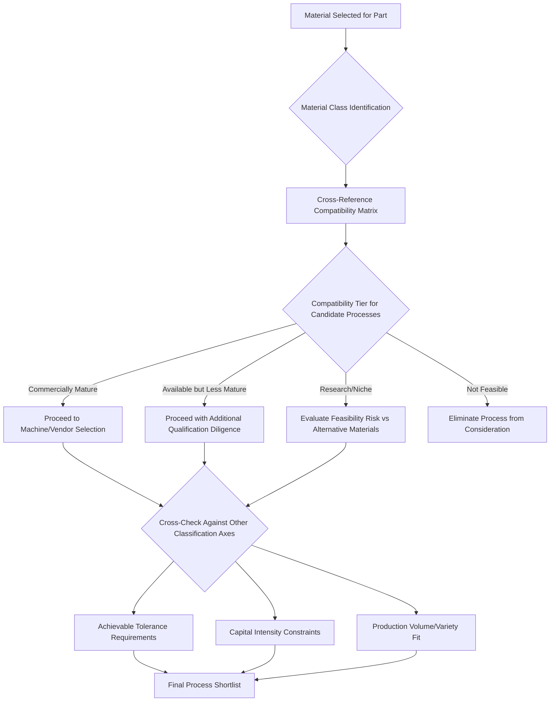

## Material-Process Compatibility Matrices

### Definition and Scope

Material-process compatibility matrices are structured decision tools that map material classes (polymers, metals, ceramics, composites, and specialty materials) against the seven ISO/ASTM 52900 additive manufacturing process categories, indicating which combinations are technically feasible, commercially mature, or infeasible given fundamental physical constraints. These matrices synthesize the classification frameworks covered throughout this chapter — feedstock form, energy source, achievable tolerance, and capital intensity — into a practical, cross-referenced selection tool used at the earliest stage of process selection, before narrowing to specific machine or vendor considerations.

### Matrix Structure and Compatibility Levels

Compatibility matrices typically classify each material-process combination into one of several feasibility tiers:

**Commercially Mature**

Well-established, widely available commercial systems and qualified material feedstocks exist; the combination has substantial production track record and standardized process parameters.

**Commercially Available but Less Mature**

Systems and materials exist commercially but with fewer vendors, less-standardized process parameters, or more limited material property/qualification data compared to mature combinations.

**Technically Feasible, Primarily Research/Niche**

Physical feasibility has been demonstrated (in literature or limited commercial offerings) but the combination lacks broad commercial infrastructure, standardized feedstock, or production-scale process control.

**Not Feasible / Fundamentally Incompatible**

The combination violates a fundamental physical or chemical constraint of the process mechanism (e.g., a photopolymerizable resin cannot exist as the feedstock for a process requiring loose, flowable powder).

### Core Compatibility Matrix

| Material Class | Vat Photopolymerization | Powder Bed Fusion | Material Extrusion | Material Jetting | Binder Jetting | Sheet Lamination | Directed Energy Deposition |
| --- | --- | --- | --- | --- | --- | --- | --- |
| Thermoplastics | Not Feasible | Mature (SLS) | Mature | Mature | Feasible (indirect) | Feasible (niche) | Not Feasible |
| Photopolymer Resins | Mature | Not Feasible | Not Feasible | Mature | Not Feasible | Not Feasible | Not Feasible |
| Metals | Not Feasible | Mature (LPBF/EBM) | Niche (metal-filled filament, indirect) | Niche (emerging) | Mature | Mature (UAM) | Mature |
| Ceramics | Feasible (loaded resin) | Niche | Niche (paste extrusion) | Niche | Mature | Niche | Niche |
| Composites (fiber-reinforced) | Feasible (short-fiber loaded) | Niche | Mature (continuous/chopped fiber) | Niche | Not typical | Mature (UAM metal-composite) | Niche |
| Sand (foundry) | Not Feasible | Not Feasible | Not Feasible | Not Feasible | Mature | Not Feasible | Not Feasible |
| Bio-inks/Cells | Feasible (bioprinting variant) | Not Feasible | Feasible (bioprinting variant) | Feasible (bioprinting variant) | Not Feasible | Not Feasible | Not Feasible |

### Physical Constraints Driving Infeasibility

**Feedstock Form Incompatibility**

A process category's fundamental feedstock-form requirement (liquid resin, loose powder, continuous filament/wire, or sheet) directly excludes materials that cannot physically exist in that form — sand cannot be formulated as a photocurable resin, and most thermoset photopolymer chemistries cannot be reformulated as a fusible loose powder for Powder Bed Fusion.

**Energy Source-Material Interaction Incompatibility**

Some material-energy source pairings are physically infeasible regardless of feedstock form — for example, materials lacking sufficient laser absorption at available wavelengths cannot be reliably processed via laser-based melting, and materials that decompose before reaching a usable melt state cannot be processed via any melt-based mechanism.

**Chemical/Thermal Process Incompatibility**

Binder Jetting's post-process sintering step is incompatible with materials that cannot achieve adequate densification via solid-state or liquid-phase sintering, limiting the practically qualified material set even where the jetting/green-part-formation step itself would be technically feasible.

### Matrix Application Diagram

### Compatibility Matrix Heatmap Concept (SVG)

<svg xmlns="http://www.w3.org/2000/svg" viewBox="0 0 600 280">
<text x="300" y="25" font-size="16" font-weight="bold" text-anchor="middle" fill="#222">Material-Process Compatibility Heatmap (svg_diagram)</text>
<text x="150" y="50" font-size="10" text-anchor="middle" fill="#333">Vat Photo</text>
<text x="280" y="50" font-size="10" text-anchor="middle" fill="#333">Powder Bed</text>
<text x="410" y="50" font-size="10" text-anchor="middle" fill="#333">Binder Jet</text>
<text x="530" y="50" font-size="10" text-anchor="middle" fill="#333">DED</text>
<text x="60" y="90" font-size="10" text-anchor="end" fill="#333">Polymer</text>
<rect x="110" y="70" width="70" height="35" fill="#2ecc71" />
<rect x="240" y="70" width="70" height="35" fill="#2ecc71" />
<rect x="370" y="70" width="70" height="35" fill="#f39c12" />
<rect x="490" y="70" width="70" height="35" fill="#e74c3c" />
<text x="60" y="140" font-size="10" text-anchor="end" fill="#333">Metal</text>
<rect x="110" y="120" width="70" height="35" fill="#e74c3c" />
<rect x="240" y="120" width="70" height="35" fill="#2ecc71" />
<rect x="370" y="120" width="70" height="35" fill="#2ecc71" />
<rect x="490" y="120" width="70" height="35" fill="#2ecc71" />
<text x="60" y="190" font-size="10" text-anchor="end" fill="#333">Ceramic</text>
<rect x="110" y="170" width="70" height="35" fill="#f39c12" />
<rect x="240" y="170" width="70" height="35" fill="#e67e22" />
<rect x="370" y="170" width="70" height="35" fill="#2ecc71" />
<rect x="490" y="170" width="70" height="35" fill="#e67e22" />
<text x="60" y="240" font-size="10" text-anchor="end" fill="#333">Sand</text>
<rect x="110" y="220" width="70" height="35" fill="#e74c3c" />
<rect x="240" y="220" width="70" height="35" fill="#e74c3c" />
<rect x="370" y="220" width="70" height="35" fill="#2ecc71" />
<rect x="490" y="220" width="70" height="35" fill="#e74c3c" />
</svg>

### Key Points

- Compatibility matrices synthesize **feedstock form and energy source classification** (covered earlier in this chapter) into a practical decision tool, since the underlying reason for most infeasibility cells traces directly back to a feedstock-form or energy-source-material physical incompatibility.
- The distinction between **"not feasible"** and **"technically feasible but immature"** is critical for process selection risk assessment — the former eliminates a process from consideration outright, while the latter signals a combination requiring additional material qualification effort, supplier vetting, or acceptance of higher technical risk.
- **Binder Jetting's broad material compatibility** (metals, ceramics, sand, and some polymers) relative to melt-based processes stems directly from its decoupling of shape-formation (binder deposition) from densification (separate sintering step), avoiding the material-specific melt-behavior constraints that limit laser- and beam-based processes.
- Compatibility matrices should be treated as a **first-pass filter**, not a final selection tool — a "commercially mature" combination still requires cross-referencing against the achievable-tolerance, capital-intensity, and production-volume classification axes covered elsewhere in this chapter before final process selection.
- [Inference] As material science research for AM continues to mature, some currently "niche/research" cells in compatibility matrices are likely to migrate toward "commercially available," following the historical pattern observed in metal Powder Bed Fusion's maturation from research-stage to production-qualified status over the preceding decades — though the pace of this migration varies substantially by material class and application-driven investment.

### Example

Selecting a process for a ceramic component requiring complex internal channels: cross-referencing the compatibility matrix shows **Binder Jetting** as commercially mature for ceramics (via green-part jetting followed by sintering), while Vat Photopolymerization with ceramic-loaded resin is feasible but less mature, and Powder Bed Fusion for ceramics remains largely niche/research due to thermal shock cracking challenges during laser processing — directing the selection process toward Binder Jetting as the lowest-risk starting point, subject to further evaluation against the part's specific tolerance and production volume requirements.

### Related Topics

- Classification by feedstock form and energy source
- Classification by achievable tolerance and dimensional capability
- Classification by capital intensity and tooling investment
- Boundary cases outside the seven categories (bioprinting material compatibility)
- Powder characterization and qualification for metal and ceramic AM
- Post-process sintering requirements for binder jetting material systems