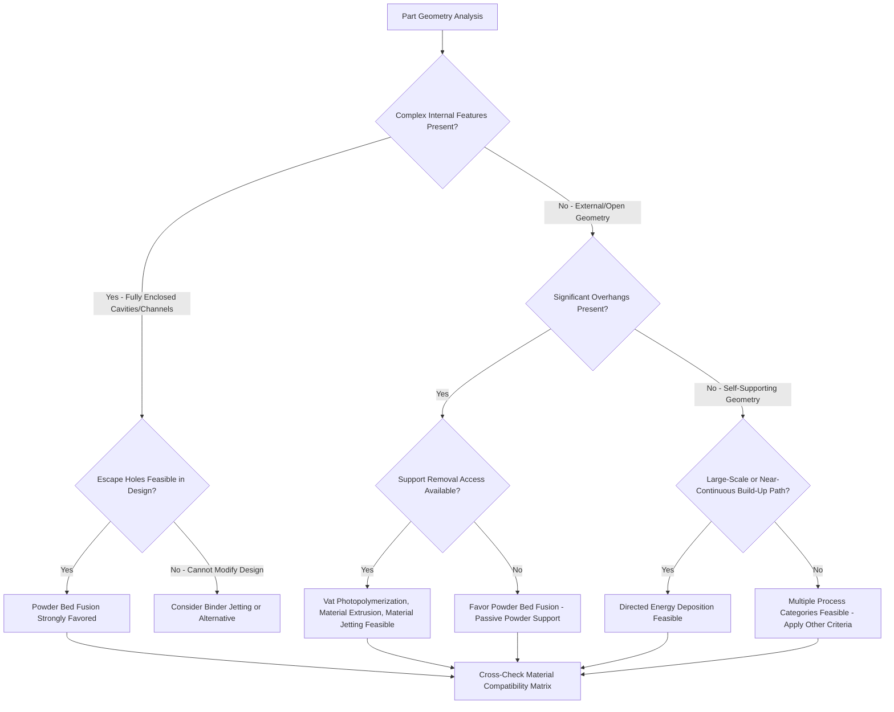

## Process-Selection Charts by Shape and Feature Complexity

### Definition and Scope

Process-selection charts by shape and feature complexity are decision tools that map part geometry characteristics — overall size, aspect ratio, internal feature complexity (channels, lattices, undercuts), overhang requirements, and wall thickness — against the seven ISO/ASTM 52900 process categories to identify which processes can physically realize a given geometry, independent of material considerations. This framework complements material-process compatibility matrices: where a material matrix answers "can this material be processed by this mechanism," a shape/complexity chart answers "can this geometry be realized by this mechanism," and both filters are typically applied together during process selection.

### Classification by Support Structure Dependency

**Support-Free Processes (for most geometries)**

Powder Bed Fusion (both laser and electron beam variants) uses the surrounding unfused powder bed itself as passive support for overhangs and internal cavities, substantially reducing or eliminating the need for dedicated support structures compared to processes building into open air or liquid.

**Support-Dependent Processes**

Vat Photopolymerization, Material Extrusion, and Material Jetting generally require explicit, dedicated support structures for overhangs beyond a self-supporting angle threshold (commonly cited around 45° from vertical, though highly process- and material-dependent), since these processes build into open air or liquid resin without a surrounding solid medium to passively support unfused/uncured material.

**Support-Free by Design Constraint (DED)**

Directed Energy Deposition processes generally cannot produce significant unsupported overhangs at all (rather than using supports to enable them), since the melt pool requires an existing solid surface immediately beneath the deposition point — DED geometries must therefore be designed with self-supporting, quasi-continuous build-up paths rather than relying on either passive powder-bed support or dedicated support structures.

### Classification by Internal Feature Accessibility

**Fully Enclosed Internal Channels/Cavities (Achievable)**

Powder Bed Fusion excels at fully enclosed internal geometry (conformal cooling channels, internal lattices, hollow cavities) since unfused powder within enclosed cavities can typically be removed through small escape holes after the build, without requiring the cavity to be accessible during the build itself.

**Internal Features Requiring Post-Build Access (Constrained)**

Vat Photopolymerization and Material Jetting can produce enclosed internal cavities, but uncured resin trapped within fully enclosed cavities can be difficult or impossible to fully drain and post-cure, often necessitating escape holes or partial-enclosure design modifications.

**Internal Features Generally Inaccessible (DED, Sheet Lamination)**

Directed Energy Deposition cannot produce fully enclosed internal cavities in a single continuous build (the deposition head requires line-of-sight access to the current build surface), making DED unsuitable for parts with complex fully-internal geometry unless combined with hybrid machining (as covered under hybrid manufacturing classification) to access internal features between deposition phases.

### Classification by Minimum Feature Size and Wall Thickness

| Process Category | Minimum Wall Thickness (typical) | Minimum Unsupported Feature | Internal Channel Capability |
| --- | --- | --- | --- |
| Vat Photopolymerization | 0.3–0.5 mm | 0.2–0.5 mm | Moderate (drainage required) |
| Powder Bed Fusion | 0.3–0.8 mm | 0.3–0.5 mm (self-supporting angle dependent) | Excellent (powder removable via escape holes) |
| Material Extrusion | 0.8–1.5 mm | Nozzle-diameter dependent | Limited (support removal access needed) |
| Material Jetting | 0.3–0.6 mm | 0.3–0.5 mm | Moderate (support removal access needed) |
| Binder Jetting | 0.4–1.0 mm | 0.4–0.6 mm | Good (loose powder removable) |
| Sheet Lamination | 1–3 mm | Cutting-tool dependent | Poor (laminate bonding limits internal access) |
| Directed Energy Deposition | 1–5 mm | Not applicable (no unsupported overhangs) | Poor (line-of-sight deposition constraint) |

### Process Selection Diagram

### Geometry-Process Compatibility Schematic (SVG)

<svg xmlns="http://www.w3.org/2000/svg" viewBox="0 0 600 280">
<text x="300" y="25" font-size="16" font-weight="bold" text-anchor="middle" fill="#222">Overhang and Internal Feature Handling (svg_diagram)</text>
<text x="130" y="55" font-size="12" text-anchor="middle" fill="#2a5f8f" font-weight="bold">Powder Bed Fusion</text>
<rect x="60" y="70" width="140" height="90" fill="#d5d5d5" stroke="#333" stroke-width="1" />
<rect x="100" y="90" width="60" height="30" fill="#4a90d9" stroke="#2a5f8f" />
<text x="130" y="150" font-size="9" text-anchor="middle" fill="#333">Powder = Passive Support</text>
<text x="450" y="55" font-size="12" text-anchor="middle" fill="#a93226" font-weight="bold">Directed Energy Deposition</text>
<rect x="400" y="130" width="100" height="30" fill="#e67e22" stroke="#b35a0f" />
<line x1="450" y1="130" x2="450" y2="90" stroke="#e74c3c" stroke-width="3" stroke-dasharray="3,3" />
<text x="450" y="80" font-size="9" text-anchor="middle" fill="#a93226">No Overhang Possible</text>
<text x="450" y="165" font-size="9" text-anchor="middle" fill="#333">Requires Solid Base Beneath</text>
</svg>

### Key Points

- **Powder Bed Fusion's passive powder-bed support** is its single most distinctive geometric advantage over other AM process categories, enabling both complex overhangs and fully enclosed internal features without dedicated support structures — a capability directly tied to its feedstock-form classification (loose powder bed) covered earlier in this chapter.
- **Directed Energy Deposition's line-of-sight deposition constraint** fundamentally limits it to geometries with continuous, self-supporting build-up paths, making it structurally unsuitable for complex internal features regardless of material compatibility — this constraint is independent of, and generally more restrictive than, its already-coarser achievable-tolerance classification.
- Support-dependent processes (Vat Photopolymerization, Material Extrusion, Material Jetting) impose a **design-for-removability** constraint on internal features: even geometrically achievable internal cavities may be practically unusable if support material or uncured resin cannot be physically extracted after the build.
- The **escape-hole design pattern** — adding small drainage/powder-removal holes to otherwise fully enclosed internal cavities — is a common design-for-additive-manufacturing (DfAM) technique that extends internal feature accessibility across multiple process categories, effectively shifting geometry from the "generally inaccessible" to "achievable" tier through minor design modification rather than process substitution.
- [Inference] Shape/complexity-driven process selection and material-driven process selection frequently produce competing recommendations for a given part (e.g., a geometry favoring Powder Bed Fusion but a material favoring Material Extrusion), requiring explicit trade-off resolution — in practice, geometric feasibility constraints are often treated as a harder filter than material preference, since a process that cannot physically realize the required geometry cannot be salvaged by material substitution alone.

### Example

Selecting a process for a heat exchanger component with complex internal conformal cooling channels and moderate external overhangs: **Laser Powder Bed Fusion** would be strongly favored specifically due to its geometric capability profile — the surrounding powder bed passively supports both the internal channel geometry and the external overhangs simultaneously, with unfused powder removable through small designed escape holes after the build — whereas Directed Energy Deposition would be eliminated early in the selection process due to its fundamental inability to produce the enclosed internal channel geometry, regardless of the component's metal-material compatibility with DED.

### Related Topics

- Material-process compatibility matrices
- Classification by achievable tolerance and dimensional capability
- Directed energy deposition classification
- Powder Bed Fusion classification (LPBF, EBM)
- Design for Additive Manufacturing (DfAM) principles
- Support structure design and removal strategies across AM process categories