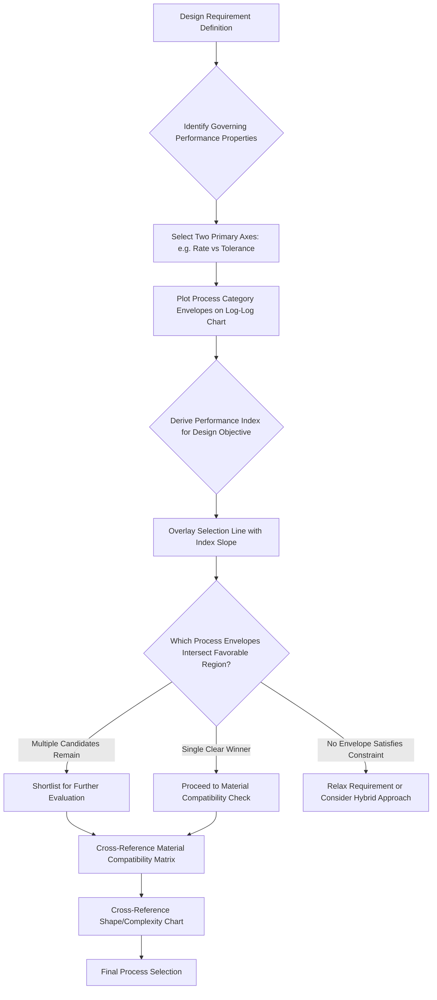

## Ashby-Style Material and Process Selection Charts

### Definition and Scope

Ashby-style selection charts are graphical, multi-property comparison tools — originating from Michael Ashby's materials selection methodology in mechanical engineering — that plot two (or more, via bubble size/color) quantitative performance properties against each other on logarithmic axes, allowing designers to visually identify materials or processes that best satisfy a combination of performance criteria simultaneously. Applied to additive manufacturing process classification, Ashby-style charts extend beyond simple compatibility matrices (which use discrete feasibility tiers) by plotting continuous, quantitative process attributes — enabling identification of Pareto-optimal process choices and explicit visualization of the trade-off relationships (rate-resolution, cost-volume) established elsewhere in this chapter.

### Core Methodology

**Property Axes Selection**

Charts plot two performance metrics relevant to the design decision at hand — commonly build rate versus achievable tolerance, capital cost versus production volume, or material property attainable (strength, density) versus process cost — using logarithmic scales to accommodate the wide orders-of-magnitude range typical of AM process attributes.

**Process Envelopes**

Rather than plotting single points, each process category is represented as an **envelope** (a bounded region, often an ellipse or polygon) capturing the range of achievable performance across different machines, parameters, and materials within that process category — reflecting that a single process category (e.g., Powder Bed Fusion) spans a range of achievable rates and tolerances depending on specific parameter selection, not a single fixed value.

**Selection Lines and Indices**

For a given design requirement expressed as a performance index (e.g., "minimize build time subject to tolerance ≤ X"), a selection line can be overlaid on the chart, and all process envelopes intersecting the favorable side of that line become candidates, while those falling entirely on the unfavorable side are eliminated.

### Applying Ashby Methodology to AM Process Selection

**Chart 1: Build Rate vs. Achievable Tolerance**

Directly visualizes the rate-resolution trade-off established under cycle-time classification, plotting each process category as an envelope spanning its typical rate range against its typical tolerance range, with DLP/MSLA highlighted as a partial outlier (better tolerance-to-rate ratio for complex geometries due to parallel exposure) as discussed in that section.

**Chart 2: Capital Cost vs. Production Volume Break-Even**

Visualizes the capital-intensity classification against volume/variety classification, showing each process category's envelope of typical capital investment plotted against the production volume range where that investment becomes economically justified relative to conventional manufacturing alternatives.

**Chart 3: Achievable Mechanical Property vs. Process Cost**

Plots material property attainment (e.g., relative density, tensile strength as percentage of wrought equivalent) against per-part process cost, useful for end-use functional part selection where mechanical performance is a primary design driver rather than geometric complexity or speed.

### Selection Index Derivation

For a design objective combining two properties, a performance index $M$ can be derived to identify the process that maximizes (or minimizes) a combined objective. For example, minimizing total build time subject to a maximum tolerance constraint:

$$M = \frac{R}{\tau^{n}}$$

Where $R$ is build rate, $\tau$ is achievable tolerance, and $n$ is an exponent reflecting the relative sensitivity of the design objective to tolerance versus rate (derived from the specific part's functional requirements) — processes are then ranked by $M$, with guide lines of slope $n$ drawn on the log-log rate-tolerance chart to visually identify the optimal process envelope.

### Selection Chart Diagram

### Ashby Chart Concept (SVG)

<svg xmlns="http://www.w3.org/2000/svg" viewBox="0 0 600 320">
<text x="300" y="25" font-size="16" font-weight="bold" text-anchor="middle" fill="#222">Build Rate vs. Tolerance: Process Envelopes (svg_diagram)</text>
<line x1="80" y1="270" x2="550" y2="270" stroke="#333" stroke-width="2" />
<line x1="80" y1="270" x2="80" y2="50" stroke="#333" stroke-width="2" />
<text x="300" y="300" font-size="12" text-anchor="middle" fill="#333">Achievable Tolerance (log scale) →</text>
<text x="35" y="160" font-size="12" text-anchor="middle" fill="#333" transform="rotate(-90 35 160)">Build Rate (log scale) →</text>
<ellipse cx="150" cy="220" rx="55" ry="35" fill="#4a90d9" fill-opacity="0.35" stroke="#2a5f8f" stroke-width="1.5" />
<text x="150" y="225" font-size="10" text-anchor="middle" fill="#2a5f8f" font-weight="bold">Vat Photo</text>
<ellipse cx="260" cy="180" rx="60" ry="40" fill="#2ecc71" fill-opacity="0.35" stroke="#1e8449" stroke-width="1.5" />
<text x="260" y="185" font-size="10" text-anchor="middle" fill="#1e8449" font-weight="bold">Powder Bed Fusion</text>
<ellipse cx="380" cy="130" rx="65" ry="35" fill="#f39c12" fill-opacity="0.35" stroke="#a86a0a" stroke-width="1.5" />
<text x="380" y="135" font-size="10" text-anchor="middle" fill="#a86a0a" font-weight="bold">Laser-DED</text>
<ellipse cx="480" cy="80" rx="55" ry="30" fill="#e74c3c" fill-opacity="0.35" stroke="#a93226" stroke-width="1.5" />
<text x="480" y="85" font-size="10" text-anchor="middle" fill="#a93226" font-weight="bold">WAAM</text>
<line x1="100" y1="260" x2="500" y2="90" stroke="#333" stroke-width="1.5" stroke-dasharray="6,3" />
<text x="420" y="105" font-size="9" fill="#555">Selection Line (slope = n)</text>
</svg>

### Key Points

- Ashby-style charts **extend rather than replace** the compatibility matrix and shape/complexity chart frameworks covered elsewhere in this chapter, adding quantitative, continuous trade-off visualization on top of the discrete feasibility filtering those tools provide.
- **Process envelopes rather than single points** are essential to accurate representation, since a single process category (Powder Bed Fusion, for instance) spans a meaningful range of achievable rate and tolerance combinations depending on scan strategy, layer thickness, and material — collapsing this range to a single point would misrepresent genuine within-category flexibility.
- The **selection index and slope-line methodology** (adapted directly from classical Ashby materials selection theory) provides a principled, quantitative way to resolve trade-offs between competing performance requirements, rather than relying on qualitative judgment alone when comparing processes with genuinely different rate-tolerance profiles.
- Multiple charts addressing **different property pairs** (rate-tolerance, cost-volume, mechanical property-cost) are typically needed for comprehensive process selection, since no single two-axis chart captures all relevant decision criteria simultaneously — this mirrors classical Ashby materials selection practice, where designers commonly cascade through several charts addressing different constraint pairs.
- [Inference] Because specific numeric process envelope boundaries shift as machine technology improves, Ashby-style AM selection charts require periodic recalibration against current process capability data; a chart constructed from data several years old may understate current achievable performance, particularly for rapidly-improving process categories such as metal Powder Bed Fusion.

### Example

Selecting between Laser-PBF and WAAM for a large titanium structural component using a rate-tolerance Ashby chart: plotting both process envelopes reveals WAAM's substantially higher build rate but coarser tolerance envelope, while Laser-PBF offers finer tolerance but lower rate; applying a selection index weighted toward the part's actual functional requirement (moderate tolerance sufficient after planned machining, large mass requiring high deposition rate) would draw a selection line favoring the WAAM envelope — directly illustrating how the Ashby methodology converts a qualitative "faster vs. more precise" trade-off discussion into a quantitative, visually explicit selection decision.

### Related Topics

- Material-process compatibility matrices
- Process-selection charts by shape and feature complexity
- Classification by cycle time and production rate
- Classification by achievable tolerance and dimensional capability
- Classification by capital intensity and tooling investment
- Directed energy deposition classification (WAAM vs. laser-DED trade-offs)