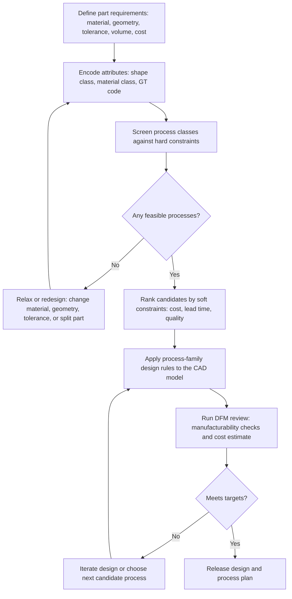

## Design-for-Manufacturing Use of Classification Systems

Design-for-manufacturing (DFM) uses classification systems to translate a part's geometry, material, tolerance, volume, and cost requirements into a shortlist of feasible manufacturing processes, and then to feed process-specific design rules back into the design itself. Classification is the bridge between *what the designer wants* and *what a process can economically deliver*. Applied early, it prevents the expensive pattern of designing a part first and discovering later that no efficient process can make it.

### Purpose and Scope

Manufacturing process classifications organize processes by shared attributes such as how material is shaped, what the material state is during shaping, and what geometry and accuracy result. DFM exploits these attributes in three ways:

1. **Process selection**: match part attributes to process capabilities, eliminating infeasible options.
2. **Design rule application**: once a process family is chosen, apply that family's geometric, tolerance, and material constraints.
3. **Design communication**: give designers, process engineers, and suppliers a shared vocabulary for negotiating trade-offs.

**Key Points**

- Classification narrows a very large process space (hundreds of processes) to a few candidates before detailed costing.
- The earlier in the design cycle classification is applied, the cheaper the resulting design changes. A commonly cited heuristic is that most of a product's manufacturing cost is committed during early design, though the exact percentage varies by source and industry [Inference].
- Classification does not replace detailed process planning; it provides a screening layer.
- Classification results depend on the taxonomy used and on the quality of the input attributes, so outputs should be treated as candidate lists, not final decisions.

### Classification Systems Relevant to DFM

DFM practitioners draw on several types of classification, each answering a different question.

| Classification Type | Organizing Principle | DFM Question Answered |
| --- | --- | --- |
| Process-mechanism (shaping) classification | Casting, forming, machining, joining, additive, etc. | Which family of process can create this shape? |
| Material-state classification | Liquid, solid (plastic), solid (elastic), powder, sheet | Which processes are compatible with this material state and material class? |
| Group technology (GT) part-family coding | Geometry, dimensions, material, features encoded as code digits | Which existing parts and processes resemble this new part? |
| Process-material compatibility matrices | Rows = processes, columns = materials | Can this process handle this alloy/polymer/ceramic? |
| Process-shape compatibility matrices | Shape classes (prismatic, axisymmetric, thin-walled, hollow) | Can this process produce this geometry class? |
| Process-attribute charts | Tolerance, surface finish, size, rate, cost | Does the process meet accuracy, finish, and volume needs? |
| Cost-model classification | Setup-dominated vs. cycle-time-dominated vs. tooling-dominated | Which process is cheapest at this batch size? |

Common reference taxonomies include the ISO/DIN-style process groupings (for example, DIN 8580 groups manufacturing processes into main groups such as primary shaping, forming, separating, joining, coating, and changing material properties), and the process-selection approaches popularized in engineering design texts, such as Ashby-style material-and-process selection charts and Boothroyd-Dewhurst DFM/DFA methods.

### Attribute-Driven Screening

The core DFM use of classification is **attribute matching**. Part requirements are expressed as attributes, and each process class carries a capability range for the same attributes.

**Typical screening attributes**

- **Material class**: metal (ferrous/non-ferrous), thermoplastic, thermoset, elastomer, ceramic, composite
- **Shape class**: prismatic, axisymmetric (rotational), thin-walled/sheet, hollow/re-entrant, long/slender, freeform
- **Size and mass**: envelope dimensions, weight
- **Feature complexity**: undercuts, internal cavities, thin ribs, fine textures
- **Tolerance and surface finish**: dimensional tolerance band, roughness $R_a$
- **Production volume**: prototype, low, medium, high
- **Cost and lead-time targets**

**Screening logic**

A process $P_j$ is considered feasible for a part $i$ if every required attribute falls inside that process's capability range:

$$\text{Feasible}(P_j, i) = \bigwedge_{k=1}^{n} \left[ a_{ik} \in C_{jk} \right]$$

where $a_{ik}$ is part $i$'s value for attribute $k$ and $C_{jk}$ is process $j$'s capability range for attribute $k$.

In practice, hard constraints (material compatibility, size limits) act as eliminators, while soft constraints (cost, lead time) are used for ranking.

**Example**

A designer needs an aluminum housing, about 120 mm × 80 mm × 40 mm, with internal ribs, a wall thickness of 2.5 mm, a tolerance of ±0.1 mm on mounting faces, and a volume of 50,000 units per year.

| Process Candidate | Material OK? | Geometry OK? | Tolerance OK (±0.1 mm)? | Volume Economic? | Result |
| --- | --- | --- | --- | --- | --- |
| Sand casting | Yes | Yes | No (as-cast tolerances are typically coarser) | No (low rate) | Eliminated |
| High-pressure die casting | Yes | Yes (thin walls, ribs) | Mounting faces need machining | Yes | **Candidate** |
| CNC machining from billet | Yes | Yes | Yes | No (high per-part cost) | Eliminated at this volume |
| Extrusion + machining | Yes | Only if profile is constant-section | Partial | Yes | Conditional |
| Sheet metal forming | Yes | No (ribbed 3D housing) | Partial | Yes | Eliminated |
| Metal 3D printing | Yes | Yes | No (needs post-machining) | No | Eliminated at this volume |

**Output**

The screening yields a primary candidate (die casting with secondary machining of mounting faces) and a conditional alternative (extrusion plus machining if the geometry can be made constant-section).

### Group Technology Coding in DFM

Group technology assigns each part a code describing its geometry, features, dimensions, material, and accuracy. DFM uses GT in several ways:

- **Design retrieval**: before creating a new part, search the coded database for an existing part with a similar code, and reuse or adapt it. This reduces part-number proliferation and reuses proven processes.
- **Process inheritance**: parts in the same family typically share a routing, fixtures, and tooling, so a new part coded into an existing family inherits a validated process plan.
- **Design standardization**: repeated coding reveals near-duplicate parts that can be consolidated.
- **Cell and layout design**: families map naturally to manufacturing cells.

Coding schemes are generally classed as monocode (hierarchical), polycode (chain-type), or hybrid. Well-known systems include OPITZ, MICLASS, and KK-3; the exact digit meanings differ by system and version.

**Example**

A new shaft is coded with an Opitz-style code indicating rotational geometry, length-to-diameter ratio, stepped diameters, and a keyway. A database query returns 14 similar parts. Eleven share a turning-then-milling-then-grinding routing, so the designer chooses a keyway width and diameter steps already covered by existing tooling and gauges.

### Process-Family Design Rules

Once a process family is selected, its classification provides the design rules. Each family has characteristic constraints.

#### Casting Family

- Uniform wall thickness to avoid shrinkage defects and hot spots
- Draft angles for pattern or die release
- Generous fillets and radii to reduce stress concentration and improve flow
- Avoid isolated heavy sections; design for directional solidification
- Allow machining stock on critical surfaces

#### Bulk Deformation (Forging, Extrusion, Rolling)

- Simple parting-line geometry and adequate draft (forging)
- Radii at corners to promote material flow and reduce die wear
- Constant cross-section for extrusion
- Avoid abrupt section changes that cause underfill or laps

#### Sheet Metal Forming

- Minimum bend radius tied to material thickness and ductility
- Hole-to-edge and hole-to-bend distances to prevent distortion
- Flat-pattern nesting efficiency
- Relief cuts at bends and corners

#### Polymer Molding

- Uniform walls, typically with rib thickness at a fraction of the nominal wall to avoid sink marks
- Draft on all faces parallel to mold opening
- Avoid undercuts or accept the cost of side actions and lifters
- Gate location and weld-line placement considerations

#### Machining (Subtractive)

- Tool access for every feature
- Standardized hole sizes, thread sizes, and corner radii that match stock tooling
- Minimize the number of setups by keeping features accessible from few orientations
- Avoid deep narrow pockets and thin unsupported walls

#### Additive Manufacturing

- Support-structure minimization via build orientation and overhang limits
- Minimum feature size and wall thickness dependent on the technology
- Powder or resin removal paths for internal cavities
- Accounting for anisotropy and post-processing needs

#### Joining and Assembly

- Weld accessibility and joint geometry
- Fastener count reduction and part consolidation
- Self-locating features to ease assembly

Exact numerical limits (minimum wall thickness, draft angle, bend radius) vary by material, machine, supplier, and standard, so they should be confirmed against the specific supplier or process capability documentation.

### The DFM Classification Workflow

The following flow shows how classification is embedded in the design process.

### Design-to-Process Feedback Loop

Classification is not a one-way filter. DFM iterates in both directions:

- **Design changes to fit a preferred process**: for example, altering a 3D machined bracket into a sheet-metal bent bracket by simplifying geometry and loosening a tolerance.
- **Process changes to fit a fixed design**: for example, moving from CNC machining to investment casting when volume rises and the geometry cannot change.

**Common design levers that shift a part into a cheaper process class**

| Design Lever | Effect on Process Class |
| --- | --- |
| Loosen non-critical tolerances | Opens near-net-shape processes (casting, molding) instead of machining |
| Consolidate multiple parts into one | Enables molding or casting; removes assembly operations |
| Remove undercuts | Eliminates side actions, simplifies tooling |
| Standardize features | Allows standard tooling and fewer setups |
| Change material class | May shift feasible processes entirely (for example, steel to aluminum enables die casting and extrusion) |
| Split a complex part into simpler parts | May move each piece to a cheaper process, at the cost of assembly |

### Cost-Driven Classification: Volume and Cost Structure

Processes can be classified by how their cost scales with volume, which is central to DFM selection. A simplified per-part cost model is:

$$C_{unit} = \frac{C_{tooling}}{N} + C_{setup,unit} + C_{material} + C_{cycle}$$

where $N$ is the production quantity, $C_{tooling}$ is the up-front tooling cost, and $C_{cycle}$ is the machine and labor cost per part.

| Cost Structure Class | Example Processes | Economic Sweet Spot |
| --- | --- | --- |
| Low tooling, high per-part cost | CNC machining, additive, manual fabrication | Prototype and low volume |
| Moderate tooling, moderate per-part cost | Sand casting, sheet metal (soft tooling), short-run molding | Low to medium volume |
| High tooling, low per-part cost | Die casting, injection molding, stamping, forging | High volume |

The **break-even quantity** between two processes A and B is the point where their total costs are equal:

$$N_{BE} = \frac{C_{tooling,B} - C_{tooling,A}}{C_{var,A} - C_{var,B}}$$

where $C_{var}$ is the variable (per-part) cost, and B is the higher-tooling, lower-variable-cost process.

**Example**

Process A (CNC machining): tooling/fixturing $2,000, variable cost $40 per part.

Process B (injection molding): tooling $30,000, variable cost $4 per part.

$$N_{BE} = \frac{30000 - 2000}{40 - 4} = \frac{28000}{36} \approx 778 \text{ parts}$$

Below roughly 778 parts, machining is cheaper on total cost; above it, molding wins. These numbers are illustrative only, and real break-even analysis must include material, secondary operations, scrap, and lead time.

### Illustration: Volume vs. Process Class

<svg xmlns="http://www.w3.org/2000/svg" viewBox="0 0 640 360" width="640" height="360" font-family="sans-serif" font-size="12">
<title>Process Selection by Volume (svg_diagram)</title>
<text x="320" y="24" text-anchor="middle" font-size="15" font-weight="bold">Typical Process Class by Production Volume (svg_diagram)</text>
<line x1="70" y1="300" x2="600" y2="300" stroke="#333" stroke-width="2" />
<line x1="70" y1="300" x2="70" y2="50" stroke="#333" stroke-width="2" />
<text x="335" y="345" text-anchor="middle">Production Volume (log scale, illustrative)</text>
<text x="20" y="180" text-anchor="middle" transform="rotate(-90 20 180)">Tooling Investment</text>
<rect x="80" y="240" width="140" height="50" fill="#cfe8ff" stroke="#1f5fa8" />
<text x="150" y="262" text-anchor="middle">CNC / Additive</text>
<text x="150" y="278" text-anchor="middle">1 - 100 units</text>
<rect x="230" y="180" width="150" height="110" fill="#d9f2d0" stroke="#3a7d22" />
<text x="305" y="225" text-anchor="middle">Sand Casting / Sheet</text>
<text x="305" y="241" text-anchor="middle">Short-Run Molding</text>
<text x="305" y="257" text-anchor="middle">100 - 10,000 units</text>
<rect x="390" y="70" width="200" height="220" fill="#ffe3c2" stroke="#b5651d" />
<text x="490" y="170" text-anchor="middle">Die Casting / Injection</text>
<text x="490" y="186" text-anchor="middle">Molding / Stamping / Forging</text>
<text x="490" y="202" text-anchor="middle">10,000+ units</text>
<text x="335" y="60" text-anchor="middle" font-size="11" fill="#555">Higher tooling cost, lower per-part cost at high volume</text>
</svg>

### Practical DFM Use Cases

#### Use Case 1: Bracket Redesign Across Process Classes

A machined aluminum L-bracket is reviewed for a production ramp from 200 to 20,000 units.

- Classification screening shows the geometry (two flat legs, a few holes, uniform thickness) fits the sheet-metal family.
- Design change: replace the machined block with a laser-cut and bent sheet bracket, add bend reliefs, and standardize hole diameters.
- Result: fewer operations, lower material waste, cheaper unit cost at volume. Any percentage savings depend on the specific quote and should not be assumed.

#### Use Case 2: Part Consolidation for Molding

An assembly of five machined and fastened components is reclassified as a candidate for injection molding.

- Consolidate into one molded part with integral snap fits and living hinges where material allows.
- Add draft, uniform walls, and remove undercuts.
- Evaluate against the tooling break-even quantity.

#### Use Case 3: Tolerance Relaxation to Enable a Near-Net-Shape Process

A cast component has a blanket ±0.05 mm tolerance that forces full machining. A tolerance audit finds only two faces truly need that accuracy.

- Classification shows the as-cast process can hold coarser tolerances on non-critical surfaces.
- Design change: relax non-critical tolerances and machine only the critical faces.
- Result: reduced machining time and lower cost.

### Tools and Methods That Embed Classification

- **CAD-integrated DFM checkers**: automated rule checks for wall thickness, draft, undercuts, and tool access, typically tied to a chosen process family.
- **Feature recognition**: software identifies features (holes, pockets, ribs) and maps them to process capabilities.
- **Material and process selection software**: chart-based and database-driven screening, commonly built on Ashby-style approaches.
- **PLM and GT databases**: part families, routings, and similarity search for reuse.
- **Should-cost and quoting tools**: cost estimation tied to process classes and volume.
- **Supplier capability databases**: encode each supplier's process classes, tolerances, and capacities for sourcing decisions.

The specific features, accuracy, and licensing of commercial tools vary by vendor and version.

### Limitations and Pitfalls

**Key Points**

- **Taxonomy dependence**: different classification systems can give different candidate lists for the same part.
- **Data quality**: capability ranges published in charts are typical values and may not reflect a specific machine, supplier, or material grade.
- **Over-reliance on screening**: classification eliminates and ranks, but it cannot capture every interaction, such as thermal distortion, residual stress, or supply-chain constraints.
- **Coding overhead**: group technology coding requires up-front effort and consistent application; inconsistent coding degrades retrieval quality.
- **Novel or hybrid processes**: emerging processes (hybrid additive-subtractive, for example) may not fit cleanly into legacy taxonomies [Inference].
- **Static classification of dynamic capability**: process capabilities evolve, so classification tables need periodic review.
- **Behavior disclaimer**: the process behaviors, tolerances, and cost relationships described here are general and may vary by material, equipment, supplier, and standard.

### Best Practices

1. Classify the part early, before geometry is frozen, while changes are cheap.
2. Record attributes explicitly (material, shape class, tolerance, volume) so screening is reproducible.
3. Screen with hard constraints first, then rank with soft constraints.
4. Retrieve similar parts through GT or PLM search before designing from scratch.
5. Engage process engineers and suppliers during screening, not only after release.
6. Keep an explicit list of rejected processes with reasons, so decisions can be revisited if volume or requirements change.
7. Re-run classification when key requirements shift (volume, material, tolerance, regulation).
8. Validate candidate selections with prototype or pilot runs when risk is high.

### Conclusion

Classification systems turn design-for-manufacturing from an ad hoc review into a structured, repeatable decision process. By encoding part requirements as attributes and matching them against process-class capabilities, teams can eliminate infeasible options early, apply the correct family-specific design rules, exploit group technology for reuse, and compare processes on a cost-versus-volume basis. The approach works best as an iterative loop in which design and process choice inform each other, with detailed process planning and supplier validation refining the screening results.

**Related Topics**

- Group technology part-family coding schemes (OPITZ, MICLASS, KK-3)
- Process capability charts and tolerance-versus-process mapping
- Material-process compatibility matrices
- Boothroyd-Dewhurst design-for-manufacture and assembly methods
- Should-cost modeling and break-even analysis by process class
- Design rules by process family (casting, molding, forming, machining, additive)
- Feature-based process planning and automated feature recognition
- Design for additive manufacturing and hybrid process selection
- Supplier capability classification and sourcing decisions
- Computer-aided process planning (CAPP) driven by classification codes