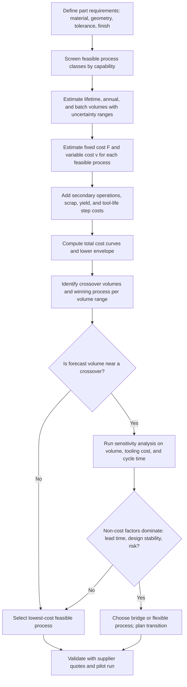

## Cost-Volume Relationships Across Process Classes

Cost-volume relationships describe how the total and per-unit cost of manufacturing a part changes as production quantity changes, and how that behavior differs between process classes. Every manufacturing process combines fixed (volume-independent) costs, such as tooling, fixtures, programming, and setup, with variable (volume-dependent) costs, such as material, machine time, labor, energy, and scrap. Because process classes differ sharply in how they split cost between these two categories, no single process is cheapest across all volumes. Classification-driven selection exploits this: each process class has a characteristic cost structure, and that structure determines the volume range in which the class is economically competitive.

### Purpose and Scope

This topic covers:

- The fundamental cost model and its components
- Cost-structure signatures of each major process class
- Break-even analysis between two or more processes
- Learning curves, capacity steps, and other real-world deviations from the simple model
- Practical selection workflows and worked examples

**Key Points**

- Processes with low up-front investment tend to have higher per-part cost, and vice versa. This trade-off is the foundation of volume-based process selection.
- The crossover volume between two processes is a property of the *pair* and of the specific part, not a universal constant.
- Cost estimates in this document are illustrative; real values vary widely with material, part size, tolerances, region, supplier, and equipment.
- Volume should be interpreted at three horizons: batch size (per production run), annual volume, and lifetime volume. Different cost elements amortize over different horizons.

### Fundamental Cost Model

#### Total Cost

Total cost for producing $N$ parts is the sum of fixed and variable components:

$$C_{total}(N) = C_{fixed} + C_{var} \cdot N$$

where $C_{fixed}$ is the volume-independent cost and $C_{var}$ is the variable cost per part.

#### Unit Cost

Dividing by quantity gives the average unit cost:

$$C_{unit}(N) = \frac{C_{fixed}}{N} + C_{var}$$

As $N$ grows, the fixed-cost term shrinks and unit cost asymptotically approaches $C_{var}$. This hyperbolic behavior explains why high-tooling processes only pay off at scale.

#### Expanded Cost Components

A more detailed unit-cost expression separates the major elements:

$$C_{unit} = C_{m} + C_{p} + \frac{C_{tool}}{N_{tool}} + \frac{C_{setup}}{N_{batch}} + C_{sec}$$

| Symbol | Meaning | Amortization Basis |
| --- | --- | --- |
| $C_{m}$ | Material cost per part (including scrap allowance) | Per part |
| $C_{p}$ | Processing cost per part (machine rate × cycle time + direct labor) | Per part |
| $C_{tool}$ | Tooling cost (dies, molds, fixtures, patterns) | Tool life quantity $N_{tool}$ |
| $C_{setup}$ | Setup and changeover cost per batch | Batch size $N_{batch}$ |
| $C_{sec}$ | Secondary operations (finishing, inspection, assembly) | Per part |

Where tool life is shorter than total volume, tooling must be replaced, and the tooling term becomes a step function of $N$ rather than a smooth hyperbola.

#### Processing Cost Detail

$$C_{p} = \frac{R_{machine} \cdot t_{cycle}}{\eta}$$

where $R_{machine}$ is the burdened machine-hour rate, $t_{cycle}$ is the cycle time per part, and $\eta$ is the overall utilization or yield factor ($0 < \eta \leq 1$).

### Cost-Structure Signatures of Process Classes

Each process class has a recognizable fixed-versus-variable profile.

| Process Class | Typical Fixed Cost | Typical Variable Cost | Cost-Structure Signature |
| --- | --- | --- | --- |
| Additive manufacturing (polymer/metal) | Very low (no part-specific tooling) | High (slow build rates, costly feedstock) | Nearly flat unit cost, little benefit from volume |
| CNC machining (subtractive) | Low to moderate (programming, fixturing) | Moderate to high (machining time, material waste) | Modest scale benefit, dominated by cycle time |
| Manual/soft-tooled fabrication (welding, hand layup) | Low | High (labor-intensive) | Labor-dominated, weak scale effect |
| Sheet metal (laser cutting, press brake) | Low to moderate | Moderate | Flexible, mid-volume competitive |
| Sheet metal (progressive/transfer die stamping) | High (hard tooling) | Very low | Strong scale effect, high-volume dominant |
| Sand casting | Low to moderate (pattern) | Moderate to high (cleaning, machining) | Low-volume casting option |
| Investment casting | Moderate (wax tooling) | Moderate to high | Mid-volume, complex-shape option |
| Die casting | High (steel dies) | Low | High-volume metal near-net-shape |
| Injection molding | High (mold) | Low | High-volume polymer, strongest scale effect |
| Thermoforming / vacuum casting | Low to moderate | Moderate | Low-to-mid-volume polymer |
| Forging (closed-die) | High (dies) | Low to moderate | High-volume, high-strength parts |
| Extrusion | Moderate (die) | Very low | Continuous, constant-section, high throughput |
| Powder metallurgy | High (die and press tooling) | Low | High-volume small metal parts |

**Illustrative relative magnitudes**

The following ranges are order-of-magnitude illustrations for a small-to-medium part and vary widely by size and complexity [Inference].

| Process | Illustrative Tooling Cost | Illustrative Variable Cost per Part | Rough Economic Volume Range |
| --- | --- | --- | --- |
| Additive (polymer) | ~$0 | $10 – $100+ | 1 – 100s |
| CNC machining | $500 – $5,000 (fixtures/programming) | $10 – $200 | 1 – 10,000s |
| Sheet metal (laser + brake) | $0 – $2,000 | $3 – $30 | 10 – 10,000s |
| Sand casting | $1,000 – $10,000 | $5 – $50 | 50 – 10,000s |
| Investment casting | $3,000 – $30,000 | $5 – $60 | 100 – 10,000s |
| Die casting | $20,000 – $200,000+ | $0.5 – $8 | 10,000 – millions |
| Injection molding | $5,000 – $250,000+ | $0.1 – $5 | 5,000 – millions |
| Progressive die stamping | $20,000 – $300,000+ | $0.05 – $2 | 50,000 – millions |
| Forging (closed-die) | $10,000 – $150,000+ | $1 – $20 | 5,000 – millions |

### Break-Even Analysis

#### Two-Process Crossover

Given two processes A and B, with A having lower fixed cost and higher variable cost:

$$C_A(N) = F_A + v_A N \qquad C_B(N) = F_B + v_B N$$

with $F_A < F_B$ and $v_A > v_B$. Setting the totals equal yields the break-even quantity:

$$N_{BE} = \frac{F_B - F_A}{v_A - v_B}$$

For $N < N_{BE}$ process A is cheaper; for $N > N_{BE}$ process B is cheaper.

**Example**

Compare CNC machining (A) and injection molding (B) for a plastic housing.

| Parameter | CNC Machining (A) | Injection Molding (B) |
| --- | --- | --- |
| Fixed cost $F$ | $1,500 | $35,000 |
| Variable cost $v$ | $28.00 per part | $1.80 per part |

$$N_{BE} = \frac{35000 - 1500}{28.00 - 1.80} = \frac{33500}{26.20} \approx 1279 \text{ parts}$$

**Output**

| Quantity $N$ | Total Cost A | Total Cost B | Cheaper |
| --- | --- | --- | --- |
| 500 | $15,500 | $35,900 | A (CNC) |
| 1,279 | ~$37,300 | ~$37,300 | Equal |
| 5,000 | $141,500 | $44,000 | B (molding) |
| 50,000 | $1,401,500 | $125,000 | B (molding) |

#### Multi-Process Selection and the Lower Envelope

With more than two candidates, the economically optimal process at each volume is the one with the lowest total cost. Plotting all total-cost lines, the **lower envelope** shows which process wins in each volume range and where the transitions occur.

$$C^{*}(N) = \min_{j} \left[ F_j + v_j N \right]$$

A process whose line never touches the lower envelope is dominated and can be dropped from consideration on cost alone (though it may still be chosen for non-cost reasons).

**Example: Three-Process Envelope**

| Process | $F$ | $v$ |
| --- | --- | --- |
| A: CNC machining | $1,000 | $30 |
| B: Sand casting + machining | $6,000 | $12 |
| C: Die casting + machining | $60,000 | $3 |

Crossover A → B:

$$N_{AB} = \frac{6000 - 1000}{30 - 12} = \frac{5000}{18} \approx 278$$

Crossover B → C:

$$N_{BC} = \frac{60000 - 6000}{12 - 3} = \frac{54000}{9} = 6000$$

So the economic ranges are roughly: CNC for $N < 278$, sand casting for $278 < N < 6000$, and die casting for $N > 6000$. (Verify that A→C directly does not cross earlier: $N_{AC} = 59000/27 \approx 2185$, which lies inside B's winning range where B is already cheaper, so it does not alter the envelope.)

### Illustration: Total Cost Lines and Crossovers

<svg xmlns="http://www.w3.org/2000/svg" viewBox="0 0 680 400" width="680" height="400" font-family="sans-serif" font-size="12">
<title>Total Cost vs Volume (svg_diagram)</title>
<text x="340" y="24" text-anchor="middle" font-size="15" font-weight="bold">Total Cost vs Volume for Three Process Classes (svg_diagram)</text>
<line x1="80" y1="340" x2="640" y2="340" stroke="#333" stroke-width="2" />
<line x1="80" y1="340" x2="80" y2="50" stroke="#333" stroke-width="2" />
<text x="360" y="382" text-anchor="middle">Production Volume N (illustrative, linear scale)</text>
<text x="24" y="195" text-anchor="middle" transform="rotate(-90 24 195)">Total Cost</text>
<line x1="80" y1="325" x2="640" y2="75" stroke="#1f5fa8" stroke-width="3" />
<text x="560" y="72" fill="#1f5fa8" font-weight="bold">A: CNC (high v, low F)</text>
<line x1="80" y1="290" x2="640" y2="200" stroke="#3a7d22" stroke-width="3" />
<text x="530" y="192" fill="#3a7d22" font-weight="bold">B: Sand casting</text>
<line x1="80" y1="190" x2="640" y2="160" stroke="#b5651d" stroke-width="3" />
<text x="520" y="152" fill="#b5651d" font-weight="bold">C: Die casting (high F, low v)</text>
<circle cx="153" cy="308" r="5" fill="#000" />
<text x="153" y="328" text-anchor="middle" font-size="11">N_AB</text>
<circle cx="420" cy="203" r="5" fill="#000" />
<text x="420" y="223" text-anchor="middle" font-size="11">N_BC</text>
<text x="120" y="360" text-anchor="middle" font-size="11" fill="#555">Region A</text>
<text x="290" y="360" text-anchor="middle" font-size="11" fill="#555">Region B</text>
<text x="530" y="360" text-anchor="middle" font-size="11" fill="#555">Region C</text>
</svg>

### Unit-Cost Behavior

Plotting unit cost rather than total cost shows the hyperbolic decline toward the variable-cost floor.

$$C_{unit}(N) = \frac{F}{N} + v$$

**Example**

Injection molding with $F = \$40{,}000$ and $v = \$1.50$:

| Quantity $N$ | Fixed Cost per Part $F/N$ | Unit Cost |
| --- | --- | --- |
| 1,000 | $40.00 | $41.50 |
| 10,000 | $4.00 | $5.50 |
| 100,000 | $0.40 | $1.90 |
| 1,000,000 | $0.04 | $1.54 |

The diminishing returns are visible: going from 100,000 to 1,000,000 units saves only about $0.36 per part, while the first tenfold step from 1,000 to 10,000 saves $36.00.

**Key Points**

- Unit cost falls steeply at low volumes and flattens at high volumes.
- Beyond the point where $F/N$ becomes small relative to $v$, further volume growth barely improves cost; effort is better spent reducing $v$ (cycle time, material, scrap).
- Processes with a large $F$ are exposed to volume-forecast risk. If actual volume falls short, unit cost can be far above plan.

### Real-World Deviations from the Linear Model

The simple $F + vN$ model is a first approximation. Several effects distort it.

#### Tool Life and Step Costs

Tooling wears out. If a mold or die has a life of $N_{life}$ parts, the number of tool sets required is:

$$n_{tools} = \left\lceil \frac{N}{N_{life}} \right\rceil$$

and the tooling cost term becomes:

$$C_{tool,total} = n_{tools} \cdot C_{tool}$$

This produces a step increase in total cost each time a replacement or duplicate tool is needed. Softer tooling (aluminum molds, soft dies) has a shorter life and cheaper up-front cost, shifting the crossover to lower volumes.

#### Multi-Cavity and Multi-Stage Tooling

Multi-cavity molds and dies raise $F$ but reduce cycle time per part. If a mold has $n_c$ cavities, the per-part processing cost falls approximately as:

$$C_p \approx \frac{R_{machine} \cdot t_{cycle}}{n_c \cdot \eta}$$

The optimal cavity count balances higher tooling cost against lower per-part machine cost, and is volume-dependent.

#### Capacity Constraints and Machine Step Costs

When volume exceeds the capacity of one machine or cell, an additional machine (a capital step) is required. This creates a sawtooth in cost per part:

$$n_{machines} = \left\lceil \frac{N \cdot t_{cycle}}{T_{available} \cdot \eta} \right\rceil$$

where $T_{available}$ is the available production time per period.

#### Learning and Experience Curves

Variable cost tends to decrease with cumulative production due to worker learning, process refinement, and yield improvements. The classic model is:

$$C_n = C_1 \cdot n^{b}, \qquad b = \frac{\ln(LR)}{\ln 2}$$

where $C_n$ is the cost of the $n$-th unit, $C_1$ is the first-unit cost, and $LR$ is the learning rate (for example, $LR = 0.85$ means cost falls to 85% each time cumulative output doubles). Learning effects are stronger in labor-intensive processes and weaker in highly automated ones. Typical learning rates vary by industry and are best obtained from company history [Inference].

**Example**

With $LR = 0.90$: $b = \ln(0.90)/\ln(2) \approx -0.152$. If the first unit costs $100:

- Unit 2: $100 \times 2^{-0.152} \approx \$90.0$
- Unit 4: $100 \times 4^{-0.152} \approx \$81.0$
- Unit 16: $100 \times 16^{-0.152} \approx \$65.6$

#### Scrap, Yield, and Setup Losses

Low-volume runs are penalized by setup scrap and first-article inspection. Effective material cost per good part is:

$$C_{m,eff} = \frac{C_{m}}{Y}$$

where $Y$ is the process yield (fraction of good parts). Yield often improves with volume and process maturity, giving another route by which cost declines as volume increases.

#### Batch Size and Setup Amortization

For processes with significant changeover time (CNC, stamping with die change, molding with mold change), the setup term $C_{setup}/N_{batch}$ depends on batch size rather than annual volume. Producing 10,000 parts a year in 10 batches of 1,000 has a lower setup burden than 100 batches of 100, but higher inventory carrying cost. The economic order or production quantity balances these:

$$Q^{*} = \sqrt{\frac{2 D S}{H}}$$

where $D$ is annual demand, $S$ is setup cost per batch, and $H$ is annual holding cost per unit.

#### Secondary Operations and Hidden Costs

Near-net-shape processes such as casting and molding often need secondary operations (machining critical faces, deburring, finishing, inspection). These add to $v$ and can shift the crossover. Conversely, a process that meets requirements directly, without secondary steps, may be cheaper than its primary-process cost suggests.

#### Non-Cost Factors That Interact with Volume

- **Lead time**: hard tooling can take weeks to months, which may rule out high-tooling processes for short schedules regardless of cost.
- **Design change risk**: hard tooling is expensive to modify; unstable designs favor flexible processes.
- **Quality and consistency**: high-volume processes generally provide tighter repeatability once tuned.
- **Supply chain and geography**: tooling and labor costs differ substantially across regions.
- **Material availability and minimum order quantities**.

### Cost-Volume Selection Workflow

### Worked Example: Full Selection Across Three Volume Scenarios

A designer needs an aluminum housing. Candidate processes, with illustrative numbers:

| Process | Fixed Cost $F$ | Variable Cost $v$ | Notes |
| --- | --- | --- | --- |
| CNC machining from billet | $2,000 | $45.00 | No tooling; long cycle time |
| Investment casting + finish machining | $12,000 | $14.00 | Wax tooling; secondary machining |
| Die casting + finish machining | $85,000 | $4.50 | Steel die; secondary machining on critical faces |

**Crossovers**

$$N_{CNC \to IC} = \frac{12000 - 2000}{45.00 - 14.00} = \frac{10000}{31.00} \approx 323$$

$$N_{IC \to DC} = \frac{85000 - 12000}{14.00 - 4.50} = \frac{73000}{9.50} \approx 7684$$

**Total cost at three scenarios**

| Scenario | Volume $N$ | CNC Total | Investment Cast Total | Die Cast Total | Cheapest |
| --- | --- | --- | --- | --- | --- |
| Prototype / pilot | 100 | $6,500 | $13,400 | $85,450 | CNC |
| Mid-volume | 3,000 | $137,000 | $54,000 | $98,500 | Investment casting |
| High-volume | 40,000 | $1,802,000 | $572,000 | $265,000 | Die casting |

**Conclusion of the example**

The best process changes twice as volume grows. A common strategy is a **bridge approach**: begin with CNC or soft tooling to launch quickly and validate the design, then invest in hard tooling once the design is stable and volume is confirmed.

### Sensitivity and Risk Analysis

Because crossover volumes depend on estimates that are themselves uncertain, sensitivity analysis is standard practice.

**Sensitivity of the break-even to inputs**

$$\frac{\partial N_{BE}}{\partial F_B} = \frac{1}{v_A - v_B} \qquad \frac{\partial N_{BE}}{\partial v_B} = \frac{F_B - F_A}{(v_A - v_B)^2}$$

The break-even is most sensitive to changes in the variable-cost *difference* when that difference is small. Two processes with nearly equal variable costs can have an extremely large or unstable crossover volume, so small estimation errors can flip the decision.

**Practical sensitivity steps**

1. Define low, expected, and high volume scenarios.
2. Vary tooling cost by a plausible range (for example, quotes often differ meaningfully between suppliers).
3. Vary cycle time and yield, since they drive $v$.
4. Recompute crossovers and check whether the chosen process remains optimal across scenarios.
5. Where the choice flips, prefer the option with lower regret (smaller worst-case cost penalty) or a staged strategy.

**Expected-cost view under volume uncertainty**

If volume is uncertain with probability weights $p_s$ over scenarios $s$:

$$E[C_j] = \sum_{s} p_s \left( F_j + v_j N_s \right) = F_j + v_j \sum_s p_s N_s$$

Because the model is linear in $N$, the expected cost equals the cost at the expected volume, but decision *risk* (variance of outcomes) is higher for high-$F$ processes, which matters when downside protection is valued.

### Product Life Cycle and Volume Evolution

Volume typically changes over a product's life, so the best process may change too.

| Life Cycle Stage | Typical Volume | Typical Process Emphasis |
| --- | --- | --- |
| Prototype / development | 1 – 50 | Additive, CNC, manual fabrication, soft tooling |
| Pilot / launch | 50 – 5,000 | Bridge tooling, sheet metal, investment or sand casting, aluminum molds |
| Growth | 5,000 – 500,000 | Hard tooling begins to pay off, multi-cavity tools |
| Maturity | Sustained high volume | Fully optimized hard-tooled processes, automation |
| Decline / service parts | Low, sporadic | Return to flexible processes; consider additive for spares |

**Key Points**

- Design for the *next* process transition when possible, for example, keeping geometry compatible with later molding even if early units are machined.
- Tooling ownership, storage, and maintenance costs matter for long-lived or declining products.

### Integration with Classification-Driven Selection

Cost-volume analysis is applied after capability screening (material, geometry, tolerance) has produced a feasible set. In a classification-driven framework:

1. **Classification** narrows the process space by hard technical constraints.
2. **Cost-volume analysis** ranks the survivors economically across the volume range.
3. **Process-family design rules** (draft, wall thickness, tool access) are applied to the selected process, and design changes can in turn shift the fixed and variable costs, prompting a re-run of the cost-volume comparison.

Design decisions that alter the cost structure include part consolidation, tolerance relaxation, feature simplification, and material substitution. Each can move a part from one cost-structure class to another.

### Limitations and Pitfalls

**Key Points**

- **Model simplification**: the linear $F + vN$ model ignores step costs, learning, capacity limits, and discounting unless explicitly added.
- **Estimate uncertainty**: early-stage fixed and variable costs are often rough; treat crossover volumes as ranges, not points.
- **Time value of money**: tooling paid up-front versus per-part costs paid over time differ in present value; a discounted-cash-flow view can shift the crossover:

$$PV = \sum_{t=1}^{T} \frac{CF_t}{(1+r)^t}$$

- **Ignoring secondary and downstream costs**: assembly, inspection, logistics, warranty, and scrap can outweigh primary-process differences.
- **Overreliance on published cost ranges**: values differ by region, supplier, part size, and time; confirm with quotes.
- **Volume-forecast bias**: forecasts are commonly optimistic; hard-tooled processes then carry higher regret [Inference].
- **Regulatory or quality mandates** may restrict process choice regardless of cost.
- **Behavior disclaimer**: cost relationships, tool lives, and process capabilities described here are general and may vary by material, equipment, supplier, and market conditions.

### Best Practices

1. Build a total-cost model with explicit fixed, variable, and step components for each candidate process.
2. Express volume at batch, annual, and lifetime horizons, and amortize each cost element on the appropriate basis.
3. Plot the lower envelope to visualize which process wins in each volume range.
4. Run sensitivity and scenario analysis around forecast volume and tooling quotes.
5. Consider a staged (bridge-to-production) strategy when volume or design maturity is uncertain.
6. Include secondary operations, yield, and scrap in $v$ from the start.
7. Incorporate learning effects and capacity steps for long production horizons.
8. Revisit the analysis when volume forecasts, material prices, or design requirements change.
9. Validate final selection with supplier quotes and, when risk is high, a pilot run.

### Conclusion

Cost-volume relationships explain why process selection is inherently volume-dependent: low-tooling processes such as additive manufacturing and CNC machining win at small quantities, mid-investment processes such as sheet metal fabrication and sand or investment casting cover intermediate ranges, and high-tooling processes such as die casting, injection molding, forging, and stamping dominate at large scale. The fixed-plus-variable cost model and its break-even and lower-envelope constructions give a quantitative basis for these transitions, while tool life, capacity steps, learning curves, yield, time value of money, and forecast uncertainty refine the picture. Used together with capability-based classification, cost-volume analysis converts a list of technically feasible processes into an economically defensible selection.

**Related Topics**

- Break-even analysis and sensitivity methods for process selection
- Tooling cost estimation (molds, dies, patterns, fixtures)
- Learning and experience curve modeling
- Should-cost and activity-based costing for manufacturing
- Economic order quantity and batch-size optimization
- Bridge tooling and rapid tooling strategies
- Total cost of ownership and life-cycle costing
- Volume-forecast uncertainty and real-options analysis
- Process capability versus cost trade-offs (tolerance-cost relationships)
- Capacity planning and machine utilization effects on cost