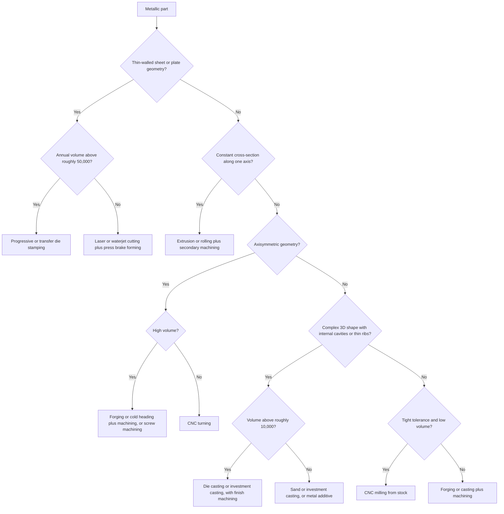
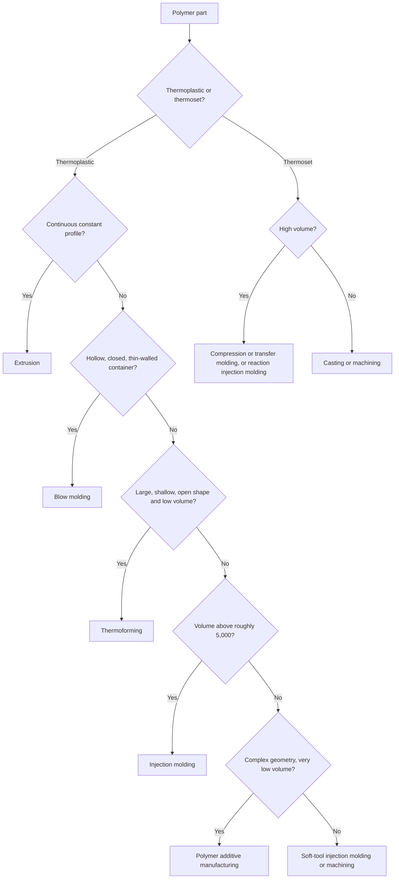

## Decision-Tree Approaches to Process-Family Selection


Decision-tree approaches to process-family selection encode manufacturing knowledge as a sequence of ordered questions about part attributes (material, shape, size, tolerance, volume, cost), where each answer prunes the set of candidate process families until a short list remains. They are the most direct operationalization of classification-driven selection: the taxonomy of process families supplies the leaves of the tree, and the part attributes supply the branching tests. Trees can be authored by experts as explicit rule sets, derived automatically from historical data using machine learning, or blended in hybrid schemes.

### Purpose and Scope

This topic covers:

- The structure and vocabulary of process-selection decision trees
- Expert-authored (knowledge-based) trees and their design principles
- Data-driven trees (CART, ID3/C4.5-style) trained on past process decisions
- Ordering of decision nodes and the effect on tree size and usability
- Handling uncertainty, missing data, and multiple feasible outcomes
- Integration with cost-volume analysis, design-for-manufacturing rules, and process planning
- Validation, maintenance, and limitations

**Key Points**

- A decision tree is a *screening and recommendation* device. Its output is a candidate set or ranked list of process families, not a finished process plan.
- Trees are transparent and auditable: every recommendation can be traced to the specific tests that produced it, which is a major advantage over black-box selectors.
- Tree quality depends on the taxonomy used for the leaves, the choice and ordering of attributes, and the fidelity of the encoded knowledge. Trees built for one industry, material set, or region may transfer poorly to another.
- Trees usually return several viable families rather than a single answer, so downstream cost and capability analysis is still needed.

### Structure and Vocabulary

| Term | Meaning in Process Selection |
| --- | --- |
| Root node | The first test applied, often the most discriminating attribute (for example, material class or primary shape state) |
| Internal (decision) node | A test on one part attribute, such as "Is the part hollow with re-entrant features?" |
| Branch | One outcome of a test (yes/no, or a category or numeric range) |
| Leaf node | A terminal outcome: a process family, a set of families, or a family with a ranking or flag |
| Path | The sequence of tests from root to leaf, which is also the recommendation's justification |
| Depth | Number of tests along the longest path; smaller depth is easier to apply and audit |
| Pruning | Removing branches that add complexity without improving decisions |
| Split criterion | The rule for choosing which attribute to test at a node (expert judgment or information-based measure) |

**Illustrative top-level partition**

Many practical trees begin with the material class, because it eliminates the largest portion of the process space quickly:

| Material Class | Typical Process Families Retained |
| --- | --- |
| Ferrous and non-ferrous metals | Casting, forging, sheet forming, extrusion, machining, powder metallurgy, joining, additive (metal) |
| Thermoplastics | Injection molding, extrusion, thermoforming, blow molding, machining, additive (polymer) |
| Thermosets | Compression and transfer molding, reaction injection molding, casting, machining |
| Elastomers | Compression and injection molding, extrusion, casting |
| Ceramics and glasses | Pressing and sintering, slip casting, glass forming, grinding |
| Composites | Layup, filament winding, pultrusion, resin transfer molding, compression molding |

The lists above are representative, not exhaustive, and family membership can vary with the taxonomy adopted.

### Expert-Authored (Knowledge-Based) Trees

In this approach, domain experts define the questions, ordering, and leaf outcomes from handbooks, supplier capability data, and experience. The tree is effectively a compiled rule base.

#### Typical Decision Attributes

1. **Material class and specific alloy or polymer** (weldability, castability, formability, machinability)
2. **Primary shape class**: prismatic, axisymmetric (rotational), thin-walled or sheet-like, hollow or re-entrant, long and slender, freeform
3. **Size and mass envelope**
4. **Feature complexity**: undercuts, internal passages, thin ribs, fine textures
5. **Dimensional tolerance and surface finish requirements**
6. **Production volume** (batch, annual, lifetime)
7. **Mechanical property requirements** (strength, fatigue, anisotropy)
8. **Cost and lead-time targets**
9. **Special constraints**: regulatory, biocompatibility, corrosion, supply chain

#### Design Principles for Expert Trees

- **Place strongly eliminating tests first.** Tests that discard many families (material compatibility, size limits) go near the root to keep the tree shallow.
- **Separate hard constraints from soft preferences.** Hard constraints (physically or technically infeasible) eliminate; soft preferences (cost, lead time) rank the survivors. Mixing them in one branch structure makes trees brittle.
- **Prefer categorical or banded tests.** Convert continuous attributes to bands (for example, tolerance classes) so each branch has a clear meaning.
- **Allow multiple leaves per path.** Return a set of feasible families rather than forcing a single choice.
- **Record rationale at each node.** Attaching a short justification (for example, "as-cast tolerances typically exceed the requirement") improves auditability and maintenance.
- **Keep depth manageable.** Very deep trees are hard to review; consider splitting into subtrees (a family-level tree, then a process-level tree within each family).

#### Example: Expert Tree for Metallic Parts

The tree below encodes a simplified screening logic for a metallic part. It is illustrative and not a complete industrial rule set.



**Example**

A steel flange, axisymmetric, 150 mm diameter, annual volume 30,000, tight bore tolerance.

- Metallic: yes
- Thin-walled sheet geometry: no
- Constant cross-section: no
- Axisymmetric: yes
- High volume: yes (30,000 in this illustrative threshold)

**Output**

Candidate family: forging (or cold heading) followed by machining, with screw machining or CNC turning as an alternative. The result is a family-level recommendation to be refined by cost-volume analysis and capability checks.

#### Example: Expert Tree for Polymer Parts



Numeric thresholds in these trees are placeholders. Real thresholds depend on part size, tooling quotes, and region, and should be calibrated (see the calibration section).

### Data-Driven Decision Trees

When a history of parts and the processes used to make them is available, a tree can be learned automatically rather than authored by hand.

#### Learning Setup

- **Inputs (features)**: part attributes such as material class, bounding-box dimensions, wall thickness, feature counts, tolerance class, surface finish, volume.
- **Target (label)**: the process family (or process) that was ultimately used or judged best.
- **Training data**: historical parts from PLM or ERP systems, group technology databases, quoting records, or curated benchmark datasets.

#### Split Criteria

At each node, the algorithm chooses the attribute and threshold that best separates the classes.

**Entropy and information gain** (ID3/C4.5-style):

$$H(S) = -\sum_{c=1}^{K} p_c \log_2 p_c$$


$$IG(S, A) = H(S) - \sum_{v \in \text{values}(A)} \frac{|S_v|}{|S|} H(S_v)$$

where $p_c$ is the fraction of samples in class $c$, and $S_v$ is the subset of samples with attribute $A$ taking value $v$.

**Gini impurity** (CART-style):

$$G(S) = 1 - \sum_{c=1}^{K} p_c^2$$

CART chooses the split that minimizes the weighted impurity of the child nodes. C4.5 additionally normalizes information gain by split information (the gain ratio) to reduce bias toward attributes with many values.

#### Example: Small Worked Split

Suppose 10 historical parts, labeled by process family: 6 injection molded (IM) and 4 CNC machined (CNC). Attribute: annual volume ≥ 5,000 (yes/no).

- Parent entropy: $H = -0.6\log_2 0.6 - 0.4\log_2 0.4 \approx 0.971$
- Yes branch (6 parts: 5 IM, 1 CNC): $H \approx 0.650$
- No branch (4 parts: 1 IM, 3 CNC): $H \approx 0.811$
- Weighted child entropy: $0.6 \times 0.650 + 0.4 \times 0.811 \approx 0.714$
- Information gain: $0.971 - 0.714 \approx 0.257$

**Output**

The volume test yields an information gain of about 0.26 bits, which the algorithm compares against other candidate splits (material class, wall thickness, tolerance) to select the best test at this node.

#### Practical Learning Workflow

1. Assemble and clean the dataset; resolve inconsistent process labels and taxonomy mismatches.
2. Engineer features that reflect manufacturing physics (for example, aspect ratio, wall-thickness-to-size ratio, feature-count measures, undercut presence).
3. Split into training, validation, and test sets, ideally stratified by process family.
4. Train a tree with depth and minimum-leaf-size limits to control overfitting.
5. Prune using cost-complexity pruning or validation performance.
6. Evaluate with accuracy, per-class precision and recall, and a confusion matrix, since rare process families can be poorly served by overall accuracy.
7. Review the resulting tree with process experts to catch physically implausible rules.

#### Cost-Complexity Pruning

Pruning trades accuracy for simplicity using a penalty on tree size:

$$R_\alpha(T) = R(T) + \alpha |T|$$

where $R(T)$ is the misclassification (or impurity) cost of tree $T$, $|T|$ is the number of leaves, and $\alpha \geq 0$ sets the penalty. Larger $\alpha$ produces smaller, more interpretable trees.

#### Ensembles and Their Trade-offs

Random forests and gradient-boosted trees usually improve predictive accuracy over a single tree but lose the single-path interpretability that makes trees attractive for manufacturing review. A common compromise is to use an ensemble for ranking and a distilled single tree, or feature-importance analysis, for explanation [Inference].

### Hybrid Approaches

Hybrid schemes combine expert rules with learned components:

- **Expert skeleton, learned thresholds**: experts fix the tree structure and questions; data calibrates numeric thresholds such as volume cutoffs.
- **Expert hard-constraint layer plus learned ranking**: a rule layer removes infeasible families (for example, a ceramic cannot be die cast), and a learned model ranks the remainder.
- **Learned tree audited by rules**: an automatically induced tree is checked against a library of physical and regulatory rules, and violating branches are corrected.
- **Case-based reasoning fallback**: when no path matches confidently, retrieve similar past parts (for example, via group technology codes) and adopt their processes.

### Ordering of Decision Nodes

The order of tests affects tree size, usability, and the number of questions a user must answer.

**Ordering heuristics**

| Heuristic | Rationale |
| --- | --- |
| Most eliminating test first | Reduces the candidate set fastest |
| Cheapest-to-answer test first | Minimizes user effort and data-gathering cost |
| Most certain attribute first | Reduces the chance of a wrong early branch that propagates |
| Highest information gain first | Statistically minimizes expected remaining uncertainty |
| Hard constraints before soft preferences | Prevents ranking infeasible options |

**Expected number of tests**

For a tree with leaf probabilities $p_\ell$ and path lengths $d_\ell$, the expected number of questions is:

$$E[d] = \sum_{\ell} p_\ell \, d_\ell$$

Ordering that places frequently encountered outcomes near the root lowers $E[d]$.

### Handling Uncertainty, Missing Data, and Multiple Outcomes

Real design data is often incomplete early in development.

- **Missing attributes**: allow an "unknown" branch that returns the union of outcomes from the possible answers, or defer the test until the attribute is estimated.
- **Fuzzy or soft thresholds**: instead of a sharp cutoff at 10,000 units, allow a transition band where both families remain candidates with graded scores.
- **Probabilistic leaves**: leaves may carry class probabilities, such as 0.7 injection molding and 0.3 die casting, drawn from the training-data proportions at that leaf.
- **Interval inputs**: propagate ranges through the tree (for example, volume 3,000 to 12,000) and return every family reachable within the range.
- **Confidence flags**: mark recommendations that rely on sparse training data or borderline tests for human review.

**Leaf probability estimate**

For a leaf containing $n$ training samples, of which $n_c$ belong to class $c$:

$$\hat{P}(c \mid \text{leaf}) = \frac{n_c}{n}$$

With small $n$, a smoothed estimate (such as Laplace smoothing) avoids overconfident 0 or 1 values:

$$\hat{P}(c \mid \text{leaf}) = \frac{n_c + 1}{n + K}$$

### Integration with Cost-Volume and DFM Analysis

A decision tree is most effective as the first stage in a pipeline.

1. **Tree screening** returns a feasible or high-likelihood set of process families.
2. **Cost-volume analysis** ranks the survivors economically using fixed and variable cost estimates and break-even comparisons.
3. **Design-for-manufacturing rule checks** apply family-specific geometric and tolerance rules to the design.
4. **Feedback**: design changes (for example, relaxing a tolerance, removing an undercut) may move the part to a different branch, so the tree is re-evaluated.

In some frameworks, the tree's volume tests are derived directly from cost-volume crossover points, so that thresholds stay consistent with the underlying cost model rather than being hard-coded once and forgotten.

### Encoding a Decision Tree as Rules

An expert tree can be stored as nested rules for use in software. A minimal Python illustration:

```python
def select_process_family(part):
    """Illustrative screening only; thresholds are placeholders."""
    if part["material_class"] == "metal":
        if part["shape"] == "sheet":
            return ["stamping"] if part["annual_volume"] > 50_000 \
                   else ["laser_cut_and_brake_form"]
        if part["constant_section"]:
            return ["extrusion", "machining"]
        if part["shape"] == "axisymmetric":
            return ["forging", "screw_machining"] if part["annual_volume"] > 20_000 \
                   else ["cnc_turning"]
        if part["complex_3d"]:
            return ["die_casting", "investment_casting"] if part["annual_volume"] > 10_000 \
                   else ["sand_casting", "investment_casting", "metal_additive"]
        return ["cnc_milling"]
    if part["material_class"] == "thermoplastic":
        if part["constant_section"]:
            return ["extrusion"]
        if part["annual_volume"] > 5_000:
            return ["injection_molding"]
        return ["thermoforming", "polymer_additive", "soft_tool_injection_molding"]
    return ["manual_review"]

example = {
    "material_class": "metal",
    "shape": "axisymmetric",
    "constant_section": False,
    "complex_3d": False,
    "annual_volume": 30_000,
}
print(select_process_family(example))
```

**Output**

```plaintext
['forging', 'screw_machining']
```

A data-driven tree can be trained with a standard library. The following sketch uses scikit-learn's CART implementation; behavior and defaults may vary across library versions.

```python
from sklearn.tree import DecisionTreeClassifier, export_text
import pandas as pd

# df has feature columns and a 'process_family' label column
X = pd.get_dummies(df.drop(columns=["process_family"]))
y = df["process_family"]

clf = DecisionTreeClassifier(
    criterion="gini",        # or "entropy"
    max_depth=6,             # control size and interpretability
    min_samples_leaf=5,      # avoid tiny, overfit leaves
    ccp_alpha=0.005,         # cost-complexity pruning strength
    random_state=0,
)
clf.fit(X, y)

print(export_text(clf, feature_names=list(X.columns)))
```

### Illustration: Anatomy of a Process-Selection Tree

<svg xmlns="http://www.w3.org/2000/svg" viewBox="0 0 700 380" width="700" height="380" font-family="sans-serif" font-size="12">
<title>Decision-Tree Anatomy (svg_diagram)</title>
<text x="350" y="24" text-anchor="middle" font-size="15" font-weight="bold">Anatomy of a Process-Selection Decision Tree (svg_diagram)</text>
<rect x="270" y="45" width="160" height="40" rx="6" fill="#cfe8ff" stroke="#1f5fa8" />
<text x="350" y="62" text-anchor="middle">Root: material class?</text>
<text x="350" y="77" text-anchor="middle" font-size="10" fill="#555">(most eliminating test)</text>
<line x1="310" y1="85" x2="170" y2="135" stroke="#333" stroke-width="2" />
<line x1="390" y1="85" x2="530" y2="135" stroke="#333" stroke-width="2" />
<text x="225" y="105" font-size="11">metal</text>
<text x="460" y="105" font-size="11">polymer</text>
<rect x="90" y="135" width="160" height="40" rx="6" fill="#d9f2d0" stroke="#3a7d22" />
<text x="170" y="152" text-anchor="middle">Internal: shape class?</text>
<text x="170" y="167" text-anchor="middle" font-size="10" fill="#555">(decision node)</text>
<rect x="450" y="135" width="160" height="40" rx="6" fill="#d9f2d0" stroke="#3a7d22" />
<text x="530" y="152" text-anchor="middle">Internal: volume high?</text>
<text x="530" y="167" text-anchor="middle" font-size="10" fill="#555">(decision node)</text>
<line x1="130" y1="175" x2="80" y2="235" stroke="#333" stroke-width="2" />
<line x1="210" y1="175" x2="250" y2="235" stroke="#333" stroke-width="2" />
<line x1="490" y1="175" x2="450" y2="235" stroke="#333" stroke-width="2" />
<line x1="570" y1="175" x2="620" y2="235" stroke="#333" stroke-width="2" />
<text x="90" y="210" font-size="11">sheet</text>
<text x="235" y="210" font-size="11">3D</text>
<text x="455" y="210" font-size="11">yes</text>
<text x="600" y="210" font-size="11">no</text>
<rect x="10" y="235" width="140" height="44" rx="6" fill="#ffe3c2" stroke="#b5651d" />
<text x="80" y="255" text-anchor="middle">Leaf: stamping or</text>
<text x="80" y="270" text-anchor="middle">laser + brake</text>
<rect x="180" y="235" width="140" height="44" rx="6" fill="#ffe3c2" stroke="#b5651d" />
<text x="250" y="255" text-anchor="middle">Leaf: casting or</text>
<text x="250" y="270" text-anchor="middle">machining set</text>
<rect x="380" y="235" width="140" height="44" rx="6" fill="#ffe3c2" stroke="#b5651d" />
<text x="450" y="255" text-anchor="middle">Leaf: injection</text>
<text x="450" y="270" text-anchor="middle">molding</text>
<rect x="550" y="235" width="140" height="44" rx="6" fill="#ffe3c2" stroke="#b5651d" />
<text x="620" y="255" text-anchor="middle">Leaf: thermoforming</text>
<text x="620" y="270" text-anchor="middle">or additive</text>
<text x="350" y="320" text-anchor="middle" font-size="11" fill="#555">A path from root to leaf is both the recommendation and its justification.</text>
<text x="350" y="340" text-anchor="middle" font-size="11" fill="#555">Leaves return candidate families, refined later by cost-volume and DFM analysis.</text>
</svg>

### Calibration of Thresholds

Numeric thresholds (volume cutoffs, size limits, tolerance bands) are the most context-sensitive elements.

**Methods**

- **Cost-model derivation**: compute break-even volumes between adjacent families and use them as thresholds, recalculating when tooling or labor costs change.
- **Supplier capability surveys**: use quoted minimum order quantities, achievable tolerances, and maximum part sizes from actual suppliers.
- **Data fitting**: learn thresholds from historical decisions using a decision-tree learner restricted to a fixed structure.
- **Sensitivity testing**: perturb thresholds and check how often recommendations change; thresholds where small changes flip many outcomes deserve extra attention or a soft transition band.

### Validation and Evaluation

| Evaluation Approach | What It Tests |
| --- | --- |
| Expert walkthrough of paths | Physical and practical correctness of each rule |
| Back-testing on historical parts | Agreement with decisions that proved successful |
| Hold-out test set (data-driven trees) | Generalization beyond training parts |
| Confusion matrix and per-class recall | Whether rare families are being missed |
| Coverage analysis | Fraction of parts that reach a confident leaf versus "manual review" |
| Sensitivity and robustness tests | Stability under input noise and threshold changes |
| Pilot use with process engineers | Real-world usability and trust |

**Key metrics for a classifier-based tree**

$$\text{Accuracy} = \frac{TP + TN}{TP + TN + FP + FN}, \quad \text{Precision}_c = \frac{TP_c}{TP_c + FP_c}, \quad \text{Recall}_c = \frac{TP_c}{TP_c + FN_c}$$

For a screening tree, **recall of the truly best family within the returned candidate set** is often more important than top-1 accuracy, because the downstream cost analysis can still choose among several returned candidates.

### Maintenance and Governance

- **Version control** the tree and its rationale, and record the taxonomy version it targets.
- **Assign ownership** to process experts who review rules on a schedule.
- **Track overrides**: when engineers reject a recommendation, log the reason; recurring overrides signal a missing rule or stale threshold.
- **Update on change**: new processes (for example, hybrid additive-subtractive systems), new materials, supplier changes, or cost shifts may require new branches [Inference].
- **Document scope** clearly: industry, material range, size range, and region for which the tree is valid.

### Limitations and Pitfalls

**Key Points**

- **Rigid thresholds**: sharp cutoffs create abrupt changes in recommendation for nearly identical parts; soft transition bands mitigate this.
- **Combinatorial coverage**: a hand-built tree cannot anticipate every combination of attributes, so unmatched cases should route to manual review rather than a forced guess.
- **Order sensitivity**: a poor early test can bury good options or push a user down a misleading branch.
- **Overfitting in learned trees**: deep trees memorize idiosyncratic historical decisions, including past mistakes and supplier-specific habits.
- **Data bias**: historical data reflects what a company *did*, not necessarily what was *best*; learned trees may perpetuate suboptimal habits [Inference].
- **Interaction effects**: trees test one attribute at a time and can miss interactions (for example, the joint effect of thin walls and high tolerance) unless deliberately encoded.
- **Taxonomy dependence**: outcomes depend on how process families were defined and grouped.
- **Hidden context**: available equipment, existing supplier relationships, intellectual property, and sustainability targets are often outside the tree but influence real decisions.
- **Behavior disclaimer**: the process capabilities, thresholds, and library behaviors described here are general and may vary by material, equipment, supplier, region, and software version.

### Best Practices

1. Start with a clear taxonomy of process families and define the leaves before writing questions.
2. Separate hard feasibility constraints from soft cost and preference rankings.
3. Place strongly eliminating, easy-to-answer tests near the root, keeping depth manageable.
4. Return sets of candidate families with rationale rather than a single forced answer.
5. Derive volume thresholds from a cost model and recalibrate when costs change.
6. Provide explicit handling for missing, uncertain, or borderline inputs.
7. Use learned trees where quality historical data exists, but review them with experts and constrain depth.
8. Add a manual-review exit for uncovered cases and log overrides to drive improvement.
9. Pair the tree with cost-volume analysis and DFM rule checks rather than treating its output as final.
10. Version, document, and periodically review the tree as processes, materials, and markets evolve.

### Conclusion

Decision-tree approaches make classification-driven process-family selection concrete, transparent, and repeatable. Expert-authored trees capture accepted manufacturing knowledge as auditable rules; data-driven trees extract patterns from historical decisions using entropy or Gini-based splitting with pruning; and hybrid schemes combine the reliability of physical rules with the adaptability of learning. Their strength lies in producing a short, justified list of feasible process families quickly, particularly early in design when information is limited. Their weaknesses, including rigid thresholds, order sensitivity, limited interaction handling, and dependence on taxonomy and data quality, mean they work best as the first stage of a pipeline that continues into cost-volume analysis, design-for-manufacturing checks, and supplier validation.

**Related Topics**

- Rule-based and expert-system process selection
- Group technology coding and similarity-based retrieval
- Cost-volume relationships and break-even threshold derivation
- Multi-criteria decision-making methods (AHP, TOPSIS) for ranking candidate families
- Machine-learning classifiers for process recommendation (random forests, gradient boosting)
- Fuzzy logic and probabilistic process selection under uncertainty
- Process-material and process-shape compatibility matrices
- Feature recognition and automated attribute extraction from CAD
- Computer-aided process planning (CAPP) integration
- Case-based reasoning for manufacturing process selection