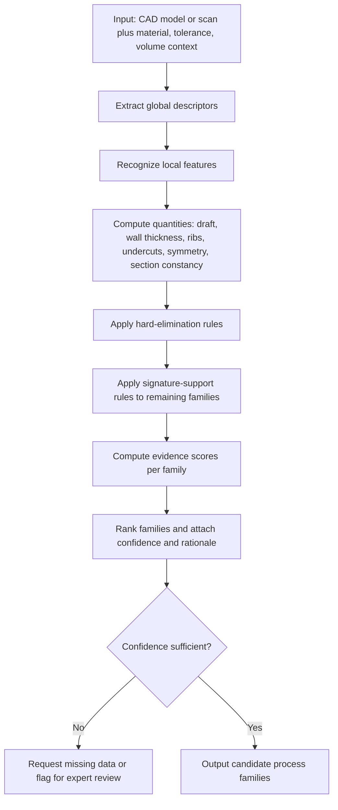

## Inferring Likely Process Families from Part Features and Geometry


Inferring likely process families from part features and geometry is the practice of reading a part's shape, feature content, and dimensional attributes, whether from a CAD model, a drawing, or a physical sample, and deducing which manufacturing process families could plausibly have produced it (reverse inference) or could produce it economically (forward screening). Geometry carries strong process signatures: draft angles suggest molding, casting, or forging; uniform wall thickness with ribs and bosses suggests molding or die casting; constant cross-sections suggest extrusion; bend lines and flat patterns suggest sheet forming; tool-access-limited pockets and orthogonal faces suggest machining; layered lattices and internal channels suggest additive manufacturing. This topic covers how to extract those signatures, quantify them, and convert them into ranked process-family hypotheses.

### Purpose and Scope

This topic covers:

- Why geometry is informative about process, and where it is ambiguous
- A taxonomy of geometric and feature descriptors used as evidence
- Process signatures: which features point toward which families
- Rule-based, scoring-based, and machine-learning inference methods
- Feature recognition from CAD and from scanned or measured parts
- Handling ambiguity, conflicting evidence, and uncertainty
- Two directions of use: design-time screening and forensic (reverse) inference
- Validation, tooling, and limitations

**Key Points**

- Inference from geometry yields *hypotheses with degrees of confidence*, not certainties. Many parts are geometrically compatible with several families.
- Geometry alone is insufficient. Material, volume, tolerance, and surface condition are needed to discriminate between families that share geometric signatures (for example, die casting versus injection molding for thin-walled ribbed housings).
- The strongest evidence combines *feature presence*, *feature absence*, and *feature quantities* (for example, a draft angle of 1° to 3° is more informative than the mere presence of a slope).
- Design-time inference asks "what could make this?"; forensic inference asks "what did make this?" The latter can use physical evidence (parting lines, gate marks, tool marks) unavailable in pure CAD.

### Why Geometry Encodes Process

Each process family imposes physical constraints on what shapes it can produce, and those constraints leave characteristic footprints.

| Process Mechanism | Physical Constraint | Resulting Geometric Signature |
| --- | --- | --- |
| Mold or die release (casting, molding, forging) | Part must eject from a cavity | Draft angles, parting lines, absence of unrelieved undercuts, ejector pin locations |
| Uniform cooling or solidification (casting, molding) | Thermal gradients cause defects | Nominally uniform wall thickness, tapered ribs, generous fillets, coring of thick sections |
| Tool access (machining) | Cutting tool must reach every surface | Orthogonal faces, internal corner radii matching cutter radius, limited pocket depth-to-width ratios |
| Plastic deformation of sheet (forming) | Material bends without fracture | Constant thickness, bend radii tied to thickness, bend reliefs, flat-pattern developability |
| Constant-section flow (extrusion, rolling) | Material passes through a fixed die | Cross-section invariant along one axis |
| Rotational symmetry (turning, spinning) | Workpiece rotates against tool | Axisymmetric features, coaxial diameters, grooves, threads |
| Layer-wise deposition (additive) | Part built incrementally | Lattices, internal channels, consolidated assemblies, orientation-dependent overhang treatment |
| Fusion and filler (welding, brazing) | Joints between separately made parts | Weld prep geometry, lap and butt joint configurations, fabricated assembly appearance |
| Powder compaction (powder metallurgy) | Powder must fill and compact in a die | Uniform density paths, limited height-to-diameter ratio, no undercuts perpendicular to pressing direction |

The table shows that inference is possible because process constraints are, at bottom, geometric and physical.

### Geometric and Feature Descriptors

#### Global Descriptors

| Descriptor | Definition | Informative For |
| --- | --- | --- |
| Bounding-box dimensions and aspect ratios | Envelope length, width, height | Size feasibility, extrusion (long slender), stamping (large flat), turning (length-to-diameter) |
| Volume and mass | Solid volume, density-derived mass | Process size limits, material utilization |
| Surface-area-to-volume ratio | $SA/V$ | Thin-walled versus massive parts; cooling behavior |
| Envelope utilization (volume-to-bounding-box ratio) | $V_{part}/V_{bbox}$ | Material removal fraction in machining (low ratio implies heavy stock removal) |
| Rotational symmetry index | Degree of axisymmetry | Turning, spinning, forging, powder pressing |
| Sheet-likeness (thickness-to-area) | Ratio of nominal thickness to planform dimensions | Sheet metal forming, thermoforming, stamping |
| Constant-section index | Cross-section similarity along a sweep axis | Extrusion, rolling, pultrusion |

**Buy-to-fly style ratio**

The material-removal fraction is often approximated from geometry alone:

$$\phi_{removal} = 1 - \frac{V_{part}}{V_{stock}}$$

where $V_{stock}$ is the volume of the smallest practical stock (a bounding block or cylinder). High $\phi_{removal}$ argues against machining from solid at higher volumes and toward near-net-shape processes.

#### Local Feature Descriptors

| Feature | Attributes Measured | Process Relevance |
| --- | --- | --- |
| Walls | Nominal thickness, thickness variation, minimum thickness | Molding, die casting, sheet forming, additive minimum feature |
| Ribs and gussets | Height-to-thickness ratio, thickness relative to wall | Molding (sink risk), casting, machining feasibility |
| Bosses | Outer diameter, height, core diameter | Molding, casting, machining |
| Holes | Diameter, depth-to-diameter ratio, through/blind, pattern | Drilling, coring, punching, additive |
| Pockets and slots | Depth-to-width ratio, corner radii, floor radii | Milling access, electrical discharge machining, casting cores |
| Undercuts | Presence, direction, extent | Side actions in molding and die casting, cores in casting, machining feasibility |
| Threads | Internal/external, size, form | Turning, tapping, molding with unscrewing cores, rolling |
| Fillets and radii | Magnitude, consistency | Flow-based processes tolerate and require radii; machining shows cutter-radius-matched radii |
| Draft | Angle magnitude, direction consistency | Molding, casting, forging |
| Bends | Radius, angle, bend-line collinearity | Sheet forming, tube bending |
| Textures and fine surfaces | Feature scale, pattern | Molding (mold texture), etching, additive stair-stepping |
| Lattices and internal channels | Cell size, connectivity, conformal channels | Additive manufacturing |
| Parting-line candidates | Silhouette split planes, flash lines | Molding, casting, forging |

#### Tolerance and Surface Descriptors

- Dimensional tolerance bands per feature (for example, ±0.05 mm on a bore)
- Geometric tolerances (flatness, concentricity, position)
- Surface roughness $R_a$ specifications and lay direction
- Datum structure, which suggests the setup and work-holding strategy

Tight tolerances shift the inference toward machining or grinding for critical features, even when the overall form suggests a near-net-shape process with secondary operations.

### Process Signatures: Evidence Toward Families

The following signature table maps observed geometry to process-family hypotheses. "Strong" indicates high diagnostic value; "weak" indicates the evidence is compatible with many families.

| Observed Evidence | Points Toward | Strength | Notes |
| --- | --- | --- | --- |
| Consistent draft (approximately 0.5° to 3° or more) on faces parallel to a pull direction | Injection molding, die casting, forging, sand or investment casting | Strong | Draft magnitude varies by process and surface depth |
| Uniform nominal wall thickness with ribs at reduced thickness | Injection molding, die casting | Strong | Thick, massive sections argue against these |
| Constant cross-section along one axis | Extrusion, rolling, pultrusion, wire EDM | Strong | Post-machined features may break the constant section locally |
| Flat pattern developable, uniform thickness, bend radii ≥ material-dependent minimum | Sheet metal forming, stamping | Strong | Requires sheet-like proportions |
| Coaxial cylindrical features, grooves, threads on axis | Turning, screw machining, forging plus turning | Strong | Combined with high volume suggests cold heading or forging |
| Orthogonal faces, flat-bottomed pockets, corner radii matching cutter sizes | CNC milling | Strong | Corner radius equal to standard end-mill radius is a diagnostic clue |
| Sharp internal corners in pockets | Wire EDM, sinker EDM, broaching, or non-cutter-limited process | Moderate | Milling cannot produce sharp internal corners |
| Internal cavities without access paths | Casting with cores, investment casting, additive, multi-piece assembly | Strong | Machining is infeasible for closed cavities |
| Lattice or gyroid internal structures, conformal channels | Additive manufacturing | Strong | Rarely producible otherwise |
| Thin uniform-thickness large shell with shallow draw | Thermoforming, stamping or drawing, blow molding (if closed hollow) | Moderate | Closed hollow bodies indicate blow or rotational molding |
| Uniform hollow closed body | Blow molding, rotational molding, hydroforming | Moderate | Material class discriminates |
| Weld-prep bevels, seam geometry, fabricated multi-part outline | Welded fabrication | Strong | Presence of joint geometry in the model |
| Significant machining allowance offsets on selected faces (raised pads) | Casting or forging plus machining | Strong | Raised pads often mark faces destined for machining |
| Very low volume-to-bounding-box ratio | Machining from solid is costly; near-net-shape indicated at volume | Moderate | Volume-dependent |
| Straight-through hole patterns in thin plate | Punching, laser or waterjet cutting | Moderate | Compare hole size to plate thickness |
| Non-developable double-curved thin shell | Deep drawing, hydroforming, spinning, molding, additive | Moderate | Material and thickness discriminate |

**Key Points**

- A single feature rarely determines the family. Confidence increases when independent signatures agree (for example, draft plus uniform walls plus ribs plus bosses).
- Absence of a signature is also informative: no draft and sharp internal edges in a pocket weigh against molding and casting.
- Numeric magnitudes matter. Minimum wall thickness, rib ratios, and draft angles are compared to typical family ranges, which vary by material, machine, and supplier and should be verified against capability data.

### Feature Recognition Foundations

Before inference, features must be extracted from the geometry. Approaches differ by input type.

#### From Boundary-Representation (B-Rep) CAD Models

- **Graph-based recognition**: represent the part as an attributed adjacency graph, where nodes are faces and edges are labeled convex or concave. Subgraph patterns correspond to features such as through-holes, blind holes, pockets, slots, and bosses.
- **Rule-based recognition**: geometric and topological rules identify features from face types, loops, and edge convexity.
- **Volumetric decomposition**: decompose the removal volume (stock minus part) into machining-oriented feature volumes; alternatively decompose the part into convex hulls or sweeps.
- **Neural methods**: graph neural networks and convolutional networks over B-Rep or voxel data classify faces or features [Inference: performance varies with dataset and model].

**Attributed adjacency graph**

$$G = (V, E, \lambda), \quad V = \{\text{faces}\}, \; E = \{\text{shared edges}\}, \; \lambda: E \to \{\text{convex}, \text{concave}\}$$

A blind hole, for example, appears as a cylindrical face and a bottom face connected by a concave edge, both inside a loop on a planar face.

#### From Mesh or Point-Cloud Data (Scans)

- Segment surfaces into primitives (planes, cylinders, cones, spheres, tori) using region growing or RANSAC.
- Estimate curvature and normals to detect fillets, ribs, and draft.
- Fit primitives to recover dimensional attributes such as bore diameters and wall thicknesses.
- Scan noise and resolution limit detection of small features and thin walls [Inference].

#### From Drawings and Annotations

Text and symbols in drawings (general tolerances, surface finish symbols, hole callouts, material notes, process notes) provide strong evidence that geometry alone cannot, such as an explicit "cast" or "machined all over" note.

### Quantifying Key Geometric Evidence

#### Draft Angle Estimation

For a face with normal $\mathbf{n}$ and a candidate pull direction $\mathbf{d}$ (unit vectors), the draft angle is:

$$\theta_{draft} = 90^\circ - \arccos(\lvert \mathbf{n} \cdot \mathbf{d} \rvert)$$

Faces nearly parallel to $\mathbf{d}$ with a small consistent $\theta_{draft}$ (for example, 1° to 3°) support mold-based or die-based hypotheses. The best pull direction is found by searching candidate directions (often principal axes) for the direction that maximizes the number of faces with positive, consistent draft and minimizes undercuts.

#### Wall-Thickness Estimation

Local thickness at a surface point can be estimated by casting a ray inward along the negative surface normal and measuring the distance to the opposite surface, or by medial-axis and sphere-fitting methods. Summary statistics used as evidence:

$$\bar{t} = \frac{1}{N}\sum_{i=1}^{N} t_i, \qquad CV_t = \frac{\sigma_t}{\bar{t}}$$

A low coefficient of variation $CV_t$ (uniform walls) supports molding, die casting, sheet forming, and thin-shell processes; a high $CV_t$ (heavy and thin sections mixed) supports machining from solid, forging, or sand casting with local coring.

#### Rib and Boss Proportions

For a rib of thickness $t_r$ on a wall of thickness $t_w$ and height $h_r$:

$$\rho_{rib} = \frac{t_r}{t_w}, \qquad \lambda_{rib} = \frac{h_r}{t_r}$$

Rib thickness ratios below roughly 1 (often around 0.5 to 0.7 for cosmetic molded surfaces) and moderate height ratios are typical of molded designs. The specific limits depend on material and process and must be confirmed with supplier guidance [Inference].

#### Constant-Section Index

Sample cross-sections $S(z_k)$ at stations $z_k$ along a candidate axis and compare them with a shape-similarity measure, such as the intersection-over-union of the section polygons:

$$CSI = \frac{1}{K-1}\sum_{k=1}^{K-1} IoU\bigl(S(z_k), S(z_{k+1})\bigr)$$

$CSI$ near 1 indicates an extrusion-like part.

#### Axisymmetry Index

Measure the fraction of the surface that is generated by revolution about a candidate axis:

$$AI = \frac{A_{rev}}{A_{total}}$$

where $A_{rev}$ is the area of faces that are surfaces of revolution about the axis. Values near 1 suggest turning, spinning, or rotational forging.

#### Undercut Detection

Along a candidate pull direction $\mathbf{d}$, a face is undercut if a ray from the face in the direction $\mathbf{d}$ (or $-\mathbf{d}$) is blocked by other geometry before reaching the parting surface or infinity. The number and complexity of undercuts affect tooling (side actions, cores, collapsible cores) and can push inference away from simple two-plate molds or dies.

#### Tool-Access Analysis

For a machining hypothesis, compute for each face the set of approach directions from which a tool of given diameter and length can reach it without collision. The number of distinct orientations needed estimates required setups:

$$n_{setups} \geq \min \; |\mathcal{O}| \quad \text{such that} \quad \bigcup_{o \in \mathcal{O}} \text{Access}(o) = \text{all machined faces}$$

This is a set-cover problem, often solved heuristically. Many required setups raise cost and argue for alternative families.

### Inference Methods

#### Method 1: Rule-Based Inference

Expert rules map features and quantities to family hypotheses, typically with hard eliminations and soft supports.



**Hard elimination examples**

- Closed internal cavity present → eliminate machining from solid as a sole process (unless the part is split and joined).
- Unrelieved undercut in all candidate pull directions → eliminate simple two-plate molding or die casting.
- Non-constant cross-section along every axis → eliminate extrusion as a sole process.
- Non-developable thick, massive form → eliminate sheet forming.

**Soft support examples**

- Consistent draft on faces parallel to the best pull direction → add support to molding, casting, and forging.
- Low wall-thickness variation → add support to molding, die casting, sheet forming.

#### Method 2: Weighted Evidence Scoring

Assign each family $f$ a score aggregated from feature evidence:

$$S_f = \sum_{k} w_{fk} \cdot e_k$$

where $e_k \in [0,1]$ is the normalized strength of evidence $k$ (for example, draft consistency, wall uniformity), and $w_{fk}$ is the weight linking evidence $k$ to family $f$ (positive for support, negative for contradiction). Scores are then normalized to a ranking or to pseudo-probabilities:

$$P(f) = \frac{\exp(S_f)}{\sum_{g}\exp(S_g)}$$

The softmax transform is a convenience for ranking and does not, by itself, guarantee calibrated probabilities [Inference].

**Example**

Evidence for a small housing (values illustrative):

| Evidence $e_k$ | Value | Injection Molding $w$ | Die Casting $w$ | CNC Milling $w$ | Sheet Forming $w$ |
| --- | --- | --- | --- | --- | --- |
| Draft consistency | 0.9 | +2.0 | +2.0 | −1.5 | −1.0 |
| Wall uniformity (low $CV_t$) | 0.85 | +1.5 | +1.5 | −0.5 | +1.0 |
| Ribs at reduced thickness | 0.8 | +1.5 | +1.0 | −0.5 | −1.5 |
| Undercut-free along pull axis | 0.9 | +1.0 | +1.0 | 0.0 | 0.0 |
| Sharp internal pocket corners | 0.0 | −1.0 | −0.5 | −2.0 | 0.0 |

Weighted sums (each $S_f = \sum_k w_{fk} e_k$):

- Injection molding: $2.0(0.9) + 1.5(0.85) + 1.5(0.8) + 1.0(0.9) - 1.0(0.0) = 1.8 + 1.275 + 1.2 + 0.9 + 0 = 5.175$
- Die casting: $2.0(0.9) + 1.5(0.85) + 1.0(0.8) + 1.0(0.9) - 0.5(0.0) = 1.8 + 1.275 + 0.8 + 0.9 + 0 = 4.775$
- CNC milling: $-1.5(0.9) - 0.5(0.85) - 0.5(0.8) + 0 - 2.0(0.0) = -1.35 - 0.425 - 0.4 = -2.175$
- Sheet forming: $-1.0(0.9) + 1.0(0.85) - 1.5(0.8) + 0 + 0 = -0.9 + 0.85 - 1.2 = -1.25$

**Output**

Injection molding (5.18) and die casting (4.78) are the leading hypotheses, essentially tied on geometry. Material class then discriminates: a polymer favors injection molding, while a metal favors die casting. This illustrates why geometry must be combined with material and volume.

#### Method 3: Bayesian Inference

Treat the process family as a latent variable and geometric observations as evidence:

$$P(f \mid E) \propto P(f) \prod_{k} P(e_k \mid f)$$

under a conditional-independence (naive Bayes) simplification, where $P(f)$ is a prior reflecting production mix or context (for example, an automotive supplier's prior differs from a prototype shop's), and $P(e_k \mid f)$ is the likelihood of observing evidence $e_k$ given the family. Priors from the organization's own history help disambiguate; the independence assumption is often violated (draft and undercut-freeness are correlated), which can overstate confidence [Inference].

#### Method 4: Machine-Learning Classifiers

Train classifiers on labeled parts (geometry and known process):

- **Tabular models** (decision trees, random forests, gradient-boosted trees) on engineered descriptors such as $CV_t$, $CSI$, $AI$, draft statistics, feature counts, and bounding-box ratios.
- **Deep models on geometry**: voxel CNNs, point-cloud networks (PointNet-style), multi-view CNNs, and graph neural networks on B-Rep graphs. These can learn signatures automatically but require sizable labeled datasets and may be less interpretable [Inference].
- **Multi-label output**: since a part may be made by several families or by a sequence (casting then machining), predictions are best framed as multi-label or sequence prediction rather than single-label.

**Evaluation**

Use per-family precision, recall, and a confusion matrix; examine confusions between geometrically similar families (injection molding versus die casting; forging versus casting) since these are inherently ambiguous without material and volume context.

#### Method 5: Similarity-Based and Case-Based Inference

Compute a geometric or group-technology similarity between the new part and a library of parts with known processes, then adopt the processes of the nearest neighbors:

$$\hat{f} = \arg\max_{f} \sum_{j \in \mathcal{N}_k(x)} \mathbb{1}[f_j = f] \cdot s(x, x_j)$$

where $\mathcal{N}_k(x)$ are the $k$ most similar library parts and $s$ is a similarity score (for example, cosine similarity on shape descriptors or code-distance on group technology codes). This approach transfers proven plans and exposes local company practice, but inherits any bias in the library.

### Multi-Stage and Sequence Inference

Most real parts are made by process *sequences*, not a single process. Inference should therefore output a primary family plus secondary operations.

| Geometry Pattern | Likely Sequence |
| --- | --- |
| Near-net shape with raised pads and tight-tolerance bores | Casting or forging, then machining of pads and bores |
| Extruded profile with drilled cross-holes and milled ends | Extrusion, then machining |
| Bent sheet with threaded inserts and welded seams | Cutting, forming, joining, insertion |
| Molded body with metal inserts | Injection molding with insert loading, or post-molding insertion |
| Additively built body with machined interfaces | Additive, heat treatment, then machining of datum and mating faces |
| Turned shaft with milled keyway and ground journals | Turning, milling, heat treatment, grinding |

Indicators of secondary operations:

- Localized tight tolerances on otherwise loosely toleranced parts
- Raised stock allowances on selected faces
- Threads or bores in cast or molded bodies requiring finishing
- Surface-finish callouts stricter than the primary process typically delivers

### Two Directions of Use

#### Design-Time (Forward) Screening

Given a design, identify families that can produce it economically, and identify geometric changes that would open cheaper families. For example, flagging an undercut that prevents a two-plate mold and suggesting a redesign that removes it.

#### Forensic (Reverse) Inference

Given an existing part (reverse engineering, second-source qualification, failure analysis, counterfeit detection), infer how it was made. Physical evidence adds discriminating power:

| Physical Evidence | Indicates |
| --- | --- |
| Parting line, flash, or witness marks | Casting, molding, forging |
| Gate vestige or sprue remnant | Injection molding, die casting |
| Ejector-pin marks | Molding, die casting |
| Machining tool marks and cutter-radius corners | Machining |
| Grain flow following contours (etched section) | Forging |
| Porosity distribution and dendritic structure | Casting |
| Layer lines, stair-stepping, support scars | Additive manufacturing |
| Weld beads, heat-affected zones | Welding |
| Extrusion die lines along one axis | Extrusion |
| Surface texture replicating tool surface | Molding, stamping |

Forensic inference must be handled carefully in legal or safety-critical contexts; confidence statements should be evidence-based and conservative [Inference].

### Worked Example

A part is provided as a CAD model with the following extracted attributes:

| Attribute | Value |
| --- | --- |
| Material context | Aluminum alloy |
| Bounding box | 110 × 70 × 35 mm |
| Nominal wall thickness | 2.2 mm, $CV_t \approx 0.12$ |
| Draft on faces parallel to Z | 1.5° consistent |
| Ribs | Thickness ratio $\rho_{rib} \approx 0.6$ |
| Undercuts along Z | None |
| Bores | Two Ø8 mm through-bores with ±0.02 mm tolerance |
| Mounting faces | Raised 1.5 mm pads, flatness 0.05 mm |
| Annual volume | 40,000 units |
| Internal cavity | Open along Z |

**Step 1: Hard eliminations**

- Sheet forming: eliminated (ribbed 3D form, non-developable).
- Extrusion: eliminated (not constant-section along any axis).
- Machining from billet as the only process: not eliminated on geometry but disfavored at this volume because removal fraction is high and the shape suits near-net processes.

**Step 2: Signature support**

- Draft, uniform walls, reduced-thickness ribs, and undercut-free geometry along Z all support die casting (metal) and molding-type processes.
- Raised pads and ±0.02 mm bores signal secondary machining.

**Step 3: Combine with material and volume**

- Aluminum material and 40,000 units per year favor high-pressure die casting over injection molding (polymer only) and over lower-volume casting.

**Output**

| Rank | Candidate Sequence | Rationale |
| --- | --- | --- |
| 1 | High-pressure die casting, then machining of pads and bores | Draft, uniform walls, ribs, volume, raised pads, tight bores |
| 2 | Investment or semi-solid casting, then machining | Similar geometry; lower tooling cost or better properties at some volumes |
| 3 | CNC machining from billet or plate | Feasible but costly at this volume; suitable for prototypes |

The result is a ranked hypothesis set with rationale, to be refined by cost-volume analysis and supplier capability checks.

### Illustration: From Geometry to Process Hypotheses

<svg xmlns="http://www.w3.org/2000/svg" viewBox="0 0 720 400" width="720" height="400" font-family="sans-serif" font-size="12">
<title>Geometry to Process Inference (svg_diagram)</title>
<text x="360" y="24" text-anchor="middle" font-size="15" font-weight="bold">Geometry-to-Process Inference Pipeline (svg_diagram)</text>
<rect x="20" y="50" width="130" height="60" rx="6" fill="#cfe8ff" stroke="#1f5fa8" />
<text x="85" y="76" text-anchor="middle">Part geometry</text>
<text x="85" y="94" text-anchor="middle" font-size="10" fill="#555">CAD, scan, drawing</text>
<line x1="150" y1="80" x2="190" y2="80" stroke="#333" stroke-width="2" />
<polygon points="190,74 202,80 190,86" fill="#333" />
<rect x="205" y="50" width="140" height="60" rx="6" fill="#d9f2d0" stroke="#3a7d22" />
<text x="275" y="72" text-anchor="middle">Feature recognition</text>
<text x="275" y="90" text-anchor="middle" font-size="10" fill="#555">walls, ribs, holes, bends</text>
<line x1="345" y1="80" x2="385" y2="80" stroke="#333" stroke-width="2" />
<polygon points="385,74 397,80 385,86" fill="#333" />
<rect x="400" y="50" width="140" height="60" rx="6" fill="#d9f2d0" stroke="#3a7d22" />
<text x="470" y="72" text-anchor="middle">Quantified evidence</text>
<text x="470" y="90" text-anchor="middle" font-size="10" fill="#555">draft, CV_t, CSI, AI</text>
<line x1="540" y1="80" x2="580" y2="80" stroke="#333" stroke-width="2" />
<polygon points="580,74 592,80 580,86" fill="#333" />
<rect x="595" y="50" width="110" height="60" rx="6" fill="#ffe3c2" stroke="#b5651d" />
<text x="650" y="76" text-anchor="middle">Inference engine</text>
<text x="650" y="94" text-anchor="middle" font-size="10" fill="#555">rules, scores, ML</text>
<line x1="650" y1="110" x2="650" y2="170" stroke="#333" stroke-width="2" />
<polygon points="644,170 650,182 656,170" fill="#333" />
<rect x="560" y="185" width="180" height="60" rx="6" fill="#ffe3c2" stroke="#b5651d" />
<text x="650" y="208" text-anchor="middle">Ranked process families</text>
<text x="650" y="226" text-anchor="middle" font-size="10" fill="#555">with confidence + rationale</text>
<rect x="20" y="185" width="200" height="60" rx="6" fill="#f3e5f5" stroke="#7b1fa2" />
<text x="120" y="208" text-anchor="middle">Context inputs</text>
<text x="120" y="226" text-anchor="middle" font-size="10" fill="#555">material, tolerance, volume</text>
<line x1="220" y1="215" x2="595" y2="105" stroke="#7b1fa2" stroke-width="2" stroke-dasharray="5,4" />
<rect x="250" y="285" width="220" height="60" rx="6" fill="#fff9c4" stroke="#f9a825" />
<text x="360" y="308" text-anchor="middle">Downstream analysis</text>
<text x="360" y="326" text-anchor="middle" font-size="10" fill="#555">cost-volume, DFM rules, suppliers</text>
<line x1="560" y1="230" x2="470" y2="305" stroke="#333" stroke-width="2" />
<text x="360" y="380" text-anchor="middle" font-size="11" fill="#555">Geometry supplies hypotheses; context and downstream analysis select among them.</text>
</svg>

### Implementation Sketch

A minimal illustration of weighted evidence scoring in Python. Values and weights are placeholders for demonstration and would need calibration against real data.

```python
import math

# Evidence values normalized to [0, 1] (illustrative)
evidence = {
    "draft_consistency": 0.9,
    "wall_uniformity": 0.85,
    "ribs_reduced_thickness": 0.8,
    "undercut_free": 0.9,
    "sharp_internal_corners": 0.0,
}

# Weights: family -> evidence -> weight (illustrative placeholders)
weights = {
    "injection_molding": {"draft_consistency": 2.0, "wall_uniformity": 1.5,
                          "ribs_reduced_thickness": 1.5, "undercut_free": 1.0,
                          "sharp_internal_corners": -1.0},
    "die_casting":       {"draft_consistency": 2.0, "wall_uniformity": 1.5,
                          "ribs_reduced_thickness": 1.0, "undercut_free": 1.0,
                          "sharp_internal_corners": -0.5},
    "cnc_milling":       {"draft_consistency": -1.5, "wall_uniformity": -0.5,
                          "ribs_reduced_thickness": -0.5, "undercut_free": 0.0,
                          "sharp_internal_corners": -2.0},
    "sheet_forming":     {"draft_consistency": -1.0, "wall_uniformity": 1.0,
                          "ribs_reduced_thickness": -1.5, "undercut_free": 0.0,
                          "sharp_internal_corners": 0.0},
}

def score_families(evidence, weights):
    return {f: sum(w.get(k, 0.0) * evidence.get(k, 0.0) for k in w)
            for f, w in weights.items()}

def softmax(scores):
    m = max(scores.values())
    exps = {f: math.exp(s - m) for f, s in scores.items()}
    z = sum(exps.values())
    return {f: e / z for f, e in exps.items()}

scores = score_families(evidence, weights)
probs = softmax(scores)
for f, p in sorted(probs.items(), key=lambda x: -x[1]):
    print(f"{f:18s} score={scores[f]:6.3f}  p={p:5.3f}")
```

**Output**

```plaintext
injection_molding  score= 5.175  p=0.599
die_casting        score= 4.775  p=0.401
sheet_forming      score=-1.250  p=0.001
cnc_milling        score=-2.175  p=0.000
```

The softmax values are relative rankings among the listed candidates, not calibrated probabilities. Exact printed values may differ slightly in rounding.

### Handling Ambiguity and Conflicting Evidence

- **Geometric look-alikes**: injection molding versus die casting, forging versus casting, milling from plate versus sheet cutting. Resolve with material, volume, tolerance, and property requirements.
- **Conflicting evidence**: draft suggests molding, yet sharp internal corners and orthogonal faces suggest machining. Possible explanations include a machined part designed with an anticipated later conversion to casting, or a cast part with machined internal features. Report both hypotheses with a sequence interpretation.
- **Ambiguity by process convergence**: additive and casting can produce similar organic shapes; layer lines, lattices, and support scars discriminate in physical parts but not always in CAD.
- **Multi-process reality**: report primary process plus likely secondary operations rather than forcing a single label.
- **Uncertainty propagation**: carry confidence intervals or ranges for measured quantities such as wall thickness (especially from scans) and propagate them into evidence values.
- **Abstain option**: when maximum confidence is below a threshold, output "insufficient evidence" and request additional inputs.

### Validation and Evaluation

| Approach | What It Tests |
| --- | --- |
| Expert review of rule outputs on representative parts | Correctness of signatures and thresholds |
| Back-testing on parts with known processes | Agreement with ground truth |
| Hold-out sets and cross-validation (ML) | Generalization to unseen parts |
| Confusion analysis across look-alike families | Whether ambiguity is properly reported |
| Sensitivity to feature-recognition errors | Robustness to noisy or incomplete extraction |
| Coverage and abstention rate | How often the system commits versus defers |
| Comparison with supplier or process-engineer judgment | Practical utility |

Because ground truth for "the correct process" is sometimes only "the process that was used," which may itself have been suboptimal, evaluation should distinguish *reproducing historical practice* from *finding the best process*.

### Tools and Data Sources

- CAD kernels and feature-recognition modules in commercial CAD/CAM systems; automated DFM checkers that flag draft, wall-thickness, undercut, and tool-access issues
- Geometry-processing libraries (mesh and point-cloud processing, B-Rep kernels such as OpenCASCADE-based tools) for computing descriptors
- Public and proprietary CAD datasets for learning (for example, part-model repositories with feature or process labels); label quality varies [Inference]
- PLM and group technology databases for similarity-based and case-based inference
- Supplier capability databases to attach realistic ranges to signature thresholds

Specific product features, dataset contents, and licensing vary by vendor and version and should be verified against current documentation.

### Limitations and Pitfalls

**Key Points**

- **Underdetermination**: geometry alone often leaves multiple plausible families; treating the top-ranked hypothesis as fact overstates certainty.
- **Design-intent gap**: the geometry shows what was drawn, not what constraints the designer had in mind; a part designed generically may not reveal its intended process.
- **Feature-recognition errors**: misidentified or missed features (small draft, subtle undercuts, thin walls in scan data) propagate into wrong inferences.
- **Threshold sensitivity**: signature thresholds (for example, minimum draft or rib ratio) differ by material, machine, and supplier and should not be treated as universal constants.
- **Dataset and label bias**: learned models inherit the process mix and habits of their training data and may fail on novel process combinations or emerging technologies such as hybrid additive-subtractive systems [Inference].
- **Independence assumptions**: naive Bayes and additive scoring ignore correlations between features and can exaggerate confidence.
- **Scale effects**: signatures that hold for small parts (for example, wall-thickness limits) can change for very large or very small components.
- **Post-processing masking**: machining, polishing, or coating can erase primary-process signatures in physical parts, hindering forensic inference.
- **Behavior disclaimer**: process capabilities, feature thresholds, and software behaviors described here are general and may vary by material, equipment, supplier, standard, and tool version.

### Best Practices

1. Extract features and quantities explicitly and record them; avoid inferring from a single visual impression.
2. Combine geometry with material, tolerance, surface, and volume context before committing to a family.
3. Separate hard eliminations (physically infeasible) from soft signature support to keep reasoning transparent.
4. Report ranked hypotheses with confidence and a short rationale that lists the supporting and contradicting evidence.
5. Infer sequences (primary plus secondary operations), not just a single process label.
6. Use multiple independent signatures; require agreement before assigning high confidence.
7. Calibrate thresholds against supplier capability data and revisit them periodically.
8. Include an abstain or expert-review path when evidence is thin or conflicting.
9. For physical parts, incorporate surface and metallurgical evidence in addition to geometry.
10. Feed the ranked families into cost-volume analysis and design-for-manufacturing checks rather than treating inference as the final decision.

### Conclusion

Process families leave characteristic geometric footprints: draft and uniform walls for mold- and die-based processes, constant sections for extrusion, developable flat patterns for sheet forming, cutter-limited corners and orthogonal faces for machining, and lattices or conformal channels for additive manufacturing. By extracting features from CAD, scan, or drawing data, quantifying evidence such as draft, wall-thickness variation, rib proportions, symmetry, section constancy, undercuts, and tool access, and combining that evidence through rules, weighted scoring, Bayesian reasoning, or learned models, one can produce ranked process-family hypotheses with rationale. Because geometry underdetermines process, these hypotheses must be conditioned on material, tolerance, and volume, expressed as sequences rather than single labels, and passed to cost-volume analysis and supplier validation. Used this way, geometry-driven inference is a fast, transparent front end to classification-driven process selection.

**Related Topics**

- Automatic feature recognition algorithms for B-Rep and mesh models
- Attributed adjacency graphs and graph neural networks for CAD
- Draft, undercut, and parting-line analysis
- Wall-thickness analysis and medial-axis methods
- Tool-access and setup-planning analysis for machining
- Group technology coding and similarity-based retrieval
- Design rules by process family and automated DFM checking
- Process-sequence and route inference (primary plus secondary operations)
- Forensic process identification from part surfaces and microstructure
- Uncertainty quantification and calibration in process-recommendation models