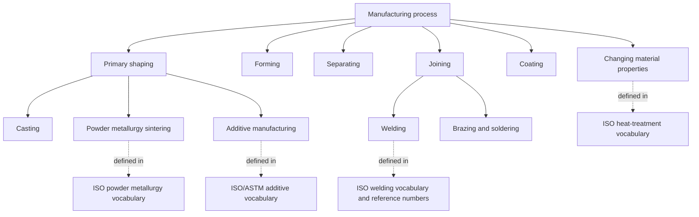
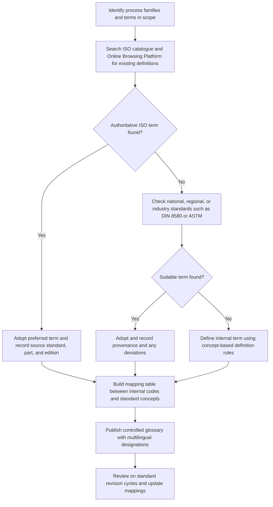

## ISO Manufacturing-Process Vocabulary Standards


ISO manufacturing-process vocabulary standards are the terminology documents published by the International Organization for Standardization (ISO) and its technical committees that define, in a controlled and internationally agreed way, the names and meanings of manufacturing processes, process categories, and related concepts. They provide the shared language on which process classification, process planning, quoting, digital process descriptions, and cross-border supplier communication depend. No single ISO document defines "manufacturing processes" as a whole. Instead, the vocabulary is distributed across many process-specific and domain-specific standards, plus a small number of framework standards that organize process categories at a higher level. This item explains how ISO terminology standards are structured, which documents matter for process classification, how definitions are written and used, and how the vocabulary connects to other classification systems such as DIN 8580 and digital taxonomies.

### Purpose and Scope

This topic covers:

- The role of terminology standards in process classification and selection
- How ISO organizes terminology work (committees, document types, numbering)
- Structure and conventions of an ISO vocabulary standard
- Major ISO vocabulary standards relevant to manufacturing processes, by process family
- Relationship between ISO vocabularies and DIN 8580-style process taxonomies
- Practical use: writing specifications, building databases, mapping to digital systems
- Multilingual terminology and equivalence
- Maintenance, versioning, and limitations

**Key Points**

- ISO vocabulary standards define *terms and concepts*, not process capabilities. A definition of "die casting" tells you what the term means, not what tolerances it achieves.
- Coverage is fragmented: some process families (additive manufacturing, welding, plastics, machine tools) have dedicated vocabulary standards, while others rely on definitions embedded in broader standards or on national and industry documents.
- Standard numbers, titles, edition years, and status change over time (revision, withdrawal, replacement). Any specific citation in this document should be verified against the current ISO catalogue before use in a contract or specification.
- Vocabulary standards are most valuable when used consistently across drawings, quotations, process plans, and databases, because inconsistent terminology is a primary source of mapping errors between systems.

### Role of Terminology Standards in Classification-Driven Selection

Process classification frameworks assign parts, features, and processes to categories. Those categories only work if the labels mean the same thing to every user.

| Function | How ISO Vocabulary Supports It |
| --- | --- |
| Unambiguous naming | Fixes one preferred term per concept and lists deprecated synonyms |
| Concept definition | Gives a definition that separates one process from neighbors (for example, forming versus casting) |
| Hierarchy and relationships | Some standards show generic-specific (parent-child) relationships between terms |
| Cross-language alignment | Provides equivalent terms in multiple official or translated languages |
| Data modeling | Supplies controlled labels for databases, ontologies, and product-data exchange |
| Contract and quality language | Reduces disputes about what a specified process actually entails |

Without controlled vocabulary, statements such as "cast and machined" or "formed" can hide large differences in meaning between organizations.

### How ISO Organizes Terminology

#### Standards Bodies and Committees

ISO standards are developed by technical committees (TCs), subcommittees (SCs), and working groups (WGs), each covering a subject domain. Manufacturing-process vocabulary is spread across many of them. Representative examples of committee domains (names and scopes should be verified against the current ISO committee directory):

| Domain | Typical Committee Focus |
| --- | --- |
| Additive manufacturing | ISO/TC 261 (additive manufacturing), often jointly with ASTM International |
| Welding and allied processes | ISO/TC 44 |
| Plastics | ISO/TC 61 |
| Foundry and casting | ISO/TC 25 (cast irons) and related foundry work |
| Machine tools | ISO/TC 39 |
| Industrial automation systems | ISO/TC 184 |
| Metallic and other inorganic coatings | ISO/TC 107 |
| Rubber | ISO/TC 45 |
| Tolerancing and geometrical product specifications | ISO/TC 213 |
| Terminology and language resources | ISO/TC 37 (principles and methods for terminology work) |

#### Document Types

| Type | Meaning | Relevance to Vocabulary |
| --- | --- | --- |
| International Standard (IS) | Full consensus standard | Most vocabularies are published in this form |
| Technical Specification (TS) | Preliminary or specialized document | May carry terminology where consensus for full IS is not yet reached |
| Technical Report (TR) | Informative document | Occasionally provides terminology background |
| Publicly Available Specification (PAS) | Fast-track specification | Rarely used for core vocabulary |
| Amendment (Amd) and Corrigendum (Cor) | Modifications to published standards | Update or correct definitions |
| Joint or dual-logo documents | Developed with partners such as ASTM International or IEC | Common in additive manufacturing and electrotechnical areas |

#### Numbering and Part Structure

ISO documents are identified by a number, an optional part number, and an edition year, for example `ISO 12345-1:YYYY`. Vocabulary standards are frequently multi-part, with one part per sub-domain. Titles often contain the word "Vocabulary" or "Terms and definitions," but not always.

#### The Online Browsing Platform and Terminology Databases

ISO makes standard-embedded terminology searchable through its Online Browsing Platform (OBP), which lists terms and definitions extracted from published standards, and through the IEC Electropedia (International Electrotechnical Vocabulary) for electrotechnical terms. Searching these sources before coining a local term is good practice. Availability and access conditions can change, so verify current access terms.

### Anatomy of an ISO Vocabulary Standard

Terminology standards follow drafting conventions, largely governed by ISO/IEC Directives Part 2 and by the terminology-work principles standards (the ISO 704 family on terminology principles and the ISO 10241 family on terminological entries in standards). Exact document numbers and editions should be verified.

#### Typical Structure

| Element | Content |
| --- | --- |
| Foreword and introduction | Scope statement, committee responsibility, rationale |
| Scope | What concepts and domain the vocabulary covers |
| Terms and definitions | Numbered entries (for example, 3.1.2) |
| Systematic arrangement | Concepts grouped by subject and relationship rather than alphabetically |
| Annexes | Alphabetical index, multilingual equivalents, concept diagrams |

#### Structure of a Terminological Entry

A well-formed entry usually contains:

1. **Entry number** (hierarchical, for example 3.2.4)
2. **Preferred term** (the recommended designation)
3. **Admitted terms** (acceptable synonyms), and sometimes **deprecated terms** (discouraged designations)
4. **Definition** (a concise statement that distinguishes the concept)
5. **Notes to entry** (clarifications, usage information, exceptions)
6. **Examples** (illustrative cases)
7. **Source and cross-references** (origin standard, related entries)

**Example (illustrative structure, not a quotation of any real standard)**

```plaintext
3.4.7
<preferred term>: powder bed fusion
<definition>: additive manufacturing process in which thermal energy
              selectively fuses regions of a powder bed
<note 1 to entry>: examples include processes using laser or electron beam energy sources
<related terms>: see also "directed energy deposition"
```

This layout is representative of how entries are organized. The wording of real standards differs and must be taken from the published text.

#### Definition-Writing Conventions

Terminology standards follow principles of concept-based definition:

- **Intensional definition**: state the superordinate (broader) concept plus the delimiting characteristics that distinguish this concept from its siblings.
- **Substitutability**: the definition should be replaceable for the term in a sentence without changing meaning.
- **No circularity** and no reuse of the defined term in its own definition.
- **Brevity and precision**: avoid unnecessary detail; put ancillary information in notes.
- **Concept independence from language**: definitions describe the concept, and each language then supplies a designation for it.

A generic-specific definition can be represented schematically as:

$$\text{Definition} = \text{Superordinate concept} + \text{Delimiting characteristic(s)}$$

For example, "additive manufacturing process" (superordinate) plus the delimiting characteristic of the mechanism used to join the feedstock (say, fusion of powder by thermal energy) yields the concept of powder bed fusion.

### ISO Vocabulary Standards by Process Family

The table lists representative ISO vocabulary and terminology-bearing standards. It is *illustrative and non-exhaustive*. Document numbers, titles, parts, editions, and status (current, revised, withdrawn) change over time and must be confirmed against the ISO catalogue before citation.

| Process Family or Domain | Representative ISO Terminology Standards (verify current status) | Notes |
| --- | --- | --- |
| Additive manufacturing | ISO/ASTM 52900 (general principles and terminology) | Defines process categories such as material extrusion, powder bed fusion, vat photopolymerization, binder jetting, material jetting, sheet lamination, directed energy deposition; developed jointly with ASTM |
| Welding and allied processes | ISO 857-1 (welding and allied processes, metal welding processes) and ISO 857-2 (soldering and brazing) | Vocabulary for welding, soldering, and brazing processes |
| Welding process numbering | ISO 4063 (welding and allied processes, nomenclature and reference numbers) | Assigns numeric codes to processes, useful for drawings and specifications |
| Plastics terminology | ISO 472 (plastics vocabulary) | Broad plastics vocabulary spanning materials and processing terms |
| Rubber | ISO 1382 (rubber vocabulary) | Rubber materials and processing terminology |
| Machine tools | ISO 841 (industrial automation systems, coordinate systems and motion nomenclature) and related machine-tool terminology documents | Axes and motion nomenclature for numerically controlled machines |
| Cutting tools | ISO 3002 series and related documents on basic quantities in cutting and grinding | Geometry and quantities in cutting and grinding |
| Geometrical product specification | ISO 17450 series (GPS) and related documents | Terminology for geometrical specification and verification concepts, with process-related surface notions |
| Surface texture | ISO 4287 and ISO 21920 series | Terms and parameters for surface texture (relevant to finish attributes of processes) |
| Metallic coatings | ISO 2080 (electroplating and related processes vocabulary) and related surface-treatment vocabularies | Coating and surface-treatment process terms |
| Heat treatment | ISO 4885 (ferrous materials, heat treatments vocabulary) | Terms for heat-treatment operations |
| Powder metallurgy | ISO 3252 (powder metallurgy vocabulary) | Powder metallurgy process and material terms |
| Foundry | ISO documents on castings terminology and foundry practice (varies by material and topic) | Casting vocabulary is partially standardized at ISO level and partly at national level |
| Forming (sheet, bulk) | Coverage partly in ISO documents on specific processes and partly in national standards (for example DIN 8580 family) | No single dedicated ISO forming vocabulary to cite without verification |
| Industrial data and product information | ISO 10303 (STEP), ISO 13584 (parts library), ISO 14649 (STEP-NC), ISO 15926 (process industry data) | Data-model standards that embed controlled process vocabularies; discussed below |

**Key Points**

- The additive manufacturing vocabulary standard is the clearest example of a *comprehensive, process-taxonomy-defining* ISO vocabulary: it defines a set of process categories with mutually distinguishing characteristics.
- Welding has a strong two-layer structure: vocabulary (what the process is) plus reference numbers (compact codes for drawings), which supports both human and machine use.
- For subtractive machining, casting, and forming, there is no single unified ISO taxonomy analogous to the additive one; practitioners often combine ISO documents with DIN 8580 or company taxonomies.
- Many standards listed here have parts, corrigenda, and successor editions. The year and part must always be specified when citing.

### Additive Manufacturing Vocabulary as a Worked Case

Additive manufacturing (AM) illustrates how an ISO vocabulary can define a process classification. The general-principles-and-terminology standard defines an overall concept and a set of process categories distinguished by how material is added and joined.

| Process Category | Distinguishing Mechanism (paraphrased) | Typical Feedstock |
| --- | --- | --- |
| Material extrusion | Material selectively dispensed through a nozzle or orifice | Thermoplastic filament, pellets, pastes |
| Vat photopolymerization | Liquid photopolymer selectively cured by light | Photopolymer resin |
| Powder bed fusion | Thermal energy selectively fuses regions of a powder bed | Polymer, metal, or ceramic powder |
| Binder jetting | Liquid bonding agent selectively deposited to join powder | Powder plus binder |
| Material jetting | Droplets of build material selectively deposited | Photopolymer, wax |
| Sheet lamination | Sheets of material bonded to form a part | Paper, polymer, or metal sheet |
| Directed energy deposition | Focused thermal energy fuses material as it is deposited | Wire or powder metal |

The wording above is a paraphrase for illustration; exact definitions must be taken from the published standard.

**Example**

A supplier quotation states "printed part." Using the AM vocabulary, a specification would name the category (for example, powder bed fusion), the energy source and material (for example, laser, metal powder), and the post-processing steps. This removes ambiguity that "printed" leaves open and lets the buyer compare like with like.

### Vocabulary for Welding: Names and Reference Numbers

Welding vocabulary and process numbering demonstrate a code-based classification tied to a vocabulary standard. The nomenclature-and-reference-numbers standard assigns each process a numeric identifier, organized by process group.

| Leading Digit Group (illustrative) | Process Group |
| --- | --- |
| 1 | Arc welding |
| 2 | Resistance welding |
| 3 | Gas welding |
| 4 | Solid-state welding |
| 5 | Beam welding |
| 7 | Other welding processes |
| 8 | Cutting and gouging |
| 9 | Brazing, soldering, braze welding |

Within a group, further digits identify specific processes (for example, sub-processes of arc welding). The grouping above is a simplification for illustration, and the complete, current code list must be taken from the standard itself.

**Example**

A weld symbol on a drawing may cite a process reference number rather than a name, so a fabricator in another language reads the same meaning. The mapping between number and name is governed by the standard, not by local convention.

### Relationship to DIN 8580 and Other Taxonomies

DIN 8580 is a German national standard organizing manufacturing processes into main groups by the way cohesion of material is treated. It is widely used as a classification backbone in Europe and appears in many textbooks. It is *not* an ISO document, although it influences international practice.

| Main Group (DIN 8580 style) | Idea | Example Processes |
| --- | --- | --- |
| Primary shaping | Create shape from formless material, creating cohesion | Casting, sintering, molding, additive processes |
| Forming | Change shape while maintaining mass and cohesion | Forging, rolling, bending, deep drawing |
| Separating | Reduce cohesion locally | Turning, milling, drilling, grinding, cutting |
| Joining | Connect workpieces durably | Welding, brazing, adhesive bonding, fastening |
| Coating | Apply a firmly adhering layer | Painting, plating, thermal spraying |
| Changing material properties | Alter properties by rearranging or modifying material structure | Heat treatment, hardening |

The relationship between ISO vocabularies and DIN 8580 can be summarized:

- **ISO documents** define terms for specific process families and cross-cutting concepts; coverage is distributed and modular.
- **DIN 8580 and its subordinate standards** provide a single hierarchical taxonomy of all manufacturing processes.
- Practitioners commonly *use DIN 8580 as the organizing frame and ISO vocabularies for detailed definitions* where available, especially for additive manufacturing, welding, and plastics.
- Some ISO/CEN work and national mirror documents align with the DIN scheme in Europe; the extent of alignment varies and should be checked for the specific process concerned [Inference].



### Terminology Principles: ISO 704 and ISO 1087 Families

Two families of standards govern *how* terminology is produced, independent of the manufacturing subject:

- **Terminology work principles and methods** (the ISO 704 family): concept analysis, definitions, designations, and relationships between concepts.
- **Vocabulary of terminology work** (the ISO 1087 family): defines terms used in terminology work itself, such as "concept," "designation," "definition," and "term."

Verify current numbers and editions before citing. These documents underpin the concept model used across ISO vocabularies.

**Concept relations commonly modeled**

| Relation | Meaning | Manufacturing Example |
| --- | --- | --- |
| Generic (is-a) | Subordinate concept is a kind of superordinate | Laser beam welding is a kind of beam welding |
| Partitive (part-of) | Concept is a part of a whole | Print head is a part of a printer; mold is part of an injection molding system |
| Associative (sequential, causal, temporal) | Concepts linked by process order or cause | Heat treatment follows machining in a route |

Understanding these relations helps when converting a vocabulary into an ontology or database schema.

### Multilingual Terminology and Equivalence

ISO vocabularies are often published in English and French (the two official ISO languages), sometimes with Russian, and frequently with additional languages provided in annexes or by national member bodies. Key issues:

- **Term equivalence versus concept equivalence**: a translated term should correspond to the same concept, not merely the same word. False friends (for example, similar-sounding words with different meanings) are a known hazard.
- **Alphabetical multilingual indexes** in annexes let readers move between languages.
- **National adoptions**: national bodies may publish identical (IDT) or modified adoptions, such as EN ISO documents in Europe or national forms with local prefixes. The national text may differ in language and sometimes in edition timing.
- **Regional term variants**: the same process may have different colloquial names in different industries or countries, so mapping tables are needed.

**Example**

A supplier in one country uses a local term that translates literally to "spray casting" for a process the ISO vocabulary designates differently. Mapping through the standard's concept definitions (rather than the literal words) avoids misclassification.

### Practical Use

#### Writing Specifications and Drawings

- Cite the standard, part, and edition when a term must carry a precise meaning, for example, "process categories per ISO/ASTM 52900:YYYY."
- Use preferred terms consistently; avoid deprecated synonyms.
- Where a process reference number exists (for example, welding), include it alongside or instead of the name to remove language dependence.
- Define project-specific terms in a glossary and mark any deviation from the standard.

#### Building Databases and Digital Records

- Store the *concept* (with an identifier) separately from its *designations* (terms in various languages).
- Map internal process codes to ISO-defined categories, keeping a mapping table that records the source standard and edition.
- Version the vocabulary reference, since definitions can change between editions.

**Example schema sketch**

```plaintext
ProcessConcept(concept_id, preferred_term_en, definition, source_standard, edition_year, parent_concept_id)
ProcessDesignation(concept_id, language, term, status)   -- status: preferred | admitted | deprecated
ProcessMapping(internal_code, concept_id, mapping_type, notes)  -- mapping_type: exact | broader | narrower | related
```

The mapping types mirror common thesaurus and ontology practice (exact, broader, narrower, related).

#### Supporting Digital Classification and Data Exchange

ISO vocabularies feed into larger data and classification ecosystems:

- **ISO 10303 (STEP)** application protocols describe product and manufacturing data, including process-related information; their data models rely on controlled terms.
- **ISO 14649 (STEP-NC)** models machining operations and processes for numerical control, using defined operation and feature types.
- **ISO 13584 (parts library, PLIB)** and **IEC 61360 / ISO 29002** style dictionaries manage controlled property and class definitions with unique identifiers, useful for machine-readable classification.
- **ISO 15926** covers process-industry lifecycle data with reference data libraries.
- **ISO 23247 series** addresses digital twin frameworks for manufacturing, which depend on consistent process terminology.

The exact scope, edition, and applicability of these standards vary, and their relationship to any one process vocabulary should be confirmed for the intended use [Inference].

### Workflow: Adopting ISO Vocabulary in an Organization



### Illustration: Layers of Process Vocabulary

<svg xmlns="http://www.w3.org/2000/svg" viewBox="0 0 700 380" width="700" height="380" font-family="sans-serif" font-size="12">
<title>Layers of Process Vocabulary (svg_diagram)</title>
<text x="350" y="24" text-anchor="middle" font-size="15" font-weight="bold">Layers of Manufacturing-Process Vocabulary (svg_diagram)</text>
<rect x="60" y="45" width="580" height="60" rx="6" fill="#cfe8ff" stroke="#1f5fa8" />
<text x="350" y="70" text-anchor="middle" font-weight="bold">Terminology principles (ISO 704 / ISO 1087 families)</text>
<text x="350" y="90" text-anchor="middle" font-size="11" fill="#555">How concepts, definitions, and designations are constructed</text>
<rect x="60" y="120" width="580" height="60" rx="6" fill="#d9f2d0" stroke="#3a7d22" />
<text x="350" y="145" text-anchor="middle" font-weight="bold">Taxonomy backbone (for example DIN 8580 main groups)</text>
<text x="350" y="165" text-anchor="middle" font-size="11" fill="#555">Hierarchy of primary shaping, forming, separating, joining, coating, property change</text>
<rect x="60" y="195" width="580" height="70" rx="6" fill="#ffe3c2" stroke="#b5651d" />
<text x="350" y="220" text-anchor="middle" font-weight="bold">Process-family ISO vocabularies</text>
<text x="350" y="240" text-anchor="middle" font-size="11" fill="#555">Additive manufacturing, welding and allied processes, plastics, powder metallurgy, heat treatment, surface texture</text>
<rect x="60" y="280" width="580" height="60" rx="6" fill="#f3e5f5" stroke="#7b1fa2" />
<text x="350" y="305" text-anchor="middle" font-weight="bold">Digital data-model standards (STEP, STEP-NC, PLIB, digital twin frameworks)</text>
<text x="350" y="325" text-anchor="middle" font-size="11" fill="#555">Machine-readable use of controlled process terms</text>
<text x="350" y="365" text-anchor="middle" font-size="11" fill="#555">Upper layers govern method and structure; lower layers apply the vocabulary in software and data exchange.</text>
</svg>

### Comparison of Terminology Sources

| Source Type | Strengths | Weaknesses |
| --- | --- | --- |
| ISO vocabulary standards | International consensus; multilingual; citable | Fragmented coverage; paid access for full texts; slow revision cycles |
| National standards (DIN, ANSI, BS, JIS) | Deep coverage in some areas; often complete taxonomies | Language and regional bias; may not align with ISO |
| Industry and trade association glossaries | Practical, current terms | Variable rigor; may conflict across bodies |
| Textbooks and handbooks | Explanatory context | Not normative; definitions vary by author |
| Company glossaries | Tailored to internal use | Risk of drift and local jargon |
| Ontologies and digital dictionaries | Machine-readable; support inference | Dependent on quality of underlying definitions |

### Maintenance, Versioning, and Governance

- **Systematic review**: ISO standards are subject to periodic review (commonly on a multi-year cycle), after which they may be confirmed, revised, or withdrawn.
- **Edition awareness**: definitions can change between editions; always record edition year and part.
- **Corrigenda and amendments**: check for later modifications to the specific clause being used.
- **Superseded documents**: older references may point to withdrawn standards; identify the replacement.
- **Change-tracking practice**: maintain a register of adopted vocabulary standards with status, review date, and owner.
- **Access and licensing**: full texts are typically purchased; terms and definitions may be browsable through the Online Browsing Platform, but usage and redistribution rights differ, so avoid copying definitions verbatim into public documents without permission [Inference].

### Limitations and Pitfalls

**Key Points**

- **Fragmentation**: there is no single ISO "manufacturing process dictionary"; gaps and overlaps exist between committees, and terminology can differ between documents.
- **Vocabulary is not capability**: a defined term says nothing about tolerances, materials, or cost, so vocabulary must be paired with capability and cost data for selection.
- **Overlap and inconsistency**: the same term can be defined slightly differently in two standards (for example, in different material or industry contexts), so always cite the specific source.
- **Lag behind technology**: fast-moving areas (additive, hybrid, digital manufacturing) evolve faster than revision cycles, so vocabularies may trail practice [Inference].
- **Translation drift**: non-English designations can diverge in meaning; verify against concept definitions.
- **Citation errors**: standard numbers, titles, and parts in secondary sources are frequently outdated; verify against the ISO catalogue.
- **Over-standardization risk**: forcing local shop-floor terms into standard terms without a mapping can lose useful distinctions.
- **Copyright**: reproduction of standard text is restricted; paraphrase and cite instead of copying.
- **Behavior disclaimer**: the standard numbers, scopes, structures, and process groupings described here are general and may vary by edition, jurisdiction, and adoption; consult the current published documents for authoritative wording.

### Best Practices

1. Search existing ISO and national vocabularies before creating any new term.
2. Cite standard number, part, and edition year whenever a definition matters contractually or technically.
3. Prefer preferred terms; record admitted synonyms and avoid deprecated terms in controlled documents.
4. Separate concept identifiers from language-specific designations in databases.
5. Maintain explicit mapping tables (exact, broader, narrower, related) between internal codes and standard concepts.
6. Use process reference numbers (for example, in welding) in drawings to reduce language dependence.
7. Pair vocabulary standards with a taxonomy backbone (such as DIN 8580) and capability data for selection.
8. Track standard status and revisions, and schedule periodic reviews of adopted terminology.
9. Paraphrase rather than copy definitions, and respect licensing restrictions.
10. Involve process experts and terminologists together when creating or revising a glossary.

### Conclusion

ISO manufacturing-process vocabulary standards provide the controlled language on which classification, selection, specification, and digital process description depend. Although coverage is distributed across many committees and process families, with additive manufacturing and welding offering especially structured taxonomies and numbering, the standards share common terminology principles: concept-based definitions, preferred and admitted designations, hierarchical concept relations, and multilingual equivalence. Used alongside a taxonomy backbone such as DIN 8580, capability data, and data-model standards such as STEP and STEP-NC, they allow organizations to describe processes consistently across drawings, quotations, databases, and software. Because numbers, editions, and definitions change, effective use requires citing specific documents, tracking revisions, and mapping local terms to standard concepts deliberately rather than assuming equivalence.

**Related Topics**

- ISO/ASTM 52900 additive manufacturing terminology and process categories
- Welding process nomenclature and reference numbers (ISO 4063)
- DIN 8580 and the DIN 8580 to DIN 8591 subordinate process standards
- Terminology work principles (ISO 704) and vocabulary of terminology work (ISO 1087)
- ISO 10303 (STEP) and ISO 14649 (STEP-NC) process data models
- ISO 13584 (PLIB) and IEC 61360 dictionaries for machine-readable classification
- Geometrical product specification (GPS) and surface-texture terminology
- Ontologies and knowledge graphs for manufacturing process classification
- Multilingual terminology management and concept-based termbases
- Mapping between national, ISO, and industry process taxonomies