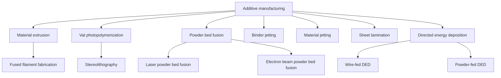
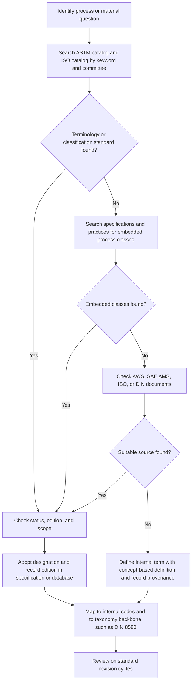

## ASTM Process-Classification Standards


ASTM International (formerly the American Society for Testing and Materials) publishes voluntary consensus standards through technical committees, and several of them classify, name, or categorize manufacturing processes, process outputs, or process-related materials. Unlike ISO, ASTM has no single "manufacturing process taxonomy." Process classification appears in three forms: (1) **terminology standards** (the "E" and process-specific "F", "B", "A" terminology documents) that define process categories; (2) **classification standards** (titled "Standard Classification for...") that sort materials, products, or process outputs into designated classes; and (3) **practice, guide, and specification standards** that embed process classes as a way to specify what was done to a material or part. The most complete ASTM-originated process taxonomy is in additive manufacturing (Committee F42), which is developed jointly with ISO as ISO/ASTM documents. This item explains how ASTM's classification work is organized, how to read and use its standards, which documents matter for process classification, and how ASTM relates to ISO, DIN 8580, and digital classification systems.

### Purpose and Scope

This topic covers:

- The structure of ASTM International and how standards are numbered and revised
- Distinction between terminology, classification, specification, practice, guide, and test method standards
- Additive manufacturing categories as the principal ASTM-originated process taxonomy
- Process-related classification and terminology in metals, plastics, coatings, powder metallurgy, and other domains
- How ASTM designations encode process information (for example, condition and temper codes)
- Relationship to ISO vocabularies, DIN 8580, and digital data standards
- Practical use in specifications, quoting, quality documents, and databases
- Maintenance, licensing, and limitations

**Key Points**

- ASTM standards are documents about *materials, products, systems, and services*. Process classification is present but is usually incidental to the standard's primary purpose, except in additive manufacturing.
- Document numbers, titles, edition years, and status change with revisions and withdrawals. Every citation in this document must be verified against the current ASTM catalog before use in a contract, specification, or compliance record.
- ASTM classification standards are *pragmatic and application-driven*: they answer questions such as "which grade or class does this product belong to?" rather than "what is the complete hierarchy of all manufacturing processes?"
- Effective use usually combines ASTM documents with ISO vocabularies and a taxonomy backbone such as DIN 8580.

### Organization of ASTM International

| Element | Description |
| --- | --- |
| Technical committees | Subject-area committees, each identified by a letter and number (for example, Committee A01 on steel; B07 on light metals; F42 on additive manufacturing) |
| Subcommittees | Subdivisions of a committee handling a topic within its scope |
| Consensus balloting | Standards are approved through balloting among members and stakeholders |
| Society reviews | Standards are reviewed periodically, commonly on a multi-year cycle, then reapproved, revised, or withdrawn |
| Publications | Annual Book of ASTM Standards volumes and individual standards through the ASTM Compass platform; access and licensing terms vary |

Committee names and scopes are illustrative here and should be confirmed against the ASTM committee directory.

### Numbering Convention

An ASTM designation has the form:

```plaintext
[Letter prefix][Serial number]-[Two-digit year of adoption or revision]
Example pattern: F3122-22   (illustrative pattern, not a citation)
Reapproval:      E1234-20(2025)e1   (year in parentheses = last reapproval; e1 = editorial change)
```

| Component | Meaning |
| --- | --- |
| Letter prefix | Subject area: A (ferrous metals), B (nonferrous metals), C (ceramic, concrete, masonry), D (miscellaneous materials, including plastics and coatings), E (miscellaneous subjects), F (materials, products, and systems for specific applications, including additive manufacturing), and others |
| Serial number | Unique identifier within the prefix |
| Year suffix | Year of adoption or last revision |
| Parenthetical year | Year of last reapproval without technical change |
| Epsilon superscript (for example, e1) | Editorial change since the last full revision |

The designation identifies the document, and the year identifies the edition. Both are required to cite a standard precisely.

### Types of ASTM Standards Relevant to Process Classification

| Type | Title Pattern | Role in Classification |
| --- | --- | --- |
| Standard Terminology | "Standard Terminology Relating to..." | Defines terms and, in some areas, process categories |
| Standard Classification | "Standard Classification for..." | Assigns items (materials, products, outputs) to classes, types, or grades |
| Standard Specification | "Standard Specification for..." | Specifies requirements for a product, often using process-based grades or conditions |
| Standard Practice | "Standard Practice for..." | Describes a procedure, sometimes including process classes |
| Standard Guide | "Standard Guide for..." | Offers non-mandatory guidance on selecting or applying processes |
| Standard Test Method | "Standard Test Method for..." | Defines measurement, indirectly relating to process characterization |

**Key Points**

- Only terminology and classification documents directly define categories. Specifications, practices, and guides reference process classes to state requirements.
- A "classification" in ASTM usage does not always mean a manufacturing process classification; it may classify materials by composition, property, or end use.

### Additive Manufacturing: The Principal Process Taxonomy

Committee F42 on additive manufacturing technologies is the most prominent ASTM source of process classification. Its foundational terminology document is published jointly with ISO as the general-principles-and-terminology standard (ISO/ASTM 52900), superseding the earlier ASTM F2792 terminology document. Exact editions and superseded-document status should be verified.

#### The Seven Process Categories

The joint standard defines a set of additive process categories distinguished by how material is added and joined. The wording below is paraphrased for illustration; exact definitions must be taken from the published text.

| Category | Distinguishing Mechanism (paraphrased) | Typical Feedstock | Common Materials |
| --- | --- | --- | --- |
| Material extrusion | Material selectively dispensed through a nozzle or orifice | Filament, pellet, paste | Thermoplastics, composites, pastes |
| Vat photopolymerization | Liquid photopolymer in a vat selectively cured by light | Liquid resin | Photopolymers |
| Powder bed fusion | Thermal energy selectively fuses regions of a powder bed | Powder | Polymers, metals, some ceramics |
| Binder jetting | Liquid bonding agent selectively deposited to join powder | Powder plus binder | Metals, sand, ceramics, polymers |
| Material jetting | Droplets of build material selectively deposited | Liquid photopolymer or wax | Photopolymers, waxes |
| Sheet lamination | Sheets of material bonded to form a part | Sheet or foil | Paper, polymer, metal sheet |
| Directed energy deposition | Focused thermal energy fuses material as it is deposited | Wire or powder | Metals, some polymers |

These seven categories function as a genus-level classification: each category groups multiple commercial process names (for example, selective laser melting and electron beam melting fall under powder bed fusion).

**Example**

A quotation states "3D printed titanium bracket." Using the ASTM/ISO categories, a precise specification would name the category (powder bed fusion or directed energy deposition), the energy source (laser or electron beam), the material designation, and required post-processing (stress relief, hot isostatic pressing, machining). This transforms an ambiguous phrase into a comparable, auditable statement.

#### Other F42 Standards Bearing on Classification

The following types of F42 documents are commonly used alongside the terminology standard. Titles and numbers should be verified.

| Document Type | Purpose |
| --- | --- |
| Standard for file formats (for example, the Additive Manufacturing File Format) | Defines data formats for describing geometry, materials, and process-related information |
| Standards on design (for example, guides for design for additive manufacturing) | Provide design guidance by process category |
| Standards on materials and process specifications | Specify requirements for parts made from specific materials by specific categories (for example, specifications for powder bed fusion of specific alloys) |
| Standards on test methods and qualification | Define testing of AM materials and parts, including orientation and location notation |
| Standard for coordinate systems and test methodologies | Defines a build coordinate system and orientation notation used in reporting |

**Build orientation notation (illustrative)**

AM standards define a Cartesian build coordinate system and orientation codes (for example, indicating the axis along which a specimen's long dimension lies relative to the build direction) so that mechanical properties reported for AM parts can be compared. Exact notation and axis conventions must be taken from the current standard.



### Process Information Embedded in ASTM Designations

Many ASTM standards encode process history in material designations or condition codes. Recognizing these is a practical form of process classification.

| Domain | Example Encoded Process Information | Notes |
| --- | --- | --- |
| Steel product specifications | Product form and process descriptors in the title and scope, such as hot-rolled, cold-rolled, cold-drawn, forged, cast | Grades and finishing treatment (annealed, normalized, quenched and tempered) may be part of the requirements |
| Aluminum and nonferrous alloys | Temper designation systems (letter and digit codes such as F, O, H, T with numeric suffixes) describing strain hardening and heat treatment | Temper designation practice is defined by ANSI H35.1 and referenced in ASTM B-series specifications [Inference: exact cross-references should be verified] |
| Castings | Specifications distinguish castings by process (sand, permanent mold, investment, centrifugal, die) and by grade | Casting specifications often carry supplementary requirements |
| Forgings | Specifications distinguish forging types and required heat treatment conditions | Class or grade often reflects heat-treatment condition |
| Powder metallurgy | Material designation standards for structural PM parts encode material and density or property class | Density and post-sinter treatments affect classification |
| Coatings | Specifications for electroplated, hot-dip, and thermally sprayed coatings specify coating class, type, and thickness | "Class" and "Type" often encode process variants |
| Fasteners | Property class and grade markings, with different classes for different heat-treatment routes | Marking classifies mechanical properties rather than process alone |

**Example: reading a specification for process information**

A steel forging specification's title identifies the product form (forging) and material family, and the scope lists supplementary requirements and heat-treatment options. From the specification alone one can infer that the part is forged, then subject to a heat-treatment condition selected from the allowed set. A buyer specifies the class or grade explicitly to avoid ambiguity.

### ASTM Classification Standards in Depth

"Standard Classification for..." documents provide systems to assign items to categories. Their structure typically includes:

1. **Scope**: what the classification covers.
2. **Referenced documents**: related standards.
3. **Terminology**: definitions of terms used.
4. **Significance and use**: how the classification supports specification and communication.
5. **Classification scheme**: the actual list of classes, types, or grades, often with a designation system.
6. **Keywords**: index terms for retrieval.

#### How Classification Schemes Encode Categories

Two encoding styles are common:

| Style | Description | Example Pattern |
| --- | --- | --- |
| Hierarchical (monocode-like) | Each digit or letter refines the previous | Class → Type → Grade |
| Facet-based (polycode-like) | Independent attributes each get a code position | Material code + property code + condition code |

A facet-based designation can be written as:

$$\text{Designation} = f(\text{attribute}_1, \text{attribute}_2, \dots, \text{attribute}_n)$$

where each attribute is drawn from a controlled list. Facet-based schemes are more flexible but require rules for valid combinations.

#### Illustrative Reading of a Classification Table

The table below shows a *hypothetical* class-type-grade structure to demonstrate how to interpret ASTM-style classification systems. It is not a real standard.

| Class | Type | Grade | Meaning (hypothetical) |
| --- | --- | --- | --- |
| 1 | I | A | Hot-formed, as-fabricated, standard tolerance |
| 1 | I | B | Hot-formed, as-fabricated, tight tolerance |
| 2 | II | A | Cold-formed, stress-relieved, standard tolerance |
| 2 | II | B | Cold-formed, stress-relieved, tight tolerance |

A specifier would then write "Class 2, Type II, Grade B" to indicate the exact process condition and tolerance level, rather than describing them informally.

### Selected Domains with Process-Relevant ASTM Standards

The table lists *types* of ASTM standards, not exhaustive citations. Users must search the ASTM catalog for current documents.

| Domain | Committee (illustrative) | Process-Relevant Content |
| --- | --- | --- |
| Ferrous metals | A01 and related | Product-form and treatment classification in steel and cast iron specifications |
| Nonferrous metals | B-series committees | Casting, wrought product, powder metallurgy, and coating specifications with process descriptors |
| Additive manufacturing | F42 | Process categories, design guidance, materials and process specifications, test methods |
| Plastics | D20 | Terminology and classification of plastics, including material classification systems that relate to processing suitability |
| Surface preparation and coatings | B08, D01 | Classification of coating types and application methods |
| Powder metallurgy | B09 | Material designation and property classification for PM parts |
| Metal-matrix and composite materials | D30 | Composite classification and processing-related terminology |
| Welding | Coordinated with AWS documents; ASTM includes weld-related test and consumable specifications | Weld process classification is principally in AWS documents; ASTM contributes test methods and material specifications |
| Nondestructive testing | E07 | Classification of inspection methods (indirectly relevant to process qualification) |
| Sustainability and lifecycle | E60 | Classification of sustainability aspects of processes |

The plastics area illustrates a nuance: ASTM D4000 (Standard Classification System for Specifying Plastic Materials) and its "line callout" method classify plastics by properties rather than by process, but the classification supports selection for specific processing routes such as injection molding or extrusion [Inference: verify current standard scope].

### Relationship to ISO, DIN 8580, and Other Systems

| System | Type | Relationship to ASTM |
| --- | --- | --- |
| ISO vocabularies | International terminology standards | Dual-logo ISO/ASTM documents (notably additive manufacturing) are jointly developed; other ASTM documents are ASTM-only |
| DIN 8580 | German national process taxonomy | A comprehensive hierarchy; ASTM has no equivalent all-process hierarchy, so practitioners often use DIN 8580 as the backbone and ASTM for detailed material and process specifications |
| AWS | Welding classification and codes | AWS is the primary US source of welding process letter designations and consumable classification; ASTM interacts through materials and test methods |
| SAE and AMS | Aerospace and automotive material and process specifications | Many aerospace process specs are SAE AMS; ASTM standards are frequently cross-referenced |
| ANSI | US national standards coordination | ASTM standards may be approved as American National Standards |
| MIL and government specs | Legacy US defense specifications | Many have been replaced by industry consensus standards, including ASTM |
| CEN/EN | European standards | EN standards may reference or parallel ASTM and ISO documents |

**Example: aligning terminology across systems**

A design team maps "laser sintering" as used on a supplier's quote to ASTM/ISO category powder bed fusion. That category is placed under DIN 8580 primary shaping (as a process that creates shape from formless material). A mapping table records all three labels so that later searches by any system find the same process.

### Using ASTM Standards in Practice

#### Writing Specifications and Purchase Orders

- Cite designation, edition year, and any required class, type, grade, or supplementary requirements.
- State the process category explicitly where it matters (for example, "powder bed fusion per ISO/ASTM 52900, laser source").
- Where a specification permits several conditions, select one explicitly.
- Avoid citing undated standards in contracts unless the intent is to follow the latest edition.

#### Building Databases and Digital Records

- Store the designation and edition as separate fields.
- Keep a mapping between internal process codes and standard categories, with mapping type (exact, broader, narrower, related).
- Record the standard's status (active, withdrawn, superseded) and the review date.

**Example schema sketch**

```plaintext
StandardRef(std_id, body, designation, edition_year, status, title)
ProcessCategory(cat_id, label, definition_source_std_id, parent_cat_id)
ProcessMapping(internal_code, cat_id, mapping_type, notes)   -- exact | broader | narrower | related
PartRecord(part_id, cat_id, spec_std_id, class_or_grade, condition_code)
```

#### Quality and Compliance Documentation

- Reference the exact standard edition on certificates and travelers.
- For AM parts, record process category, machine, material lot, build orientation notation, and post-processing steps to align with qualification standards.
- Use standard test methods for material characterization so that results are comparable across sources.

### Workflow: Locating and Applying an ASTM Classification



### Illustration: Where ASTM Sits in the Classification Landscape

<svg xmlns="http://www.w3.org/2000/svg" viewBox="0 0 720 380" width="720" height="380" font-family="sans-serif" font-size="12">
<title>ASTM in the Classification Landscape (svg_diagram)</title>
<text x="360" y="24" text-anchor="middle" font-size="15" font-weight="bold">ASTM Process-Classification Landscape (svg_diagram)</text>
<rect x="30" y="50" width="200" height="90" rx="6" fill="#cfe8ff" stroke="#1f5fa8" />
<text x="130" y="76" text-anchor="middle" font-weight="bold">Terminology standards</text>
<text x="130" y="96" text-anchor="middle" font-size="11" fill="#555">Define terms and</text>
<text x="130" y="112" text-anchor="middle" font-size="11" fill="#555">process categories</text>
<text x="130" y="128" text-anchor="middle" font-size="10" fill="#555">(example: AM categories)</text>
<rect x="260" y="50" width="200" height="90" rx="6" fill="#d9f2d0" stroke="#3a7d22" />
<text x="360" y="76" text-anchor="middle" font-weight="bold">Classification standards</text>
<text x="360" y="96" text-anchor="middle" font-size="11" fill="#555">Assign items to</text>
<text x="360" y="112" text-anchor="middle" font-size="11" fill="#555">class, type, or grade</text>
<text x="360" y="128" text-anchor="middle" font-size="10" fill="#555">(materials, products)</text>
<rect x="490" y="50" width="200" height="90" rx="6" fill="#ffe3c2" stroke="#b5651d" />
<text x="590" y="76" text-anchor="middle" font-weight="bold">Specifications / practices</text>
<text x="590" y="96" text-anchor="middle" font-size="11" fill="#555">Embed process classes</text>
<text x="590" y="112" text-anchor="middle" font-size="11" fill="#555">in requirements</text>
<text x="590" y="128" text-anchor="middle" font-size="10" fill="#555">(casting, forging, coating)</text>
<line x1="130" y1="140" x2="360" y2="200" stroke="#333" stroke-width="2" />
<line x1="360" y1="140" x2="360" y2="200" stroke="#333" stroke-width="2" />
<line x1="590" y1="140" x2="360" y2="200" stroke="#333" stroke-width="2" />
<rect x="210" y="200" width="300" height="60" rx="6" fill="#f3e5f5" stroke="#7b1fa2" />
<text x="360" y="224" text-anchor="middle" font-weight="bold">Organization-level process mapping</text>
<text x="360" y="244" text-anchor="middle" font-size="11" fill="#555">Internal codes mapped to standard concepts</text>
<line x1="360" y1="260" x2="360" y2="290" stroke="#333" stroke-width="2" />
<rect x="80" y="290" width="240" height="50" rx="6" fill="#fff9c4" stroke="#f9a825" />
<text x="200" y="312" text-anchor="middle" font-weight="bold">Taxonomy backbone</text>
<text x="200" y="328" text-anchor="middle" font-size="11" fill="#555">DIN 8580 main groups</text>
<rect x="400" y="290" width="240" height="50" rx="6" fill="#fff9c4" stroke="#f9a825" />
<text x="520" y="312" text-anchor="middle" font-weight="bold">Digital systems</text>
<text x="520" y="328" text-anchor="middle" font-size="11" fill="#555">Databases, PLM, ontologies</text>
<line x1="360" y1="290" x2="200" y2="290" stroke="#333" stroke-width="2" />
<line x1="360" y1="290" x2="520" y2="290" stroke="#333" stroke-width="2" />
</svg>

### Comparison of ASTM with Other Classification Sources

| Feature | ASTM | ISO | DIN 8580 | AWS |
| --- | --- | --- | --- | --- |
| Scope | Materials, products, systems, services, some process terminology | Broad; many terminology standards | Complete manufacturing process taxonomy | Welding, brazing, cutting, related |
| Process taxonomy completeness | Partial (strong in AM) | Partial and distributed | Comprehensive | Deep within welding |
| Development model | Voluntary consensus by technical committees | Consensus through national bodies | German national standardization | Industry consensus by committees |
| Language | English | English and French official; others in translations | German (translations exist) | English |
| Access model | Purchased or subscribed; some free reading access varies | Purchased | Purchased | Purchased |
| Strength | Detailed material and product specs; AM taxonomy | International, multilingual | Structured hierarchy for all processes | Practical welding classifications |
| Weakness | No unified hierarchy | Fragmented across domains | National origin; less detail for new technologies | Domain-limited |

### Maintenance, Versioning, and Governance

- **Periodic review**: ASTM standards are reviewed on a regular cycle, commonly every few years, then reapproved, revised, or withdrawn.
- **Withdrawal without replacement**: some standards are withdrawn with no successor; identify substitutes carefully.
- **Replacement by joint standards**: AM terminology moved from an ASTM-only document to a joint ISO/ASTM standard; older references may point to withdrawn documents.
- **Track the edition in records**: differences between editions can change definitions or requirements.
- **Redistribution limits**: ASTM standards are copyrighted; quoting definitions extensively in public documents may require permission, so paraphrase and cite [Inference: check current permissions policy].
- **Register of adopted standards**: maintain an internal register with designation, edition, status, owner, and review date.

### Limitations and Pitfalls

**Key Points**

- **No unified process hierarchy**: ASTM does not offer a complete, cross-domain process taxonomy; users must combine sources.
- **Product-centric orientation**: classification is often oriented toward materials and products, so process information is implicit and must be interpreted from titles, scopes, and requirements.
- **Ambiguity of the word "classification"**: some ASTM classifications sort by composition, property, or end use, not by manufacturing process.
- **Citation drift**: secondary sources frequently cite outdated designations or withdrawn editions; verify against the ASTM catalog.
- **Overlap and inconsistency across bodies**: ASTM, ISO, SAE, and AWS may define similar concepts differently; always cite the specific source.
- **Lag behind technology**: fast-moving areas such as AM, hybrid manufacturing, and digital manufacturing evolve faster than revision cycles [Inference].
- **Regional differences in adoption**: ASTM is heavily used in the United States and internationally, but regional buyers may require ISO, EN, JIS, or GB equivalents; equivalence between standards is often approximate, not exact.
- **Access cost and licensing**: purchase or subscription may be required, and internal redistribution rules apply.
- **Behavior disclaimer**: the standard numbers, scopes, structures, and groupings described here are general and may vary by edition, jurisdiction, and adoption; consult the current published documents for authoritative wording.

### Best Practices

1. Search the ASTM and ISO catalogs together before defining any new process term.
2. Cite full designation, edition year, and specific class, type, grade, or condition in specifications.
3. Prefer joint ISO/ASTM standards where available (notably AM) to reduce regional ambiguity.
4. Separate the *process category* (from a terminology standard) from the *material and requirement specification* (from a product standard) in records.
5. Maintain mapping tables between internal codes, ASTM categories, ISO terms, and taxonomy-backbone entries such as DIN 8580.
6. Record the standard status and schedule reviews of adopted references.
7. Use standard test methods and orientation notation consistently so results are comparable across suppliers.
8. Treat withdrawn or superseded standards as historical references and identify current replacements.
9. Paraphrase definitions and cite the source rather than reproducing text.
10. Verify equivalence claims between standards from different bodies; do not assume they are identical.

### Conclusion

ASTM International contributes to process classification mainly through terminology standards, classification standards, and process-aware material and product specifications. Its strongest process taxonomy is in additive manufacturing, where the jointly developed ISO/ASTM terminology standard defines seven process categories that are now widely used across industry and software. Elsewhere, ASTM encodes process information through product-form descriptors, class-type-grade schemes, temper and condition designations, and coating classes, so process classification must often be inferred from specification structure rather than read from a dedicated hierarchy. Because ASTM does not provide a unified taxonomy of all manufacturing processes, effective practice combines ASTM documents with ISO vocabularies, a backbone taxonomy such as DIN 8580, and organization-specific mapping tables. Since designations, editions, and status change over time, rigorous use depends on precise citation, tracked revisions, and verification against the current catalog.

**Related Topics**

- ISO/ASTM 52900 additive manufacturing process categories and terminology
- ASTM F42 additive manufacturing standards portfolio and qualification standards
- Additive manufacturing file formats and data exchange (AMF, 3MF)
- ASTM D4000 and line-callout classification of plastics
- Temper and condition designation systems for aluminum and other alloys
- AWS welding process designations and their relationship to ISO 4063
- SAE AMS aerospace process and material specifications
- DIN 8580 as a taxonomy backbone for mapping standards
- Digital classification systems and ontologies for manufacturing standards
- Standards lifecycle management and edition tracking in PLM systems