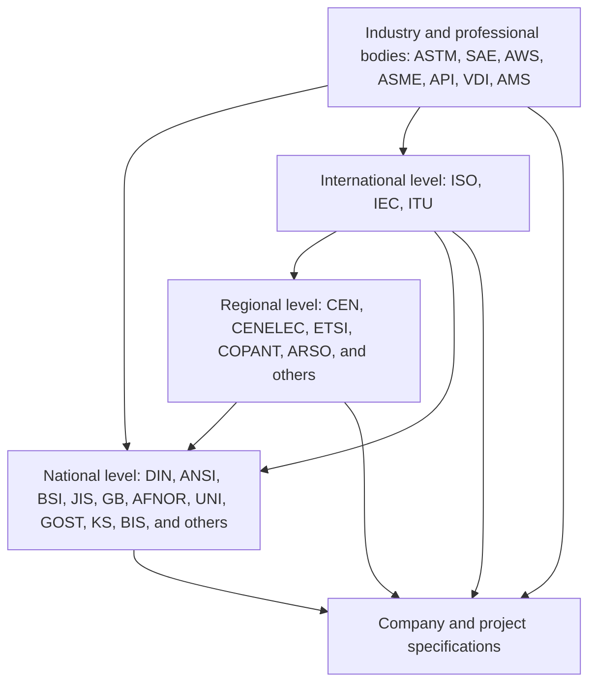
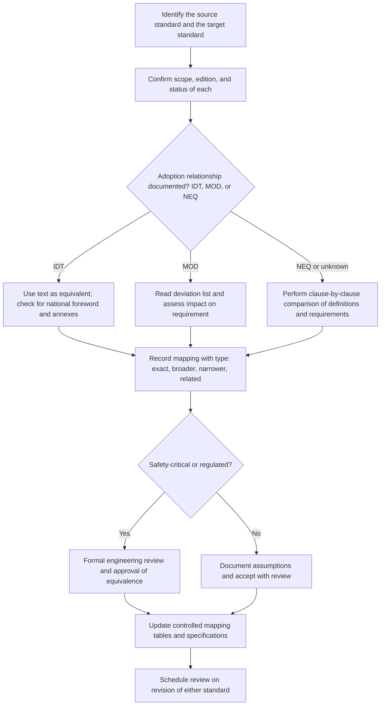

## National and Regional Standard Variations


National and regional standard variations are the differences in terminology, classification schemes, designation systems, process definitions, and technical requirements between standards issued by different standardization bodies: national bodies (DIN, ANSI, BSI, JIS, GB, AFNOR, UNI, GOST, KS, BIS, and others), regional bodies (CEN, CENELEC, COPANT, ARSO, and similar), and industry or professional bodies with international reach (ASTM, SAE, AWS, ASME, API). For manufacturing process classification, these variations determine whether a term such as "casting," "heat treatment," or "hot-rolled" carries the same meaning in a German drawing, a US purchase order, and a Japanese supplier's process sheet. This item explains why variations exist, how national and regional standards relate to ISO, where the practical differences appear in process classification, and how to manage those differences in specifications, databases, and cross-border supply chains.

### Purpose and Scope

This topic covers:

- The structure of the international, regional, and national standardization system
- How national and regional bodies adopt, adapt, or diverge from ISO documents
- Naming and numbering conventions that signal adoption status
- Major national and regional process-classification and terminology systems
- Categories of variation: terminology, taxonomy, designation, units, tolerance, and grade equivalence
- Methods for mapping and reconciling variations
- Practical impacts on drawings, quoting, procurement, and digital records
- Governance, maintenance, and limitations

**Key Points**

- Variations are structural, not accidental: they arise from different industrial histories, regulatory regimes, languages, units, and market practices.
- Adopted does not always mean identical. A national adoption may be identical to the ISO text, modified with national annexes, or only loosely aligned.
- Equivalence tables between standards (for example, steel grade cross-references) are frequently *approximate*; they support screening, not substitution, unless verified against both standards.
- Document numbers, titles, editions, adoption status, and equivalences change over time. Every specific citation here is illustrative and must be verified against the current catalogs of the relevant bodies before use in contracts or compliance records.

### The Standardization Ecosystem



| Level | Examples | Role |
| --- | --- | --- |
| International | ISO, IEC, ITU | Develop consensus standards intended for global use |
| Regional | CEN, CENELEC (Europe), COPANT (Americas), ARSO (Africa), GSO (Gulf) | Harmonize standards across a group of countries; may develop regional standards or adopt international ones |
| National | DIN (Germany), ANSI (US coordination), BSI (UK), JIS/JISC (Japan), SAC/GB (China), AFNOR (France), UNI (Italy), GOST (Russia and some CIS states), KS (Korea), BIS (India), SIS (Sweden), NEN (Netherlands) | Develop national standards, represent the country in ISO and regional bodies, adopt international and regional standards |
| Industry and professional bodies | ASTM International, SAE International, AWS, ASME, API, VDI, VDE | Develop consensus standards for a sector; often used far beyond their home country |
| Organization-level | Company standards, customer specifications, military and government specifications | Add further requirements or restrict options |

The regional layer is especially important in Europe, where the European Committee for Standardization (CEN) works under agreements with ISO and the EU legal framework. European Norms (EN) must be implemented as national standards by CEN members, and conflicting national standards must be withdrawn.

### Relationships Between Standards: Adoption Modes

Adoption modes describe how one standardization body relates its document to another's. Terminology used below follows common ISO and IEC guidance on the degree of correspondence (for example, ISO/IEC Guide 21 on adoption of international standards). Verify current guide numbers and editions.

| Adoption Mode | Meaning | Typical Marking | Practical Consequence |
| --- | --- | --- | --- |
| Identical (IDT) | National or regional document is technically and editorially identical to the source, except for cover, foreword, and minor editorial changes | Prefix combination such as EN ISO, DIN EN ISO, BS EN ISO, or ANSI/ISO | Content matches; language and page layout may differ |
| Modified (MOD) | National document contains technical deviations from the source, identified and explained | National number with note on modification | Requirements or definitions may differ; read the deviation annex |
| Not equivalent (NEQ) | National document is only related in subject matter | National number, sometimes with reference | Do not assume correspondence |
| Reference or cross-reference only | National document simply refers to the international document | Citation in text | Requirements come from the referenced document |
| Translation | National-language version of an identical text | National-language title | Meaning should match, but translation issues can arise |

**Key Points**

- The presence of "ISO" in a designation does not guarantee identical requirements; check the adoption statement in the national foreword.
- Some national bodies adopt ISO documents with national annexes that add requirements (for example, national parameters in tolerancing or safety limits).
- In Europe, the EN prefix indicates a European Norm that CEN members must adopt as national standards; forms such as `DIN EN ISO 1234` show that an ISO document was adopted as an EN and then as a German national standard [Inference: verify the pattern with the specific standard].

### Designation and Numbering Conventions

Designations often reveal adoption history. Patterns below are illustrative.

| Pattern | Reading |
| --- | --- |
| `ISO 12345:YYYY` | International standard, edition year |
| `EN ISO 12345:YYYY` | ISO standard adopted as European Norm |
| `DIN EN ISO 12345:YYYY` | EN ISO standard published as a German national standard |
| `BS EN ISO 12345:YYYY` | EN ISO standard published as a British Standard |
| `ANSI/ASME B46.1-YYYY` | American National Standard developed by ASME |
| `ASTM A123/A123M-YY` | ASTM standard with dual-unit designation (inch-pound and SI "M" versions) |
| `JIS B 0601:YYYY` | Japanese Industrial Standard, with prefix letter for subject area |
| `GB/T 1234-YYYY` | Chinese national standard, recommended (T) rather than mandatory |
| `GB 1234-YYYY` | Chinese national standard, mandatory in the applicable scope |
| `GOST R 12345-YYYY` or `GOST 12345-YY` | Russian national or interstate standard |
| `IS 1234:YYYY` | Indian Standard (BIS) |

Prefix letters and numbering systems are administrative devices whose exact rules differ by body and change over time.

### Categories of Variation Relevant to Process Classification

#### 1. Terminology Variation

The same concept may carry different designations, or the same designation may cover different concepts.

| Concept | Example Variation (illustrative) | Risk |
| --- | --- | --- |
| Machining processes | US "turning," "milling," and "boring" are generally aligned with ISO terms, but colloquial variants differ | Low for core terms, higher for specialized processes |
| Casting variants | "Permanent mold casting" (US) versus "gravity die casting" (UK and other regions) | Misinterpretation of tooling type |
| Forming terms | "Deep drawing" versus "drawing" versus "stamping" used with different scope | Confusion between sheet-forming and wire-drawing |
| Heat-treatment terms | "Hardening" versus "quenching and tempering" scope | Ambiguity about tempering step |
| Plastics processing | "Injection molding" versus "injection moulding" (spelling variants) | Search and mapping failures |
| Joining | "Braze welding" versus "brazing" in different national definitions | Classification errors |
| Surface treatment | "Galvanizing" versus "hot-dip galvanizing" versus "zinc plating" | Different processes with different coating thickness and performance |

Spelling variants (for example, American versus British English) are trivial for humans but can defeat database matching, so controlled vocabularies and synonym lists are needed.

#### 2. Taxonomy Variation

Different systems organize the process space differently.

| System | Organizing Principle |
| --- | --- |
| DIN 8580 series (Germany) | Main groups by manner of cohesion: primary shaping, forming, separating, joining, coating, changing material properties |
| ISO documents | Distributed vocabularies by process family and committee |
| ASTM | Terminology and product-oriented classification; strong in additive manufacturing |
| Japanese (JIS and industry) | Terminology standards by process family; strong influence of industry practice |
| Chinese national standards (GB) | Process classification and terminology documents by industry sector, often aligned with ISO in newer documents [Inference] |
| Russian (GOST) | Historical interstate standards system with terminology and classification documents; some documents remain in use across CIS states |
| Industry taxonomies | Aerospace, automotive, and electronics sectors often maintain their own process lists (for example, aerospace special process lists tied to prime contractor approval) |

Where taxonomies disagree on how to group a process (for example, whether powder metallurgy sintering belongs under primary shaping or under a separate category), mapping requires explicit rules.

#### 3. Designation System Variation

Materials, tempers, and conditions are encoded differently by country.

| Domain | Illustrative Variation |
| --- | --- |
| Steel grades | European EN 10027 naming (by application and property or by chemical composition), US AISI/SAE and UNS numbering, Japanese JIS grade names, Chinese GB grade names, and legacy DIN and BS designations |
| Aluminum alloys | International four-digit alloy series (registered via the Aluminum Association system) used widely; temper designations (F, O, H, T with digits) used broadly but published in national or regional documents such as ANSI H35.1 and EN 515 |
| Copper alloys | UNS numbers, EN designations, and JIS names |
| Fasteners | ISO property classes (for example, 8.8, 10.9), SAE grades, and ASTM classes with different marking systems |
| Surface finish | Roughness parameters ($R_a$) are common internationally; older or national symbols and finish grade systems differ |
| Weld processes | ISO 4063 numeric process references versus AWS letter abbreviations (for example, GTAW, GMAW) |

**Example: weld process designations**

| Process | AWS Letter Designation | ISO 4063 Reference Number (illustrative) |
| --- | --- | --- |
| Gas tungsten arc welding | GTAW | 141 |
| Gas metal arc welding | GMAW | 131 (MIG), 135 (MAG) |
| Shielded metal arc welding | SMAW | 111 |
| Submerged arc welding | SAW | 121 |

The mapping is partly one-to-many: the AWS category GMAW corresponds to more than one ISO reference number depending on the shielding gas. Verify exact codes against the current standards.

#### 4. Unit and Dimensional Convention Variation

| Aspect | Variation |
| --- | --- |
| Units | SI (metric) used almost everywhere except the United States, where inch-pound units remain common, and where dual-unit standards (for example, ASTM "M" versions) exist |
| Thread standards | ISO metric threads versus Unified (UN/UNC/UNF), British Standard Whitworth (BSW/BSP), and NPT pipe threads |
| Sheet and wire gauges | Gauge numbers differ between systems (for example, US Standard, Brown and Sharpe, Birmingham) and are not interchangeable with thickness in millimeters |
| Preferred number series | Renard (R-series) preferred numbers versus inch fractional sizes |
| Drawing conventions | First-angle projection (common in Europe and Asia) versus third-angle projection (common in the US) |
| Tolerance conventions | ISO fit and tolerance system (IT grades, hole-basis and shaft-basis) versus ANSI B4.1 preferred fits with different nomenclature |

**Drawing projection warning**

First-angle and third-angle projections rearrange the view layout. Misreading the projection symbol produces mirrored view interpretations, so drawings crossing regions should display the projection symbol clearly.

#### 5. Tolerance and Requirement Variation

Even when a standard is adopted identically, related standards referenced by it may differ. National standards may define:

- General tolerances for unspecified dimensions (for example, ISO 2768 versus older DIN 7168 and national equivalents)
- Casting tolerance systems (for example, ISO 8062 series versus national or industry casting-tolerance grades)
- Forging tolerances (for example, national forging-tolerance standards with different grade structures)
- Surface texture parameters and evaluation conditions

**Casting tolerance grade systems** are typically stated as a grade $CT$ tied to nominal size ranges, but the numbering and permissible deviations differ between systems, so grades must not be compared by number alone [Inference].

#### 6. Regulatory and Legal Variation

| Aspect | Variation |
| --- | --- |
| Legal status | Some standards are voluntary, some are mandatory by regulation, and some become mandatory only when cited in law or contract (for example, harmonized EN standards under EU directives, or GB mandatory standards in China) |
| Conformity assessment | Marking and certification systems differ (CE marking, UL and other national certification marks, CCC in China, and others) |
| Environmental and chemical restrictions | Substance restrictions and process-emission limits differ between jurisdictions and can restrict process choice or require alternatives |
| Public procurement | Some public buyers require national standards |

These legal differences can change which process options are permissible independent of technical merit.

### Major National and Regional Systems

The table gives orientation only. Details, scope, and numbers must be verified with the relevant body.

| Body | Region | Notable Features for Process Classification |
| --- | --- | --- |
| DIN (Deutsches Institut für Normung) | Germany | DIN 8580 series provides a comprehensive hierarchical manufacturing process taxonomy; many DIN standards were replaced by DIN EN or DIN EN ISO versions; a large body of material and tolerance standards |
| CEN | Europe | EN standards implemented nationally by members; harmonization with ISO under a cooperation agreement; strong influence on material grade designation (for example, EN 10027 for steels) |
| BSI | United Kingdom | BS EN and BS EN ISO adoptions; legacy British Standards for older components; post-Brexit arrangements maintain adoption of many EN standards [Inference: verify current status] |
| AFNOR | France | NF standards, NF EN and NF EN ISO adoptions; historical French standards for some processes |
| UNI | Italy | UNI EN and UNI EN ISO adoptions |
| ANSI | United States | Coordinates the US standards system, accredits standards developers (such as ASME, ASTM, SAE, AWS), and represents the US in ISO |
| ASTM International | United States and global | Material and product specifications, test methods, and AM terminology with ISO |
| SAE International | United States and global | Automotive and aerospace standards, including AMS aerospace material and process specifications |
| ASME | United States and global | Codes such as boiler and pressure vessel codes, and standards such as those on surface texture and dimensioning |
| AWS | United States and global | Welding process designations, consumable classifications, and welding codes |
| JISC and JIS | Japan | Japanese Industrial Standards, with JIS marks; many aligned with ISO but with distinct designations and legacy documents |
| SAC and GB | China | Mandatory (GB) and recommended (GB/T) standards; substantial alignment with ISO in newer documents; industry standards with their own prefixes |
| BIS | India | Indian Standards (IS), with adoption or alignment to ISO in many areas |
| KATS and KS | South Korea | Korean Industrial Standards, often aligned with ISO and JIS |
| GOST and interstate councils | Russia and CIS | GOST standards with an extensive historical system; both national (GOST R) and interstate (GOST) documents |
| ABNT | Brazil | NBR standards, many adopted from ISO and IEC |
| SANS | South Africa | SANS standards, many adopted from ISO |
| GSO and SASO | Gulf and Saudi Arabia | Regional and national standards and conformity marks |

### The German DIN 8580 Series as a Reference Taxonomy

DIN 8580 is frequently used as a backbone for process classification even outside Germany because it offers a complete hierarchy. Its structure is a widely cited example of national-level process taxonomy.

| Main Group | Concept | Subordinate Standard (illustrative) |
| --- | --- | --- |
| 1. Primary shaping | Creating shape from formless material by creating cohesion | DIN 8580 defines the group; subordinate standards detail subgroups |
| 2. Forming | Changing shape while retaining mass and cohesion | Subordinate DIN 8582 to 8586 cover forming by compressive, combined tensile and compressive, tensile, bending, and shearing conditions (verify numbers) |
| 3. Separating | Local reduction of cohesion | DIN 8588 (severing), DIN 8589 (machining with geometrically defined and undefined cutting edges), and others |
| 4. Joining | Connecting workpieces permanently | DIN 8593 series |
| 5. Coating | Applying an adherent layer | DIN 8580 defines the group; details in related documents |
| 6. Changing material properties | Modifying properties by structural change | DIN 8580 defines the group; details in related documents |

Numbers of subordinate standards above are listed from general knowledge and must be verified, as revisions and renumbering occur [Inference].

**Example: mapping across systems**

| Process Name | DIN 8580 Group | ISO or ASTM Term (illustrative) | AWS or Other Designation |
| --- | --- | --- | --- |
| Sand casting | Primary shaping | Casting terminology in ISO foundry documents | Not applicable |
| Laser powder bed fusion | Primary shaping | Powder bed fusion (ISO/ASTM 52900 category) | Not applicable |
| Closed-die forging | Forming | Forging terminology | Not applicable |
| Milling | Separating (machining with geometrically defined cutting edges) | Milling | Not applicable |
| Gas tungsten arc welding | Joining | ISO 4063 process 141 | AWS GTAW |
| Case hardening | Changing material properties | Heat treatment terminology (ISO) | Not applicable |

### Steel Grade Equivalence: A Standard Example of Variation Risk

Cross-reference tables between steel designation systems are commonly used but carry known risks.

| Example Approximate Correspondence (illustrative only) | Caution |
| --- | --- |
| A structural carbon steel in EN, ASTM, and JIS systems may appear in cross-reference tables as "roughly equivalent" | Chemical composition ranges, mechanical property requirements, test conditions, and thickness limits differ; verify against each specification before substitution |
| A stainless steel commonly listed as similar across AISI, EN, and JIS designations | Small differences in composition limits, permitted residuals, and product form requirements can affect corrosion resistance and weldability |
| Alloy steels for quenching and tempering | Hardenability requirements and test methods (for example, end-quench methods) may differ |

**Key Points**

- "Equivalent" in a table generally means "similar and commonly substituted after verification," not "interchangeable without review."
- Substitution should be documented and approved by an engineer with authority over the design, especially in safety-critical applications.
- Some industries (aerospace, pressure equipment, nuclear) prohibit substitution without formal approval.

### Method: Reconciling Variations

A systematic reconciliation approach reduces errors.



**Mapping types**

| Mapping Type | Meaning | Example |
| --- | --- | --- |
| Exact | Concepts and requirements identical | An EN ISO adoption and its ISO source with identical text |
| Broader | Source concept is a superset of the target | Generic "heat treatment" mapped to specific "case hardening" |
| Narrower | Source concept is a subset of the target | "Case hardening" mapped to generic "heat treatment" |
| Related | Concepts overlap but neither contains the other | Regional casting terms with partially overlapping scope |
| None | No suitable correspondence | Process with no equivalent in the target system |

The mapping types mirror common thesaurus and ontology practice.

### Illustration: Layered Standard Variation

<svg xmlns="http://www.w3.org/2000/svg" viewBox="0 0 720 400" width="720" height="400" font-family="sans-serif" font-size="12">
<title>Layers of Standard Variation (svg_diagram)</title>
<text x="360" y="24" text-anchor="middle" font-size="15" font-weight="bold">Layers of National and Regional Standard Variation (svg_diagram)</text>
<rect x="260" y="45" width="200" height="50" rx="6" fill="#cfe8ff" stroke="#1f5fa8" />
<text x="360" y="68" text-anchor="middle" font-weight="bold">International (ISO, IEC)</text>
<text x="360" y="86" text-anchor="middle" font-size="10" fill="#555">Global consensus text</text>
<line x1="320" y1="95" x2="180" y2="140" stroke="#333" stroke-width="2" />
<line x1="400" y1="95" x2="540" y2="140" stroke="#333" stroke-width="2" />
<rect x="80" y="140" width="200" height="50" rx="6" fill="#d9f2d0" stroke="#3a7d22" />
<text x="180" y="163" text-anchor="middle" font-weight="bold">Regional (CEN, COPANT)</text>
<text x="180" y="181" text-anchor="middle" font-size="10" fill="#555">Harmonized regional norms</text>
<rect x="440" y="140" width="200" height="50" rx="6" fill="#ffe3c2" stroke="#b5651d" />
<text x="540" y="163" text-anchor="middle" font-weight="bold">Industry bodies</text>
<text x="540" y="181" text-anchor="middle" font-size="10" fill="#555">ASTM, SAE, AWS, ASME</text>
<line x1="180" y1="190" x2="120" y2="240" stroke="#333" stroke-width="2" />
<line x1="180" y1="190" x2="240" y2="240" stroke="#333" stroke-width="2" />
<line x1="540" y1="190" x2="480" y2="240" stroke="#333" stroke-width="2" />
<line x1="540" y1="190" x2="600" y2="240" stroke="#333" stroke-width="2" />
<rect x="30" y="240" width="180" height="50" rx="6" fill="#f3e5f5" stroke="#7b1fa2" />
<text x="120" y="262" text-anchor="middle" font-weight="bold">National: DIN, BSI, AFNOR</text>
<text x="120" y="280" text-anchor="middle" font-size="10" fill="#555">IDT, MOD, or NEQ adoption</text>
<rect x="220" y="240" width="180" height="50" rx="6" fill="#f3e5f5" stroke="#7b1fa2" />
<text x="310" y="262" text-anchor="middle" font-weight="bold">National: JIS, GB, KS, BIS</text>
<text x="310" y="280" text-anchor="middle" font-size="10" fill="#555">Alignment varies by area</text>
<rect x="410" y="240" width="140" height="50" rx="6" fill="#f3e5f5" stroke="#7b1fa2" />
<text x="480" y="262" text-anchor="middle" font-weight="bold">National: ANSI, GOST</text>
<text x="480" y="280" text-anchor="middle" font-size="10" fill="#555">System-specific</text>
<rect x="560" y="240" width="140" height="50" rx="6" fill="#f3e5f5" stroke="#7b1fa2" />
<text x="630" y="262" text-anchor="middle" font-weight="bold">Company specs</text>
<text x="630" y="280" text-anchor="middle" font-size="10" fill="#555">Add or restrict options</text>
<line x1="120" y1="290" x2="360" y2="335" stroke="#333" stroke-width="2" />
<line x1="310" y1="290" x2="360" y2="335" stroke="#333" stroke-width="2" />
<line x1="480" y1="290" x2="360" y2="335" stroke="#333" stroke-width="2" />
<line x1="630" y1="290" x2="360" y2="335" stroke="#333" stroke-width="2" />
<rect x="200" y="335" width="320" height="45" rx="6" fill="#fff9c4" stroke="#f9a825" />
<text x="360" y="356" text-anchor="middle" font-weight="bold">Mapping and reconciliation layer</text>
<text x="360" y="372" text-anchor="middle" font-size="10" fill="#555">Controlled vocabularies, cross-reference tables, engineering review</text>
</svg>

### Practical Impact Areas

#### Drawings and Technical Data Packages

- State the governing standard and edition in the title block or notes, and name the standards for general tolerances, surface finish, threads, and weld symbols.
- Confirm the projection method and unit system on the drawing.
- Where a drawing crosses regions, include both designation systems for materials (for example, "EN 10025-2 S355J2, equivalent to a named alternative subject to approval").
- Weld symbols may follow ISO 2553 or AWS A2.4 conventions, which differ in symbol layout and reading conventions, so state which is used [Inference: verify current document numbers].

#### Quoting and Procurement

- Ask suppliers which standards they use for processes and tolerances, and whether they hold approvals under those standards.
- Require suppliers to identify substitutions of materials or processes explicitly.
- For multinational sourcing, make the governing standard part of the contract, since national defaults may otherwise apply.

#### Process Planning and Databases

- Store the standard body, designation, edition, and status as separate fields.
- Keep synonym tables for spelling and regional term variants.
- Model the mapping between internal process codes and external standards with mapping type and verification date.

**Example schema sketch**

```plaintext
Standard(std_id, body, designation, edition_year, status, language, adoption_mode, source_std_id)
Concept(concept_id, preferred_label, definition, source_std_id)
Designation(concept_id, language, term, region, status)      -- preferred | admitted | deprecated
CrossReference(from_std_id, to_std_id, mapping_type, verified_by, verified_date, notes)
```

#### Quality, Testing, and Certification

- Test methods differ between standards (specimen geometry, temperature, loading rate); results under different methods may not be directly comparable.
- Certificates of conformity should cite the exact standard, edition, and grade.
- Notified bodies and accredited laboratories may recognize only certain standards for a given regulatory purpose.

#### Digital Systems and Data Exchange

- Product data exchange standards such as ISO 10303 (STEP) rely on controlled vocabularies but may carry national or company extensions.
- Classification systems for parts and catalogs (for example, eCl@ss, UNSPSC, ETIM, and the ISO 13584 PLIB framework) organize items by different taxonomies, so cross-mapping is required for multi-system integration.
- Language localization of process names and definitions should be handled by concept-based termbases rather than by string translation.

### Selected Domain Variations

#### Steel and Ferrous Products

- European EN designation systems encode either application and property or chemical composition; US systems (AISI/SAE, UNS) use numeric codes; Japanese and Chinese systems use their own alphanumeric names.
- Product-form specifications differ in permitted tolerances, testing frequency, and delivery condition symbols.

#### Aluminum and Nonferrous Alloys

- Alloy numbering is broadly international, but temper designation documents and chemical limit tables are published in national or regional standards, and small variations exist.
- Casting alloy designations differ by region (for example, EN and US systems name cast alloys differently).

#### Welding

- AWS letter designations and ISO 4063 numbers coexist; qualification systems differ (for example, procedure qualification under ASME Section IX versus EN ISO 15614 series), and the acceptance criteria for welders and procedures are not identical.
- Weld symbol conventions differ between ISO and AWS practice.

#### Threads and Fasteners

- Metric (ISO), Unified inch (UN series), Whitworth-based, and pipe thread systems (NPT, BSP) coexist; thread forms can look similar but do not mate reliably (for example, some pipe threads with similar diameters).
- Fastener property classes and markings differ between ISO, SAE, and ASTM systems.

#### Surface Finish and Coatings

- Roughness parameters are widely aligned, but evaluation conditions and cut-off filters have changed across editions, and older drawings may reference superseded conventions.
- Coating thickness and salt-spray requirements vary by standard, and "zinc plating" versus "hot-dip galvanizing" carries different thickness and durability expectations.

#### Plastics and Rubber

- Material classification systems for plastics differ between ISO and ASTM (for example, ISO 1043 symbols and ISO designation systems versus ASTM line-callout classification), so the same resin may be specified using different property frameworks.
- Test conditions (conditioning, temperature, humidity) and specimen preparation methods can differ.

### Comparison of Selected National and Regional Characteristics

| Aspect | Germany / DIN | Europe / CEN | United States | Japan / JIS | China / GB |
| --- | --- | --- | --- | --- | --- |
| Process taxonomy | Comprehensive DIN 8580 hierarchy | Largely harmonizes with ISO; limited unified taxonomy | No unified hierarchy; sectoral and materials standards | Sectoral terminology standards | Sectoral standards; growing ISO alignment |
| Unit system | SI | SI | Mixed; inch-pound common | SI | SI |
| Drawing projection | First angle | First angle | Third angle | First angle | First angle |
| Material designation | EN and legacy DIN | EN | AISI/SAE, UNS, ASTM | JIS names | GB names |
| Standards development model | National standards institute | Regional body with national members | Multiple accredited developers | National committee system | State-led with industry input |
| Legal role | Voluntary unless cited in law or contract | Harmonized standards support EU directives | Voluntary unless cited by regulation or contract | Some JIS marks tied to certification | GB mandatory versus GB/T recommended |

This table simplifies complex systems and should be used only as orientation [Inference].

### Governance and Maintenance

- **Standards register**: maintain an internal list of adopted standards by body, designation, edition, status, adoption mode, and owner.
- **Revision monitoring**: subscribe to update services or check catalogs periodically; national adoptions of international revisions may lag behind the source by months or years.
- **Withdrawal tracking**: national standards may be withdrawn on adoption of EN or ISO replacements; older drawings may cite withdrawn documents.
- **Legacy documents**: keep a mapping from superseded designations to current ones so old drawings and records remain interpretable.
- **Approval workflow for equivalence**: require engineering sign-off for material or process substitutions across standards.
- **Multi-language management**: use concept-based termbases and validated translations for cross-border documentation.
- **Copyright and licensing**: standards are copyrighted; quote sparingly and cite editions, and follow the licensing terms for internal copies and redistribution.

### Limitations and Pitfalls

**Key Points**

- **False equivalence**: cross-reference tables are aids, not proof of interchangeability; small differences in composition limits, test methods, or tolerances can matter.
- **Hidden national annexes**: identical-looking adoptions may include national foreword statements or annexes that alter requirements.
- **Edition mismatch**: two bodies may cite different editions of the same underlying source, causing subtle differences.
- **Terminology drift in translation**: translated terms may not align with concept definitions; verify against the concept, not the word.
- **Legacy standards persist**: withdrawn standards remain embedded in old drawings, supplier documents, and habits.
- **Fragmented taxonomies**: no single global taxonomy covers all processes, so mapping is necessary and imperfect.
- **Regulatory divergence**: legal requirements can override technical preferences and can differ by market.
- **Update lag and access barriers**: revisions propagate at different speeds, and cost or language barriers can limit access to authoritative text.
- **Overconfidence in automation**: automated mapping or machine translation of process and material designations can propagate errors without expert review [Inference].
- **Behavior disclaimer**: the standard numbers, adoption practices, scopes, and regional characteristics described here are general and may vary by edition, jurisdiction, industry sector, and time; consult the current published documents and the relevant standards body for authoritative information.

### Best Practices

1. Identify the governing standard, body, and edition explicitly on every drawing, specification, and purchase order.
2. Check the adoption mode (identical, modified, or not equivalent) and read national forewords and annexes.
3. Treat cross-reference tables as screening aids and verify equivalence against both source documents before substitution.
4. Use controlled vocabularies with synonym and regional-variant handling, and separate concept identifiers from language-specific terms.
5. Record mapping types (exact, broader, narrower, related) with verification dates and reviewers.
6. Require formal engineering approval for cross-standard substitutions in safety-critical or regulated products.
7. State units, projection method, and general-tolerance standards on drawings that will cross regions.
8. Track revisions and withdrawals across all adopted bodies, and maintain mappings from legacy designations.
9. Clarify with suppliers which standards and qualification systems they use for processes, welding, testing, and inspection.
10. Use a backbone taxonomy such as DIN 8580 and concept-based termbases to keep cross-system mappings consistent, and paraphrase rather than copy standard text.

### Conclusion

National and regional standard variations reflect the layered structure of global standardization: international bodies such as ISO publish consensus documents, regional bodies such as CEN harmonize across groups of countries, national bodies adopt or adapt them, industry bodies such as ASTM, SAE, and AWS add sector-specific specifications, and organizations layer on their own requirements. The variations that matter most for process classification are differences in terminology, taxonomy structure, material and process designation systems, units and drawing conventions, tolerance systems, and legal status. Because "adopted" does not always mean "identical" and cross-reference tables are only approximate, robust practice depends on citing exact standards and editions, verifying adoption modes, maintaining controlled vocabularies with typed mappings, and applying engineering review to substitutions. Managed this way, variation becomes a documented and traceable part of the process-classification system rather than a source of hidden error.

**Related Topics**

- ISO adoption modes and ISO/IEC Guide 21 on degree of correspondence
- CEN and EN harmonization, and the relationship to EU directives
- DIN 8580 to DIN 8593 series as a national process taxonomy
- Steel, aluminum, and copper alloy designation systems and cross-referencing
- ISO 4063 and AWS welding process designations and weld-symbol standards
- First-angle versus third-angle projection and international drawing conventions
- General tolerance and casting or forging tolerance standards across systems
- Concept-based termbases, multilingual terminology management, and localization
- Catalog and product classification systems (eCl@ss, UNSPSC, ETIM, ISO 13584)
- Standards lifecycle management, legacy-document mapping, and supply-chain compliance