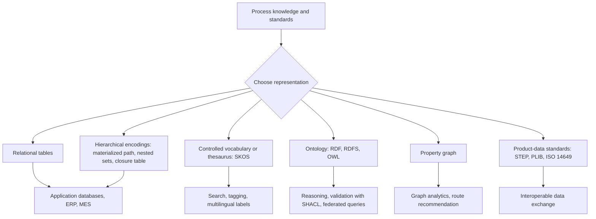
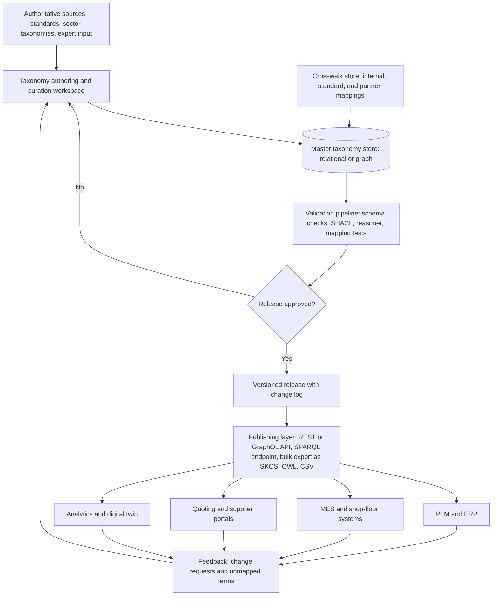

## Digital and Database-Oriented Process Taxonomies


Digital and database-oriented process taxonomies are machine-readable classification structures that represent manufacturing processes, their attributes, and their relationships in forms that software can store, query, validate, exchange, and reason over. Where a printed standard offers definitions and hierarchies for human readers, a digital taxonomy adds unique identifiers, formal relationships, controlled property definitions, versioning, and programmatic access, so that a CAD/CAM system, a quoting engine, a PLM platform, a supplier-capability database, and an analytics pipeline can all refer to "laser powder bed fusion" and mean the same concept. This item explains the design of such taxonomies, the main representation technologies (relational schemas, hierarchical encodings, controlled vocabularies, ontologies, knowledge graphs, and product-data standards), the existing digital dictionaries and data models relevant to manufacturing processes, and the engineering practices needed to build, map, validate, and maintain them.

### Purpose and Scope

This topic covers:

- Why machine-readable taxonomies differ from printed classifications
- Core design elements: concepts, identifiers, labels, hierarchies, facets, properties, and relations
- Storage and representation options, from relational tables to RDF/OWL and property graphs
- Existing standards and platforms that provide digital classification of processes and related items
- Mapping between taxonomies (crosswalks) and entity resolution
- Querying, reasoning, and validation
- Integration with PLM, MES, ERP, CAPP, quoting, and digital-twin systems
- Governance, versioning, quality metrics, and limitations

**Key Points**

- A digital taxonomy separates the **concept** (with a stable identifier) from its **labels** (names in various languages), so renaming or translating never breaks references.
- Hierarchy alone is rarely sufficient. Manufacturing knowledge is multi-dimensional (mechanism, material, energy source, feedstock state, geometry produced), so facet-based and graph-based structures are commonly layered over a simple tree.
- No single digital taxonomy covers all manufacturing processes. Practical systems combine standards-based vocabularies, sector taxonomies, and organization-specific extensions, connected by explicit mappings.
- Specific standards, dictionary contents, platform features, and identifier schemes evolve. Statements below describe general design, and specific documents, versions, and tools must be verified against current publications before use.

### Why Digital Taxonomies Differ from Printed Classifications

| Aspect | Printed Standard | Digital Taxonomy |
| --- | --- | --- |
| Identity | Section number that may change between editions | Persistent unique identifier (URI, IRDI, code) independent of position |
| Structure | Linear document with hierarchy and cross-references | Explicit graph or tables with typed relations |
| Access | Human reading and search | API, query language, and bulk export |
| Multilingual support | Parallel translated documents or annexes | Language-tagged labels attached to a single concept |
| Change management | New edition | Versioned concepts with deprecation and replacement links |
| Validation | Editorial review | Automated consistency checks and schema validation |
| Reuse | Manual transcription | Import, reference, and federation |
| Reasoning | Human interpretation | Rule-based inference, subsumption, and constraint checking |

The move to digital form changes classification from a *lookup document* to an *infrastructure component* that other systems depend on.

### Core Design Elements

#### Concept, Label, Definition, and Identifier

| Element | Role | Design Guidance |
| --- | --- | --- |
| Concept | The unit of meaning (for example, "powder bed fusion") | One concept per distinct meaning; avoid merging near-synonyms with different scope |
| Identifier | Stable reference to the concept | Opaque, persistent, never reused; do not embed meaning that may change |
| Preferred label | Primary name per language | One per language per concept |
| Alternative labels | Synonyms, abbreviations, regional variants | Support search and mapping |
| Definition | Concept-based statement of meaning | Cite the source standard and edition; paraphrase when licensing requires |
| Notes and examples | Clarification | Keep separate from the definition |
| Status | Active, deprecated, proposed, withdrawn | Include replacement pointers for deprecated concepts |
| Provenance | Source, author, date, version | Enable audit and trust assessment |

**Opaque versus meaningful identifiers**

Meaningful codes (for example, hierarchical numeric codes) are readable but embed the structure into the identifier, so restructuring the hierarchy forces identifier changes. Opaque identifiers avoid this, at the cost of readability. A common compromise is an opaque persistent identifier plus a separate, changeable notation field for human-readable codes.

#### Hierarchy

The generic (is-a) hierarchy organizes concepts from broad to specific. A concept with parent $p$ inherits the parent's characteristics and adds delimiting ones. In a strict tree, each concept has one parent; in a directed acyclic graph (DAG), a concept can have several parents.

$$\text{Ancestors}(c) = \{ p \mid c \sqsubseteq^{+} p \}, \qquad \text{Descendants}(c) = \{ d \mid d \sqsubseteq^{+} c \}$$

where $\sqsubseteq^{+}$ denotes the transitive closure of the is-a relation. Queries such as "find all processes that are kinds of joining" use descendants of the joining concept.

**Multiple inheritance** is common in manufacturing. For example, "laser welding" is both a kind of *welding* (by the joining mechanism) and a kind of *beam process* (by the energy source), so a DAG or facet model is more natural than a strict tree.

#### Facets (Polyhierarchical Attributes)

Faceted classification describes each process using independent dimensions, each with its own controlled list.

| Facet | Example Values |
| --- | --- |
| Process mechanism | Casting, forming, material removal, joining, additive deposition, heat treatment, coating |
| Material state during shaping | Liquid, plastic solid, elastic solid, powder, sheet |
| Energy source | Mechanical, thermal, chemical, electrical, optical (laser), electron beam |
| Feedstock form | Ingot, billet, sheet, powder, wire, filament, resin |
| Geometry class produced | Prismatic, axisymmetric, sheet-like, hollow, freeform |
| Tooling type | Hard tooling, soft tooling, tool-less, fixture-only |
| Automation level | Manual, semi-automated, fully automated |
| Typical volume range | Prototype, low, medium, high |

A process $P$ is then a record over facets:

$$P = (f_1, f_2, \dots, f_n), \quad f_i \in V_i$$

where $V_i$ is the controlled value set for facet $i$. Facets support flexible filtering (for example, "thermal energy, powder feedstock, tool-less") that a single tree cannot.

#### Properties and Capability Attributes

Beyond classification, digital taxonomies often attach *properties* to process concepts or to process instances:

| Property Group | Example Properties | Typical Data Type |
| --- | --- | --- |
| Geometric capability | Max part envelope, minimum feature size, wall thickness limits | Numeric with units and range |
| Accuracy | Achievable tolerance grade, repeatability | Numeric or enumerated |
| Surface | Typical roughness $R_a$ range | Numeric range |
| Materials | Compatible material classes | Reference to material taxonomy |
| Throughput | Cycle time, build rate | Numeric with units |
| Cost structure | Tooling class, setup time | Numeric or enumerated |
| Constraints | Undercut handling, draft requirements | Boolean or enumerated |

Capability values are typically *typical ranges*, not guarantees, and should be tagged with source, date, and applicability conditions [Inference].

**Property definition rigor**

A robust dictionary defines each property once, with a data type, unit, permissible value range, and definition, and then references it from multiple classes. This mirrors the approach of property-dictionary standards described below.

#### Relations

| Relation Type | Description | Manufacturing Example |
| --- | --- | --- |
| Generic (is-a) | Subclass relationship | Laser powder bed fusion is a kind of powder bed fusion |
| Partitive (part-of, has-part) | Composition | A machining route has-part a turning operation |
| Sequential (precedes, follows) | Ordering | Heat treatment follows rough machining |
| Requires / uses | Dependency | Injection molding requires a mold; welding uses a filler material |
| Produces | Output | Casting produces a near-net-shape blank |
| Suitable-for | Compatibility | Die casting suitable-for aluminum alloys |
| Equivalent-to / related-to | Cross-taxonomy correspondence | Local term maps to a standard concept |
| Replaced-by | Lifecycle | Deprecated concept replaced by a newer concept |

Typed relations let queries traverse the taxonomy (for example, "find processes that produce a near-net-shape blank and are suitable for titanium").

### Representation Technologies



#### Relational Representation

Relational databases are the most common storage for taxonomies embedded in enterprise systems.

**Adjacency list**

Each row references its parent.

```sql
CREATE TABLE process_concept (
    concept_id   TEXT PRIMARY KEY,           -- opaque persistent identifier
    notation     TEXT,                       -- human-readable code, may change
    status       TEXT NOT NULL,              -- active | deprecated | proposed
    parent_id    TEXT REFERENCES process_concept(concept_id),
    source_std   TEXT,                       -- provenance
    edition_year INT
);

CREATE TABLE process_label (
    concept_id   TEXT REFERENCES process_concept(concept_id),
    lang         TEXT NOT NULL,              -- BCP 47 language tag
    label        TEXT NOT NULL,
    label_type   TEXT NOT NULL,              -- preferred | alternative | deprecated
    PRIMARY KEY (concept_id, lang, label, label_type)
);
```

Adjacency lists are simple and easy to update, but retrieving all descendants needs recursive queries.

**Recursive query example (standard SQL recursive common table expression)**

```sql
WITH RECURSIVE descendants AS (
    SELECT concept_id, parent_id, 1 AS depth
    FROM process_concept
    WHERE concept_id = 'JOINING'
    UNION ALL
    SELECT c.concept_id, c.parent_id, d.depth + 1
    FROM process_concept c
    JOIN descendants d ON c.parent_id = d.concept_id
)
SELECT concept_id, depth FROM descendants;
```

**Alternative hierarchy encodings**

| Encoding | Idea | Strengths | Weaknesses |
| --- | --- | --- | --- |
| Adjacency list | Parent pointer per row | Simple, easy writes | Recursive queries for subtrees |
| Materialized path | Store the full path (for example, `/1/4/7/`) | Fast subtree queries via prefix match | Path updates on moves; length limits |
| Nested sets | Store left and right interval numbers | Fast subtree and ancestor queries | Expensive inserts and moves |
| Closure table | Store every ancestor-descendant pair with depth | Very fast queries; supports DAGs | Larger storage; maintenance on changes |

A closure table for a DAG stores all reachability pairs:

$$\text{Closure} = \{ (a, d, k) \mid d \text{ is a descendant of } a \text{ at distance } k \}$$

with $(a, a, 0)$ included for reflexive queries.

**Facet and relation tables**

```sql
CREATE TABLE facet_value (
    facet_id   TEXT,
    value_id   TEXT,
    PRIMARY KEY (facet_id, value_id)
);

CREATE TABLE process_facet (
    concept_id TEXT REFERENCES process_concept(concept_id),
    facet_id   TEXT,
    value_id   TEXT,
    PRIMARY KEY (concept_id, facet_id, value_id)
);

CREATE TABLE concept_relation (
    from_id    TEXT REFERENCES process_concept(concept_id),
    rel_type   TEXT NOT NULL,          -- part_of | precedes | requires | produces | suitable_for
    to_id      TEXT NOT NULL,
    PRIMARY KEY (from_id, rel_type, to_id)
);
```

#### Controlled Vocabularies and SKOS

The Simple Knowledge Organization System (SKOS), a W3C recommendation, represents thesauri and classification schemes in RDF. It provides properties for preferred and alternative labels, hierarchy (broader and narrower), associative links (related), and cross-scheme mappings.

| SKOS Element | Meaning |
| --- | --- |
| `skos:Concept` | A unit of thought in the scheme |
| `skos:ConceptScheme` | The taxonomy as a whole |
| `skos:prefLabel` / `skos:altLabel` | Preferred and alternative labels, language-tagged |
| `skos:broader` / `skos:narrower` | Hierarchical relations |
| `skos:related` | Associative relation |
| `skos:exactMatch`, `skos:closeMatch`, `skos:broadMatch`, `skos:narrowMatch`, `skos:relatedMatch` | Cross-scheme mapping relations |
| `skos:definition`, `skos:note`, `skos:example` | Documentation properties |

**Example (Turtle syntax, illustrative)**

```turtle
@prefix skos: <http://www.w3.org/2004/02/skos/core#> .
@prefix ex:   <http://example.org/process/> .

ex:PowderBedFusion a skos:Concept ;
    skos:inScheme ex:ProcessScheme ;
    skos:prefLabel "powder bed fusion"@en ;
    skos:prefLabel "Pulverbettschmelzen"@de ;
    skos:altLabel "PBF"@en ;
    skos:broader ex:AdditiveManufacturing ;
    skos:definition "Additive process in which thermal energy selectively fuses regions of a powder bed."@en ;
    skos:exactMatch <http://example.org/external/PBF-001> .

ex:LaserPowderBedFusion a skos:Concept ;
    skos:prefLabel "laser powder bed fusion"@en ;
    skos:broader ex:PowderBedFusion .
```

SKOS is lightweight and well suited to controlled vocabularies and mappings, but it does not support rich logical constraints. The definition above is a paraphrase written for illustration, not a quotation of any standard.

#### Ontologies: RDF, RDFS, and OWL

An ontology adds formal semantics: classes, properties, domains and ranges, cardinality constraints, and logical axioms. OWL (Web Ontology Language) supports reasoning such as classification and consistency checking.

**Modeling example in description-logic notation**

$$\text{LaserWelding} \equiv \text{Welding} \sqcap \exists \text{usesEnergySource}.\text{LaserBeam}$$


$$\text{Welding} \sqsubseteq \text{JoiningProcess}$$

From these axioms, a reasoner can infer that any process asserted to be a welding process using a laser energy source is an instance of `LaserWelding` and, transitively, of `JoiningProcess`.

**Use of the reasoner**

| Capability | Example |
| --- | --- |
| Subsumption | Infer that laser welding is a joining process |
| Instance classification | Automatically classify a process instance based on its properties |
| Consistency checking | Detect that a process cannot be both a "material removal" and an "additive deposition" process if those classes are declared disjoint |
| Domain and range inference | Infer that anything with a `requiresTool` relation is a tooled process |

**Open-world versus closed-world assumption**

OWL uses the open-world assumption: missing information is unknown, not false. Databases usually assume a closed world. This difference influences validation. Constraint languages such as SHACL (Shapes Constraint Language) are typically used to validate RDF data with closed-world style checks.

**SHACL example (illustrative)**

```turtle
@prefix sh: <http://www.w3.org/ns/shacl#> .
@prefix ex: <http://example.org/process/> .

ex:ProcessShape a sh:NodeShape ;
    sh:targetClass ex:Process ;
    sh:property [
        sh:path ex:hasMechanism ;
        sh:minCount 1 ;
        sh:message "Every process must declare exactly one primary mechanism." ;
        sh:maxCount 1 ;
    ] ;
    sh:property [
        sh:path ex:typicalToleranceMm ;
        sh:datatype <http://www.w3.org/2001/XMLSchema#decimal> ;
        sh:minInclusive 0 ;
    ] .
```

#### Property Graph Representation

Property graph databases (for example, systems using Cypher or Gremlin-style query languages) store nodes and edges with properties. They are convenient for path queries, recommendation, and analytics.

**Example (Cypher-style, illustrative)**

```plaintext
// Find processes suitable for titanium that produce a near-net-shape blank
MATCH (p:Process)-[:SUITABLE_FOR]->(:Material {name: "titanium alloy"}),
      (p)-[:PRODUCES]->(:Output {name: "near-net-shape blank"})
RETURN p.name, p.typicalToleranceMm
```

Query languages, syntax, and features differ by product and version.

#### Choosing Among Representations

| Need | Suitable Choice |
| --- | --- |
| Simple in-app taxonomy with fast writes | Relational adjacency list or closure table |
| Multilingual vocabulary with mappings | SKOS |
| Logical reasoning and rigorous semantics | OWL with SHACL validation |
| Route search and graph analytics | Property graph |
| Machine-readable interchange with property definitions | Product-data dictionary standards (below) |
| Mixed needs | Layered architecture: relational or graph store for operations, with SKOS or OWL export for interchange |

### Existing Digital Classification Systems and Dictionaries

The following are representative systems relevant to manufacturing and industrial classification. Their scope, content, versions, licensing, and coverage of *processes* specifically vary considerably and must be verified against current documentation. Many classify products and components rather than processes.

| System | Type | Relevance to Process Classification |
| --- | --- | --- |
| ISO 13584 (PLIB, parts library) | Standard for computer-interpretable dictionaries of parts and their properties | Defines a class hierarchy with properties and identifiers; used for product and property definitions; process coverage is limited |
| IEC 61360 and ISO 29002 (property and class dictionaries; identification schemes) | Data element types and dictionary structure; identifier schemes for exchange of characteristic data | Provides unique identifiers (for example, IRDI) and structured property definitions usable for process capabilities |
| IEC Common Data Dictionary (CDD) | Dictionary of classes and properties for electrotechnical domains, built on IEC 61360 | Illustrates the identifier and property model; coverage centered on electrotechnical items |
| ISO 10303 (STEP) application protocols | Product-data exchange with defined data models | Includes representations of manufacturing features and process-related data in specific application protocols |
| ISO 14649 (STEP-NC) | Data model for CNC machining operations | Models operations, features, and machining strategies for numerical control |
| ISO 15926 | Data integration for process-industry lifecycle information | Reference data libraries and semantic modeling approach |
| ISO 23247 series | Digital twin framework for manufacturing | Framework requiring consistent process and resource terminology |
| ASTM/ISO additive manufacturing standards | Terminology and data-format documents | Defines AM process categories and file formats that can seed AM taxonomies |
| eCl@ss | Cross-industry product classification and description standard | Classes and properties for products and services; some coverage of manufacturing services and machines [Inference] |
| ETIM | Classification for technical products, mainly installation and electrical sectors | Product-centered; limited process coverage |
| UNSPSC | Taxonomy for products and services in procurement | Includes service categories that touch manufacturing services; coarse for process detail |
| NAICS, ISIC, and similar | Industry classification systems | Classify establishments by economic activity, providing rough process-related categories |
| HS/CN tariff nomenclatures | Trade classification | Products by material and processing state; occasional process-based distinctions |
| MTConnect | Open, read-only data standard for machine-tool data | Standardizes machine data items and vocabulary for equipment monitoring, relevant to process data streams |
| OPC UA companion specifications | Information models for industrial equipment | Includes models for machine tools, additive equipment, and others [Inference: verify specific companion specifications] |
| Asset Administration Shell (AAS) | Digital representation of assets in Industry 4.0 architectures | Submodels can carry process and capability descriptions with references to dictionary identifiers |
| Capability, skill, and service ontologies (research and industry efforts) | Ontological models of manufacturing capabilities | Represent processes, resources, and skills in semantic form; maturity varies |
| Domain ontologies such as those from industrial ontology initiatives | Upper and mid-level ontologies for industrial data | Provide reusable classes for processes, resources, and products; adoption varies |

**Key Points**

- Many well-known digital classification systems classify *products and components*, not processes. Process taxonomies are often built by extending them or by constructing domain-specific vocabularies.
- Property dictionaries (IEC 61360-style) are valuable because they define each characteristic once with a globally unique identifier, data type, and unit.
- The Asset Administration Shell and OPC UA models are important for *runtime* data exchange, where taxonomy identifiers label the meaning of data points.

### Identification Schemes and Persistent Identifiers

| Scheme | Description | Use |
| --- | --- | --- |
| URI or IRI | Web-style identifier, resolvable or not | RDF, SKOS, OWL, linked data |
| IRDI (International Registration Data Identifier) | Structured identifier defined under ISO/IEC 6523 and ISO 29002-style schemes, combining registration authority, item code, and version | Dictionary entries in property libraries |
| URN | Location-independent name | Long-lived references in documents |
| Internal surrogate key | Database-generated key | Application-internal joins |
| DOI or handle | Persistent identifier for documents and datasets | Citing standards or datasets |

**Guidance**

- Use identifiers that are stable, globally unique, and never reassigned.
- Keep version information explicit: either version-specific identifiers or a version attribute, with rules for how references behave when concepts change.
- Where external dictionaries assign identifiers, store them as mapped references rather than replacing internal identifiers.

### Mapping and Crosswalks

Real systems must reconcile multiple taxonomies: internal codes, supplier codes, standards-based vocabularies, and sector taxonomies.

#### Mapping Relations

| Relation | Meaning | SKOS Analogue |
| --- | --- | --- |
| Exact | Same meaning and scope | `skos:exactMatch` |
| Close | Very similar, may differ slightly | `skos:closeMatch` |
| Broader | Source concept is more general than target | `skos:broadMatch` |
| Narrower | Source concept is more specific than target | `skos:narrowMatch` |
| Related | Overlapping or associative | `skos:relatedMatch` |
| None | No correspondence | (no mapping) |

#### Crosswalk Table Design

```sql
CREATE TABLE crosswalk (
    from_scheme   TEXT,
    from_id       TEXT,
    to_scheme     TEXT,
    to_id         TEXT,
    match_type    TEXT NOT NULL,      -- exact | close | broader | narrower | related
    confidence    REAL,               -- 0..1 for automated matches
    verified_by   TEXT,
    verified_date DATE,
    notes         TEXT,
    PRIMARY KEY (from_scheme, from_id, to_scheme, to_id)
);
```

#### Automated Matching Techniques

| Technique | Idea | Limitation |
| --- | --- | --- |
| Exact and normalized string matching | Compare cleaned labels (case, spelling, punctuation) | Misses synonyms and translations |
| Fuzzy string similarity | Edit distance, token-set similarity | False positives for similar words with different meanings |
| Embedding-based similarity | Compare vector representations of labels and definitions | Sensitive to domain and model; needs review [Inference] |
| Structural matching | Compare neighborhood in the hierarchy | Requires comparable structures |
| Definition-based matching | Compare definition text | Sensitive to wording and licensing |
| Instance-based matching | Compare objects classified under each concept | Needs shared instance data |
| Rule- and dictionary-based | Use synonym lists and rules | Requires maintenance |

A simple string-similarity score, for example the Jaccard similarity of token sets $A$ and $B$, is:

$$J(A, B) = \frac{|A \cap B|}{|A \cup B|}$$

Automated matches should be treated as *candidates* for human validation, particularly in safety-critical or regulated contexts, because similar labels can hide different scope (for example, "galvanizing" versus "electroplating").

**Example**

| Internal Label | Candidate Standard Concept | Match Type | Notes |
| --- | --- | --- | --- |
| "3D printing (metal, laser)" | Laser powder bed fusion | close | May also cover directed energy deposition; verify machine and process |
| "Die cast" | High-pressure die casting | broader | Also covers low-pressure and gravity die casting in some usages |
| "Turning" | Turning | exact | Verify against local definition |
| "Anodize" | Anodizing | exact | Confirm type and specification class |

### Data Quality and Validation

| Check | Purpose | Method |
| --- | --- | --- |
| Uniqueness | No duplicate identifiers or duplicate preferred labels per language | Constraints and unique indexes |
| Referential integrity | Every parent, relation target, and mapping target exists | Foreign keys or SHACL |
| Acyclicity | No cycles in the is-a hierarchy | Graph traversal check |
| Completeness | Required attributes present (definition, source, status) | Schema validation |
| Consistency | Disjoint classes not overlapped; facet values valid | Reasoner or rules |
| Orphan detection | Concepts without parents (other than roots) | Query checks |
| Label conflicts | Same label for different concepts | Duplicate-label report |
| Deprecation hygiene | Deprecated concepts point to replacements; no new use of deprecated items | Lifecycle rules |
| Unit and range validity | Property values within valid ranges and correct units | Datatype and range checks |
| Mapping consistency | Mapping types respect hierarchy (an exact match should not map one concept to two unrelated ones) | Cross-checks |

**Cycle check on the is-a graph**

A simple algorithm is a depth-first search that marks nodes as *visiting* and *visited*; encountering a *visiting* node indicates a cycle.

```python
def has_cycle(children):  # children: dict[node] -> list of child nodes
    WHITE, GRAY, BLACK = 0, 1, 2
    color = {n: WHITE for n in children}
    for nbrs in list(children.values()):
        for m in nbrs:
            color.setdefault(m, WHITE)

    def dfs(u):
        color[u] = GRAY
        for v in children.get(u, []):
            if color[v] == GRAY:
                return True
            if color[v] == WHITE and dfs(v):
                return True
        color[u] = BLACK
        return False

    return any(color[n] == WHITE and dfs(n) for n in list(color))
```

**Output**

For `{"A": ["B"], "B": ["C"], "C": ["A"]}` the function returns `True`, and for `{"A": ["B", "C"], "B": [], "C": []}` it returns `False`.

### Quality Metrics

| Metric | Definition | Use |
| --- | --- | --- |
| Coverage | Fraction of real-world items (parts, processes, suppliers) that can be classified | Measures fitness for purpose |
| Mapping completeness | Fraction of internal concepts with at least one verified mapping | Tracks integration progress |
| Ambiguity rate | Fraction of items with multiple plausible classifications | Signals overlapping concepts |
| Depth balance | Distribution of concept depths | Detects overly deep or flat areas |
| Label duplication rate | Fraction of labels attached to more than one concept | Detects naming conflicts |
| Inter-annotator agreement | Agreement between independent classifiers, for example Cohen's kappa | Measures reliability of classification guidelines |
| Staleness | Fraction of concepts not reviewed within the review interval | Governance metric |

Cohen's kappa for two annotators is:

$$\kappa = \frac{p_o - p_e}{1 - p_e}$$

where $p_o$ is the observed agreement and $p_e$ is the agreement expected by chance. Low kappa on a category indicates unclear definitions.

### Integration with Enterprise and Manufacturing Systems

| System | How the Taxonomy Is Used |
| --- | --- |
| PLM | Classify parts and route templates; enable reuse search; store process references on BOM and routing entries |
| ERP | Standardize routing operations, work-center capabilities, and cost-center mapping |
| MES | Map executed operations to standardized process concepts; label data collected on the shop floor |
| CAPP | Retrieve candidate process plans by process and feature classes; validate process sequences |
| CAD/CAM | Associate features with process capability constraints; drive automated DFM checks |
| Quoting and RFQ platforms | Match part requirements to supplier capabilities by process, material, and tolerance |
| Supplier capability databases | Represent each supplier's processes, equipment, certifications, and capacity using controlled terms |
| Quality systems | Link inspection plans and special-process approvals to process concepts |
| Digital twin and analytics | Give semantic meaning to sensor and event data; support cross-plant benchmarking |
| Sustainability and cost tools | Attach energy, emissions, and cost factors to process classes |

**Supplier matching as a taxonomy query**

A part requires process $r_1$ (powder bed fusion), material $m$ (titanium alloy), and tolerance class $t$. A supplier $s$ qualifies if its declared capabilities subsume the requirement:

$$\text{Qualifies}(s, \text{part}) \iff \exists\, c \in \text{Cap}(s): \; \text{process}(c) \sqsubseteq \text{process}(r_1) \;\wedge\; m \in \text{materials}(c) \;\wedge\; \text{tol}(c) \leq t$$

This formulation shows why hierarchy matters: a supplier declaring the specific process "laser powder bed fusion" qualifies for a request for the general category "powder bed fusion." Note the direction of subsumption. A supplier that only declares the broad category does not necessarily qualify for a request naming a specific sub-process [Inference: depends on the matching policy adopted].

### Architecture Pattern



### Illustration: From Concept to Data Records

<svg xmlns="http://www.w3.org/2000/svg" viewBox="0 0 720 400" width="720" height="400" font-family="sans-serif" font-size="12">
<title>Concept-Centered Taxonomy Model (svg_diagram)</title>
<text x="360" y="24" text-anchor="middle" font-size="15" font-weight="bold">Concept-Centered Digital Taxonomy Model (svg_diagram)</text>
<rect x="270" y="150" width="180" height="70" rx="8" fill="#cfe8ff" stroke="#1f5fa8" stroke-width="2" />
<text x="360" y="178" text-anchor="middle" font-weight="bold">Process Concept</text>
<text x="360" y="196" text-anchor="middle" font-size="11" fill="#555">persistent identifier</text>
<text x="360" y="211" text-anchor="middle" font-size="11" fill="#555">status, definition, source</text>
<rect x="30" y="50" width="170" height="60" rx="6" fill="#d9f2d0" stroke="#3a7d22" />
<text x="115" y="75" text-anchor="middle" font-weight="bold">Labels</text>
<text x="115" y="93" text-anchor="middle" font-size="11" fill="#555">multilingual, synonyms</text>
<line x1="200" y1="90" x2="270" y2="165" stroke="#333" stroke-width="2" />
<rect x="270" y="50" width="180" height="60" rx="6" fill="#d9f2d0" stroke="#3a7d22" />
<text x="360" y="75" text-anchor="middle" font-weight="bold">Hierarchy</text>
<text x="360" y="93" text-anchor="middle" font-size="11" fill="#555">is-a, DAG or tree</text>
<line x1="360" y1="110" x2="360" y2="150" stroke="#333" stroke-width="2" />
<rect x="520" y="50" width="170" height="60" rx="6" fill="#d9f2d0" stroke="#3a7d22" />
<text x="605" y="75" text-anchor="middle" font-weight="bold">Facets</text>
<text x="605" y="93" text-anchor="middle" font-size="11" fill="#555">mechanism, energy, feedstock</text>
<line x1="520" y1="95" x2="450" y2="165" stroke="#333" stroke-width="2" />
<rect x="30" y="260" width="170" height="60" rx="6" fill="#ffe3c2" stroke="#b5651d" />
<text x="115" y="285" text-anchor="middle" font-weight="bold">Properties</text>
<text x="115" y="303" text-anchor="middle" font-size="11" fill="#555">typed, with units and ranges</text>
<line x1="200" y1="280" x2="290" y2="220" stroke="#333" stroke-width="2" />
<rect x="270" y="260" width="180" height="60" rx="6" fill="#ffe3c2" stroke="#b5651d" />
<text x="360" y="285" text-anchor="middle" font-weight="bold">Typed relations</text>
<text x="360" y="303" text-anchor="middle" font-size="11" fill="#555">requires, produces, precedes</text>
<line x1="360" y1="260" x2="360" y2="220" stroke="#333" stroke-width="2" />
<rect x="520" y="260" width="170" height="60" rx="6" fill="#f3e5f5" stroke="#7b1fa2" />
<text x="605" y="285" text-anchor="middle" font-weight="bold">Crosswalk mappings</text>
<text x="605" y="303" text-anchor="middle" font-size="11" fill="#555">exact, close, broader, narrower</text>
<line x1="520" y1="280" x2="430" y2="220" stroke="#333" stroke-width="2" />
<text x="360" y="365" text-anchor="middle" font-size="11" fill="#555">Identity is separated from labels, structure, properties, and mappings so each can change independently.</text>
</svg>

### Worked Example: Building a Small Process Taxonomy

**Goal**: represent a subset of processes for a supplier-capability database with multilingual labels, facets, and mappings to an external vocabulary.

**Step 1: Define scope and top-level structure**

Top-level concepts follow the DIN 8580-style main groups: primary shaping, forming, separating, joining, coating, changing material properties.

**Step 2: Define facets**

| Facet | Values |
| --- | --- |
| Material state | liquid, plastic solid, powder, sheet, wire |
| Energy source | mechanical, thermal, laser, electron beam, chemical, electrical |
| Tooling | hard tooling, soft tooling, tool-less |

**Step 3: Create concepts**

| Concept ID | Preferred Label (en) | Parent | Facets |
| --- | --- | --- | --- |
| PRC-0001 | Primary shaping | root | n/a |
| PRC-0010 | Additive manufacturing | PRC-0001 | tool-less |
| PRC-0011 | Powder bed fusion | PRC-0010 | powder, thermal |
| PRC-0012 | Laser powder bed fusion | PRC-0011 | powder, laser |
| PRC-0013 | Electron beam powder bed fusion | PRC-0011 | powder, electron beam |
| PRC-0020 | Casting | PRC-0001 | liquid, hard tooling or soft tooling |
| PRC-0021 | High-pressure die casting | PRC-0020 | liquid, hard tooling |

**Step 4: Add relations and properties**

```plaintext
PRC-0021  suitable_for   MAT-ALUMINUM-ALLOY
PRC-0021  produces       OUT-NEAR-NET-SHAPE
PRC-0021  typicalRaUm    min=0.8  max=3.2      (source: internal survey, 2025)
PRC-0012  suitable_for   MAT-TITANIUM-ALLOY
PRC-0012  precedes       PRC-0300 (Heat treatment)   -- typical route relation
```

Property values above are illustrative and would need sourcing.

**Step 5: Add multilingual labels and mapping**

| Concept | Language | Label | Type |
| --- | --- | --- | --- |
| PRC-0012 | en | laser powder bed fusion | preferred |
| PRC-0012 | en | LPBF | alternative |
| PRC-0012 | de | Laserstrahlschmelzen im Pulverbett | preferred |
| PRC-0012 | en | selective laser melting | alternative (deprecated in controlled documents) |

| From | To | Match Type |
| --- | --- | --- |
| PRC-0011 | External additive category "powder bed fusion" | exact |
| PRC-0012 | External term "selective laser melting" | close |

**Step 6: Validate and publish**

Run uniqueness, acyclicity, orphan, and label-conflict checks; review mappings; release version 1.0 with a change log.

**Output**

A versioned taxonomy that supports queries such as: "list all descendants of powder bed fusion that are suitable for titanium, with any label in German," and that maps cleanly to external vocabularies.

### Versioning and Lifecycle

| Concern | Recommended Practice |
| --- | --- |
| Release management | Semantic-style versioning (major.minor.patch) with change logs; major versions for structural changes |
| Concept lifecycle | Statuses: proposed, active, deprecated, retired; deprecated concepts must carry a replacement pointer |
| Backward compatibility | Never reuse identifiers; keep deprecated identifiers resolvable |
| Change requests | Formal request process with rationale, impact analysis, and reviewer sign-off |
| Effective dating | Allow validity periods so historical records interpret concepts as they were at the time |
| Migration | Provide scripts to update references when concepts merge or split |
| Publication | Publish diffs between versions to downstream consumers |

**Merge and split handling**

When two concepts merge, one is deprecated and points to the survivor. When a concept splits, the original becomes a broader parent or is deprecated with multiple suggested replacements; records classified under the old concept may need manual review to select the correct child.

### Governance and Roles

| Role | Responsibility |
| --- | --- |
| Taxonomy owner | Overall accountability, scope, and policy |
| Domain experts (process engineers, metallurgists) | Validate definitions, facets, and capability properties |
| Terminologist or information architect | Enforce concept-based modeling, labels, and relation types |
| Data steward | Monitor quality metrics, mappings, and downstream data conformance |
| Integrator or developer | Implement APIs, imports, and synchronization |
| Change control board | Approve releases and structural changes |

### Security, Licensing, and Interoperability Considerations

- **Copyright and licensing**: standards texts and some classification systems are licensed; store paraphrased definitions with citations rather than copying licensed text, and check redistribution terms of any imported taxonomy [Inference: verify each license].
- **Access control**: capability data about suppliers or proprietary processes may be commercially sensitive; apply role-based access and data-classification labels.
- **Interoperability formats**: provide exports in common formats (CSV, JSON, RDF serializations such as Turtle and JSON-LD) so partners can integrate without proprietary tooling.
- **API stability**: version APIs and identifiers so downstream systems are not broken by taxonomy updates.
- **Federation**: linked-data approaches allow referencing external concepts by identifier without duplicating them, at the cost of dependence on external availability.

### Limitations and Pitfalls

**Key Points**

- **No universal process ontology**: existing digital classification systems cover products and components far better than processes; process taxonomies typically require local curation or assembly from several sources.
- **Modeling overreach**: heavy ontology engineering can outpace the organization's ability to populate and maintain it; start with a minimal, well-governed core.
- **Mixing classification with capability**: a process concept describes *what a process is*, whereas a supplier's capability describes *what a particular machine or shop can do*; conflating them produces misleading matches.
- **Identifier misuse**: embedding meaning in codes or reusing retired identifiers breaks historical records.
- **Automated mapping errors**: string- and embedding-based matches can link concepts with similar names but different scope; human validation is needed for consequential mappings [Inference].
- **Hierarchy bias**: forcing a single hierarchy hides valid alternative viewpoints, which facets and multiple parents can address.
- **Granularity mismatch**: a taxonomy too coarse cannot support quoting or planning; one too fine is costly to maintain and hard to classify consistently.
- **Stale capability data**: typical ranges and supplier declarations age; record dates and sources and review regularly.
- **Open-world versus closed-world confusion**: reasoning results may surprise developers accustomed to closed-world database semantics, so validation and reasoning roles should be separated deliberately.
- **Vendor and tool dependence**: proprietary tools may lock in structures; prefer open formats and export capability.
- **Behavior disclaimer**: the standards, dictionaries, platforms, query languages, and technical behaviors described here are general and may vary by version, implementation, and vendor; verify against current documentation before adoption.

### Best Practices

1. Separate concept identity (persistent, opaque identifier) from labels, notation, structure, and mappings.
2. Start with a minimal core taxonomy aligned to a recognized backbone, then extend through governed change requests.
3. Combine a generic hierarchy with facets rather than forcing all dimensions into one tree.
4. Define every property once, with data type, unit, range, and definition, and reference it from classes.
5. Keep classification concepts distinct from supplier or machine capability records.
6. Store mappings as typed, verified crosswalk records (exact, close, broader, narrower, related) with reviewer and date.
7. Use automated matching only to propose candidates, and require expert review for consequential mappings.
8. Validate continuously: uniqueness, referential integrity, acyclicity, disjointness, and mapping consistency.
9. Version releases, deprecate rather than delete, and provide replacement pointers and migration guidance.
10. Expose the taxonomy through stable APIs and open interchange formats, and monitor quality metrics such as coverage, ambiguity, and staleness.
11. Paraphrase and cite source standards, respecting licensing, and record provenance for every definition.
12. Involve domain experts, information architects, and data stewards together in governance.

### Conclusion

Digital and database-oriented process taxonomies turn classification into shared infrastructure. By giving each process concept a persistent identifier, multilingual labels, a definition with provenance, hierarchical and faceted structure, typed relations, controlled properties, and verified mappings to other vocabularies, they let PLM, ERP, MES, CAPP, quoting, and analytics systems exchange and reason about manufacturing processes consistently. Implementation options range from relational schemas with closure tables to SKOS vocabularies, OWL ontologies validated with SHACL, and property graphs, and are often layered in a single architecture. Existing dictionary and data-model standards such as ISO 13584, IEC 61360, STEP, STEP-NC, and the Asset Administration Shell supply valuable building blocks, though few classify processes comprehensively, so most organizations assemble a taxonomy from standards-based vocabularies, sector taxonomies, and local extensions linked by explicit crosswalks. Sustained value depends on disciplined governance: versioning, deprecation, validation, quality metrics, and human review of mappings.

**Related Topics**

- SKOS thesauri and multilingual controlled vocabularies for manufacturing
- OWL ontologies and SHACL validation for process and capability models
- Closure-table and graph-database techniques for hierarchical data
- ISO 13584 (PLIB), IEC 61360, and ISO 29002 dictionary and identifier schemes
- ISO 10303 (STEP) and ISO 14649 (STEP-NC) process and feature data models
- Asset Administration Shell submodels and OPC UA information models for machines
- Manufacturing capability and skill ontologies for supplier matching
- Crosswalk and entity-resolution methods for taxonomy mapping
- Taxonomy governance, versioning, and change-control workflows
- Knowledge graphs for process-route recommendation and digital twins