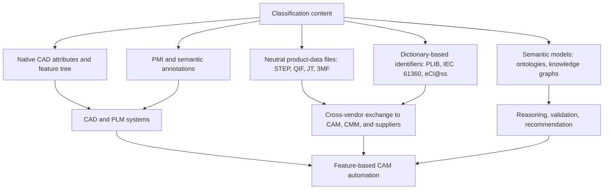
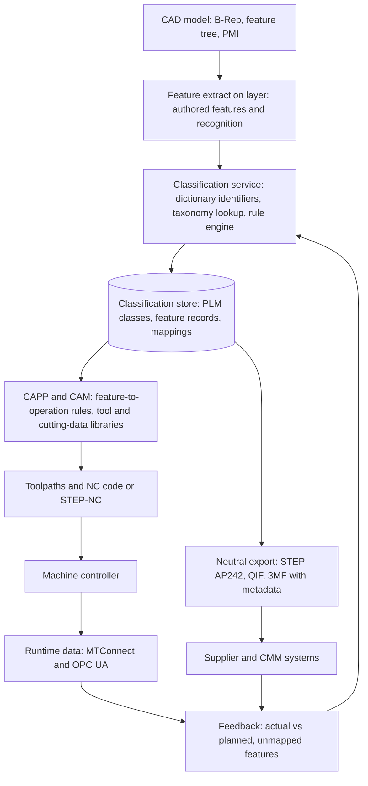

## Machine-Readable Classification for CAD and CAM Systems


Machine-readable classification for CAD and CAM systems is the practice of attaching computer-interpretable class, feature, material, tolerance, and process labels to geometry and product data, so that design software, manufacturing-planning software, and downstream systems can search, validate, and act on them automatically without a human re-reading a drawing. In CAD, classification identifies what an object *is* (part family, standard component, feature type, material class); in CAM, it identifies what must be *done* to it (machining features, operation types, process families, tool classes, inspection requirements). The value lies in the bridge between them: a hole recognized as a "blind, threaded, M8 hole" in CAD can be mapped to a drill-then-tap operation in CAM, and both can reference the same controlled vocabulary and identifiers. This item explains what is classified, how classification is encoded (native attributes, neutral file formats, product-data standards, property dictionaries, and semantic models), how features are recognized or authored, how classification drives CAM automation, and how to govern and validate it.

### Purpose and Scope

This topic covers:

- Objects and attributes that CAD and CAM systems classify
- Encoding mechanisms: native metadata, neutral formats, product-manufacturing information (PMI), feature models, and dictionary-based identifiers
- Relevant standards and formats (STEP, STEP-NC, QIF, JT, 3MF, AMF, MTConnect, OPC UA, and related)
- Feature recognition versus feature-based design as sources of classification
- Mapping features to process families, operations, tools, and cost drivers
- Group technology coding and part-family classification in CAD/PLM
- Semantic and ontology-based approaches
- Data-exchange, interoperability, and validation practices
- Governance, versioning, and limitations

**Key Points**

- Geometry alone is not classification. A boundary-representation (B-Rep) solid contains faces, edges, and vertices; *classification* is the additional layer that says "these faces form a counterbored hole."
- Classification enters a CAD model in three ways: authored by the designer (feature-based modeling and annotations), inferred by software (automatic feature recognition), or imported from external data (PLM classes, supplier catalogs, standard-part libraries).
- Neutral formats differ in how much classification they preserve. Geometry-only formats lose most semantic information; product-data standards preserve more but depend on the implementation of the sending and receiving systems.
- Specific standards, application protocols, software behaviors, and file-format capabilities evolve and vary by vendor and version. The statements below describe general practice, and details must be verified against current documentation.

### What Gets Classified

| Object | Example Classification Values | Primary Consumer |
| --- | --- | --- |
| Part or product | Part family, commodity class, make/buy, standard/custom, GT code | PLM, ERP, sourcing |
| Assembly component | Fastener, bearing, housing, standard part class | BOM, procurement |
| Geometric feature | Hole, pocket, slot, boss, rib, fillet, chamfer, thread, groove | CAM, DFM checkers |
| Feature attribute | Diameter, depth, thread pitch, corner radius, draft angle | CAM, inspection |
| Material | Material class, grade, specification, heat-treat condition | CAM, procurement, simulation |
| Tolerance and datum | Size tolerance, geometric tolerance type, datum reference frame | CAM, CMM, quality |
| Surface condition | Roughness $R_a$ class, finish type, coating requirement | CAM, finishing |
| Process requirement | Process family, special process (heat treat, plating), qualification | Process planning, suppliers |
| Operation | Turning, milling, drilling, tapping, grinding, EDM, additive build | CAM |
| Tool | Tool type, diameter, flute count, holder, tool material | CAM, tool management |
| Machine and resource | Machine type, axes count, envelope, controller | CAM, scheduling |
| Inspection feature | Characteristic type, measurement method, sampling | Quality systems |
| Manufacturing route | Sequence of process classes | CAPP, MES |

### Encoding Mechanisms



#### 1. Native CAD Attributes and Feature Trees

Most CAD systems store metadata and features in a proprietary model:

- **Custom properties or attributes**: key-value fields on parts and assemblies (for example, material, finish, part class, process note).
- **Feature tree (history-based modeling)**: parametric features such as extrude, cut, hole wizard, fillet, and pattern, each of which carries type and parameters.
- **Classification fields synchronized with PLM**: class hierarchies with attribute sets managed in a PLM or library system, exposed to CAD as properties.
- **Standard-part libraries**: catalog components with class and property definitions (for example, fastener libraries).
- **Feature libraries and templates**: reusable, classified feature definitions such as standard counterbores and O-ring grooves.

**Strengths**: rich, editable, tied to design intent.

**Weaknesses**: proprietary; semantics may be lost or flattened on export; naming varies by vendor and by user.

#### 2. Product and Manufacturing Information (PMI)

PMI carries tolerances, datums, surface finish, notes, and dimensions directly on the 3D model rather than on a 2D drawing.

| PMI Type | Representation | Use |
| --- | --- | --- |
| Graphical PMI | Visual presentation (lines, text) with limited semantics | Human reading |
| Semantic (machine-readable) PMI | Structured tolerance and datum entities associated to specific faces or features | CAM, CMM programming, automated checking |

Semantic PMI is the classification layer that lets downstream systems know, for example, that a specific cylindrical face carries a position tolerance of a given value relative to specific datums. The degree of PMI support, association fidelity, and interoperability varies by system and file version [Inference].

Relevant standards for the underlying tolerancing semantics include the ISO GPS (Geometrical Product Specifications) family, ASME Y14.5 in the United States, and the model-based-definition guidance in ASME Y14.41 and ISO 16792 (verify current editions and numbers).

#### 3. Neutral Product-Data Files

| Format / Standard | Scope | Classification-Relevant Content |
| --- | --- | --- |
| ISO 10303 (STEP), AP203 and AP214 (legacy) | Product structure and geometry | Basic geometry, assembly structure, some attributes; AP214 added color, layers, and some features [Inference: coverage varies by implementation] |
| ISO 10303-242 (STEP AP242) | Managed model-based 3D engineering | Semantic PMI, GD&T, kinematics, tessellated geometry, and product classification hooks; the current mainstream STEP protocol for model-based definition |
| ISO 10303-238 and ISO 14649 (STEP-NC) | Machining process data for CNC | Machining operations, features, tools, and strategies in a machine-independent form |
| ISO 10303-224 | Mechanical product definition for process planning (machining features) | Feature definitions used for process planning [Inference: verify current status and scope] |
| QIF (Quality Information Framework, ISO 23952) | XML-based quality data | Characteristics, measurement plans, and results with semantic linkage to features |
| JT (ISO 14306) | Lightweight 3D visualization with PMI and metadata | Assembly structure, PMI, attributes |
| 3MF (3D Manufacturing Format) | Additive manufacturing | Geometry, materials, colors, and print-related metadata in an extensible package |
| AMF (ISO/ASTM 52915) | Additive manufacturing | Geometry, materials, colors, lattices, and metadata |
| STL | Additive manufacturing (tessellated) | Geometry only; no classification semantics |
| IGES | Legacy geometry exchange | Geometry and limited annotation; largely superseded |
| Parasolid, ACIS kernel files | Kernel-level geometry transfer | Geometry with kernel-defined attributes; vendor-specific |
| PLMXML and similar | Product-structure exchange | Structure and attributes |
| MTConnect | Machine data (read-only) | Standardized vocabulary for machine data items; relevant to runtime feedback |
| OPC UA companion specifications | Information models for machines | Structured machine and process data with semantic identifiers |

**Key Points**

- STEP and its application protocols are the principal standardized route to preserve semantic PMI and product structure across vendors, but *conformance is implementation-dependent*: two systems both claiming support may exchange only a subset of the standard's capabilities.
- Tessellated formats (STL, and often 3MF) suit additive manufacturing but do not carry design-feature classification, so classification must travel as sidecar metadata or in a richer format.
- STEP-NC is technically capable of representing feature-based machining, but industry adoption is partial compared with traditional G-code, so many shops still rely on post-processed NC code [Inference].

#### 4. Dictionary-Based Identifiers

To avoid ambiguity between vendors and languages, properties and classes can be tied to identifiers in a dictionary rather than free-text names:

- **ISO 13584 (PLIB) and IEC 61360**: structured dictionaries in which each class and property has a unique identifier (for example, an IRDI), a definition, a data type, and a unit.
- **eCl@ss, ETIM, and similar**: cross-industry product classification and property systems used for catalog data and procurement.
- **Organization-specific dictionaries**: internal controlled lists of features, materials, finishes, and process notes.

Attaching a dictionary identifier to a property such as "material grade" or "thread pitch" makes the meaning independent of the label used in a particular CAD system.

#### 5. Semantic Models

Ontologies and knowledge graphs represent classification with formal relations, supporting reasoning and validation:

$$\text{BlindHole} \sqsubseteq \text{Hole} \sqcap \exists \text{hasBottom}.\text{Bottom}$$


$$\text{ThreadedHole} \equiv \text{Hole} \sqcap \exists \text{hasThread}.\text{Thread}$$

Such models let systems infer, for instance, that a feature asserted to be a "hole with thread" is a `ThreadedHole` and therefore requires a tapping or thread-milling operation. Semantic approaches are covered in more detail under digital taxonomies; here they serve as the reasoning layer above CAD/CAM data.

### Feature Concepts: Design Features versus Manufacturing Features

| Aspect | Design Feature | Manufacturing (Machining) Feature |
| --- | --- | --- |
| Origin | Created by the designer in the feature tree | Recognized or defined for process planning |
| Intent | Functional or modeling intent (for example, a mounting boss) | Process intent (for example, a pocket to be milled) |
| Example | "Extrude boss," "hole wizard hole" | "Blind hole with flat bottom," "closed pocket with floor radius" |
| Persistence | Depends on history and modeling method | Derived from geometry and rules |
| Mismatch risk | Modeling shortcuts may hide functional features | Recognition may misinterpret geometry |

A gap often exists between design features and manufacturing features: the designer may create a feature by a sequence of operations that does not match the machinist's view. Bridging this gap is the central challenge of CAD/CAM classification, and it is addressed either by *feature recognition* (inferring manufacturing features from geometry) or by *feature mapping* (translating design features into manufacturing features by rule).

### Feature Recognition

Automatic feature recognition (AFR) identifies machining or design features directly from B-Rep or mesh geometry.

#### Attributed Adjacency Graph

A common representation encodes a solid as a graph $G = (V, E, \lambda)$ with faces as nodes and shared edges as arcs, each arc labeled by whether the edge is convex or concave:

$$G = (V, E, \lambda), \quad V = \{\text{faces}\}, \quad E = \{\text{shared edges}\}, \quad \lambda: E \to \{\text{convex}, \text{concave}\}$$

Feature recognition then becomes subgraph matching: a *through hole* appears as a cylindrical face connected by concave edges to the surrounding planar face, with no bottom face; a *blind hole* additionally has a bottom face. Pattern definitions can be encoded as rules or as graph templates.

#### Recognition Approaches

| Approach | Idea | Strengths | Weaknesses |
| --- | --- | --- | --- |
| Rule-based | If-then rules over face types, convexity, and topology | Transparent, easy to extend | Rule explosion; struggles with feature interactions |
| Graph-based | Subgraph isomorphism on attributed adjacency graphs | Systematic for prismatic features | Computationally heavy; interacting features break templates |
| Volumetric decomposition | Decompose the removal volume (stock minus part) into machinable volumes | Aligns with material removal | Decomposition is not unique; can produce many volumes |
| Hint-based | Use geometric traces ("hints") to identify features even when interactions hide them | Handles some interacting features | Complex to implement |
| Convex decomposition | Split the object into convex parts | Useful for some processes | Not directly machining-oriented |
| Machine learning (CNN on voxels, PointNet-style on point clouds, GNN on B-Rep graphs) | Learn feature classes from labeled data | Handles variation; scalable with data | Needs datasets; interpretability and reliability vary [Inference] |

**Feature interaction problem**

Two features sharing faces (for example, a hole intersecting a slot) change the local topology, so a template defined for an isolated feature may fail. Robust systems handle interaction via decomposition, hints, or learning, and still may require user confirmation.

#### Recognition Outputs

For each recognized feature, a system typically records:

| Attribute | Example |
| --- | --- |
| Feature type | Blind hole |
| Parameters | Diameter 8 mm, depth 15 mm |
| Orientation and access direction | Tool axis along +Z |
| Parent and child relations | Counterbore contains a through hole |
| Associated faces | Face identifiers |
| Tolerances and PMI | H7 fit, position tolerance |
| Machining attributes | Suggested operation set |

### Feature-Based Design and Feature Mapping

Rather than infer features after the fact, a design can *declare* them.

- **Design-by-features**: the designer creates manufacturing-oriented features directly (for example, a pocket feature with floor and wall parameters), so classification is inherent.
- **Feature mapping**: a translator converts design-feature types into manufacturing features by rule (for example, "extruded cut with closed profile and flat floor" becomes "closed pocket").
- **Hybrid**: declared features are used where available, and recognition fills gaps.

**Trade-off**: design-by-features gives reliable classification but constrains modeling style; recognition preserves modeling freedom but can misclassify.

### From Classification to CAM Operations

Once features are classified, CAM software uses rules, templates, or knowledge bases to select operations, tools, and parameters.

| Feature Class | Typical Operation Set (illustrative) |
| --- | --- |
| Through hole (small diameter) | Center drill, drill |
| Through hole (precise) | Drill, ream or bore |
| Blind threaded hole | Drill, chamfer, tap or thread mill |
| Counterbore | Drill, counterbore or end mill |
| Open pocket | Rough mill, finish mill |
| Closed pocket with corner radius | Rough mill, finish mill using tool with radius less than or equal to corner radius |
| Slot | Slot mill or end mill |
| Groove on turned diameter | Grooving insert |
| External thread on shaft | Thread turning or thread rolling |
| Planar face | Face mill |

The mapping is expressed as a rule base:

$$\text{Ops}(f) = \bigcup_{r \in R} \{\, o \mid \text{cond}_r(f) \Rightarrow o \,\}$$

where $R$ is the set of rules, $f$ is a feature with its attributes, and $\text{cond}_r$ is the condition on feature type, size, tolerance, and material.

**Example rule (pseudocode)**

```plaintext
IF feature.type == "hole" AND feature.through == false
   AND feature.thread != null
THEN operations = ["center_drill", "drill", "chamfer", "tap"]
     tap_size = feature.thread.nominal_diameter
     drill_diameter = tap_drill(feature.thread)
```

#### Parameter Derivation from Classified Attributes

Many CAM parameters follow from feature and material classification:

- **Tool selection**: tool diameter constrained by the smallest internal corner radius:

$$r_{tool} \leq r_{corner}$$

- **Depth-to-diameter check for drilling**: deep holes (often above a ratio threshold that depends on tooling) may require peck drilling or gun drilling:

$$\rho = \frac{L_{hole}}{D_{hole}}$$

- **Cutting-speed lookup**: material class, tool material, and operation class index a cutting-data table:

$$n = \frac{1000 \, v_c}{\pi D}$$

where $n$ is spindle speed (rev/min), $v_c$ is cutting speed (m/min) from the table, and $D$ is tool diameter (mm).

- **Feed per tooth to feed rate**:

$$v_f = f_z \, z \, n$$

with $f_z$ the feed per tooth, $z$ the number of flutes, and $n$ the spindle speed.

Cutting data values are handbook or vendor-supplied and depend on machine rigidity, tooling, and coolant, so any automated selection is a *starting point* to be verified [Inference].

#### Setup and Fixturing Inference

Classified access directions of features determine required orientations. The number of setups is bounded by a set-cover problem:

$$n_{setups} \geq \min |\mathcal{O}| \quad \text{s.t.} \quad \bigcup_{o \in \mathcal{O}} \text{Access}(o) = \text{all machined features}$$

CAM systems approximate this heuristically, using feature access directions produced by the recognition step.

#### Process-Family Selection from Feature Classes

At a higher level, feature and geometry classification supports process-family screening (see the chapter on classification-driven selection): the presence of draft, uniform walls, and ribs suggests molding or die casting; orthogonal faces with cutter-limited radii suggest milling; axisymmetry suggests turning. CAM systems that include DFM and process-selection modules use the same classified attributes.

### Classification for Additive Manufacturing

Additive workflows classify different information:

| Item | Classified Attribute | Typical Carrier |
| --- | --- | --- |
| Process category | Powder bed fusion, material extrusion, etc. | Build-preparation software; sidecar metadata |
| Material | Powder or filament grade, lot | 3MF, AMF, machine job files |
| Build orientation | Angle relative to build axis | Job metadata; orientation notation per AM standards |
| Support regions | Support type and location | Build-preparation project |
| Region parameters | Laser power, speed, hatch spacing, layer thickness by region | Machine-specific job format |
| Lattice and infill types | Cell type, size, density | AMF or vendor extensions |
| Post-processing requirements | Heat treatment, HIP, machining allowance | PMI, notes, or PLM attributes |
| Inspection classes | Critical features, CT scan requirement | QIF, PMI |

The 3MF format is extensible through a package structure and extension specifications that can carry materials, properties, slice data, and beam-lattice information, while AMF provides an XML structure for materials and lattices. Because these formats vary in adoption and vendor support, classification metadata often relies on vendor-specific or custom extensions [Inference].

### Group Technology and Part-Family Classification in CAD/PLM

Group technology (GT) classification assigns a part a code that encodes geometry, features, dimensions, material, and accuracy, enabling retrieval of similar parts and inheritance of process plans.

| Use in CAD/PLM | Description |
| --- | --- |
| Design retrieval | Search coded library for similar existing parts before creating a new one |
| Standardization | Detect near-duplicate parts for consolidation |
| Process plan inheritance | New part adopts the routing of its family, then is modified |
| Cell design | Map families to manufacturing cells |
| Cost estimation | Use family-level cost models |

**Similarity-based retrieval**

Given code or descriptor vectors $x$ and $y$ for two parts, similarity can be measured, for example, by cosine similarity:

$$s(x, y) = \frac{x \cdot y}{\lVert x \rVert \, \lVert y \rVert}$$

or by a weighted code-distance across GT code positions. Modern systems also compute learned shape embeddings, which are matched by nearest-neighbor search.

Classical coding schemes include Opitz, MICLASS, and KK-3; today they coexist with PLM-native classification and geometry-based similarity search. The digit definitions differ by scheme and version.

### Architecture for Machine-Readable Classification in a CAD/CAM Toolchain



### Illustration: Classified Feature to Operation Mapping

<svg xmlns="http://www.w3.org/2000/svg" viewBox="0 0 720 400" width="720" height="400" font-family="sans-serif" font-size="12">
<title>Feature Classification to CAM Operations (svg_diagram)</title>
<text x="360" y="24" text-anchor="middle" font-size="15" font-weight="bold">Feature Classification Driving CAM Operations (svg_diagram)</text>
<rect x="20" y="50" width="150" height="70" rx="6" fill="#cfe8ff" stroke="#1f5fa8" />
<text x="95" y="78" text-anchor="middle" font-weight="bold">CAD geometry</text>
<text x="95" y="96" text-anchor="middle" font-size="11" fill="#555">faces, edges, PMI</text>
<line x1="170" y1="85" x2="210" y2="85" stroke="#333" stroke-width="2" />
<polygon points="210,79 222,85 210,91" fill="#333" />
<rect x="225" y="50" width="160" height="70" rx="6" fill="#d9f2d0" stroke="#3a7d22" />
<text x="305" y="78" text-anchor="middle" font-weight="bold">Feature layer</text>
<text x="305" y="96" text-anchor="middle" font-size="11" fill="#555">recognized or authored</text>
<line x1="385" y1="85" x2="425" y2="85" stroke="#333" stroke-width="2" />
<polygon points="425,79 437,85 425,91" fill="#333" />
<rect x="440" y="50" width="130" height="70" rx="6" fill="#d9f2d0" stroke="#3a7d22" />
<text x="505" y="78" text-anchor="middle" font-weight="bold">Classification</text>
<text x="505" y="96" text-anchor="middle" font-size="11" fill="#555">type + attributes</text>
<line x1="570" y1="85" x2="610" y2="85" stroke="#333" stroke-width="2" />
<polygon points="610,79 622,85 610,91" fill="#333" />
<rect x="625" y="50" width="80" height="70" rx="6" fill="#ffe3c2" stroke="#b5651d" />
<text x="665" y="78" text-anchor="middle" font-weight="bold">Rules</text>
<text x="665" y="96" text-anchor="middle" font-size="11" fill="#555">CAM KB</text>
<text x="360" y="160" text-anchor="middle" font-size="12" fill="#333">Example: classified feature "blind threaded hole, M8x1.25, depth 15"</text>
<rect x="60" y="180" width="140" height="50" rx="6" fill="#fff9c4" stroke="#f9a825" />
<text x="130" y="203" text-anchor="middle" font-weight="bold">Center drill</text>
<text x="130" y="220" text-anchor="middle" font-size="10" fill="#555">locate start</text>
<rect x="230" y="180" width="140" height="50" rx="6" fill="#fff9c4" stroke="#f9a825" />
<text x="300" y="203" text-anchor="middle" font-weight="bold">Drill tap size</text>
<text x="300" y="220" text-anchor="middle" font-size="10" fill="#555">tap drill diameter</text>
<rect x="400" y="180" width="140" height="50" rx="6" fill="#fff9c4" stroke="#f9a825" />
<text x="470" y="203" text-anchor="middle" font-weight="bold">Chamfer</text>
<text x="470" y="220" text-anchor="middle" font-size="10" fill="#555">thread entry</text>
<rect x="570" y="180" width="130" height="50" rx="6" fill="#fff9c4" stroke="#f9a825" />
<text x="635" y="203" text-anchor="middle" font-weight="bold">Tap or thread mill</text>
<text x="635" y="220" text-anchor="middle" font-size="10" fill="#555">form thread</text>
<line x1="200" y1="205" x2="230" y2="205" stroke="#333" stroke-width="2" />
<line x1="370" y1="205" x2="400" y2="205" stroke="#333" stroke-width="2" />
<line x1="540" y1="205" x2="570" y2="205" stroke="#333" stroke-width="2" />
<rect x="120" y="280" width="480" height="60" rx="6" fill="#f3e5f5" stroke="#7b1fa2" />
<text x="360" y="305" text-anchor="middle" font-weight="bold">Attributes drive parameters</text>
<text x="360" y="325" text-anchor="middle" font-size="11" fill="#555">material class, thread standard, depth ratio, tolerance, tool library</text>
<text x="360" y="375" text-anchor="middle" font-size="11" fill="#555">The same classification also feeds inspection planning and cost estimation.</text>
</svg>

### Worked Example: Classified Feature Record and Rule Application

A machined aluminum bracket contains a blind threaded hole. The feature is recognized and stored as a structured record.

**Feature record (JSON, illustrative schema)**

```json
{
  "feature_id": "F-0042",
  "class": "hole",
  "subclass": "blind_threaded_hole",
  "dictionary_ref": "org:feature/hole/blind_threaded",
  "parameters": {
    "nominal_diameter_mm": 8.0,
    "thread_designation": "M8x1.25-6H",
    "thread_depth_mm": 12.0,
    "hole_depth_mm": 15.0,
    "bottom": "conical_118deg"
  },
  "access_direction": [0.0, 0.0, 1.0],
  "material_class": "aluminum_wrought",
  "pmi": {
    "position_tolerance_mm": 0.10,
    "datum_refs": ["A", "B"]
  },
  "source": "recognized",
  "confidence": 0.97
}
```

**Rule application**

```python
def plan_operations(feature):
    ops = []
    if feature["class"] == "hole" and feature["subclass"] == "blind_threaded_hole":
        p = feature["parameters"]
        pitch = 1.25  # would be parsed from the thread designation
        tap_drill = p["nominal_diameter_mm"] - pitch    # approximation for metric coarse
        ops.append({"op": "center_drill"})
        ops.append({"op": "drill",
                    "diameter_mm": round(tap_drill, 2),
                    "depth_mm": p["hole_depth_mm"]})
        ops.append({"op": "chamfer", "size_mm": 0.5})
        ops.append({"op": "tap", "thread": p["thread_designation"],
                    "depth_mm": p["thread_depth_mm"]})
    return ops

feature = {
    "class": "hole", "subclass": "blind_threaded_hole",
    "parameters": {"nominal_diameter_mm": 8.0, "thread_designation": "M8x1.25-6H",
                   "thread_depth_mm": 12.0, "hole_depth_mm": 15.0}
}
print(plan_operations(feature))
```

**Output**

```plaintext
[{'op': 'center_drill'},
 {'op': 'drill', 'diameter_mm': 6.75, 'depth_mm': 15.0},
 {'op': 'chamfer', 'size_mm': 0.5},
 {'op': 'tap', 'thread': 'M8x1.25-6H', 'depth_mm': 12.0}]
```

The tap-drill approximation (nominal diameter minus pitch) is a common rule of thumb for coarse metric threads. Actual tap-drill size should come from the applicable thread standard and tooling data, and depends on thread class and material. The check that the hole depth exceeds the thread depth plus clearance for chips (here 15 mm versus 12 mm) is an example of a validation rule tied to classified attributes.

### Validation and Data-Quality Rules

Machine-readable classification is only useful if it is correct and consistent.

| Check | Example | Method |
| --- | --- | --- |
| Schema validity | Required fields present, types correct | JSON Schema, XSD, SHACL |
| Dictionary conformance | Feature class and property IDs exist in the dictionary | Lookup against controlled vocabulary |
| Unit consistency | All lengths in one unit system, or explicit unit tags | Unit-aware parsing |
| Geometric consistency | Recognized hole diameter matches face geometry | Recompute from B-Rep |
| Topological plausibility | No feature with missing bottom face if labeled blind | Graph checks |
| Cross-attribute rules | Thread depth less than hole depth; corner radius not smaller than minimum tool radius available | Rule engine |
| Association integrity | PMI entity references an existing face or feature | Reference checks |
| Completeness | All machined faces belong to at least one feature | Coverage analysis |
| Duplicate detection | Same face assigned to conflicting features | Overlap analysis |
| Round-trip fidelity | Classification preserved after export and re-import | Regression tests across systems |

**Coverage metric**

$$\text{Coverage} = \frac{A_{classified}}{A_{total}}$$

where $A_{classified}$ is the area of faces assigned to at least one classified feature and $A_{total}$ is the total surface area. Low coverage indicates unrecognized or unclassified geometry needing review.

**Recognition accuracy (for evaluation of AFR against labeled datasets)**

$$\text{Precision} = \frac{TP}{TP + FP}, \qquad \text{Recall} = \frac{TP}{TP + FN}$$

Report per feature class, because rare or complex features are often recognized less reliably than simple holes [Inference].

### Interoperability Challenges

| Challenge | Description | Mitigation |
| --- | --- | --- |
| Semantic loss on export | Feature tree and intent are dropped in neutral geometry | Use STEP AP242 with semantic PMI; carry classification in sidecar metadata |
| Partial standard support | Systems implement different subsets of a standard | Publish and test against conformance classes; agree on a profile with partners |
| Face identity persistence | Face IDs change between systems or versions, breaking PMI associations | Use robust association methods and validation after import |
| Vendor-specific attributes | Custom properties do not map across vendors | Mapping tables; dictionary-based identifiers |
| Unit and tolerance defaults | Different default units or tolerance interpretations | Explicit unit tags; documented conventions |
| Tessellated-only data | Meshes lack features and exact geometry | Retain the source B-Rep; attach metadata |
| Naming inconsistencies | Free-text feature names vary | Controlled vocabulary with synonym lists |
| Version drift | Different releases of formats and standards | Version fields; regression suites |
| Machine-specific outputs | G-code dialects and controller options vary | Post-processors; consider STEP-NC or OPC UA models where supported |
| Security and intellectual property | Classification and PMI expose design intent | Access control, data-classification labels, and export filtering |

### Governance and Maintenance

- **Controlled vocabularies**: maintain a feature dictionary with definitions, identifiers, and versioning; deprecate rather than delete entries.
- **Mapping tables**: store typed mappings (exact, broader, narrower, related) between internal feature names, standard terms, and vendor-specific labels.
- **Knowledge-base ownership**: assign process engineers to own feature-to-operation rules and cutting-data libraries, with change control.
- **Regression tests**: keep a library of reference parts with known feature classifications and expected operations; re-run after software updates or rule changes.
- **Traceability**: log the source of each classification (authored, recognized, imported), the tool version, and the confidence.
- **Human-in-the-loop review**: require confirmation of low-confidence or safety-critical classifications, and capture overrides as training and rule-improvement data.
- **Access and IP control**: restrict which classification layers are shared with each supplier.
- **Standards tracking**: monitor revisions of STEP application protocols, QIF, 3MF, and related standards, and update profiles accordingly.

### Limitations and Pitfalls

**Key Points**

- **Recognition is imperfect**: interacting features, unusual geometry, and modeling artifacts produce misclassifications; recognized features need verification for critical parts.
- **Design intent gap**: geometry shows what was modeled, not why; a functional feature may be modeled by a shortcut that hides its purpose.
- **Semantic loss across systems**: neutral exports frequently drop feature history and some PMI semantics; success depends on the implementations of both systems and on agreed profiles.
- **Standard fragmentation**: STEP protocols, QIF, JT, 3MF, and vendor formats cover overlapping but different information, so no single format is complete.
- **STEP-NC adoption**: technically expressive but not universally supported by controllers and CAM systems, so classification often ends at post-processed NC code [Inference].
- **Rule-base brittleness**: hand-written feature-to-operation rules can be incomplete or shop-specific and may embed outdated practice.
- **Automated parameter risk**: cutting data and tap-drill sizes derived from classification are starting values; machine, tooling, and workpiece conditions require verification.
- **Machine-learning caveats**: learned classifiers depend on training data quality and coverage, may fail on out-of-distribution parts, and can be hard to audit [Inference].
- **Dictionary and identifier drift**: renamed or restructured dictionaries break references unless identifiers are stable.
- **Overclassification cost**: excessive attribute requirements burden designers; capture what downstream processes actually consume.
- **Behavior disclaimer**: the standards, file formats, software behaviors, and technical values described here are general and may vary by vendor, product version, standard edition, and implementation; verify against current documentation and test with representative parts.

### Best Practices

1. Decide which downstream consumers (CAM, inspection, cost, sourcing) need classification, and capture only the attributes they use.
2. Prefer authored, semantic data (features and semantic PMI) over graphical annotations, and use recognition to fill gaps rather than as the sole source.
3. Tie feature classes, materials, and properties to controlled dictionary identifiers rather than free text.
4. Use a neutral format that preserves semantics (for example, STEP AP242 with semantic PMI) and agree on an exchange profile with partners; test round-trip fidelity.
5. Keep the source B-Rep alongside any tessellated or lightweight export, and attach classification as metadata.
6. Record provenance (authored, recognized, imported), confidence, tool version, and date for every classified feature.
7. Validate automatically: schema, dictionary conformance, units, geometric and topological consistency, and cross-attribute rules.
8. Maintain feature-to-operation rules and cutting-data libraries under change control, with regression parts.
9. Require human review for low-confidence, novel, or safety-critical features, and feed corrections back into rules or training data.
10. Store typed mappings between internal names, standard terms, and vendor labels, and version them.
11. Track standards and software updates, and re-run regression tests when either changes.
12. Protect intellectual property by controlling which classification layers are exported to which parties.

### Conclusion

Machine-readable classification is what turns a CAD model from a shape into a manufacturable definition. By labeling parts, features, materials, tolerances, and process requirements with controlled, identifier-based vocabulary, and by carrying those labels through native attributes, semantic PMI, and neutral product-data formats such as STEP AP242, QIF, and, in additive workflows, 3MF, systems can automate the path from design to process plan to machine program to inspection. Classification enters the model either by design (feature-based modeling and semantic annotation) or by inference (automatic feature recognition), and rule bases or semantic models then map feature classes to operations, tools, parameters, setups, and process families. The approach is limited by recognition errors, semantic loss during exchange, uneven standards adoption, and the brittleness of hand-built rules, so robust practice combines controlled dictionaries, agreed exchange profiles, automated validation, provenance tracking, regression testing, and human review of consequential classifications.

**Related Topics**

- Automatic feature recognition algorithms for B-Rep, mesh, and point-cloud data
- Attributed adjacency graphs and graph neural networks for CAD classification
- Semantic PMI, GD&T, and model-based definition (MBD) workflows
- ISO 10303 (STEP) AP242, AP238, and ISO 14649 (STEP-NC)
- QIF (ISO 23952) and model-based inspection planning
- 3MF and AMF metadata for additive manufacturing workflows
- Feature-to-operation knowledge bases and CAPP integration
- Group technology coding and shape-similarity search in PLM
- MTConnect and OPC UA information models for runtime process data
- Ontology and knowledge-graph approaches to CAD/CAM interoperability