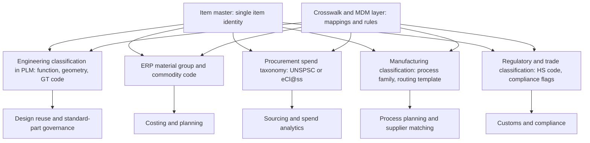
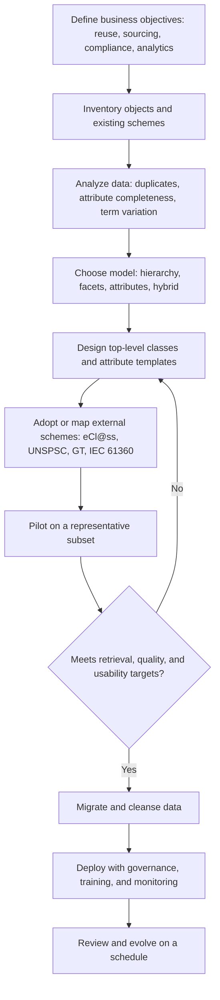

## Classification Systems in Enterprise and PLM Databases


Classification systems in enterprise and product lifecycle management (PLM) databases are the structured schemes, data models, and governance mechanisms that assign parts, documents, materials, suppliers, processes, resources, and other business objects to controlled classes, so that they can be searched, reused, reported on, and integrated across ERP, PLM, MES, CAD, and procurement systems. In a PLM or ERP context, classification serves two purposes at once: it is a *retrieval and reuse mechanism* (find the existing part before designing a new one) and a *data-structuring mechanism* (each class defines which attributes an object must carry, so records are complete and comparable). For manufacturing, classification extends beyond parts to routings, operations, work centers, tooling, and process capabilities, linking product data to the process classifications discussed elsewhere in this chapter. This item explains what is classified, how classification schemes are modeled in databases, the major approaches and industry systems, how classification is embedded in PLM and ERP platforms, and how to design, migrate, govern, and evaluate such systems.

### Purpose and Scope

This topic covers:

- Business objects that are classified in enterprise and PLM systems
- Classification models: hierarchical, faceted, attribute-based, and hybrid
- Data-model patterns for class hierarchies, attribute inheritance, and classified instances
- Industry and standard classification systems used in enterprise data (eCl@ss, UNSPSC, ETIM, GS1 GPC, NAICS, HS, and others)
- Group technology and part-family coding within PLM
- Classification of process-related objects: routings, operations, work centers, tools, suppliers, and capabilities
- Integration across PLM, ERP, MES, CAD, and supplier systems
- Design methodology, data migration, governance, quality metrics, and analytics
- Limitations and pitfalls

**Key Points**

- Enterprise classification is judged by *fitness for use*: a scheme that supports procurement spend analysis may be a poor basis for engineering reuse search, and vice versa. Most organizations therefore maintain several classifications side by side, connected by mappings.
- A class is more than a label: in mature systems, a class defines an **attribute set** (with data types, units, and allowed values), so classifying an object also tells the system what data to collect and validate.
- Classification data quality degrades without governance. Duplicate parts, inconsistent attribute values, and orphaned classes are the typical symptoms of ungoverned schemes.
- Specific systems, standards, product features, and licensing terms change over time and vary by vendor and version. The statements below describe general practice, and details must be verified against current documentation.

### Objects Classified in Enterprise and PLM Databases

| Object Type | Typical Classification Purpose | Example Classes or Attributes |
| --- | --- | --- |
| Parts and components | Reuse search, standardization, sourcing | Fasteners, bearings, castings, machined parts; thread size, material, finish |
| Assemblies and products | Product-line structure, configuration | Product family, variant, platform |
| Materials and raw stock | Specification control, procurement | Alloy class, polymer family, form (bar, sheet, powder) |
| Documents and models | Retrieval, lifecycle control | Drawing, CAD model, specification, work instruction, certificate |
| Suppliers and vendors | Sourcing, qualification, risk | Process capabilities, certifications, geography, tier |
| Manufacturing processes | Route planning, supplier matching | Process family, special-process approval status |
| Routings and operations | Standardization of process plans | Operation type, work-center class, standard time basis |
| Work centers and equipment | Capacity planning, scheduling | Machine type, axes, envelope, capabilities |
| Tools, fixtures, and gauges | Tool management | Tool type, diameter, material, life |
| Changes and issues | Workflow, analytics | Change class (minor, major), reason code |
| Requirements and specifications | Traceability | Requirement type, verification method |
| Quality records | Analytics and compliance | Defect class, inspection type |
| Customers, projects, and programs | Reporting | Segment, program, contract type |

### Classification Models

| Model | Idea | Strengths | Weaknesses |
| --- | --- | --- | --- |
| Hierarchical (enumerative tree) | Each object belongs to one leaf in a tree of classes | Simple, intuitive browsing | Rigid; single viewpoint; deep trees are hard to maintain |
| Polyhierarchical (DAG) | A class may have several parents | Represents multiple viewpoints | More complex navigation and inheritance rules |
| Faceted | Independent dimensions, each with controlled values; an object has one value per facet (or several) | Flexible filtering; scales with combinations | Requires disciplined facet definition; less intuitive than a tree |
| Attribute-based (parametric) | Classification derived from attribute values (for example, diameter and material) | Precise; supports parametric search | Needs complete, accurate attributes |
| Coded (polycode, monocode) | Codes with positional meaning, as in group technology | Compact; supports similarity computation | Code design effort; rigid if positions are fixed |
| Tag-based (folksonomy) | Free-form labels | Low friction | Inconsistent; poor for governance |
| Semantic / ontology-based | Formal classes and relations with reasoning | Rich inference and integration | Modeling and maintenance effort |
| Hybrid | Tree for primary class plus facets and attributes | Balances usability and flexibility | Requires clear rules for which mechanism holds what |

Most enterprise systems adopt a **hybrid**: a primary class hierarchy that determines the attribute template, complemented by facets or classification schemes for alternative views (for example, commodity code for procurement, GT code for manufacturing).

### Data-Model Patterns

#### Class Hierarchy with Attribute Inheritance

A child class inherits the attribute definitions of its ancestors and may add its own.

$$\text{Attrs}(c) = \text{OwnAttrs}(c) \cup \bigcup_{a \in \text{Ancestors}(c)} \text{OwnAttrs}(a)$$

For example, a class `Fastener` may define material and finish; the subclass `Screw` adds thread size and length; the subclass `Socket head cap screw` adds head diameter and drive size. An object classified as a socket head cap screw must therefore supply all inherited attributes.

#### Entity-Attribute-Value versus Typed Class Tables

Storing classified attributes in a relational database raises a design choice.

| Pattern | Description | Strengths | Weaknesses |
| --- | --- | --- | --- |
| Wide typed tables per class | One table per class or class family, with typed columns | Strong typing and fast queries; simple SQL | Schema changes needed for new classes and attributes |
| Entity-Attribute-Value (EAV) | Generic table of (object, attribute, value) rows | Very flexible; no schema change to add attributes | Weak typing; complex queries; performance overhead |
| Semi-structured column (JSON or XML) | Attributes in a document column | Flexible with some indexing support | Constraint enforcement is weaker; portability varies |
| Hybrid | Core attributes in typed columns; extension attributes in EAV or JSON | Balances performance and flexibility | Two access paths to maintain |

Many commercial PLM and ERP platforms use a metadata-driven approach internally, where class and attribute definitions are stored as data and the platform generates forms, validations, and search indexes from them. The specific storage strategy is vendor-dependent [Inference].

#### Relational Sketch

```sql
CREATE TABLE class_node (
    class_id      TEXT PRIMARY KEY,
    parent_id     TEXT REFERENCES class_node(class_id),
    scheme_id     TEXT NOT NULL,             -- which classification scheme this belongs to
    notation      TEXT,                      -- human-readable code
    status        TEXT NOT NULL,             -- active | deprecated | proposed
    valid_from    DATE,
    valid_to      DATE
);

CREATE TABLE class_label (
    class_id  TEXT REFERENCES class_node(class_id),
    lang      TEXT,
    label     TEXT,
    label_type TEXT,                         -- preferred | alternative
    PRIMARY KEY (class_id, lang, label_type, label)
);

CREATE TABLE attribute_def (
    attr_id       TEXT PRIMARY KEY,
    data_type     TEXT NOT NULL,             -- text | number | boolean | enum | date
    unit          TEXT,
    enum_set_id   TEXT,
    definition    TEXT,
    dict_ref      TEXT                        -- external dictionary identifier, if any
);

CREATE TABLE class_attribute (
    class_id   TEXT REFERENCES class_node(class_id),
    attr_id    TEXT REFERENCES attribute_def(attr_id),
    required   BOOLEAN DEFAULT FALSE,
    min_value  NUMERIC,
    max_value  NUMERIC,
    PRIMARY KEY (class_id, attr_id)
);

CREATE TABLE item (
    item_id     TEXT PRIMARY KEY,
    item_type   TEXT,                         -- part | document | supplier | operation ...
    created_at  TIMESTAMP,
    status      TEXT
);

CREATE TABLE item_classification (
    item_id    TEXT REFERENCES item(item_id),
    class_id   TEXT REFERENCES class_node(class_id),
    scheme_id  TEXT,
    is_primary BOOLEAN DEFAULT FALSE,
    PRIMARY KEY (item_id, class_id)
);

CREATE TABLE item_attribute_value (
    item_id   TEXT REFERENCES item(item_id),
    attr_id   TEXT REFERENCES attribute_def(attr_id),
    value_text TEXT,
    value_num  NUMERIC,
    unit       TEXT,
    PRIMARY KEY (item_id, attr_id)
);
```

This sketch supports multiple classification schemes (`scheme_id`), attribute templates per class, and typed value storage. Production systems add auditing, versioning, effectivity dates, and localization.

**Inherited-attribute query (recursive, illustrative)**

```sql
WITH RECURSIVE ancestry AS (
    SELECT class_id, parent_id FROM class_node WHERE class_id = 'SOCKET_HEAD_CAP_SCREW'
    UNION ALL
    SELECT c.class_id, c.parent_id
    FROM class_node c JOIN ancestry a ON c.class_id = a.parent_id
)
SELECT ca.attr_id, ca.required
FROM class_attribute ca
JOIN ancestry a ON ca.class_id = a.class_id;
```

### Industry and Standard Classification Systems

The systems below appear in enterprise data, catalogs, and procurement. Their scope, structure, licensing, and process coverage vary and must be verified against current documentation. Most classify *products, components, and services*, and only a few touch *manufacturing processes* directly.

| System | Primary Domain | Structure (General) | Relevance to Enterprise and PLM |
| --- | --- | --- | --- |
| eCl@ss | Products and services across industries | Hierarchical classes with defined properties and value lists | Standardized product descriptions; property-rich; used in procurement and PLM catalogs [Inference: extent of manufacturing-service coverage varies] |
| ETIM | Technical products, especially installation and electrical | Classes with features and values | Catalog and trade data exchange |
| UNSPSC | Products and services for procurement | Multi-level numeric taxonomy (segment, family, class, commodity) | Spend analysis and e-procurement; coarse for engineering detail |
| GS1 Global Product Classification (GPC) | Consumer and retail goods | Segment, family, class, brick, with attributes | Retail and supply-chain data synchronization |
| NAICS, ISIC, NACE | Industry activity of establishments | Hierarchical industry codes | Supplier and market segmentation; indirect process indication |
| HS / CN / TARIC | Traded goods | Harmonized tariff hierarchy | Customs and trade compliance; material and processing state distinctions |
| CPV (Common Procurement Vocabulary) | Public procurement in the EU | Hierarchical codes | Public tenders |
| ISO 13584 (PLIB) / IEC 61360 / ISO 29002 | Dictionary and identification frameworks | Class hierarchy with globally unique property and class identifiers | Property definitions and identifiers reusable across systems |
| IEC Common Data Dictionary | Electrotechnical domain | Classes and properties based on IEC 61360 | Electrotechnical component data |
| UN/CEFACT and Odette/VDA recommendations | Industry data exchange | Message and code recommendations | Automotive and trade data exchange |
| ISO 10303 (STEP) application protocols | Product data exchange | Data models for product structure, geometry, and manufacturing | Neutral exchange between CAD, PLM, and downstream systems |
| Opitz, MICLASS, KK-3 | Group technology part coding | Polycode or monocode digit positions | Part-family coding and process planning |
| Company-specific classification | Internal | Tailored trees and attribute sets | Fit to internal products and processes |

**Key Points**

- Cross-industry systems such as eCl@ss and UNSPSC are strongest for *purchased items and procurement analytics*; engineered, made-in-house parts often need an internal scheme with manufacturing-relevant attributes.
- Standards-based property dictionaries (IEC 61360-style) help unify attribute definitions across systems by giving each property one identifier, data type, and unit.
- Using an external scheme as the *only* internal classification can be limiting; many organizations adopt it as a mapped secondary scheme.

### Group Technology and Part-Family Classification in PLM

Group technology (GT) coding assigns each part a code describing geometry, features, dimensions, material, and accuracy, supporting similarity retrieval and process-plan inheritance.

| Use | Description |
| --- | --- |
| Design reuse | Search the coded library for similar parts before creating a new one |
| Standardization | Identify near-duplicate parts to consolidate |
| Routing inheritance | New part adopts the routing of its family, modified as needed |
| Cellular manufacturing | Map part families to machine cells |
| Cost estimation | Apply family-level cost models |
| Tooling and fixture reuse | Share fixtures and gauges within a family |

**Coding structures**

| Structure | Description | Trade-off |
| --- | --- | --- |
| Monocode (hierarchical) | Each digit's meaning depends on preceding digits | Compact; harder to extend |
| Polycode (chain) | Each digit has an independent meaning | Easier to compare position by position; longer codes |
| Hybrid | Combines both | Balances compactness and flexibility |

**Similarity between coded parts**

For two polycode vectors $x$ and $y$ of length $n$, a weighted mismatch distance is:

$$d(x, y) = \sum_{i=1}^{n} w_i \, \delta(x_i, y_i), \qquad \delta(a, b) = \begin{cases} 0 & a = b \\ 1 & a \neq b \end{cases}$$

with weights $w_i$ reflecting each position's importance. Nearest-neighbor search over $d$ retrieves similar parts. Modern PLM systems also support geometry-based shape similarity and attribute-based search, which can complement or replace hand-assigned GT codes [Inference].

**Example**

A newly designed flanged bushing is coded using an Opitz-style scheme as a rotational part with a specific length-to-diameter ratio, an external flange, and an internal bore. A distance query returns 9 existing parts within a small code distance. Six share a turn-then-drill-then-grind routing, so the designer reuses the routing template and adjusts dimensions.

### Classification of Manufacturing and Process Objects

In manufacturing-oriented enterprise systems, several process-related object types are classified. These classifications connect product data to process taxonomies.

| Object | Classification Dimensions | Purpose |
| --- | --- | --- |
| Operation (routing step) | Operation type (turning, milling, welding, inspection), process family, standard-operation class | Standardize routings; enable time and cost estimation |
| Work center / resource | Machine type, axes, envelope, capability class, location | Capacity planning; scheduling; supplier matching |
| Tool and fixture | Tool type, geometry, material, holder, compatibility | Tool management; kit preparation |
| Special process | Process type (heat treat, plating, NDT, welding), specification, approval status | Quality and regulatory compliance |
| Supplier capability | Process class, material, size range, tolerance class, certification | Sourcing and quoting |
| Bill of process (BOP) template | Product family and process sequence | Reuse of process plans |
| Inspection characteristic | Characteristic class (critical, major, minor), method | Quality planning |
| Non-conformance | Defect class, cause class, disposition | Analytics and corrective action |

**Standard operation libraries**

A standard-operation library stores classified operations with default parameters. A routing then references library operations rather than free text.

```plaintext
StandardOperation(op_id, op_class, process_family_ref, default_work_center_class,
                  setup_time_basis, run_time_basis, required_capability_refs)
RoutingStep(routing_id, seq, op_id, work_center_id, param_overrides)
```

**Supplier-to-part matching**

Classification allows structured matching between requirements and capabilities:

$$\text{Qualifies}(s, p) \iff \forall r \in \text{Req}(p): \; \exists\, c \in \text{Cap}(s) \text{ such that } c \text{ satisfies } r$$

where $\text{Req}(p)$ are required process, material, size, tolerance, and certification classes for part $p$, and $\text{Cap}(s)$ are the classified capabilities declared by supplier $s$. Whether a broader declared capability satisfies a narrower requirement depends on hierarchy direction and matching policy, so the policy should be explicit [Inference].

### Where Classification Lives: PLM, ERP, MES, and Beyond

| System | Typical Classification Role |
| --- | --- |
| PLM (engineering) | Part and document classes, attribute templates, reuse search, GT or shape similarity, change classes, standard-part libraries |
| ERP (business) | Material master groups, commodity codes, procurement categories, cost-center and product-group hierarchies, routing operations and work-center classes |
| MES (execution) | Operation and resource classes, event and downtime reason codes, quality defect codes |
| CAD and CAM | Standard-part libraries, feature libraries, tool libraries linked to class identifiers |
| SRM and procurement | Supplier categories, commodity codes, spend taxonomies |
| Quality management (QMS) | Defect and cause taxonomies, characteristic classes, audit categories |
| Master data management (MDM) | Golden-record classification, cross-system mappings, data-quality rules |
| Data warehouse and analytics | Conformed dimensions (product hierarchy, process hierarchy) for reporting |
| Digital twin and IoT platforms | Asset and process type models with semantic identifiers |

**Different systems, different hierarchies**

The same part may sit in a *design classification* in PLM (by function and geometry), a *material group* in ERP (by cost accounting and procurement), and a *commodity class* in a spend-analysis tool (by external code). Rather than force one hierarchy, mature practice maintains multiple schemes tied to a common item identity through the item-classification link table shown earlier.



### Integration and Synchronization

| Pattern | Description | Considerations |
| --- | --- | --- |
| Single source of truth for the class dictionary | One system owns class and attribute definitions; others subscribe | Requires clear ownership and change propagation |
| Federated schemes with crosswalks | Each system keeps its own scheme, linked by mappings | Flexible but needs mapping maintenance |
| MDM hub | Central platform manages classification and golden records | Adds a system; strong governance benefits |
| Message- or event-based sync | Class changes published as events | Latency and ordering issues; needs versioning |
| API-based lookup | Systems fetch class data on demand | Availability and performance dependencies |
| File-based exchange | Periodic export and import (CSV, XML, JSON, STEP, PLMXML, standard exchange formats) | Simple; risk of staleness and mismatch |
| Catalog standards | Exchange of classified product data via industry formats (for example, BMEcat, ETIM formats, eCl@ss exports) | Depends on supplier and buyer conformance [Inference] |

**Synchronization rules to define**

- Which system owns each class and attribute (system of record)
- How deprecations propagate and how affected items are remediated
- How conflicts are resolved when two systems modify the same classification
- How mapping tables are versioned and validated

### Design Methodology for Enterprise Classification



**Design principles**

1. **Classify by purpose.** Define the primary use (reuse, sourcing, planning) and design the primary hierarchy for it; serve other purposes through additional schemes or facets.
2. **Make classes mutually exclusive and collectively exhaustive** at each level of the primary hierarchy where possible, and include an explicit "other" class only as a controlled exception.
3. **Limit depth.** Deep trees hamper navigation and maintenance; many designs keep the primary hierarchy to a modest number of levels and use attributes for finer distinctions.
4. **Attach attribute templates to classes,** with required and optional attributes, data types, units, ranges, and value lists.
5. **Define attributes once** and reuse them across classes, to avoid inconsistent duplicates.
6. **Use unit-aware, typed values** rather than free text, so parametric search and validation work.
7. **Prefer stable identifiers** and separate them from labels and human-readable codes.
8. **Design for growth.** Provide a controlled process to add classes and attributes without restructuring.
9. **Plan the mapping layer** to external schemes from the start.

#### Class Granularity Trade-off

A scheme too coarse cannot support parametric search or precise validation; one too fine is expensive to maintain and produces classification disagreement. A useful test: a class should exist when it (a) has a distinct attribute template, (b) corresponds to a distinct search or reporting need, or (c) triggers distinct process or compliance rules.

### Data Migration and Cleansing

Introducing or restructuring classification typically involves migrating legacy data.

| Step | Activity |
| --- | --- |
| Profile | Analyze existing part descriptions, codes, and attribute completeness |
| Normalize | Standardize units, spelling, abbreviations, and casing |
| Deduplicate | Identify duplicate or near-duplicate items using attributes and text similarity |
| Classify | Assign items to new classes using rules, dictionaries, and, where appropriate, machine-assisted classification with human review |
| Extract attributes | Parse attribute values from free-text descriptions into typed fields |
| Validate | Check required attributes, ranges, and cross-attribute rules |
| Reconcile | Resolve conflicts between source systems |
| Load and verify | Load into target systems, with reconciliation reports |
| Monitor | Track post-migration quality metrics |

**Duplicate detection**

Text and attribute similarity can flag candidates. For token sets $A$ and $B$ of two item descriptions:

$$J(A, B) = \frac{|A \cap B|}{|A \cup B|}$$

Combined with attribute equality on key fields (for example, material, size, standard reference), high similarity indicates potential duplicates to review. Automated merging without review is risky because near-identical descriptions may hide meaningful differences (for example, different tolerance or coating) [Inference].

**Machine-assisted classification**

Text classifiers and language models can propose classes and attribute values from descriptions. Practical safeguards include confidence thresholds, sampling-based quality audits, review queues for low-confidence items, and logging of decisions for retraining. Accuracy varies by data quality and domain, so measured precision and recall on a labeled sample should guide deployment [Inference].

### Illustration: Layers of Enterprise Classification

<svg xmlns="http://www.w3.org/2000/svg" viewBox="0 0 720 420" width="720" height="420" font-family="sans-serif" font-size="12">
<title>Layers of Enterprise Classification (svg_diagram)</title>
<text x="360" y="24" text-anchor="middle" font-size="15" font-weight="bold">Layers of Classification in Enterprise and PLM Data (svg_diagram)</text>
<rect x="60" y="45" width="600" height="55" rx="6" fill="#cfe8ff" stroke="#1f5fa8" />
<text x="360" y="68" text-anchor="middle" font-weight="bold">Governance layer</text>
<text x="360" y="88" text-anchor="middle" font-size="11" fill="#555">ownership, change control, versioning, quality metrics, review cycles</text>
<rect x="60" y="115" width="600" height="55" rx="6" fill="#d9f2d0" stroke="#3a7d22" />
<text x="360" y="138" text-anchor="middle" font-weight="bold">Class and attribute dictionary</text>
<text x="360" y="158" text-anchor="middle" font-size="11" fill="#555">class hierarchy, attribute templates, units, value lists, dictionary identifiers</text>
<rect x="60" y="185" width="290" height="70" rx="6" fill="#ffe3c2" stroke="#b5651d" />
<text x="205" y="208" text-anchor="middle" font-weight="bold">Internal schemes</text>
<text x="205" y="228" text-anchor="middle" font-size="11" fill="#555">design class, GT code, process family,</text>
<text x="205" y="244" text-anchor="middle" font-size="11" fill="#555">routing and operation classes</text>
<rect x="370" y="185" width="290" height="70" rx="6" fill="#ffe3c2" stroke="#b5651d" />
<text x="515" y="208" text-anchor="middle" font-weight="bold">External schemes</text>
<text x="515" y="228" text-anchor="middle" font-size="11" fill="#555">eCl@ss, UNSPSC, ETIM, GPC,</text>
<text x="515" y="244" text-anchor="middle" font-size="11" fill="#555">HS codes, NAICS</text>
<rect x="60" y="270" width="600" height="50" rx="6" fill="#f3e5f5" stroke="#7b1fa2" />
<text x="360" y="292" text-anchor="middle" font-weight="bold">Crosswalk and MDM layer</text>
<text x="360" y="310" text-anchor="middle" font-size="11" fill="#555">typed mappings: exact, close, broader, narrower, related</text>
<rect x="60" y="335" width="600" height="50" rx="6" fill="#fff9c4" stroke="#f9a825" />
<text x="360" y="357" text-anchor="middle" font-weight="bold">Item records in PLM, ERP, MES, procurement, quality</text>
<text x="360" y="375" text-anchor="middle" font-size="11" fill="#555">one item identity, multiple classification links, typed attribute values</text>
<text x="360" y="410" text-anchor="middle" font-size="11" fill="#555">Multiple schemes coexist, tied together by identity and mappings rather than forced into one tree.</text>
</svg>

### Worked Example: Classifying a Fastener Family

**Goal**: define an attribute-driven class for socket head cap screws in a PLM system, link it to an external commodity scheme, and use it for reuse search.

**Step 1: Class hierarchy and attribute template**

| Class | Parent | Own Attributes (data type, unit) |
| --- | --- | --- |
| Fastener | Component | Material (enum), Finish (enum), Standard reference (text) |
| Screw | Fastener | Thread designation (text), Length (number, mm) |
| Socket head cap screw | Screw | Head diameter (number, mm), Drive size (number, mm), Property class (enum) |

An item classified as "Socket head cap screw" must supply the inherited attributes plus those defined at each level.

**Step 2: Item record (JSON, illustrative)**

```json
{
  "item_id": "P-100482",
  "primary_class": "COMPONENT/FASTENER/SCREW/SOCKET_HEAD_CAP_SCREW",
  "attributes": {
    "material": "alloy_steel",
    "finish": "zinc_flake",
    "standard_reference": "ISO 4762",
    "thread_designation": "M8x1.25",
    "length_mm": 25.0,
    "head_diameter_mm": 13.0,
    "drive_size_mm": 6.0,
    "property_class": "12.9"
  },
  "secondary_classifications": [
    {"scheme": "commodity", "code": "EXT-FASTENERS-SCREWS"},
    {"scheme": "trade", "code": "HS-7318-15"}
  ]
}
```

The specific external codes above are placeholders to show structure. Real codes must be taken from the current published schemes, and each scheme's licensing terms verified.

**Step 3: Parametric reuse search**

```sql
SELECT i.item_id
FROM item i
JOIN item_classification ic ON ic.item_id = i.item_id
JOIN item_attribute_value v1 ON v1.item_id = i.item_id AND v1.attr_id = 'thread_designation'
JOIN item_attribute_value v2 ON v2.item_id = i.item_id AND v2.attr_id = 'length_mm'
WHERE ic.class_id = 'SOCKET_HEAD_CAP_SCREW'
  AND v1.value_text = 'M8x1.25'
  AND v2.value_num BETWEEN 20 AND 30;
```

**Output**

A short list of existing qualified parts. A designer picks an existing item rather than creating a new one, reducing part-number proliferation.

**Step 4: Validation rules**

| Rule | Purpose |
| --- | --- |
| Length must be positive and within a standard range | Catch entry errors |
| Property class must be in the enum for the chosen standard reference | Prevent inconsistent combinations |
| Thread designation must parse and match the standard reference | Data consistency |
| Head diameter must be consistent with thread size according to the referenced standard | Detect wrong dimension entries |

### Governance and Roles

| Role | Responsibility |
| --- | --- |
| Classification owner (business) | Accountable for scheme scope, policies, and alignment with business objectives |
| Class and attribute stewards (engineering, procurement, manufacturing) | Maintain domain content, definitions, and value lists |
| Data steward / MDM lead | Monitor data quality, mappings, and duplicates |
| PLM/ERP administrator | Implement configuration, workflows, and access rights |
| Change control board | Approve structural changes and releases |
| Users (designers, buyers, planners) | Classify at creation, report gaps, and participate in review |
| Auditor or quality function | Verify compliance for regulated classifications |

**Governance mechanisms**

- **Change request workflow** for new classes, attributes, and value-list changes, with impact analysis on existing items
- **Lifecycle states** for classes and attributes (proposed, active, deprecated, retired) with replacement pointers
- **Effectivity dates** so historical items reflect the scheme in force at the time
- **Naming and definition standards** for classes and attributes
- **Access control** limiting who can modify the dictionary
- **Audit trail** of changes to classes, attributes, mappings, and item classifications
- **Periodic review** of unused classes, overpopulated "other" classes, and duplicated attributes

### Quality Metrics and Analytics

| Metric | Definition | Use |
| --- | --- | --- |
| Classification coverage | Fraction of items with a valid primary class | Baseline completeness |
| Attribute completeness | Fraction of required attributes populated, by class | Class-level data quality |
| "Other" or unclassified rate | Fraction of items in catch-all classes | Signals scheme gaps |
| Duplicate rate | Estimated fraction of items that duplicate another | Reuse effectiveness |
| Reuse rate | Fraction of new designs that reuse an existing part | Business benefit |
| Class balance | Distribution of items across classes | Detects overloaded or empty classes |
| Mapping completeness | Fraction of classes with verified mappings to each external scheme | Integration health |
| Search success | Fraction of searches leading to a selected item | Retrieval usability |
| Inter-classifier agreement | Agreement between independent classifiers, for example Cohen's kappa | Clarity of class definitions |
| Staleness | Fraction of classes or attributes unreviewed beyond the review interval | Governance health |

Cohen's kappa for two classifiers is:

$$\kappa = \frac{p_o - p_e}{1 - p_e}$$

where $p_o$ is observed agreement and $p_e$ is expected chance agreement. Low $\kappa$ in a region of the hierarchy suggests ambiguous class definitions or overlapping classes.

**Reuse-related cost logic**

Part-number proliferation adds costs throughout the lifecycle (procurement, inventory, quality, documentation). While specific figures vary by organization and are often cited without consistent sources, the direction of the effect is widely accepted: preventing duplicate parts reduces total lifecycle cost, which is a primary business case for classification-based reuse search [Inference].

### Security, Compliance, and Legal Considerations

- **Trade and export classification**: items may carry export-control and customs classifications (for example, tariff codes and jurisdiction-specific control-list identifiers) that have legal consequences; these are typically maintained under compliance ownership with formal review.
- **Regulated industries**: aerospace, medical device, and pressure equipment sectors may require controlled classification of special processes, critical characteristics, and approved suppliers.
- **Substance and material compliance**: classification of materials and substances supports environmental and chemical regulations, and attributes may need to reflect regulated substance content.
- **Intellectual property and access**: classification and attribute data can reveal design intent; apply role-based access and export filtering when sharing with suppliers.
- **Licensing**: external classification schemes and dictionaries may be licensed; verify redistribution and embedding terms before copying content into products or shared databases [Inference].

### Limitations and Pitfalls

**Key Points**

- **Single-hierarchy trap**: forcing all uses into one tree yields compromises that serve none well; use multiple schemes or facets tied by item identity.
- **Over-fine or over-coarse granularity**: too coarse blocks parametric search; too fine creates disagreement and maintenance burden.
- **Attribute sprawl**: many duplicated or inconsistently defined attributes undermine search and analytics; define attributes once and reuse.
- **Free-text dependence**: classification that relies on descriptions instead of typed attributes limits validation and automation.
- **Catch-all classes**: a growing "other" class signals scheme gaps and hides information.
- **Mapping drift**: crosswalks to external schemes go stale as either side changes unless versioned and reviewed.
- **Classification at creation only**: if users classify carelessly at creation, errors persist; embed validation, defaults, and review.
- **Machine-assisted misclassification**: automated classifiers can produce plausible but wrong assignments; sample audits and review queues are needed [Inference].
- **Migration underestimation**: cleansing and restructuring legacy data usually takes more effort than the schema design.
- **Organizational silos**: engineering, procurement, and manufacturing may want incompatible structures; governance must arbitrate, and multiple schemes with clear mappings can reconcile them.
- **Vendor lock-in**: proprietary classification modules can complicate export and migration; prefer open, documented formats and standard dictionaries where feasible.
- **Process classification gap**: many enterprise schemes classify products well but lack rigorous process and capability classification; organizations often extend them or link to a process taxonomy.
- **Behavior disclaimer**: the systems, standards, platform behaviors, and technical values described here are general and may vary by vendor, product version, standard edition, and implementation; verify against current documentation and test with representative data.

### Best Practices

1. Define business purposes first (reuse, sourcing, planning, compliance) and design the primary hierarchy for the dominant purpose.
2. Use a hybrid model: a primary class hierarchy that assigns attribute templates, plus facets or secondary schemes for alternative views.
3. Attach typed, unit-aware attributes to classes, and define each attribute once with a dictionary identifier where possible.
4. Keep the primary hierarchy shallow enough to maintain, and use attributes for fine distinctions.
5. Separate item identity from classification, so one item can carry multiple scheme links without duplication.
6. Map internal schemes to external ones (eCl@ss, UNSPSC, HS, and others) through typed, versioned crosswalks.
7. Extend the enterprise model to manufacturing objects (operations, work centers, tools, special processes, supplier capabilities) and link them to a process taxonomy.
8. Validate at data entry with required attributes, ranges, and cross-attribute rules, and support duplicate checks before item creation.
9. Establish ownership, change control, lifecycle states, effectivity dates, and audit trails for the dictionary.
10. Measure coverage, completeness, duplicate rate, reuse rate, and mapping completeness, and review them on a schedule.
11. Treat migration as a project: profile, normalize, deduplicate, classify, validate, and reconcile, with human review of automated results.
12. Protect sensitive classification data with role-based access and confirm licensing for external schemes.

### Conclusion

Classification systems in enterprise and PLM databases give organizations a controlled way to organize parts, documents, materials, suppliers, and manufacturing objects so that they can be found, reused, validated, and integrated. Effective systems treat a class as both a label and an attribute template, use hybrid models that combine a primary hierarchy with facets and secondary schemes, and separate item identity from classification so that engineering, ERP, procurement, manufacturing, and compliance views can coexist and be linked by typed mappings. External systems such as eCl@ss, UNSPSC, ETIM, HS codes, and property-dictionary frameworks such as ISO 13584 and IEC 61360 supply valuable structure for purchased and cataloged items, while group technology coding, standard-operation libraries, and capability classifications extend the approach to manufacturing processes. Sustained value depends on governance: clear ownership, change control, lifecycle management, validation at entry, quality metrics, careful migration, and human review of machine-assisted classification.

**Related Topics**

- Group technology coding and part-family retrieval in PLM
- Master data management and golden-record classification
- eCl@ss, ETIM, UNSPSC, and GS1 GPC structure and use
- ISO 13584, IEC 61360, and ISO 29002 property-dictionary frameworks
- Crosswalk design and taxonomy mapping between internal and external schemes
- Standard-operation libraries and bill-of-process templates
- Supplier capability classification and qualification data models
- Duplicate-part detection and part-number rationalization
- Data migration and cleansing for classification restructuring
- Classification governance, change control, and quality metrics