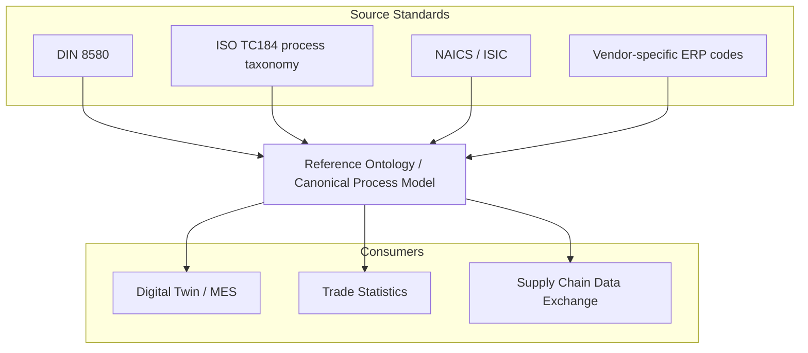

## Harmonization Efforts Across Competing Standards

### Overview

Manufacturing process classification suffers from a proliferation of overlapping, non-interoperable coding schemes — ISO standards, national statistical taxonomies, industry-specific nomenclatures, and proprietary ERP/MES vendor schemas. Harmonization efforts aim to establish crosswalks, mappings, or unified ontologies that allow data to move across these systems without semantic loss.

### The Core Problem: Classification Fragmentation

**Key Points**

- Different standards bodies classify manufacturing processes along different axes: some by industry/output (ISIC, NAICS), some by process physics (DIN 8580, ASME), some by material transformation (ASTM), and some by discrete vs. continuous operations (ISA-95).
- A single physical operation (e.g., "injection molding") may carry a different code in each system, with no guaranteed one-to-one mapping.
- Fragmentation creates friction in: supply chain data exchange, cross-border trade statistics, digital twin interoperability, and regulatory reporting.

### Major Competing Standard Families

| Standard | Governing Body | Classification Axis | Primary Use Case |
| --- | --- | --- | --- |
| DIN 8580 | German Institute for Standardization | Process physics (6 main groups) | Manufacturing engineering, process planning |
| ISO/TC 184 | ISO | Industrial automation & systems integration | Digital manufacturing, MES/ERP interoperability |
| NAICS | US/Canada/Mexico statistical agencies | Industry/economic output | Trade statistics, economic census |
| ISIC | UN Statistics Division | Industry/economic output | International trade comparison |
| ASTM F42/ISO/ASTM 52900 | ASTM International / ISO | Additive manufacturing process categories | AM process specification |
| ISA-95 (IEC 62264) | ISA / IEC | Enterprise-control system integration | MES-to-ERP data exchange |
| UNSPSC | GS1 US / UN | Product and service classification | Procurement, e-commerce |

**[Inference]** The coexistence of physics-based (DIN 8580), statistical (NAICS/ISIC), and systems-integration (ISA-95) taxonomies is largely a product of these standards evolving independently to serve different institutional needs (engineering education, macroeconomic reporting, and factory automation, respectively), rather than a deliberate division of labor.

### Harmonization Mechanisms

#### 1. Crosswalk Tables (Concordances)

The most common near-term harmonization tool: a bilateral or multilateral mapping table linking codes in System A to codes in System B, often with a correspondence type (1:1, 1:many, many:1, many:many).

**Example**

| DIN 8580 Group | Nearest NAICS Equivalent | Correspondence Type |
| --- | --- | --- |
| Urformen (Primary shaping) — Casting | NAICS 3315 (Foundries) | 1:many (casting sub-processes split across multiple NAICS codes) |
| Trennen (Separating) — Machining | NAICS 3327 (Machine Shops) | many:1 (turning, milling, drilling all collapse to one NAICS code) |
| Fügen (Joining) — Welding | NAICS 332 subsectors (varies by output product) | many:many |

This illustrates the central harmonization challenge: process-based taxonomies (DIN 8580) are granular about *how* something is made, while output-based taxonomies (NAICS) are granular about *what* is made — the two axes are not isomorphic, so concordances are inherently lossy.

#### 2. Reference Ontologies

Rather than mapping pairwise between every standard (which scales as $O(n^2)$ for $n$ standards), a reference ontology defines a canonical, standard-agnostic model of "manufacturing process" as a set of classes and properties, and each existing standard is mapped only to the reference — reducing mapping effort to $O(n)$.

- **Manufacturing Service Description Language (MSDL)** and similar ontological efforts attempt to define process capability, material input/output, and equipment relationships in a machine-readable form (often OWL/RDF-based).
- ISO 15926 (originally process industries) has been explored as a reference ontology pattern for cross-domain manufacturing data.

**[Unverified]** The degree of production adoption of full OWL-based manufacturing ontologies (as opposed to simpler crosswalk tables) varies significantly by sector and is not uniformly documented; aerospace and process industries report more mature usage than discrete general manufacturing.

#### 3. Common Data Models / Information Models

ISA-95 (IEC 62264) functions less as a classification scheme and more as a harmonizing *data model* — it defines standard object types (Equipment, Material, Personnel, Process Segment) that other classification codes can be attached to as attributes, effectively decoupling "what code system labels this" from "how the data is structured and exchanged."

- B2MML (Business To Manufacturing Markup Language) implements ISA-95 as XML schemas, acting as a lingua franca between MES and ERP systems that may internally use different process classification codes.

#### 4. Statistical Concordance Bridges (ISIC ↔ NAICS ↔ NACE)

For economic statistics, the UN, OECD, and Eurostat maintain official concordance tables between ISIC, NAICS, and NACE (the EU equivalent). These are revised periodically (e.g., ISIC Rev. 4, NAICS 2022, NACE Rev. 2) and republished with updated correspondence tables, since manufacturing sub-sector boundaries shift as new process technologies emerge (e.g., additive manufacturing did not have a clean home in pre-2010s classification revisions).

### Harmonization Architecture Pattern

This hub-and-spoke pattern is the architectural target of most modern harmonization initiatives, replacing pairwise point-to-point mappings.

### Institutional Harmonization Efforts

- **ISO/TC 184/SC 4**: Industrial data standards (STEP, ISO 15926) working toward shared product/process data models usable across CAD, PLM, and MES systems.
- **OAGi (Open Applications Group)**: Maintains harmonization work between ISA-95/B2MML and broader business messaging standards.
- **UN/CEFACT**: Cross-border trade facilitation standards that intersect with manufacturing classification for customs and export documentation.
- **Industry 4.0 / RAMI 4.0 reference architecture**: A German-led framework attempting to harmonize process, product lifecycle, and IT hierarchy layers into one 3-axis model, implicitly requiring classification harmonization as a prerequisite for machine-to-machine semantic interoperability.

**[Inference]** RAMI 4.0's three-axis model (Hierarchy Levels, Life Cycle & Value Stream, Layers) can be read as an implicit attempt to subsume both process-physics classifications (DIN 8580-style) and systems-integration classifications (ISA-95-style) under one structure, though full harmonization across all legacy standards remains an ongoing, not completed, effort.

### Persistent Challenges

- **Semantic drift**: Even where codes are formally mapped, the operational meaning of a process category can differ by regional practice or industry convention.
- **Update lag**: Concordance tables lag behind standard revisions; a NAICS update may take 1-3 years to receive a corresponding ISIC concordance refresh.
- **Granularity mismatch**: Fine-grained engineering taxonomies (DIN 8580 has dozens of sub-processes) map poorly onto coarse-grained statistical codes (NAICS manufacturing has ~180 six-digit codes total).
- **Emerging process categories**: New processes (additive manufacturing, hybrid subtractive-additive, AI-driven adaptive machining) often lack a settled home in legacy taxonomies, forcing ad hoc extensions before formal harmonization can occur.

**Related Topics**

- ISO/ASTM 52900 additive manufacturing process categorization
- ISA-95 / IEC 62264 enterprise-control integration model
- STEP (ISO 10303) product data exchange standard
- NAICS 2022 vs. ISIC Rev. 4 concordance methodology
- RAMI 4.0 reference architecture model
- Semantic web approaches to manufacturing ontology (OWL/RDF-based process models)