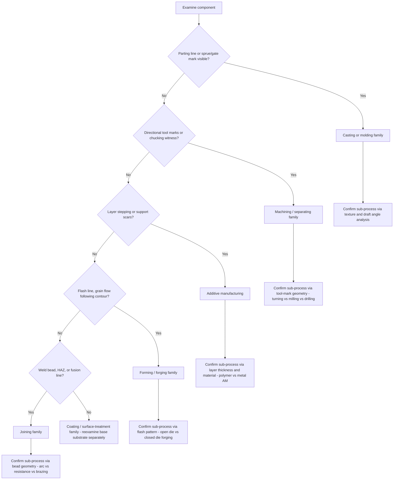

## Classifying Real-World Components by Inferred Process History

### Overview

Given a physical component with no accompanying documentation, a trained observer can often infer its manufacturing process history through systematic examination of surface characteristics, geometric features, material indicators, and internal structure. This is the applied, diagnostic counterpart to the taxonomic knowledge of process classification — working backward from artifact to process rather than forward from process to output.

### The Inference Framework

**Key Points**

- Process inference relies on the principle that each manufacturing process leaves characteristic, largely irreversible signatures on a workpiece.
- No single indicator is conclusive; reliable classification requires triangulating multiple independent cues (surface, geometry, material, internal structure).
- The inference proceeds hierarchically: first narrow to a DIN 8580 main group (primary shaping, forming, separating, joining, coating, changing material properties), then narrow to a specific sub-process.

### Diagnostic Signal Categories

#### 1. Surface Texture and Finish

| Observed Surface Feature | Likely Process | Reasoning |
| --- | --- | --- |
| Fine, directional tool marks (parallel lines) | Machining (turning, milling) | Cutting tool leaves feed-rate striations |
| Swirled, non-directional matte texture | Sand casting | Sand grain impression transferred to surface |
| Smooth, slightly glossy, no tool marks | Injection molding / die casting | Mold surface replicated onto part |
| Orange-peel or slightly rough uniform texture | Investment (lost-wax) casting | Wax pattern surface replication |
| Layered, visible stepping on curved surfaces | Additive manufacturing (FDM/SLA) | Discrete layer deposition |
| Flow lines following part contour | Forging | Grain flow follows deformation path, unlike machining which cuts across grain |
| Parting line ridge (thin raised seam) | Casting or molding | Witness of mold-half separation |

**[Inference]** The presence of a visible parting line is a strong indicator of a two-part mold process (casting or injection molding) rather than machining or additive manufacturing, since neither of the latter processes produces a mold-half seam artifact.

#### 2. Geometric and Dimensional Cues

- **Draft angles** (slight taper on vertical walls, typically 1-3°): indicates a molded or cast part requiring mold release; machined parts have no such functional requirement and are typically produced with vertical walls unless draft is explicitly designed in.
- **Uniform wall thickness**: characteristic of sheet metal forming (stamping, deep drawing) or injection molding (to avoid sink marks and uneven cooling).
- **Sharp internal corners**: suggests machining (end mill can cut a sharp corner) or EDM; cast and forged parts typically show generous internal fillets because sharp corners create stress concentrations and mold-filling difficulties.
- **Undercuts and internal cavities inaccessible from a single direction**: rule out simple two-part molding and machining from stock; suggest either a multi-piece/lost-core casting, additive manufacturing, or a multi-axis machining setup.
- **Constant cross-section along a long axis**: indicates extrusion (metal or polymer) or roll forming.
- **Variable wall thickness with flash lines**: suggests forging (flash is the excess material squeezed from the die parting line, often trimmed but leaving a witness mark).

#### 3. Material and Microstructural Indicators

- **Grain flow** (visible after etching, or inferred from mechanical property anisotropy): continuous grain flow following the part's geometric contours indicates forming (forging, rolling); grain flow abruptly terminated at surfaces indicates the surface was machined after forming.
- **Porosity**: fine, dispersed porosity suggests casting (trapped gas or shrinkage); its absence with high density suggests wrought (formed) material or powder metallurgy with full densification.
- **Dendritic microstructure**: a near-certain casting indicator — dendrites form during solidification from a melt and are destroyed by subsequent plastic deformation (forging/rolling).
- **Weld heat-affected zone (HAZ)**: a band of altered grain structure adjacent to a fusion line indicates joining by welding; the presence of filler-metal composition differing from base metal supports this.
- **Layer-boundary microstructure** (visible under microscopy as repeating bands with re-melted interfaces): indicates additive manufacturing (particularly powder-bed fusion or directed energy deposition).

**[Unverified]** Distinguishing forged from rolled grain flow patterns typically requires cross-sectional etching and is not reliably done by external visual inspection alone; this is more a laboratory/metallurgical determination than a field inference.

#### 4. Tool-Path and Fixturing Artifacts

- **Witness marks from clamping/chucking** (small indentations or discoloration in a circular or linear pattern): indicates the part was held in a machine tool fixture, supporting a machining hypothesis.
- **Sprue/gate remnant or witness mark**: a small raised or recessed point where molten material entered a mold cavity — definitive casting or injection-molding indicator.
- **Riser witness marks**: raised stub locations where risers (reservoirs for shrinkage compensation) were removed after casting.
- **Support-structure witness marks** (small circular or web-like scars): indicates additive manufacturing where removable support structures were required for overhangs.

### Diagnostic Decision Process

### Worked Example

**Example**

A cylindrical aluminum bracket is presented for classification with the following observations:

1. Smooth, slightly glossy surface with no visible tool marks
2. A thin raised seam running longitudinally around the part
3. A small circular witness mark (~3mm diameter) at one end, slightly recessed
4. Uniform wall thickness (~2.5mm) throughout
5. Draft angle of approximately 2° on all vertical faces

**Inference chain**:

- (1) and (5) together point strongly away from machining (machining leaves tool marks; draft angles serve no machining purpose) and toward a mold-based process.
- (2) is a parting line — confirms a multi-part mold.
- (3) is consistent with a gate witness mark (sprue remnant), which — combined with the light alloy, thin uniform walls, and smooth finish — is characteristic of **die casting** rather than sand casting (sand casting would show a coarser, matte surface texture) or investment casting (which typically lacks a hard parting-line seam of this type).
- (4) is consistent with die casting practice, where uniform wall thickness is a standard design rule to avoid porosity and warping.

**Conclusion**: The component's process history is most consistent with **high-pressure die casting**, secondary evidence would further narrow between cold-chamber and hot-chamber die casting based on alloy identification (aluminum alloys are near-universally cold-chamber processed due to their high melting point relative to the machine's injection components).

### Limitations and Confounding Factors

- **Secondary operations mask primary process signatures**: a cast part that is subsequently machined on critical surfaces will show mixed evidence (cast texture on non-functional surfaces, machined marks on functional/mating surfaces) — correct inference requires identifying which surfaces are "as-processed" versus "finish-machined."
- **Surface treatments obscure underlying process**: painting, plating, anodizing, or shot-peening can remove or mask primary-process surface texture, requiring inspection of unfinished internal or hidden surfaces.
- **Hybrid and repair processes**: additively repaired forged or cast parts (increasingly common in aerospace MRO) can present mixed signatures within a single component, requiring zone-by-zone rather than whole-part classification.
- **Miniaturization limits macroscopic cues**: very small components (MEMS-scale, precision electronics) may require microscopy or non-destructive evaluation (CT scanning) rather than visual/tactile inspection.

**[Inference]** For components under continuous quality dispute (e.g., counterfeit part detection in aerospace supply chains), process-history inference is often formalized using X-ray CT for internal porosity/dendrite pattern analysis combined with surface metrology, rather than relying solely on visual inspection as outlined above — visual inference remains a first-pass screening method rather than a certification-grade determination.

**Next Steps**

- Cross-reference inferred process against DIN 8580 / ISO TC184 classification codes for formal documentation
- Study metallographic etching techniques for grain-flow confirmation
- Review non-destructive evaluation (CT, ultrasonic) methods for internal process-signature verification
- Examine counterfeit/reverse-engineering detection workflows in aerospace and defense supply chains
- Study secondary-operation stacking (e.g., cast-then-machined, forged-then-welded) and multi-zone classification methodology