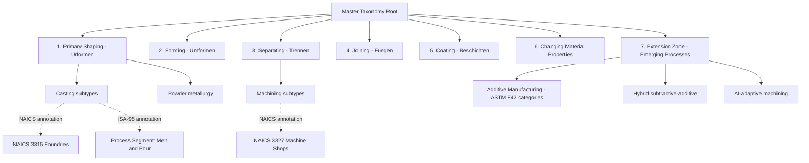

## Building a Personal Master Taxonomy Across All Systems Studied


### Overview

The capstone synthesis task in manufacturing process classification study is constructing a single, personally-owned reference taxonomy that integrates the physics-based, statistical, and systems-integration classification schemes into one coherent structure usable for both engineering reasoning and rapid lookup. This document outlines the design principles, structural options, and construction methodology for such a taxonomy.

### Why Build a Personal Taxonomy

**Key Points**

- No single published standard (DIN 8580, ISA-95, NAICS, ASTM F42) is complete for all purposes; each was designed for a different consumer (engineer, statistician, systems integrator).
- A personal master taxonomy is not a replacement for official standards but a *navigation layer* — a mental and documented model that lets you move fluidly between standards when classifying a real process or component.
- The exercise of building it consolidates the entire study sequence: nomenclature, harmonization mechanics, and applied inference all feed into the taxonomy's structure and cross-reference logic.

### Design Principles

1. **Process-physics as the primary spine.** DIN 8580's six main groups (Urformen/primary shaping, Umformen/forming, Trennen/separating, Fügen/joining, Beschichten/coating, Stoffeigenschaftändern/changing material properties) provide the most universal, technology-agnostic backbone, since nearly every manufacturing operation can be located within one of these six regardless of industry or era.
2. **Cross-references as secondary layers, not competing spines.** Rather than trying to merge DIN 8580, ISA-95, and NAICS into one flat list, attach each as an *annotation* on the primary spine — this avoids the granularity-mismatch problem discussed in harmonization study (a NAICS code often maps to many DIN 8580 sub-processes and vice versa).
3. **Leave explicit gaps for emerging processes.** Additive manufacturing, hybrid subtractive-additive, and AI-adaptive machining did not fit cleanly into pre-2010s taxonomies; your personal taxonomy should mark these as extension nodes rather than forcing them into legacy categories.
4. **Optimize for retrieval, not just completeness.** A taxonomy you cannot navigate quickly under real conditions (e.g., classifying an unknown component, as in prior applied practice) has failed its purpose regardless of comprehensiveness.

### Recommended Structural Pattern: Spine-and-Annotation Model



Each terminal node in this structure carries: a DIN 8580-style process definition, one or more statistical-standard annotations (NAICS/ISIC code), a systems-integration annotation (relevant ISA-95 Process Segment or Equipment class), and — where applicable — diagnostic signatures drawn from the applied-inference methodology (surface texture, geometric cues, microstructural indicators).

### Construction Methodology

#### Step 1: Populate the Spine

List all six DIN 8580 main groups and their standard sub-groups as the taxonomy's unchanging skeleton. This step is purely transcriptive — it should not require original synthesis, since DIN 8580's sub-group structure is already well-documented and stable.

#### Step 2: Attach Statistical Annotations

For each spine node, attach the nearest NAICS/ISIC code(s) using the crosswalk logic studied in harmonization: explicitly record whether the correspondence is 1:1, 1:many, many:1, or many:many, since this metadata is what prevents false confidence later when using the taxonomy for classification decisions.

**Example**



```
Node: Separating > Machining > Turning
  DIN 8580 ref: 3.2.2 (Drehen)
  NAICS annotation: 332721 (Precision Turned Product Mfg) [many:1 — milling, drilling also collapse partially into 332710/332721 depending on product]
  ISA-95 annotation: Process Segment "Turning Operation" under Equipment Class "Lathe/Turning Center"
  Diagnostic signature: fine directional helical tool marks; chucking witness marks at one or both ends
```

#### Step 3: Attach Systems-Integration Annotations

For each node with practical shop-floor relevance, attach the corresponding ISA-95 Process Segment and Equipment Class terminology. This step matters most for nodes you expect to encounter in MES/ERP contexts rather than pure engineering-design contexts.

#### Step 4: Attach Diagnostic Signatures

Reuse the applied-inference signal categories (surface texture, geometry, microstructure, tooling witness marks) as a structured field on each terminal node. This converts the taxonomy from a passive reference into an active classification tool usable on unknown components.

#### Step 5: Build the Extension Zone

Create a clearly labeled seventh branch (outside the six canonical DIN 8580 groups) for processes that do not yet have a stable consensus classification:

- Additive manufacturing (cross-referenced to ISO/ASTM 52900 process categories: material extrusion, powder bed fusion, directed energy deposition, vat photopolymerization, binder jetting, material jetting, sheet lamination)
- Hybrid manufacturing (subtractive-additive combined machines)
- AI-adaptive/autonomous process control, where the "process" classification may depend on real-time sensor feedback rather than a fixed toolpath

**[Inference]** Maintaining a separate extension zone rather than retrofitting these into the six legacy DIN 8580 groups is a defensible personal design choice, but it is not itself a standardized practice — DIN 8580 revisions and ISO/TC 39 working groups continue to debate formal placement of additive processes within or alongside the traditional six-group structure.

#### Step 6: Build Cross-Reference Indices

In addition to the primary hierarchical spine, maintain flat lookup indices for fast retrieval by non-hierarchical criteria:

- By material class (metals, polymers, ceramics, composites)
- By output geometry (rotational parts, sheet parts, prismatic parts)
- By diagnostic signature (searchable by observed feature, supporting the applied-inference workflow)

### Validation Methodology

**Key Points**

- Test the taxonomy against real components using the applied-inference workflow: given an unknown part, can you navigate the taxonomy to a confident classification within a bounded number of decision steps?
- Test the taxonomy against harmonization edge cases: deliberately pick a process with known many:many NAICS/DIN correspondence and confirm the taxonomy surfaces the ambiguity rather than hiding it.
- Periodically audit the extension zone against current standards revisions (ISO/ASTM 52900 undergoes revision; DIN 8580 has had multiple editions) since this zone is, by design, the least stable part of the structure.

### Maintenance Considerations

- **Version the taxonomy.** Standards themselves are versioned (NAICS 2017 vs. 2022, ISIC Rev. 4); a personal taxonomy that silently mixes annotation vintages will produce inconsistent crosswalk claims.
- **Record provenance for each annotation.** Note which edition/revision of each source standard was used, so future updates can be applied surgically rather than requiring a full rebuild.
- **Treat the extension zone as a standing agenda item**, not a one-time addition — emerging process categories (as identified in the harmonization study) will continue to appear faster than formal standards bodies can absorb them.

**Conclusion**

A personal master taxonomy built on this spine-and-annotation model directly operationalizes the three preceding study threads: nomenclature provides the vocabulary, harmonization provides the crosswalk discipline and honesty about correspondence ambiguity, and applied inference provides the diagnostic layer that makes the taxonomy usable on real, undocumented components rather than only as a reading reference.

**Next Steps**

- Draft the six-group DIN 8580 spine in full detail as a standalone reference document
- Select 15-20 high-frequency processes for full annotation (NAICS + ISA-95 + diagnostic signature) as a proof-of-concept subset before full-taxonomy population
- Define a revision-tracking convention (e.g., dated annotation entries) before scaling the taxonomy further
- Test the taxonomy against 3-5 real or photographed components using the applied-inference decision process
- Establish a recurring review cadence for the extension zone against ISO/ASTM 52900 and DIN 8580 revision activity