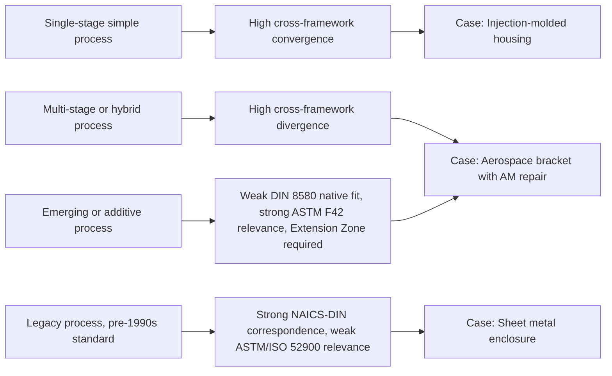

## Comparative Case Studies Across Classification Frameworks

### Overview

This section applies the classification frameworks studied throughout the syllabus — DIN 8580 process physics, NAICS/ISIC statistical taxonomy, ISA-95 systems integration, and ASTM F42/ISO 52900 additive categories — to a set of concrete manufactured components, demonstrating how the same physical object is classified differently (and sometimes ambiguously) depending on which framework is applied.

### Methodology for Comparative Classification

**Key Points**

- Each case study classifies one real-world component across all four major frameworks side by side.
- Divergences between frameworks are explicitly flagged, using the correspondence-type vocabulary (1:1, 1:many, many:1, many:many) established during harmonization study.
- Where applicable, diagnostic signatures from the applied-inference methodology are used to justify the DIN 8580 classification, keeping the case studies grounded in observable evidence rather than assumed process history.

### Case Study 1: Automotive Aluminum Wheel

| Framework | Classification | Notes |
| --- | --- | --- |
| DIN 8580 | Group 1 — Primary Shaping (Urformen), sub-type: Low-Pressure Die Casting | Confirmed by draft angles, absence of tool marks on non-machined faces, gate witness mark on inner rim |
| NAICS (2022) | 331523 — Nonferrous (except Aluminum) Die-Casting Foundries / 331521 — Aluminum Die-Casting Foundries | Correspondence type: many:1 — both low-pressure and high-pressure die casting collapse into the same NAICS code despite being distinct DIN 8580 sub-processes |
| ISA-95 | Process Segment: "Casting" under Equipment Class "Low-Pressure Die Casting Machine"; downstream Process Segment: "CNC Finish Machining" for the mating hub face | Two-segment classification reflects the hybrid process history (cast-then-machined) |
| ASTM F42 / ISO 52900 | Not applicable | No additive process involved |

**Divergence analysis**: The wheel demonstrates a *many:1* correspondence between DIN 8580 and NAICS — low-pressure die casting and high-pressure die casting are physically distinct processes (different injection mechanics, different porosity characteristics) but share a NAICS code, meaning statistical trade data cannot distinguish them. The ISA-95 layer, by contrast, captures the two-stage process history (casting + finish machining) that neither DIN 8580 nor NAICS alone represents as a sequence — DIN 8580 classifies each stage as a separate main group entry, and NAICS would typically only capture the primary output classification, not the secondary machining operation.

### Case Study 2: Sheet Metal Enclosure (Electronics Chassis)

| Framework | Classification | Notes |
| --- | --- | --- |
| DIN 8580 | Group 2 — Forming (Umformen), sub-type: Deep Drawing / Press-Brake Bending, followed by Group 4 — Joining (spot welding of seams) | Confirmed by uniform wall thickness, directional bend-line witness marks, absence of dendritic structure |
| NAICS (2022) | 332322 — Sheet Metal Work Manufacturing | 1:many — this single NAICS code covers stamping, bending, drawing, and roll forming operations that DIN 8580 treats as distinct sub-processes |
| ISA-95 | Process Segment: "Forming" then "Joining" as sequential segments within one Equipment Class "Sheet Metal Fabrication Cell" | Reflects a cell-based rather than single-machine equipment model |
| ASTM F42 / ISO 52900 | Not applicable | — |

**Divergence analysis**: This case illustrates the inverse relationship from Case Study 1: here DIN 8580 is the *more granular* framework (distinguishing deep drawing from bending from roll forming) while NAICS 332322 flattens all of these into one economic-output code. This is the expected pattern given the two frameworks' differing purposes established during harmonization study — NAICS optimizes for economic-sector aggregation, not process specificity.

### Case Study 3: Titanium Aerospace Bracket with Additive Repair

| Framework | Classification | Notes |
| --- | --- | --- |
| DIN 8580 | Group 2 — Forming (original forging), Group 6 — Changing Material Properties (heat treatment), plus an unclassified zone requiring the Extension Zone concept from the master-taxonomy exercise | The repaired region does not map cleanly to any of the six legacy groups |
| NAICS (2022) | 336413 — Other Aircraft Parts and Auxiliary Equipment Manufacturing | Single code; NAICS does not distinguish original manufacture from subsequent repair process at this level of granularity |
| ISA-95 | Two Process Segments: "Forging" (original) and "Directed Energy Deposition Repair" (secondary), tracked as separate genealogy records if the plant maintains full ISA-95 Equipment/Material genealogy | Demonstrates ISA-95's strength in capturing multi-stage process history for traceability-critical industries |
| ASTM F42 / ISO 52900 | Directed Energy Deposition (DED) — repair-specific application | This is the only framework with a purpose-built category for the additive repair operation itself |
| **[Inference]** | — | Aerospace MRO (maintenance, repair, overhaul) organizations are likely to rely most heavily on the ISA-95 genealogy layer for this component type, since neither DIN 8580 nor NAICS was designed to represent a "repair as distinct process event" — this is inferred from the structural gap rather than confirmed industry practice data |

**Divergence analysis**: This case is the clearest demonstration of the Extension Zone concept from the master-taxonomy exercise — DIN 8580's six groups, drafted before additive manufacturing existed as an industrial process, have no native category for "repair via directed energy deposition on a forged substrate." ASTM F42/ISO 52900 is the only framework purpose-built to classify the additive portion, while ISA-95 is the only framework capable of representing the hybrid, multi-event process genealogy as a first-class structure.

### Case Study 4: Injection-Molded Polymer Housing

| Framework | Classification | Notes |
| --- | --- | --- |
| DIN 8580 | Group 1 — Primary Shaping (Urformen), sub-type: Injection Molding | Confirmed by glossy surface, parting line, gate witness mark, draft angles |
| NAICS (2022) | 326199 — All Other Plastics Product Manufacturing (or 326110/326120 depending on specific product category) | 1:many — the "All Other" residual category itself signals NAICS granularity limits for plastics processing diversity |
| ISA-95 | Process Segment: "Injection Molding" under Equipment Class "Injection Molding Machine," Material class annotations for resin grade/lot | Straightforward 1:1-style mapping at this level, unlike the metal-forming cases |
| ASTM F42 / ISO 52900 | Not applicable | — |

**Divergence analysis**: Notably, this case shows *closer* alignment across frameworks than the metal-processing cases — injection molding is a mature, singular process without the multi-stage complexity of casting-plus-machining or forging-plus-repair, so DIN 8580, NAICS, and ISA-95 converge more cleanly. This supports a general pattern: **framework divergence correlates with process-chain complexity**, not with any single framework's inherent quality.

### Cross-Case Synthesis

**Key Points**

- The four cases collectively confirm the harmonization-study finding that correspondence type (1:1 vs many:1 vs many:many) is not random — it follows predictable patterns based on process-chain complexity and the historical era in which each framework was drafted.
- ISA-95 consistently emerges as the framework best suited to representing multi-stage process genealogy, since it was designed for systems integration and traceability rather than static classification.
- NAICS granularity limitations are most visible in cases with high sub-process diversity within one output category (sheet metal, plastics) — this reflects NAICS's design purpose of economic aggregation rather than a flaw.
- The Extension Zone concept from the master-taxonomy exercise is validated as necessary, not merely convenient, by the aerospace repair case — no combination of the four legacy-adjacent frameworks natively classifies additive repair without an explicit extension mechanism.

### Practical Implications for Classification Work

- When documenting a component for **engineering/process-planning purposes**, prioritize DIN 8580-style granularity.
- When documenting for **trade/statistical reporting**, accept NAICS/ISIC's coarser resolution as fit-for-purpose rather than attempting to force finer distinctions into it.
- When documenting for **traceability/genealogy purposes** (aerospace, medical device, regulated industries), ISA-95's segment-sequence model is structurally necessary — a single classification code cannot represent multi-stage process history.
- When encountering **any additive or hybrid process**, check ASTM F42/ISO 52900 first, then determine whether the Extension Zone pattern from the master taxonomy applies before attempting to force-fit into DIN 8580's six legacy groups.

**Conclusion**

These comparative case studies demonstrate that no classification framework is "more correct" than another — each optimizes for a different consumer and use case, and real components frequently require simultaneous classification across multiple frameworks with explicit acknowledgment of correspondence-type ambiguity. Complexity of process chain, rather than component simplicity or industry, is the strongest predictor of cross-framework divergence.

**Related Topics**

- Formal genealogy/traceability data modeling in ISA-95 (Material Lot and Equipment history records)
- NAICS 2027 revision cycle and anticipated treatment of additive manufacturing sub-categories
- Extension Zone governance: proposing new sub-groups to DIN 8580 working committees
- Multi-stage process documentation standards in aerospace (AS9100 traceability requirements)
- Statistical undercounting of hybrid/repair manufacturing in national economic census data