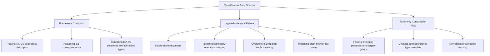

## Common Classification Errors and Misconceptions

### Overview

This section catalogs recurring errors made when classifying manufacturing processes and components — both conceptual misconceptions about how classification frameworks relate to each other, and practical misdiagnoses made during applied inference. Understanding these failure modes is essential for validating a personal master taxonomy against real-world misuse patterns.

### Category 1: Framework-Confusion Errors

#### Error 1.1: Treating NAICS/ISIC Codes as Process Descriptors

**Misconception**: Assuming a NAICS code tells you *how* something was made.

**Reality**: NAICS and ISIC classify economic output by industry sector, not manufacturing process. A part with NAICS code 332721 (Precision Turned Product Manufacturing) could theoretically be produced by turning, but the code itself does not guarantee the process — a shop classified under that code might also perform secondary milling, grinding, or even outsource turning entirely while retaining the classification based on its primary declared business activity.

**[Inference]** This error is likely common among analysts working primarily from trade or economic datasets who have not cross-trained on process-physics taxonomies like DIN 8580, since NAICS documentation itself does not emphasize this distinction.

#### Error 1.2: Assuming 1:1 Correspondence Between Standards

**Misconception**: Believing that every DIN 8580 sub-process has exactly one corresponding NAICS/ISA-95 code, and vice versa.

**Reality**: As established in harmonization study, correspondences are frequently many:1, 1:many, or many:many. Treating an approximate crosswalk as an exact equivalence produces silent data-integrity errors — most dangerously in cross-border trade statistics or supply-chain audits where the false precision is not visually obvious to downstream users.

#### Error 1.3: Conflating ISA-95 Process Segments with DIN 8580 Process Types

**Misconception**: Assuming an ISA-95 "Process Segment" is a classification of the physical process in the DIN 8580 sense.

**Reality**: ISA-95 Process Segments are organizational/operational units of work (potentially spanning multiple physical processes, or representing a single process split across shifts) — they describe *how work is organized on the factory floor*, not *what physical transformation occurs*. A single ISA-95 Process Segment could encompass both a DIN 8580 forming operation and a subsequent joining operation if the plant's operational model groups them into one work unit.

### Category 2: Applied-Inference Errors

#### Error 2.1: Single-Signal Diagnosis

**Misconception**: Concluding a process classification from one diagnostic cue alone (e.g., "it's shiny, so it must be injection molded").

**Reality**: As emphasized in the applied-inference methodology, no single indicator is conclusive. A smooth glossy surface can result from injection molding, but also from a machined-and-polished surface, an electroplated surface over a cast substrate, or a well-executed investment casting. Reliable classification requires triangulating multiple independent signal categories (surface, geometry, material/microstructure, tooling witness marks).

**Example of failure mode**:

| Single Signal Observed | Premature Conclusion | Why It's Wrong |
| --- | --- | --- |
| "Smooth surface" | Injection molded | Could also be polished-machined, plated-cast, or investment-cast |
| "Layered appearance" | Additive manufactured | Could also be laminated composite, or rolled/forged material with visible grain banding under certain lighting |
| "Sharp internal corner" | Machined | Some EDM and certain precision casting processes can also produce sharp internal corners |

#### Error 2.2: Ignoring Secondary-Operation Masking

**Misconception**: Assuming the visible surface characteristics represent the component's *entire* process history.

**Reality**: As covered in the applied-inference chapter, secondary operations (finish machining on a cast part, plating over a forged part) mask primary-process signatures on the treated surfaces while leaving other surfaces unaltered. Classifying the whole component based only on the most visually prominent surface, without checking hidden or non-critical surfaces, produces an incomplete or incorrect process history.

#### Error 2.3: Assuming Draft Angle Implies Casting Exclusively

**Misconception**: "Draft angle present → therefore cast."

**Reality**: Draft angles are also standard in injection molding, forging (for die release), and some sheet-forming operations. Draft angle indicates *some* mold- or die-based process requiring part release, not casting specifically — it narrows the hypothesis space but does not by itself select a single process within Group 1 or Group 2.

#### Error 2.4: Mistaking Grain Flow Direction for a Machining Artifact

**Misconception**: Interpreting visible directional lines on a metal surface as machining tool marks by default.

**Reality**: Forged parts show grain flow that can visually resemble directional tool marks to an untrained observer, but the underlying mechanism is entirely different (plastic deformation of internal crystal structure vs. material removal by a cutting edge). Distinguishing the two typically requires examining whether the "lines" follow the part's geometric contour (suggesting forging grain flow) versus running in a uniform, tool-path-consistent pattern independent of local geometry (suggesting machining).

### Category 3: Taxonomy-Construction Errors

#### Error 3.1: Forcing Emerging Processes into Legacy Categories

**Misconception**: Insisting that additive manufacturing must be shoehorned into one of DIN 8580's six historical groups (most often mistakenly placed under "Urformen"/primary shaping without qualification).

**Reality**: As discussed in the master-taxonomy construction methodology, additive manufacturing's relationship to the six legacy DIN 8580 groups remains actively debated by standards bodies — some AM processes (binder jetting, powder bed fusion) have primary-shaping characteristics, but others (directed energy deposition used for repair, as in the aerospace bracket case study) function more like a joining or coating operation depending on application. Declaring a single definitive legacy-group placement without qualification overstates the field's actual consensus.

#### Error 3.2: Omitting Correspondence-Type Metadata

**Misconception**: Building crosswalk annotations without recording whether each mapping is 1:1, 1:many, many:1, or many:many.

**Reality**: This was explicitly flagged as a required field in the master-taxonomy construction methodology. Omitting it converts a defensible approximate reference into a false-precision trap — future users of the taxonomy (including the original author, after time has passed) will not know where to apply appropriate skepticism.

#### Error 3.3: Static Taxonomy Without Version Provenance

**Misconception**: Treating a personal taxonomy as a permanent, one-time build.

**Reality**: Source standards are periodically revised (NAICS 2017 → 2022, ISIC Rev. 4, evolving ASTM F42/ISO 52900 editions). A taxonomy without recorded provenance for each annotation's source-standard vintage will silently accumulate inconsistency as some entries get updated and others don't.

### Error Pattern Summary

### Mitigation Checklist

**Key Points**

- Before finalizing any process classification, confirm at least two independent diagnostic signal categories agree (per the applied-inference triangulation principle).
- Before citing a cross-standard mapping, state its correspondence type explicitly rather than implying equivalence.
- Before placing an emerging process into a legacy taxonomy group, check whether an Extension Zone or explicit "unresolved/debated" annotation is more honest than forced categorization.
- Before treating a taxonomy as complete, verify it records source-standard version/edition for every annotation.
- When examining a component, deliberately check non-primary surfaces (hidden faces, internal cavities) before concluding the whole-part process history from the most visible surface alone.

**Conclusion**

Most classification errors in this domain do not stem from ignorance of the individual frameworks, but from implicitly assuming frameworks are more interchangeable, more granular, or more complete than they actually are. The corrective discipline in every category above is the same: make correspondence uncertainty, signal insufficiency, and taxonomy incompleteness *explicit* rather than allowing them to be silently assumed away.

**Related Topics**

- Statistical bias introduced by many:1 NAICS collapsing in trade-policy analysis
- Non-destructive evaluation (CT/ultrasonic) as a corrective to single-signal visual misdiagnosis
- Standards-committee debate transcripts on additive manufacturing's DIN 8580 placement
- Version-control methodologies for living technical reference documents
- Common failure modes in automated/ML-based process-classification systems (as an analogy to human diagnostic error patterns)