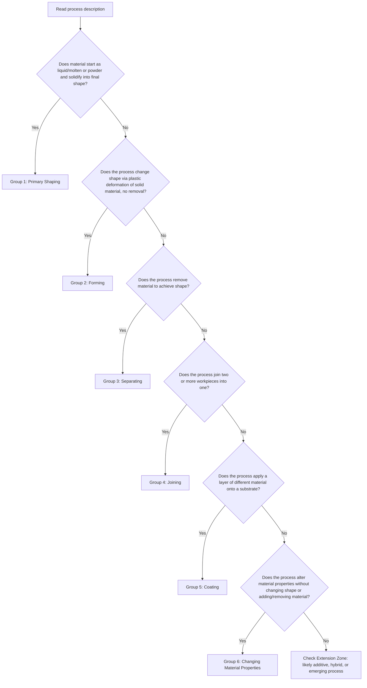

## Practice Assigning Unfamiliar Processes to Correct Categories

### Overview

This section provides structured practice exercises for classifying manufacturing processes that are unfamiliar, ambiguous, or hybrid — applying the diagnostic decision process, the master taxonomy's spine-and-annotation model, and the error-mitigation checklist from prior chapters to unfamiliar cases under exam-like conditions.

### Practice Methodology

**Key Points**

- Each exercise presents a process description without naming the process, requiring classification purely from operational characteristics.
- Work through each exercise using the six-group DIN 8580 spine as the primary decision tree, applying correspondence-type honesty when a secondary framework (NAICS, ISA-95, ASTM F42) is also relevant.
- After attempting classification, compare against the provided solution and reasoning — the goal is calibrating your own confidence against the documented answer, not memorizing the specific cases.

### Classification Decision Tree (Reference)

### Exercise 1

**Process description**: A metal wire is fed continuously through a die while an electric arc is struck between the wire tip and the workpiece, melting both the wire and a small region of the base material, which fuse together as the arc moves along a programmed path. Multiple passes build up a three-dimensional metal structure layer by layer.

 

**Your task**: Classify this process using the decision tree above, then determine its ASTM F42/ISO 52900 category if applicable.

 

**Solution and reasoning**:

- Applying the decision tree: material is not starting purely as bulk liquid poured into a mold (rules out straightforward Group 1), it is not solid-to-solid deformation without addition (rules out Group 2), no material is removed (rules out Group 3), and layers are being progressively deposited and fused — this matches the **Extension Zone** trigger at the final decision node, since layer-by-layer buildup of metal via a fusion mechanism is characteristic of additive manufacturing rather than any single legacy DIN 8580 group cleanly.
- The specific mechanism (wire feedstock, arc as energy source) identifies this as **Wire Arc Additive Manufacturing (WAAM)**, a sub-category of **Directed Energy Deposition (DED)** under ISO/ASTM 52900.
- **[Inference]** Some classification schemes place DED processes partially within DIN 8580 Group 4 (Joining) because the fusion mechanism is physically similar to welding — this is a defensible secondary annotation, illustrating the Extension Zone's role as a cross-reference point rather than a fully isolated category.

### Exercise 2

**Process description**: A cylindrical steel billet is heated to a temperature below its melting point, then placed between two shaped die halves and struck with a large hammer or press, causing the material to plastically flow and fill the die cavity, producing a near-net-shape part with excess material squeezed out along the die parting line.

 

**Your task**: Classify this process, identify the diagnostic surface/geometric signatures you would expect to observe on the finished part, and identify the correct NAICS correspondence type.

 

**Solution and reasoning**:

- Decision tree: solid material, plastic deformation, no removal — this is **Group 2: Forming**, specifically **closed-die (impression-die) forging**.
- Expected diagnostic signatures (per applied-inference methodology): a **flash line** at the die parting plane (the "excess material squeezed out"), grain flow following the part's contour rather than being cut across, and no dendritic microstructure (rules out casting).
- NAICS correspondence: NAICS 332111 (Iron and Steel Forging) — this is a relatively close **1:many** correspondence, since NAICS 332111 covers both open-die and closed-die forging, which DIN 8580 treats as distinguishable sub-processes.

### Exercise 3

**Process description**: A flat sheet of aluminum is placed over a die cavity and clamped at the edges. A punch descends, pushing the sheet into the cavity while the material stretches and flows plastically to conform to a cup-shaped die profile, with the punch and die maintaining a controlled clearance to control wall thinning.

 

**Your task**: Classify this process and distinguish it from a superficially similar process (stamping/blanking) it might be confused with.

 

**Solution and reasoning**:

- Decision tree: solid sheet material, plastic deformation, no removal, no addition — **Group 2: Forming**, specifically **deep drawing**.
- Distinguishing from stamping/blanking: blanking is technically a **Group 3 (Separating)** process — it shears material to cut a flat outline from sheet stock, rather than deforming it into a three-dimensional shape. A component that has both been blanked (cut to a flat outline) and then deep drawn (formed into a cup shape) has a two-stage process history spanning two DIN 8580 groups, illustrating the multi-stage-genealogy pattern discussed in the comparative case studies.
- **[Unverified]** Without inspecting the actual part, one cannot determine from the process description alone whether a blanking step preceded the drawing step — this would require examining the finished part's edge condition (sheared vs. as-rolled edge) as an applied-inference signal.

### Exercise 4

**Process description**: A ceramic powder is mixed with a liquid binder to form a slurry, which is deposited layer by layer through a nozzle according to a digital model. After the full geometry is built, the part is placed in a furnace where the binder burns off and the ceramic particles sinter together into a dense solid structure.

 

**Your task**: Classify this process, and identify which DIN 8580 group the *final sintering step* would separately belong to if classified as an isolated operation.

 

**Solution and reasoning**:

- The deposition stage triggers the **Extension Zone** (layer-by-layer digital-model-driven buildup), specifically corresponding to **Material Extrusion or Material Jetting** under ISO/ASTM 52900 depending on the exact deposition mechanism described.
- The isolated sintering step, however, if classified purely on its own physical mechanism (particles bonding via heat without melting to full liquid, and without changing the part's macroscopic shape) corresponds most closely to **Group 6: Changing Material Properties** (specifically a sintering/heat-treatment-type operation), or alternatively could be argued as a **Group 1: Primary Shaping** sub-type (powder-based primary shaping) depending on which DIN 8580 interpretation is applied.
- This exercise demonstrates a **genuinely ambiguous case** rather than a lookup error: reputable classification sources differ on whether post-print sintering is best modeled as a shape-defining step (Group 1) or a property-changing step (Group 6), since the geometry is technically already defined before sintering but the *final functional material properties* are not achieved until after it.

### Exercise 5

**Process description**: A metal sheet is passed between two large rotating cylindrical rolls with a gap smaller than the sheet's initial thickness, progressively reducing thickness and increasing length as the material passes through multiple roll stands in sequence.

 

**Your task**: Classify this process and identify its most common NAICS correspondence, noting the correspondence type.

 

**Solution and reasoning**:

- Decision tree: solid material, plastic deformation via compressive rolling force, no removal — **Group 2: Forming**, specifically **rolling** (flat rolling, in this description).
- NAICS correspondence: NAICS 331110 (Iron and Steel Mills and Ferroalloy Manufacturing) if steel, or the relevant nonferrous rolling code if aluminum/copper — this tends toward a **closer to 1:1** correspondence for primary rolling mills, since rolling is often the primary declared activity of establishments under these codes, unlike the more diffuse many:1 patterns seen in general machine-shop or sheet-metal-fabrication NAICS codes.

### Self-Assessment Calibration Table

| Exercise | Correct Primary Group | Common Misdiagnosis | Error Category (from prior chapter) |
| --- | --- | --- | --- |
| 1 (WAAM) | Extension Zone / DED | Misclassified as Group 4 Joining only | Error 3.1 — forcing emerging process into legacy-only category |
| 2 (Closed-die forging) | Group 2 Forming | Misclassified as Group 1 (confusing flash line with a casting parting line) | Error 2.1 — single-signal diagnosis |
| 3 (Deep drawing) | Group 2 Forming | Overlooked possible prior blanking stage (Group 3) | Error 2.2 — ignoring secondary/prior-operation masking |
| 4 (Binder jetting + sintering) | Extension Zone; sintering step ambiguous between Group 1/6 | Forcing a single definitive answer where genuine ambiguity exists | Error 3.1 — overstating consensus |
| 5 (Rolling) | Group 2 Forming | Confusing with extrusion (Group 2, but different sub-mechanism — compressive rolling vs. forced flow through a die orifice) | Error 2.1 — single-signal diagnosis (shape-change alone, without checking the force-application mechanism) |

**Conclusion**

These exercises demonstrate that unfamiliar-process classification is rarely a matter of pure lookup — it requires applying the decision-tree logic systematically, checking for multi-stage process history, and being willing to flag genuine standards ambiguity (as in Exercise 4) rather than forcing false confidence. The recurring failure modes across exercises map directly back to the error catalog from the prior chapter, confirming that the same small set of misconceptions accounts for most misclassification regardless of the specific process involved.

**Next Steps**

- Attempt classification of a novel process description without reference to the decision tree, then check work against it
- Extend the personal master taxonomy's Extension Zone with the WAAM/DED and binder-jetting/sintering ambiguity cases documented here
- Practice identifying multi-stage process genealogies (as in Exercise 3) using only finished-part inspection, without a provided process description
- Research current DIN 8580 committee positions on sintering's Group 1 vs. Group 6 classification to resolve the Exercise 4 ambiguity with updated source material