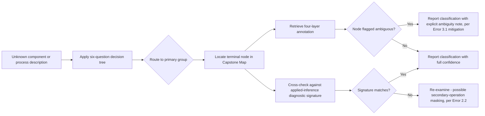

## Capstone Synthesis: A Comprehensive Process-Classification Map


### Overview

This capstone consolidates every framework, methodology, and error-correction discipline covered across the syllabus — nomenclature, harmonization mechanics, applied inference, master-taxonomy construction, comparative case studies, and error patterns — into a single integrated process-classification map. It is the terminal deliverable of the "Applied Mastery and Synthesis" chapter and is intended as a durable working reference.

### Structure of the Capstone Map

**Key Points**

- The map is organized as the six-group DIN 8580 spine plus an Extension Zone, consistent with the master-taxonomy design principles established earlier.
- Each node carries four integrated layers: process-physics definition, statistical (NAICS/ISIC) annotation with correspondence type, systems-integration (ISA-95) annotation, and applied-inference diagnostic signature.
- Known ambiguities and unresolved standards debates (e.g., sintering placement, additive-repair classification) are retained as explicit flagged nodes rather than resolved by fiat, per the error-mitigation discipline from the misconceptions chapter.

### The Complete Map

```mermaid
flowchart TB
    Root[Comprehensive Process-Classification Map]

    Root --> G1[Group 1: Primary Shaping - Urformen]
    Root --> G2[Group 2: Forming - Umformen]
    Root --> G3[Group 3: Separating - Trennen]
    Root --> G4[Group 4: Joining - Fuegen]
    Root --> G5[Group 5: Coating - Beschichten]
    Root --> G6[Group 6: Changing Material Properties]
    Root --> G7[Extension Zone: Emerging and Hybrid Processes]

    G1 --> G1a[Sand Casting]
    G1 --> G1b[Investment Casting]
    G1 --> G1c[Die Casting - high and low pressure]
    G1 --> G1d[Powder Metallurgy Compaction]

    G2 --> G2a[Forging - open and closed die]
    G2 --> G2b[Rolling]
    G2 --> G2c[Extrusion]
    G2 --> G2d[Deep Drawing]
    G2 --> G2e[Press-Brake Bending]

    G3 --> G3a[Turning]
    G3 --> G3b[Milling]
    G3 --> G3c[Drilling]
    G3 --> G3d[Grinding]
    G3 --> G3e[Blanking and Shearing]
    G3 --> G3f[EDM]

    G4 --> G4a[Arc Welding]
    G4 --> G4b[Resistance Welding]
    G4 --> G4c[Brazing and Soldering]
    G4 --> G4d[Mechanical Fastening]
    G4 --> G4e[Adhesive Bonding]

    G5 --> G5a[Electroplating]
    G5 --> G5b[Anodizing]
    G5 --> G5c[Physical/Chemical Vapor Deposition]
    G5 --> G5d[Painting and Powder Coating]

    G6 --> G6a[Heat Treatment - annealing, quenching, tempering]
    G6 --> G6b[Case Hardening]
    G6 --> G6c[Sintering - flagged ambiguous with G1]

    G7 --> G7a[Material Extrusion AM]
    G7 --> G7b[Powder Bed Fusion AM]
    G7 --> G7c[Directed Energy Deposition - flagged ambiguous with G4]
    G7 --> G7d[Binder Jetting - flagged ambiguous with G1/G6]
    G7 --> G7e[Hybrid Subtractive-Additive]
    G7 --> G7f[AI-Adaptive Machining]
```



### Layered Annotation Template

Each terminal node (illustrated here for three representative nodes) carries the full four-layer annotation structure established in the master-taxonomy chapter:

**Example**



```
Node: G3a - Turning
  DIN 8580 ref: 3.2.2 (Drehen)
  NAICS annotation: 332721 [many:1 - collapses with milling/drilling in some sub-codes]
  ISA-95 annotation: Process Segment "Turning Operation" / Equipment Class "Lathe"
  Diagnostic signature: fine directional helical tool marks; chucking witness marks
  Status: stable, non-ambiguous

Node: G6c - Sintering
  DIN 8580 ref: debated - some sources place under 1 (Urformen), others under 6
  NAICS annotation: varies by output product [many:many - highly context dependent]
  ISA-95 annotation: Process Segment "Sintering" / Equipment Class "Sintering Furnace"
  Diagnostic signature: porous microstructure, no melt-pool evidence, particle-boundary structure under microscopy
  Status: FLAGGED - genuine standards ambiguity, see Exercise 4 analysis

Node: G7c - Directed Energy Deposition
  DIN 8580 ref: not natively represented; Extension Zone entry
  ASTM F42/ISO 52900 annotation: DED (includes WAAM sub-type)
  NAICS annotation: context-dependent on end-use industry [many:many]
  ISA-95 annotation: Process Segment "Additive Repair" or "Additive Build" / Equipment Class varies
  Diagnostic signature: layered fusion-zone microstructure, possible HAZ if repair on wrought/forged substrate
  Status: FLAGGED - some schemes cross-reference to Group 4 (Joining) due to fusion mechanism similarity to welding
```

### Integration of the Diagnostic Decision Tree

The capstone map is designed to be traversed using the same decision-tree logic practiced in the prior exercises chapter — the map is the *destination* structure that the decision tree routes into:



### Validation Against the Full Syllabus

**Key Points**

- **Nomenclature chapter**: the six-group spine and terminal-node vocabulary are drawn directly from DIN 8580's established nomenclature, ensuring the map's base vocabulary is standards-grounded rather than ad hoc.
- **Harmonization chapter**: every NAICS/ISIC annotation carries explicit correspondence-type metadata, directly implementing the harmonization discipline of avoiding false 1:1 assumptions.
- **Applied-inference chapter**: every terminal node carries a diagnostic signature field, making the map usable for classifying unknown physical components, not just for organizing known process names.
- **Master-taxonomy chapter**: the spine-and-annotation structure, version-provenance discipline, and Extension Zone are all directly inherited design decisions.
- **Comparative case studies chapter**: the flagged-ambiguity nodes (sintering, DED) are drawn directly from the divergences surfaced in those case studies, rather than invented fresh for this capstone.
- **Misconceptions chapter**: the explicit flagging mechanism for ambiguous nodes is the structural fix for Error 3.1 (forcing emerging processes into false-certainty categories) and Error 1.2 (assuming false 1:1 correspondence).
- **Practice exercises chapter**: the calibration table's identified misdiagnosis patterns are reflected in which nodes carry ambiguity flags and which carry "stable, non-ambiguous" status.

### Maintenance Protocol for the Capstone Map

1. **Review cadence**: Re-audit the Extension Zone and flagged-ambiguous nodes against current ISO/ASTM 52900 and DIN 8580 revision activity on a recurring basis, since this is the fastest-moving portion of the structure.
2. **Provenance logging**: Record the specific edition/revision of each source standard used for every annotation at time of entry, per the version-provenance discipline established in the master-taxonomy chapter.
3. **New-node intake process**: When encountering a process not yet represented in the map (via the applied-inference workflow on a real component, or via new literature), first check whether it fits an existing terminal node before creating a new Extension Zone entry — avoiding premature proliferation of near-duplicate categories.
4. **Ambiguity resolution tracking**: For flagged nodes (sintering, DED, binder jetting), periodically check whether standards-committee consensus has shifted before re-flagging as stable — do not resolve the flag unilaterally based on personal judgment alone.

**Conclusion**

This capstone map is not a new framework — it is the synthesized, cross-referenced, and error-hardened integration of every framework and methodology studied throughout the course. Its value lies not in novelty but in the discipline it enforces: every classification claim it supports is traceable to a specific standard, carries honest correspondence-type and confidence metadata, and is validated against both real diagnostic signatures and documented failure patterns. Used as intended, it functions as a durable working tool for classifying real manufacturing components and processes with calibrated, defensible confidence.

**Related Topics**

- Formal publication or peer-review pathways for proposing Extension Zone entries to standards bodies
- Digital/machine-readable implementation of the capstone map (e.g., as a queryable ontology or database schema)
- Longitudinal tracking of standards revision impact on a maintained personal taxonomy
- Cross-training applications: using the capstone map as an onboarding tool for others
- Automated classification systems and their alignment (or misalignment) with this human-curated map structure