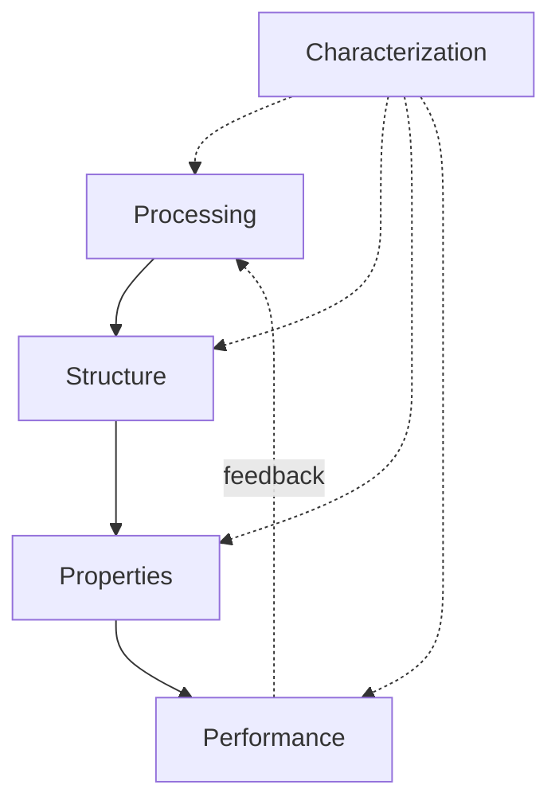
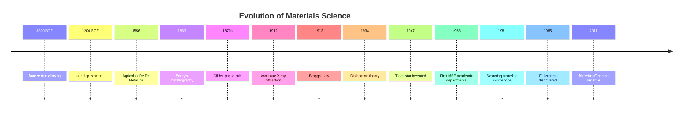

## History and Evolution of Materials Science

### Overview

Materials Science and Engineering (MSE) is the interdisciplinary field concerned with the relationships among **processing, structure, properties, and performance** of materials. Its historical development reflects humanity's progressively deeper understanding of matter — moving from empirical, trial-and-error craftsmanship to a rigorous science grounded in atomic and electronic structure. The field's evolution can be traced through distinct eras, each defined by dominant material classes and the analytical tools available to study them.

### The Prehistoric and Ancient Eras: Empirical Materials Use

**Stone Age (c. 3.4 million – 3300 BCE)**

Early humans selected naturally occurring materials — flint, obsidian, wood, bone — based on observed mechanical behavior (hardness, fracture toughness, edge retention) without any theoretical framework. Knapping techniques represent an early, unrecorded optimization of processing-property relationships.

**Bronze Age (c. 3300 – 1200 BCE)**

The discovery that copper alloyed with tin (or arsenic) produced a harder, more castable material than either pure metal marks the first deliberate materials engineering. Key developments:

- Smelting of copper ores using charcoal fires
- Empirical alloy ratio optimization (~88% Cu, 12% Sn for optimal hardness)
- Lost-wax casting techniques

**Iron Age (c. 1200 BCE onward)**

Iron required higher smelting temperatures (~1,538°C for pure iron, though bloomery processes operated below this, producing solid-state reduction) and introduced carbon-content control as an early, unknowingly-practiced form of phase transformation engineering. Blacksmiths discovered that repeated heating, hammering, and quenching altered mechanical properties — the empirical precursor to modern heat treatment and the iron-carbon phase diagram.

**Key Point:** All pre-scientific metallurgy was driven by *phenomenological empiricism* — artisans identified reproducible processing routes that yielded desired properties without understanding the underlying microstructural mechanisms (grain structure, dislocation motion, phase transformations).

### The Craft-to-Science Transition (Medieval to Early Modern, c. 500 – 1800 CE)

- **Damascus and Wootz steel** (India, Middle East, c. 300 BCE – 1700 CE): Produced ultra-high-carbon steel with distinctive banding patterns, now understood to result from carbide segregation during controlled cooling — a phenomenon not scientifically explained until 20th-century metallography.
- **Medieval European metallurgy**: Guild-based, secretive knowledge transfer; introduction of blast furnaces (c. 1350s) enabled higher-temperature, higher-throughput iron production, yielding cast iron.
- **Georgius Agricola's *De Re Metallica*** (1556): One of the first systematic, published treatises on mining and metallurgy, marking a shift toward documented, transmissible technical knowledge.
- **René Antoine Ferchault de Réaumur** (1722): Investigated the relationship between carbon content and steel properties, an early quantitative link between composition and behavior.

### The Birth of Modern Materials Science (19th Century)

The 19th century established the scientific instruments and theoretical frameworks necessary to observe and explain material structure directly.

- **Henry Clifton Sorby** (1863): Pioneered metallographic microscopy, applying geological thin-sectioning techniques to polished and etched steel samples, revealing microstructural constituents (ferrite, pearlite, cementite) for the first time.
- **Josiah Willard Gibbs** (1870s): Developed the phase rule and chemical thermodynamics, providing the theoretical foundation for phase diagrams — arguably the single most important conceptual tool in materials science.
- **Henry Le Chatelier** and **Floris Osmond**: Advanced thermal analysis techniques (e.g., pyrometry) to detect phase transformation temperatures in steels.
- **Adolf Martens**: Namesake of martensite, studied rapidly quenched steel microstructures.

This period established metallurgy as an empirical-experimental science distinct from pure craft, though the atomic-scale explanation for observed phenomena remained unknown.

### The Atomic Revolution (Early-to-Mid 20th Century)

The discovery of X-ray diffraction transformed materials science from a phenomenological to a mechanistic discipline.

- **Max von Laue** (1912): Demonstrated X-ray diffraction by crystals, proving X-rays are electromagnetic waves and that crystals have periodic atomic structure.
- **William Henry Bragg and William Lawrence Bragg** (1913): Formulated Bragg's Law,

$$n\lambda = 2d\sin\theta$$

enabling direct determination of crystal structures from diffraction patterns. This is considered the founding technique of solid-state materials characterization.

- **Dislocation theory** (1934): Independently proposed by **G.I. Taylor, Egon Orowan, and Michael Polanyi** to reconcile the enormous discrepancy between theoretical and experimentally observed shear strength of crystals. This explained plastic deformation at the atomic scale — a cornerstone concept still central to mechanical metallurgy.
- **Linus Pauling** (1930s): Applied quantum mechanics to chemical bonding, providing a framework for understanding ionic, covalent, and metallic bonding in materials.
- **Development of the electron microscope** (Ernst Ruska, 1931; commercialized by the late 1930s–1940s): Extended resolution far beyond optical microscopy, eventually enabling direct dislocation imaging (1950s, via transmission electron microscopy).

**Key Point:** By mid-century, the field had shifted from asking "*what happens*" to "*why it happens at the atomic and electronic level*" — the defining conceptual leap of modern materials science.

### Institutional Consolidation (1950s–1960s): The Formal Emergence of "Materials Science"

Before this period, the field existed as separate disciplines: metallurgy, ceramics engineering, polymer chemistry, and solid-state physics. Several converging factors unified them:

1. **Cold War and Space Race demands**: Need for high-performance materials (heat-resistant alloys, semiconductors, composites) drove interdisciplinary government funding (e.g., U.S. ARPA/DARPA Interdisciplinary Laboratory Program, 1960).
2. **Recognition of common underlying principles**: Structure-property relationships were found to be governed by universal concepts (bonding, defects, phase equilibria) applicable across metals, ceramics, and polymers alike.
3. **Founding of dedicated academic departments**: Universities such as Northwestern (1958) and MIT began establishing "Materials Science" departments, merging metallurgy, ceramics, and polymer programs.
4. **Solid-state physics integration**: The transistor's invention (Bardeen, Brattain, Shockley, 1947) demonstrated that electronic materials properties were equally central to the discipline, incorporating semiconductors into the field's scope.

This era formalized the modern **"Materials Science and Engineering" tetrahedron**: Processing ↔ Structure ↔ Properties ↔ Performance, with Characterization often placed at the center.

### The Modern Era (1970s–Present): Computational and Multiscale Materials Science

- **1970s–1980s**: Development of computational thermodynamics (CALPHAD method) allowed prediction of multicomponent phase diagrams without exhaustive experimentation.
- **1980s–1990s**: Advances in characterization — scanning tunneling microscopy (Binnig and Rohrer, 1981, Nobel Prize 1986) and atomic force microscopy enabled atomic-resolution imaging of surfaces.
- **1985**: Discovery of fullerenes (Kroto, Curl, Smalley) opened nanomaterials science.
- **1991**: Discovery of carbon nanotubes (Sumio Iijima) accelerated interest in nanostructured materials.
- **2000s**: The U.S. National Nanotechnology Initiative and similar programs worldwide institutionalized nanoscale materials research.
- **2011**: Launch of the **Materials Genome Initiative** (U.S.), aiming to halve the time and cost of materials discovery-to-deployment using high-throughput computation, machine learning, and integrated databases.
- **2010s–present**: Machine learning-accelerated materials discovery, density functional theory (DFT)-based high-throughput screening, and additive manufacturing (3D printing) as a processing paradigm have become central to contemporary research.

[Inference] The trajectory of the field suggests continued convergence between computational prediction, autonomous experimentation (self-driving labs), and data-driven materials informatics, though the pace and specific outcomes of this convergence remain an active and evolving research area.

### Timeline Summary

### Conclusion

The history of materials science traces a consistent arc: from **empirical craft** (selecting and processing materials by observed outcome), through **documented experimental science** (systematic composition-property studies), to **atomic-scale mechanistic understanding** (enabled by diffraction and microscopy), and finally to **computational and data-driven design** (predicting materials before synthesis). This progression underlies the modern MSE paradigm and directly motivates why the discipline is taught through the processing-structure-property-performance framework rather than as isolated material-class silos (metals, ceramics, polymers).

**Next Steps**

- The Materials Science Tetrahedron (Structure-Property-Processing-Performance)
- Atomic Bonding and Its Influence on Material Properties
- Crystal Structures and Crystallography Fundamentals
- Classification of Materials (Metals, Ceramics, Polymers, Composites)
- Historical Development of Phase Diagrams
- Introduction to Materials Characterization Techniques (XRD, SEM, TEM)