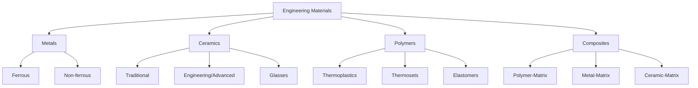

## Classification of Materials: Metals, Ceramics, Polymers, Composites

### Overview

Materials are classified into four principal categories based on the nature of atomic bonding, which in turn dictates their characteristic structure and macroscopic properties: **metals**, **ceramics**, **polymers**, and **composites**. A fifth category, **advanced materials** (semiconductors, biomaterials, smart materials), is sometimes treated separately but generally derives from combinations or specialized processing of the four base classes. This classification framework is foundational because bonding type is the primary determinant of mechanical, electrical, thermal, and optical behavior.

### Classification Basis: Atomic Bonding

| Bonding Type | Characteristic | Dominant Material Class |
| --- | --- | --- |
| Metallic | Delocalized electron "sea" around positive ion cores | Metals |
| Ionic | Electrostatic attraction between cations and anions | Ceramics |
| Covalent (network) | Directional, shared electron pairs | Ceramics, some polymers |
| Covalent (chain) + secondary (van der Waals, H-bonding) | Long-chain molecules with weak intermolecular forces | Polymers |
| Mixed/interfacial | Combination of the above across distinct phases | Composites |

### Metals

**Key Points**

- **Bonding**: Metallic bonding — a lattice of positive ion cores immersed in a delocalized electron cloud.
- **Structure**: Typically crystalline, most commonly arranged in FCC (face-centered cubic), BCC (body-centered cubic), or HCP (hexagonal close-packed) crystal systems.
- **Properties**:
  - High electrical and thermal conductivity (due to free electron mobility)
  - High ductility and toughness (non-directional bonding allows dislocation motion without bond rupture)
  - Metallic luster (electrons readily absorb and re-emit photons across visible spectrum)
  - Generally high density relative to polymers
  - Moderate-to-high melting points
- **Subclasses**: Ferrous (iron-based: steels, cast irons) and non-ferrous (aluminum, copper, titanium, nickel alloys, etc.)

**Example**

Structural steel (Fe-C alloy) in construction relies on the ductility conferred by metallic bonding to allow plastic deformation (yielding) before fracture, providing a visible warning of overload — a critical safety characteristic absent in brittle materials.

### Ceramics

**Key Points**

- **Bonding**: Predominantly ionic, covalent, or a mixture of both — generally strong and directional.
- **Structure**: Crystalline (e.g., Al₂O₃, MgO), amorphous (e.g., silicate glasses), or a mixture of crystalline grains within a glassy matrix (traditional ceramics like porcelain).
- **Properties**:
  - High hardness and compressive strength
  - Brittleness — low fracture toughness due to lack of dislocation mobility in ionic/covalent lattices
  - High melting points and excellent thermal stability
  - Electrical insulation (typically), though some (e.g., ZnO, SiC) are semiconducting
  - Chemical inertness and corrosion resistance
- **Subclasses**:
  - Traditional ceramics (clay-based: brick, porcelain, tile)
  - Engineering/advanced ceramics (Al₂O₃, ZrO₂, Si₃N₄, SiC)
  - Glasses (amorphous silicates)
  - Glass-ceramics (partially crystallized glass)
  - Cements

**Example**

Zirconia (ZrO₂) is used in dental implants for its high compressive strength and biocompatibility, though its brittleness necessitates careful design against tensile and impact loading — the failure mode for ceramics is typically sudden fracture rather than gradual yielding.

### Polymers

**Key Points**

- **Bonding**: Strong covalent bonds along the backbone chain; weaker secondary bonds (van der Waals, hydrogen bonding, dipole interactions) between chains.
- **Structure**: Long-chain macromolecules, existing as amorphous, semi-crystalline, or (rarely) highly crystalline arrangements.
- **Properties**:
  - Low density
  - Low electrical and thermal conductivity (electrons are localized in covalent bonds)
  - Low melting/softening temperatures relative to metals and ceramics
  - Wide range of mechanical behavior — from elastomeric to rigid, depending on chain structure and crosslinking
  - Generally lower stiffness and strength than metals/ceramics, though specific strength (strength-to-weight ratio) can be favorable
- **Subclasses**:
  - **Thermoplastics**: Linear/branched chains, soften reversibly on heating (PE, PP, PVC, PET, nylon)
  - **Thermosets**: Heavily crosslinked networks, degrade rather than melt on heating (epoxies, phenolics, polyurethanes)
  - **Elastomers**: Lightly crosslinked chains with high elastic extensibility (natural rubber, silicone)

**Example**

High-density polyethylene (HDPE) achieves greater stiffness than low-density polyethylene (LDPE) primarily because reduced chain branching allows tighter chain packing and higher crystallinity, which restricts chain mobility.

### Composites

**Key Points**

- **Definition**: Engineered materials combining two or more distinct constituent phases (typically a **matrix** and a **reinforcement**) that remain physically distinct at the microscopic/macroscopic level, producing properties unattainable by either constituent alone.
- **Matrix role**: Binds reinforcement, transfers load, protects from environment.
- **Reinforcement role**: Carries the majority of applied load; typically higher stiffness/strength than the matrix.
- **Classification by matrix**:
  - Polymer-matrix composites (PMCs) — e.g., carbon-fiber-reinforced epoxy
  - Metal-matrix composites (MMCs) — e.g., SiC particle-reinforced aluminum
  - Ceramic-matrix composites (CMCs) — e.g., SiC fiber-reinforced SiC
- **Classification by reinforcement geometry**:
  - Particle-reinforced (particulate composites)
  - Fiber-reinforced (continuous or discontinuous/chopped fiber)
  - Structural composites (laminates, sandwich panels)

**Rule of Mixtures** (idealized estimate for longitudinal modulus of a fiber-reinforced composite, isostrain condition):

$$E_c = E_f V_f + E_m V_m$$

where $E_c$, $E_f$, $E_m$ are the composite, fiber, and matrix moduli respectively, and $V_f$, $V_m$ are their volume fractions ($V_f + V_m = 1$).

For the transverse (isostress) condition, the inverse rule of mixtures applies:

$$\frac{1}{E_c} = \frac{V_f}{E_f} + \frac{V_m}{E_m}$$

**Example**

Carbon-fiber-reinforced polymer (CFRP) combines a stiff, brittle carbon fiber (high $E_f$, low toughness) with a ductile epoxy matrix, yielding a composite with high specific stiffness and improved damage tolerance relative to the fiber alone — the matrix arrests crack propagation between fibers.

### Comparative Property Summary

| Property | Metals | Ceramics | Polymers | Composites |
| --- | --- | --- | --- | --- |
| Density | Moderate-High | Moderate | Low | Variable (tailorable) |
| Stiffness (E) | High | Very High | Low | Tailorable (fiber-dominated) |
| Strength | High | High (compressive) | Low-Moderate | High (directional) |
| Ductility/Toughness | High | Low (brittle) | Moderate-High | Variable (anisotropic) |
| Electrical Conductivity | High | Low (insulator) | Low (insulator) | Depends on constituents |
| Thermal Stability | Moderate-High | Very High | Low | Matrix-limited |
| Corrosion Resistance | Variable | Excellent | Good (chemical) | Depends on matrix |

[Inference] Exact property values vary significantly with alloy composition, processing history, and microstructure within each class; the table reflects general tendencies rather than absolute rankings applicable to every specific material grade.

### Classification Diagram

### Conclusion

The four-class taxonomy of materials — metals, ceramics, polymers, and composites — is fundamentally a consequence of atomic bonding type, which governs electron mobility (electrical/thermal conductivity), bond directionality (ductility vs. brittleness), and bond strength (stiffness, melting point). Composites occupy a distinct category not because of a unique bonding mechanism, but because they are engineered assemblies of the other three classes, designed to exploit complementary properties. Mastery of this classification framework is prerequisite to understanding structure-property relationships throughout materials science.

**Next Steps**

- Atomic Bonding and Its Influence on Material Properties
- Crystal Structures and Crystallography Fundamentals
- Mechanical Properties: Stress-Strain Behavior Across Material Classes
- Phase Diagrams and Microstructural Development
- Introduction to Semiconductors and Advanced/Smart Materials
- Composite Micromechanics and the Rule of Mixtures