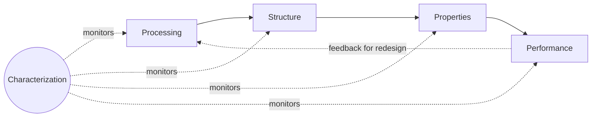

## Structure-Property-Processing-Performance Relationships

### Overview

The **Structure-Property-Processing-Performance (SPPP)** paradigm, often visualized as a tetrahedron with **Characterization** at its center, is the unifying conceptual framework of materials science and engineering. It asserts that a material's real-world performance is not an intrinsic, fixed attribute but the outcome of a causal chain: how a material is **processed** determines its **structure**, its structure determines its **properties**, and its properties (in the context of a specific application's demands) determine its **performance**. This framework replaces the older, siloed view of "picking a material from a handbook" with an engineering discipline of *designing* materials to meet functional requirements.

### The Four Elements Defined

**Processing**

The methods used to convert raw materials into a finished form, including synthesis, forming, and treatment. Processing parameters (temperature, cooling rate, deformation, atmosphere, time) directly govern the resulting structure.

- Examples: casting, forging, rolling, extrusion, powder metallurgy, heat treatment (annealing, quenching, tempering), polymerization, sintering, additive manufacturing (3D printing), thin-film deposition.

**Structure**

The arrangement of a material's internal constituents across multiple length scales:

- **Atomic/electronic structure**: bonding type, electron configuration (~$10^{-10}$ m)
- **Crystal structure**: unit cell arrangement — FCC, BCC, HCP, etc. (~$10^{-9}$ m)
- **Nanostructure**: precipitates, nanoscale features (~$10^{-9}$–$10^{-7}$ m)
- **Microstructure**: grains, grain boundaries, phases, inclusions (~$10^{-6}$–$10^{-3}$ m), observable via optical/electron microscopy
- **Macrostructure**: bulk geometry, porosity, macroscopic defects (visible to the naked eye)

**Properties**

Measurable characteristics that describe how a material responds to external stimuli, independent of specimen geometry:

- Mechanical: yield strength, tensile strength, hardness, toughness, fatigue resistance
- Thermal: conductivity, expansion coefficient, specific heat
- Electrical/magnetic: conductivity, permittivity, permeability
- Chemical: corrosion resistance, oxidation resistance
- Optical: reflectivity, transparency, refractive index

**Performance**

How the material behaves in its actual service application — a function of its properties relative to the specific loading, environmental, and lifetime conditions imposed by the application. Performance also depends on factors external to the material itself, such as component design and operating environment.

### The Causal Chain (Forward Design Logic)

**Key Point:** The relationship is bidirectional in engineering practice. Forward reasoning (processing → performance) is used in **materials selection and manufacturing**; reverse reasoning (desired performance → required properties → required structure → required processing route) is used in **materials design** — the modern, computationally-driven approach central to concepts like the Materials Genome Initiative.

### Worked Example: Quenched-and-Tempered Steel

This example illustrates the full SPPP chain in a single, well-documented system.

1. **Processing**: A medium-carbon steel is austenitized (heated above the upper critical temperature, into the single-phase austenite field), then rapidly quenched in water or oil, followed by tempering at an intermediate temperature (e.g., 400°C) for a controlled time.
2. **Structure**:
   - Rapid quenching suppresses diffusion-controlled transformation, forcing a diffusionless shear transformation of austenite into **martensite** — a supersaturated, body-centered tetragonal (BCT) phase with high dislocation/twin density.
   - Subsequent tempering allows limited carbon diffusion, precipitating fine carbide particles within a ferrite matrix (tempered martensite), relieving internal stresses.
3. **Properties**:
   - As-quenched martensite: very high hardness and strength, but low toughness (brittle) due to high internal stress and lack of stress-relief mechanisms.
   - Tempered martensite: hardness decreases moderately, but toughness and ductility increase substantially — tempering trades some strength for a critical gain in fracture resistance.
4. **Performance**:
   - In a service application such as an automotive gear or a cutting tool, the tempered condition provides the necessary combination of wear resistance (from retained hardness) and impact resistance (from improved toughness) to survive cyclic loading without brittle fracture — the as-quenched condition alone would perform poorly under real service impact loads despite its higher raw hardness.

**[Inference]** The specific tempering temperature and resulting property balance are tailored to the application; a tool requiring maximum hardness (e.g., a file) may be tempered at a lower temperature than a component requiring impact toughness (e.g., a leaf spring), and actual property values depend on exact alloy composition and processing control.

### The Role of Characterization

Characterization techniques are the empirical link connecting all four corners of the tetrahedron — without them, the SPPP relationships would remain theoretical.

| Characterization Technique | Length Scale Probed | Links |
| --- | --- | --- |
| Optical microscopy | Microstructure (grains, phases) | Processing → Structure |
| X-ray diffraction (XRD) | Crystal structure, phase identification | Processing → Structure |
| Scanning electron microscopy (SEM) | Microstructure, fractography | Structure → Properties (failure analysis) |
| Transmission electron microscopy (TEM) | Nanostructure, dislocations, precipitates | Structure → Properties |
| Mechanical testing (tensile, hardness, impact) | Bulk properties | Structure → Properties |
| Non-destructive evaluation (NDE) | Macrostructure, in-service defects | Properties → Performance |

### Multi-Scale Nature of the Framework

**Key Points**

- SPPP relationships operate simultaneously across atomic, nano, micro, and macro length scales; a change introduced at one scale (e.g., alloying addition at the atomic scale) propagates upward to affect bulk performance.
- Computational tools now support this multi-scale linkage: *ab initio*/DFT methods model atomic-scale bonding and defect energetics; phase-field and CALPHAD methods model microstructural evolution; finite element analysis (FEA) models macroscopic/component-level performance.
- This computational chain underlies **Integrated Computational Materials Engineering (ICME)**, a modern methodology that simulates the full SPPP chain to accelerate materials and component design without exhaustive physical iteration.

### Common Pitfalls in Applying the Framework

- **Property ≠ Performance**: A material with excellent laboratory-measured properties can still exhibit poor performance if the service environment introduces factors not captured by standard tests (e.g., corrosion-fatigue interaction, unanticipated stress concentrators from component geometry).
- **Structure is not single-valued**: Real materials exhibit structural heterogeneity (grain size distributions, residual porosity, inclusion populations); properties reported in datasheets are typically averages, and performance-limiting behavior (e.g., fatigue crack initiation) is often governed by the extreme tail of this distribution rather than the average.
- **Processing history is not fully erased by subsequent steps**: Residual stresses, prior-austenite grain boundaries, and other "structural memory" effects can persist through multiple processing steps and influence final performance in ways not evident from the final structure alone. [Speculation is not required here — this is a well-documented metallurgical phenomenon, but its *magnitude* in a specific alloy/process combination is often difficult to predict without direct testing.]

### Conclusion

The Structure-Property-Processing-Performance framework provides the causal, mechanistic backbone of materials engineering: it explains *why* a given processing route produces a given set of properties, and *why* those properties translate (or fail to translate) into acceptable performance in a specific application. Its bidirectional nature — enabling both forward analysis of existing materials and reverse-engineered design of new ones — makes it the organizing principle for nearly every subsequent topic in materials science, from crystal structure to failure analysis to computational materials design.

**Related Topics**

- Crystal Structures and Defects (Point, Line, Planar)
- Phase Diagrams and the Iron-Carbon System
- Heat Treatment: Annealing, Quenching, and Tempering
- Mechanical Testing Methods (Tensile, Hardness, Impact, Fatigue)
- Materials Characterization Techniques (XRD, SEM, TEM)
- Integrated Computational Materials Engineering (ICME) and the Materials Genome Initiative