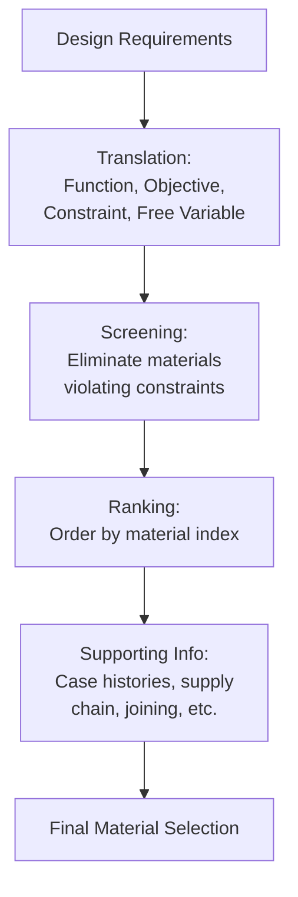

## Overview of Materials Selection

### Overview

Materials selection is the systematic engineering process of identifying the optimal material (and often, simultaneously, the optimal shape/process) for a given component, given a set of functional requirements, constraints, and objectives. It is a decision-making discipline that sits downstream of the SPPP/tetrahedron framework: selection uses known structure-property relationships to match material capability to application demand, typically under competing constraints of performance, cost, mass, availability, and manufacturability.

### The Materials Selection Process (General Framework)

Materials selection is commonly structured as a four-step process, most closely associated with the methodology formalized by **Michael F. Ashby**:

1. **Translation**: Convert the design requirements into a formal statement — defining the component's **function**, **objective(s)**, **constraints**, and **free variables**.
2. **Screening**: Eliminate materials that fail to meet "go/no-go" constraints (e.g., must operate above 500°C, must be electrically insulating, must resist a specific corrosive environment).
3. **Ranking**: Order the remaining candidate materials by their ability to maximize (or minimize) the stated objective, typically using **material indices** (see below).
4. **Supporting information/documentation**: Investigate the top-ranked candidates in detail — supply chain, joinability, prior case histories, environmental/regulatory compliance — before final selection.

### The Four Elements of Translation

| Element | Definition | Example (Lightweight Beam) |
| --- | --- | --- |
| **Function** | What the component must do | Support a bending load |
| **Objective** | What should be minimized/maximized | Minimize mass |
| **Constraint** | Non-negotiable requirement | Stiffness must exceed a specified value; must not fail under load |
| **Free variable** | Parameter the designer can still choose | Cross-sectional dimensions, material choice |

**Key Point:** Confusing an objective with a constraint is a common design error. Cost, for instance, may be treated as a constraint (must not exceed a budget) in one design problem, or as the objective itself (minimize cost) in another — the correct framing entirely changes which selection methodology and material indices apply.

### Material Property Charts (Ashby Charts)

A central tool in modern materials selection is the **material property chart** (or Ashby chart), which plots one material property against another (both typically on logarithmic scales) across the full range of engineering material classes (metals, ceramics, polymers, composites, foams, natural materials), revealing clustering and enabling visual identification of candidate materials.

- Common chart pairs: Young's modulus ($E$) vs. density ($\rho$); strength vs. density; fracture toughness vs. strength; cost vs. density.
- Materials with similar bonding/structure cluster into recognizable regions (e.g., all engineering ceramics cluster in a high-modulus, high-density region distinct from polymers).
- **Selection lines/guidelines**: Lines of constant material index (e.g., $E/\rho$, $E^{1/2}/\rho$, $E^{1/3}/\rho$) can be superimposed on the chart; materials lying on or above a given guideline satisfy the corresponding design objective optimally for a specific loading mode.

### Material Indices: Deriving the Ranking Criterion

A material index is a combination of properties that characterizes a material's performance for a specific structural function and objective, derived by combining the objective function, the constraint equation, and the free variable, then eliminating the free variable.

**Worked Derivation: Minimum-mass, stiffness-limited beam in bending**

- **Objective**: Minimize mass, $m = A L \rho$ (where $A$ = cross-sectional area, $L$ = length, $\rho$ = density)
- **Constraint**: Bending stiffness $S = \dfrac{C E I}{L^3}$ must meet or exceed a specified value (where $C$ is a geometric constant, $E$ is Young's modulus, $I$ is the second moment of area)
- For a beam with a square cross-section, $I \propto A^2$, so solving the constraint equation for $A$ (the free variable) and substituting into the mass equation yields:

$$m \propto L^{5/2} S^{1/2} C^{-1/2} \left(\frac{\rho}{E^{1/2}}\right)$$

The material-dependent term, $\dfrac{\rho}{E^{1/2}}$, should be **minimized**. Equivalently, engineers rank materials by **maximizing** its reciprocal:

$$M = \frac{E^{1/2}}{\rho}$$

This is the well-known material index for minimum-mass design of a stiffness-limited beam — it explains why materials like balsa wood, composites, and certain ceramics can outperform steel in stiffness-critical, weight-sensitive applications despite steel's higher absolute stiffness.

**[Inference]** The exact exponent in the index (1/2, 1/3, etc.) depends on the specific loading mode (bending vs. axial tension vs. torsion) and cross-sectional shape constraint (fixed shape vs. free shape); practitioners must re-derive or look up the appropriate index for their specific geometric and loading scenario rather than applying $E^{1/2}/\rho$ universally.

### Common Selection Scenarios and Indices

| Design Scenario | Objective | Constraint | Material Index (maximize) |
| --- | --- | --- | --- |
| Light, stiff tie-rod (axial tension) | Minimize mass | Fixed stiffness | $E/\rho$ |
| Light, stiff beam (bending, shape free) | Minimize mass | Fixed stiffness | $E^{1/2}/\rho$ |
| Light, stiff panel (bending, shape free) | Minimize mass | Fixed stiffness | $E^{1/3}/\rho$ |
| Light, strong tie-rod | Minimize mass | Fixed strength | $\sigma_y/\rho$ |
| Minimum-cost stiff beam | Minimize cost | Fixed stiffness | $E^{1/2}/(\rho \cdot C_m)$ (where $C_m$ = cost per unit mass) |

### Multi-Objective and Constrained Selection

Real design problems frequently involve multiple, sometimes conflicting, objectives (e.g., simultaneously minimizing mass and cost). Approaches include:

- **Trade-off (Pareto) methods**: Plotting candidates on two competing objectives (e.g., cost vs. mass) and identifying the Pareto frontier — the set of materials for which no other candidate is better in both objectives simultaneously.
- **Penalty functions/weighting**: Combining multiple objectives into a single weighted scalar value, requiring the designer to assign relative importance (weighting factors) — inherently subjective and sensitive to the chosen weights.
- **Digital logic/weighted property method**: Pairwise comparison of criteria to derive relative importance factors, followed by scoring each candidate material against weighted criteria.

### Non-Property Selection Factors

Beyond quantifiable material indices, real-world selection incorporates factors that resist simple charting:

- **Manufacturability**: Compatibility with intended shaping process (castability, formability, machinability, weldability)
- **Availability and supply chain risk**: Lead time, geographic sourcing concentration, geopolitical exposure (particularly relevant for critical/rare elements)
- **Environmental and regulatory compliance**: RoHS, REACH, recyclability, embodied carbon
- **Service history and reliability data**: Prior field performance in comparable applications, particularly weighted in safety-critical industries (aerospace, medical, nuclear)
- **Joining and assembly compatibility**: Ability to weld, bond, or fasten to adjacent components without introducing failure modes (e.g., galvanic corrosion at dissimilar-metal joints)

### Worked Example: Bicycle Frame Material Selection

- **Function**: Structural frame supporting rider weight and pedaling/impact loads
- **Objective**: Minimize mass while maintaining adequate stiffness (to avoid excessive frame flex) — a stiffness-limited beam/tube problem
- **Constraints**: Must survive fatigue loading over the product lifetime; must be affordable for the target market segment; must be manufacturable into a tube-and-joint or monocoque structure
- **Candidate comparison** (illustrative, using the $E^{1/2}/\rho$ index for tube-in-bending): Carbon-fiber-reinforced polymer (CFRP) typically ranks highest, followed by aluminum alloys, titanium alloys, and steel — consistent with the market reality that high-performance road bicycles predominantly use CFRP or aluminum frames.
- **Supporting information stage**: Despite CFRP's superior index ranking, final selection also weighs cost (CFRP fabrication is more expensive and labor-intensive), repairability (metal frames are more easily repaired after impact damage), and target market price point — illustrating why steel and aluminum frames remain common in non-premium market segments despite CFRP's property advantage.

### Conclusion

Materials selection formalizes the translation of design requirements into a specific material (and often process) choice through a structured sequence of translation, screening, ranking, and detailed supporting investigation. The material index — derived by combining objective, constraint, and free-variable equations — provides the quantitative ranking criterion underlying Ashby-chart-based selection, while non-property factors (manufacturability, cost, supply chain, regulatory compliance) ensure the final decision reflects practical engineering reality rather than property optimization alone. This process directly operationalizes the SPPP/tetrahedron framework by using known property data to select, rather than merely characterize, materials for engineering applications.

**Related Topics**

- Ashby Material Property Charts and Selection Charts
- Material Indices: Derivation for Various Loading Modes
- The Materials Science Tetrahedron
- Mechanical Properties: Stiffness, Strength, and Toughness
- Failure Analysis and Root Cause Methodology
- Sustainable Materials Selection and Life-Cycle Assessment