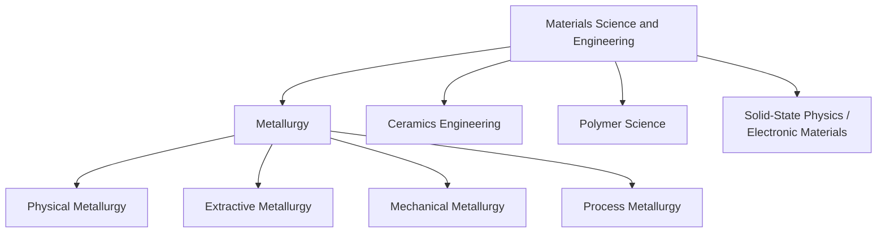

## Role of Metallurgy within Materials Science

### Overview

Metallurgy is the branch of materials science and engineering concerned specifically with **metals and their alloys** — encompassing their extraction from ores, processing into usable forms, and the study of their structure-property relationships. Historically, metallurgy predates the unified field of "materials science" by millennia, existing as an independent craft and later applied science before being subsumed as one of several constituent disciplines (alongside ceramics engineering, polymer science, and solid-state physics) that merged into the modern, unified materials science and engineering framework during the mid-20th century.

### Metallurgy's Position within the Broader Discipline

**Key Point:** Metallurgy is best understood not as a separate field from materials science, but as the metals-specific application of the same universal SPPP/tetrahedron principles (bonding, defects, phase transformations, microstructure-property relationships) that govern ceramics and polymers as well. What distinguishes metallurgy is the dominance of **metallic bonding** and its consequences: high dislocation mobility, extensive solid solubility and alloying behavior, and diffusion-controlled phase transformations that are unusually well-suited to deliberate microstructural engineering.

### The Major Subdisciplines of Metallurgy

**Extractive Metallurgy**

Concerned with obtaining metals from their naturally occurring ores and refining them to usable purity.

- **Pyrometallurgy**: High-temperature processes (smelting, roasting) — e.g., blast furnace reduction of iron ore.
- **Hydrometallurgy**: Aqueous chemical processes (leaching, solvent extraction, electrowinning) — e.g., copper extraction via heap leaching.
- **Electrometallurgy**: Electrolytic processes — e.g., aluminum production via the Hall-Héroult process.

**Physical Metallurgy**

The study of the relationship between composition, processing, microstructure, and properties of metals and alloys — the core scientific discipline linking directly to the SPPP framework.

- Phase diagrams and phase transformations (e.g., the iron-iron carbide diagram)
- Solidification and casting microstructure
- Diffusion and solid-state transformations
- Strengthening mechanisms (solid solution, precipitation, grain refinement, strain hardening)
- Heat treatment theory (annealing, quenching, tempering, aging)

**Mechanical Metallurgy**

Focuses on the mechanical behavior of metals under load.

- Elastic and plastic deformation, dislocation theory
- Fracture mechanics and fatigue
- Creep and high-temperature deformation
- Formability and workability (rolling, forging, extrusion, drawing)

**Process Metallurgy (Metal Forming/Manufacturing)**

The engineering of industrial-scale processes for shaping and joining metals.

- Casting, forging, rolling, extrusion, powder metallurgy
- Welding and joining metallurgy
- Surface treatment and coating

### Metallurgy's Distinctive Contributions to Materials Science

Several foundational concepts in general materials science originated specifically within metallurgical research before being generalized to other material classes:

| Concept | Metallurgical Origin | Generalized Application |
| --- | --- | --- |
| Phase diagrams | Fe-C system, binary alloy systems (Gibbs, Roozeboom) | Ceramic phase equilibria, polymer blends |
| Dislocation theory | Explaining metal plasticity (Taylor, Orowan, Polanyi, 1934) | Extended to ceramics (limited mobility) and semiconductors |
| Precipitation/age hardening | Al-Cu alloys (Wilm, 1906; explained mechanistically later) | Applied broadly to precipitation-strengthened systems |
| Grain boundary strengthening | Hall-Petch relationship in steels | Applied to ceramics, and (with caveats) nanocrystalline metals |
| Metallography (microstructural characterization) | Sorby's pioneering steel microscopy (1863) | Extended to all material classes as general "materials characterization" |

**[Inference]** The degree to which specific metallurgical models (e.g., classical Hall-Petch scaling) extend unmodified to non-metallic or nanoscale systems is an active research question in several sub-areas; the underlying strengthening *concept* (obstacles impeding dislocation or crack motion) generalizes well, but quantitative predictive accuracy can diverge outside the metallic, micron-to-millimeter grain size regime in which the relationships were originally established.

### Why Metallurgy Remains a Distinct, Named Specialization

Despite unification under materials science, "metallurgy" persists as a widely used professional and academic term (metallurgical engineering degrees, metallurgist job titles) for several reasons:

1. **Industrial scale and economic significance**: Ferrous and non-ferrous metal production remains one of the largest industrial sectors globally, sustaining dedicated extractive/process metallurgy expertise distinct from materials science's broader academic scope.
2. **Depth of alloy-specific knowledge**: Metal alloy systems (steels, aluminum alloys, titanium alloys, nickel superalloys) each have extensive, specialized bodies of processing-structure-property knowledge that constitute career-length specializations.
3. **Regulatory and standards infrastructure**: Metals-specific standards bodies (ASTM, ASM International, SAE) and certification frameworks (e.g., for structural/aerospace metals) maintain metallurgy as an organizationally distinct professional identity.
4. **Historical academic inertia**: Many university departments retain "Metallurgical Engineering" as a degree title or specialization track within broader Materials Science and Engineering departments.

### Metallurgy's Interfaces with Other MSE Subfields

- **With ceramics**: Shared reliance on phase diagram methodology and diffusion theory; metal-ceramic composites and coatings (e.g., thermal barrier coatings on nickel superalloy turbine blades) require integrated expertise.
- **With polymer science**: Metal-matrix and increasingly metal-polymer hybrid composites require cross-disciplinary understanding of interfacial bonding between dissimilar bonding types.
- **With solid-state physics/electronic materials**: Metallization layers in semiconductor devices (interconnects, contacts) require metallurgical understanding of thin-film diffusion, electromigration, and intermetallic compound formation at metal-semiconductor interfaces.
- **With biomaterials**: Biocompatible metallic implants (titanium, cobalt-chromium, stainless steel) require metallurgical expertise combined with biological/corrosion considerations specific to physiological environments.

### Worked Example: Metallurgy's Role in Aerospace Turbine Blade Development

- A nickel-based superalloy turbine blade requires simultaneous high-temperature strength, creep resistance, and oxidation resistance — a problem addressed almost entirely through physical metallurgy principles: precipitation strengthening via the coherent γ′ (Ni₃Al) phase, solid-solution strengthening from refractory alloying additions (W, Mo, Re), and grain boundary engineering (directional solidification, single-crystal casting) to eliminate transverse grain boundaries that would otherwise serve as creep-cavitation sites.
- This exemplifies metallurgy operating at the full SPPP chain within a single component: **Processing** (directional solidification/single-crystal casting) → **Structure** (elongated or eliminated grain boundaries, γ/γ′ microstructure) → **Properties** (creep resistance, high-temperature strength) → **Performance** (extended turbine blade service life under combined thermal and mechanical loading).

### Conclusion

Metallurgy functions within materials science as the discipline-specific application of universal structure-property principles to the metallic bonding regime, while also retaining independent identity due to its industrial scale, alloy-specific depth, and historical precedence. Many of materials science's most foundational conceptual tools — phase diagrams, dislocation theory, precipitation hardening, and metallographic characterization — originated within metallurgical research and were subsequently generalized across the broader field, making metallurgy simultaneously a subset of, and a historical wellspring for, materials science and engineering as a whole.

**Related Topics**

- History and Evolution of Materials Science
- The Iron-Carbon Phase Diagram and Steel Classification
- Strengthening Mechanisms in Metallic Alloys
- Dislocation Theory and Plastic Deformation
- Extractive Metallurgy: Pyrometallurgy, Hydrometallurgy, Electrometallurgy
- Superalloys and High-Temperature Metallurgy