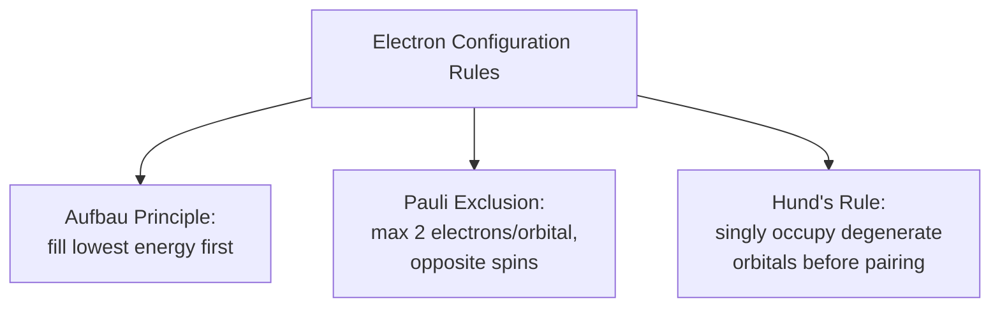
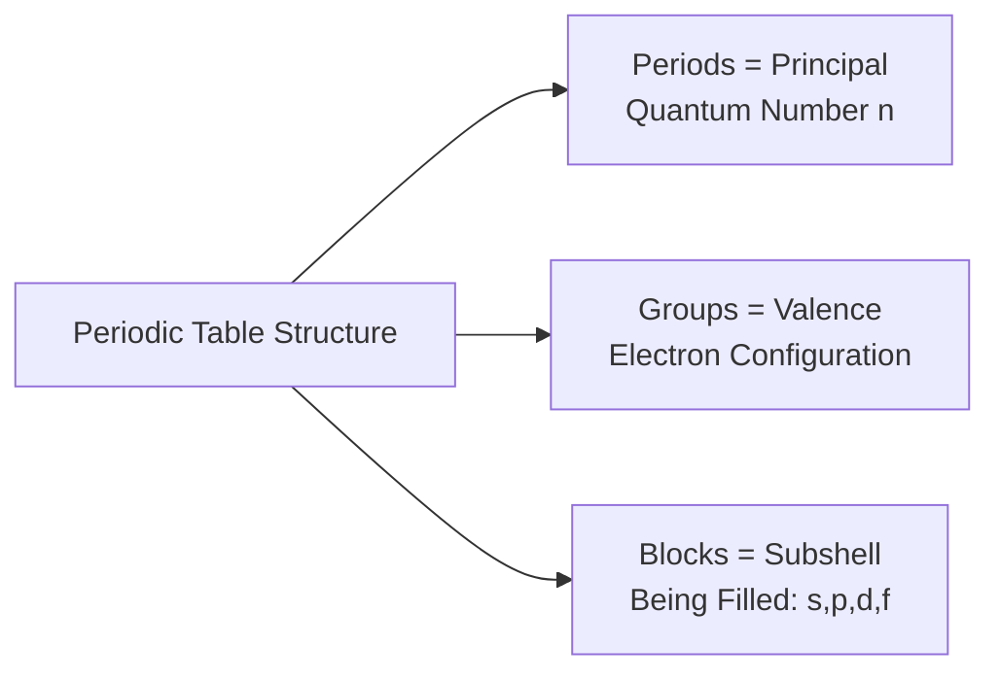

## Atomic Structure and Electron Configuration

### Overview

Atomic structure — the arrangement of protons, neutrons, and electrons within an atom, and specifically the distribution of electrons among discrete energy states — is the fundamental starting point for understanding materials behavior. Nearly every macroscopic material property (bonding type, electrical/thermal conductivity, optical behavior, chemical reactivity, magnetic behavior) traces directly back to how electrons are configured around the nucleus, since it is the outermost (valence) electrons that participate in interatomic bonding and determine chemical behavior.

### Basic Atomic Structure

An atom consists of:

- **Nucleus**: Composed of **protons** (positive charge, $+1.602 \times 10^{-19}$ C) and **neutrons** (no charge), contributing essentially all atomic mass. The number of protons defines the **atomic number** ($Z$), which determines the element's identity.
- **Electrons**: Negatively charged particles ($-1.602 \times 10^{-19}$ C) that occupy the space surrounding the nucleus in quantized energy states. The atomic mass number ($A$) equals the sum of protons and neutrons; **isotopes** of an element share the same $Z$ but differ in neutron count (and therefore $A$).

**Key Point:** In a neutral atom, the number of electrons equals the number of protons ($Z$). Ions form when an atom gains or loses electrons, producing a net charge — this is central to ionic bonding, discussed in a related topic.

### Quantum Mechanical Description of Electron Position

Unlike early planetary models (Bohr model), the modern quantum mechanical description treats electrons not as particles in fixed circular orbits, but as existing in probabilistic **orbitals** — three-dimensional regions of space where an electron is likely to be found, derived from solutions to the Schrödinger wave equation. Each electron's state is fully described by four **quantum numbers**.

**The Four Quantum Numbers**

| Quantum Number | Symbol | Physical Meaning | Allowed Values |
| --- | --- | --- | --- |
| Principal | $n$ | Energy level/shell; roughly corresponds to orbital size/distance from nucleus | $1, 2, 3, \ldots$ |
| Azimuthal (angular momentum) | $l$ | Subshell/orbital shape | $0$ to $n-1$ (denoted $s, p, d, f$ for $l = 0, 1, 2, 3$) |
| Magnetic | $m_l$ | Orbital orientation in space | $-l$ to $+l$ |
| Spin | $m_s$ | Electron's intrinsic angular momentum ("spin") | $+\frac{1}{2}$ or $-\frac{1}{2}$ |

**Shell and Subshell Nomenclature**

| $n$ (Shell) | Shell Letter | Subshells Present ($l$) | Max Electrons per Shell ($2n^2$) |
| --- | --- | --- | --- |
| 1 | K | 1s | 2 |
| 2 | L | 2s, 2p | 8 |
| 3 | M | 3s, 3p, 3d | 18 |
| 4 | N | 4s, 4p, 4d, 4f | 32 |

### Governing Rules for Electron Configuration

Three principles govern how electrons populate available orbitals in the ground state:

1. **Aufbau ("building-up") Principle**: Electrons occupy the lowest-energy orbitals available before filling higher-energy ones. The approximate filling order follows the diagonal ($n + l$) rule: 1s, 2s, 2p, 3s, 3p, 4s, 3d, 4p, 5s, 4d, 5p, 6s, 4f, 5d, 6p...
2. **Pauli Exclusion Principle**: No two electrons within the same atom can have an identical set of all four quantum numbers. Practically, this limits each orbital to a maximum of two electrons, which must have opposite spins.
3. **Hund's Rule**: Within a subshell containing multiple orbitals of equal energy (e.g., the three 2p orbitals), electrons singly occupy each orbital before any orbital receives a second electron, and singly-occupying electrons align their spins in parallel — this configuration minimizes electron-electron repulsion and is the lowest-energy (ground state) arrangement.

### Worked Example: Electron Configuration of Iron (Fe, Z = 26)

Following the Aufbau filling order for 26 electrons:

$$\text{Fe: } 1s^2\, 2s^2\, 2p^6\, 3s^2\, 3p^6\, 4s^2\, 3d^6$$

Note that the 4s subshell fills *before* 3d despite having a higher principal quantum number, because 4s has lower energy in neutral, unfilled atoms (a consequence of the $(n+l)$ approximate ordering rule) — a frequently misunderstood point, since intuition based on $n$ alone would predict 3d filling first.

**[Inference]** For transition metal *ions* (e.g., Fe²⁺, Fe³⁺), electrons are removed from the 4s subshell *before* the 3d subshell during ionization, despite 4s having filled first in the neutral atom — this apparent reversal is a well-documented, standard result of subshell energy ordering shifting once the atom is ionized, not an inconsistency in the filling rules themselves.

### Valence Electrons and Their Materials Significance

The **valence electrons** — those in the outermost (highest $n$) shell, plus any partially-filled inner subshells — determine an atom's bonding behavior and are the single most important electron-configuration concept for materials science.

| Element Type | Valence Electron Characteristic | Materials Consequence |
| --- | --- | --- |
| Alkali metals (Group 1) | 1 valence electron, loosely bound | High reactivity, easily ionized, excellent conductors |
| Transition metals | Partially filled d-subshells | Variable oxidation states, magnetic behavior, catalytic activity |
| Halogens (Group 17) | 7 valence electrons, near-complete shell | High electronegativity, readily forms anions |
| Noble gases (Group 18) | Complete valence shell (stable octet) | Chemically inert, no bonding tendency |

**Key Point:** The drive toward a stable, complete valence shell (the **octet rule**, or duet rule for very light elements) is the underlying thermodynamic motivation for all primary interatomic bonding (ionic, covalent, metallic) — atoms bond specifically to achieve a lower-energy, more stable electron configuration than they possess in isolation.

### Electron Configuration and the Periodic Table

The periodic table's structure is a direct visual encoding of electron configuration patterns:

- **Periods (rows)** correspond to the principal quantum number $n$ of the outermost shell being filled.
- **Groups (columns)** correspond to elements sharing the same valence electron configuration, explaining why elements within a group exhibit similar chemical bonding behavior.
- **Blocks (s, p, d, f)** correspond to which subshell is being filled — the s-block (Groups 1–2), p-block (Groups 13–18), d-block (transition metals), and f-block (lanthanides/actinides).

### Connection to Bonding and Material Properties

Electron configuration directly explains why materials fall into their characteristic bonding-based classes:

- **Metals**: Elements with few, loosely bound valence electrons readily delocalize them into a shared electron "sea," producing metallic bonding and the associated conductivity/ductility.
- **Ceramics**: Combinations of strongly electronegative and electropositive elements (e.g., O with Al, Si) favor electron transfer (ionic bonding) or strong directional sharing (covalent bonding).
- **Semiconductors**: Group IV elements (Si, Ge) with exactly 4 valence electrons form covalent networks with an intermediate, temperature-sensitive electronic band gap — the electron configuration basis of semiconductor behavior.

### Conclusion

Atomic structure and electron configuration provide the first-principles explanation for why materials behave as they do: the quantized arrangement of electrons — governed by the Aufbau principle, Pauli exclusion, and Hund's rule — determines each element's valence electron count and availability, which in turn dictates the type of interatomic bonding an element forms with others. This electron-configuration foundation is the necessary prerequisite for understanding ionic, covalent, and metallic bonding, and ultimately for explaining the bonding-based classification of materials into metals, ceramics, and polymers.

**Related Topics**

- Primary Interatomic Bonding: Ionic, Covalent, and Metallic
- Secondary (van der Waals) Bonding and Hydrogen Bonding
- The Periodic Table and Trends in Atomic Properties
- Electronegativity and Bond Character
- Band Theory and Electronic Structure of Solids
- Classification of Materials: Metals, Ceramics, Polymers, Composites