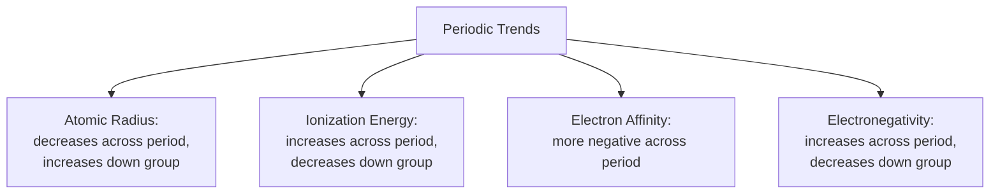
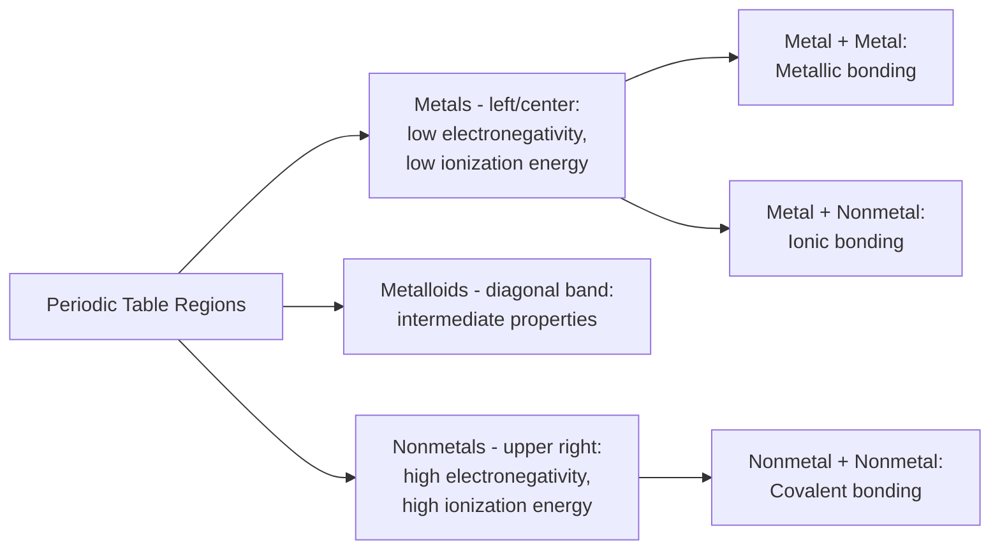

## Periodic Table Trends and Bonding

### Overview

The periodic table organizes elements such that properties recur systematically as a function of atomic number, reflecting the underlying periodicity of electron configuration. These recurring patterns — **periodic trends** — govern which type of interatomic bonding forms between any two elements, and by extension, determine the fundamental material class (metal, ceramic, polymer-forming molecular compound) that a given combination of elements will produce. Understanding periodic trends therefore provides a predictive, first-principles bridge between an element's position on the periodic table and the bonding behavior/material properties it will exhibit.

### The Four Primary Periodic Trends

**Atomic Radius**

- **Across a period (left to right)**: Decreases. Increasing nuclear charge (more protons) pulls the electron cloud inward more strongly, while electrons are added to the same principal shell (similar shielding).
- **Down a group (top to bottom)**: Increases. Each successive row adds a new principal quantum shell, increasing the average electron-nucleus distance despite increased nuclear charge.

**Ionization Energy** (energy required to remove the outermost electron)

- **Across a period**: Increases. Higher effective nuclear charge binds valence electrons more tightly.
- **Down a group**: Decreases. Valence electrons are farther from the nucleus and more shielded by inner-shell electrons, making them easier to remove.

**Electron Affinity** (energy change when an atom gains an electron)

- **Across a period**: Generally becomes more negative (more energy released, indicating stronger tendency to gain electrons), most pronounced approaching the halogens.
- **Down a group**: Generally becomes less negative, though with notable exceptions due to electron-electron repulsion effects in smaller atoms.

**Electronegativity** (an atom's tendency to attract shared bonding electrons toward itself, on the Pauling scale)

- **Across a period**: Increases.
- **Down a group**: Decreases.
- Fluorine (electronegativity ≈ 4.0) is the most electronegative element; francium and cesium are among the least (≈ 0.7).

**Key Point:** All four trends originate from the same two underlying causes: (1) increasing effective nuclear charge across a period pulling valence electrons closer and binding them more tightly, and (2) the addition of new principal shells down a group increasing electron-nucleus distance and shielding. Memorizing the trend direction is less valuable than understanding this shared causal mechanism, since it allows the trends to be re-derived rather than recalled.

### Electronegativity Difference as the Predictor of Bond Type

The single most useful periodic-trend-derived tool in materials science is using the **electronegativity difference** ($\Delta\chi$) between two bonding atoms to predict the character and type of the resulting bond.

| Electronegativity Difference ($\Delta\chi$) | Bond Character | Typical Bond Type |
| --- | --- | --- |
| $\Delta\chi \approx 0$ (same/similar element) | Nonpolar, symmetric electron sharing | Covalent (or metallic, if both are metals) |
| $0 < \Delta\chi < \sim 1.7$ | Polar covalent (unequal sharing) | Covalent with ionic character |
| $\Delta\chi > \sim 1.7$ | Substantial electron transfer | Predominantly ionic |
| Both atoms are metals (low, similar electronegativity) | Delocalized electron sharing | Metallic |

**[Inference]** The commonly cited $\Delta\chi \approx 1.7$ threshold (derived from Pauling's original correlation, corresponding to roughly 50% ionic character) is a useful heuristic rather than a sharp physical boundary — real bonds exist on a continuum between purely ionic and purely covalent, and the transition threshold can shift somewhat depending on which electronegativity scale (Pauling, Mulliken, Allred-Rochow) is used for the calculation.

### Worked Example: Predicting Bond Type from Electronegativity

Using approximate Pauling electronegativity values:

- **Na (0.9) and Cl (3.0)**: $\Delta\chi = 2.1$ → predominantly **ionic** bonding (NaCl), consistent with table salt's known ionic crystal structure and properties (high melting point, brittleness, aqueous dissociation into ions).
- **Si (1.8) and O (3.5)**: $\Delta\chi = 1.7$ → borderline, but conventionally treated as predominantly **covalent with substantial ionic character** in silicate/ceramic structures (e.g., SiO₂) — consistent with quartz's known covalent-network ceramic behavior.
- **C (2.5) and C (2.5)**: $\Delta\chi = 0$ → purely **covalent** bonding, as seen in diamond's covalent network structure.
- **Fe (1.8) and Fe (1.8)**: $\Delta\chi = 0$, both metals → **metallic** bonding, consistent with iron's characteristic ductility and conductivity.

### Periodic Table Regions and Their Bonding Tendencies

**Key Points**

- **Metals** (occupying the majority of the periodic table, left and center) have low electronegativity and low ionization energy — they readily lose valence electrons, favoring metallic bonding with other metals and ionic bonding with nonmetals.
- **Nonmetals** (upper-right region) have high electronegativity and high electron affinity — they tend to gain electrons, favoring covalent bonding with other nonmetals and ionic bonding with metals.
- **Metalloids** (a diagonal band including B, Si, Ge, As, Sb, Te) exhibit intermediate electronegativity and can display mixed covalent/metallic character — this region includes the technologically critical semiconductor elements (Si, Ge).

### Diagonal Relationships and Exceptions

- **The metalloid "staircase"** separating metals from nonmetals is not a sharp boundary; elements adjacent to it (e.g., Al, which is technically classified as a metal but shows some covalent bonding character in certain compounds) can exhibit intermediate behavior not perfectly predicted by simple electronegativity-difference rules.
- **Transition metals** show more complex trend behavior than main-group elements due to d-orbital filling effects (e.g., ionization energy and atomic radius trends across the transition series are less monotonic than in main-group periods), reflecting the shielding behavior of d-electrons.
- **Lanthanide contraction**: The unusually poor shielding provided by 4f electrons causes the atomic radii of elements immediately following the lanthanide series (e.g., Hf) to be smaller than a simple periodic trend extrapolation would predict, with downstream consequences for the chemical similarity of certain transition metal pairs (e.g., Zr and Hf).

### Application: Predicting Ceramic Compound Stability

Periodic trends also inform which ionic ceramic compounds are likely to form stable structures, via the **radius ratio rule**, which relates the ratio of cation to anion ionic radii ($r_{cation}/r_{anion}$) to the resulting stable coordination number and crystal structure (e.g., rock salt, cesium chloride, zinc blende structures) — since ionic radii themselves follow systematic periodic trends (radius generally decreasing with increasing positive charge/oxidation state for isoelectronic ions).

**[Inference]** The radius ratio rule provides useful first-order guidance for predicting coordination geometry in simple ionic ceramics, but real crystal structures are also influenced by covalent bonding contributions and specific electronic effects not captured by a purely geometric ionic radius ratio, so it functions as a heuristic rather than an exact predictive law across all ionic compounds.

### Conclusion

Periodic table trends — atomic radius, ionization energy, electron affinity, and electronegativity — are systematic consequences of increasing effective nuclear charge across periods and increasing principal shell number down groups. Of these, electronegativity difference between bonding atoms is the single most actionable predictive tool in materials science, directly forecasting whether a given pair of elements will form ionic, covalent, or metallic bonds — and by extension, whether the resulting material will behave as a ceramic, a covalently-bonded compound, or a metal. This connects the abstract quantum-mechanical electron configuration concepts directly to the practical, macroscopic classification of engineering materials.

**Related Topics**

- Atomic Structure and Electron Configuration
- Primary Interatomic Bonding: Ionic, Covalent, and Metallic
- Secondary (van der Waals) Bonding and Hydrogen Bonding
- Ionic Radii and Crystal Structure Prediction (Radius Ratio Rule)
- Classification of Materials: Metals, Ceramics, Polymers, Composites
- Band Theory and Electronic Structure of Solids