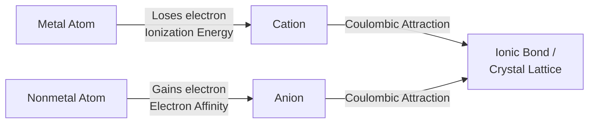
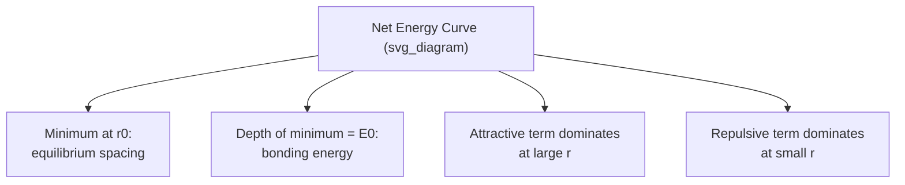
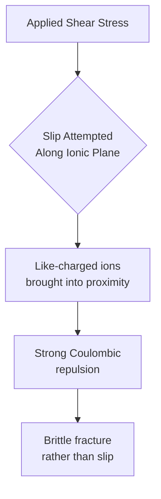

## Ionic Bonding

### Definition and Mechanism

Ionic bonding is a type of primary (strong) interatomic bond arising from **electrostatic attraction** between oppositely charged ions, formed when one or more electrons are transferred from an atom of low electronegativity (typically a metal) to an atom of high electronegativity (typically a nonmetal). The donor atom becomes a positively charged **cation**, and the acceptor atom becomes a negatively charged **anion**; the resulting Coulombic attraction between them constitutes the bond.

**Key Point:** Ionic bonding is fundamentally **non-directional** — the electrostatic attraction between a cation and anion acts equally in all directions around each ion, in contrast to covalent bonding's directional, orbital-overlap-dependent character. This non-directionality is the origin of many characteristic ceramic structural and mechanical behaviors.

### Formation Mechanism: Electron Transfer

Ionic bond formation can be conceptualized in three stages (illustrated via the classic NaCl example):

1. **Ionization of the metal**: The metal atom loses one or more valence electrons, requiring an energy input equal to its **ionization energy** ($IE$).

   $$\text{Na} \rightarrow \text{Na}^+ + e^- \quad (IE_{Na} = +496 \text{ kJ/mol})$$
2. **Electron affinity of the nonmetal**: The nonmetal atom gains the electron(s), releasing energy equal to its **electron affinity** ($EA$).

   $$\text{Cl} + e^- \rightarrow \text{Cl}^- \quad (EA_{Cl} = -349 \text{ kJ/mol})$$
3. **Electrostatic (Coulombic) attraction**: The oppositely charged ions attract, releasing substantial **lattice energy** as they arrange into a stable crystalline lattice — this lattice energy term is what makes the overall process strongly energetically favorable, since ionization energy alone would otherwise make electron transfer endothermic.

### The Coulombic Attractive Force and Bond Energy

The attractive force between two ions is described by Coulomb's law:

$$F_A = \frac{1}{4\pi\varepsilon_0}\frac{|Z_1 e||Z_2 e|}{r^2}$$

where $Z_1$, $Z_2$ are the ion valences (charge numbers), $e$ is the elementary charge, $r$ is the interionic separation distance, and $\varepsilon_0$ is the permittivity of free space.

The corresponding attractive potential energy is:

$$E_A = -\frac{A}{r}$$

This attractive term is balanced at very short range by a strong repulsive force arising from overlapping electron clouds (Pauli exclusion repulsion), typically modeled as:

$$E_R = \frac{B}{r^n}$$

The **net bonding energy** is the sum of these terms:

$$E_N = -\frac{A}{r} + \frac{B}{r^n}$$

The **equilibrium interatomic spacing** ($r_0$) occurs where net energy is minimized (where attractive and repulsive forces balance), and the **bonding energy** ($E_0$) is the depth of this energy minimum — corresponding physically to the energy required to separate the ion pair to infinite distance.

**Key Point:** Ionic bonding energies are among the highest of all primary bond types (typically 600–1500 kJ/mol), directly explaining the characteristically high melting points of ionic ceramics — greater energy input (heat) is required to overcome the strong Coulombic attraction and separate the ion lattice.

### Coordination Number and the Radius Ratio Rule

Because ionic bonding is non-directional, the geometric packing arrangement of ions in a stable ionic crystal structure is governed primarily by the relative sizes of the cation and anion, quantified via the **cation-to-anion radius ratio**:

$$\text{Radius Ratio} = \frac{r_{cation}}{r_{anion}}$$

| Radius Ratio Range | Coordination Number | Geometry | Example Structure |
| --- | --- | --- | --- |
| 0.155 – 0.225 | 3 | Triangular | — |
| 0.225 – 0.414 | 4 | Tetrahedral | Zinc blende (ZnS) |
| 0.414 – 0.732 | 6 | Octahedral | Rock salt (NaCl), MgO |
| 0.732 – 1.0 | 8 | Cubic | Cesium chloride (CsCl) |

**[Inference]** The radius ratio rule provides a useful first-order geometric prediction of coordination number and crystal structure, but numerous stable ionic compounds deviate from the "ideal" boundaries due to partial covalent bonding character or specific electronic effects — it functions as a design heuristic rather than an exact predictive law in every case.

### Requirement for Electrical Neutrality

Ionic crystal structures must maintain overall charge neutrality, meaning the ratio of cations to anions in the compound formula is fixed by their respective valences:

$$\text{For compound } A_m X_p: \quad m \cdot Z_{cation} = p \cdot |Z_{anion}|$$

For example, in MgO ($\text{Mg}^{2+}$, $\text{O}^{2-}$), a 1:1 ratio maintains neutrality; in $\text{Al}_2\text{O}_3$ ($\text{Al}^{3+}$, $\text{O}^{2-}$), a 2:3 ratio is required.

### Characteristic Properties Arising from Ionic Bonding

The non-directional, strong electrostatic nature of ionic bonds produces a consistent, predictable set of macroscopic properties:

| Property | Behavior | Mechanistic Explanation |
| --- | --- | --- |
| Melting/boiling point | High | Strong Coulombic attraction requires substantial thermal energy to overcome |
| Hardness | High | Strong, uniformly distributed bonding resists indentation |
| Brittleness | High (low fracture toughness) | Non-directional bonds allow no analogue to metallic dislocation slip; any relative ion-plane displacement brings like-charged ions into close proximity, producing strong repulsion and fracture rather than plastic flow |
| Electrical conductivity (solid state) | Low (insulator) | Electrons are localized in transferred, bound states — no free electron sea as in metals |
| Electrical conductivity (molten/dissolved) | High | Mobile ions can carry charge once the rigid lattice is disrupted |
| Thermal conductivity | Low-to-moderate | Heat transfer via lattice vibrations (phonons) rather than free electrons |
| Optical transparency | Often transparent (wide band gap) | Electrons are tightly bound in ionic states, requiring high-energy photons to excite — many are transparent to visible light |

### Mechanistic Basis of Ceramic Brittleness

**Key Point:** The brittleness of ionic ceramics is directly explained by the non-directional bonding at the atomic level. In a metal, dislocations can glide along close-packed planes, with metallic bonding tolerating the resulting atomic rearrangement because bonding is non-directional *and* charge-neutral throughout. In an ionic crystal, an equivalent slip displacement would bring **like-charged ions into direct adjacency** across the slip plane, generating strong Coulombic repulsion. This repulsion makes dislocation glide in ionic crystals require vastly higher stress than in metals (or is effectively prohibited along most slip systems at room temperature), so ionic ceramics fail by brittle fracture (bond rupture) rather than plastic deformation under typical loading conditions.

### Worked Example: Comparing NaCl and MgO

| Property | NaCl | MgO |
| --- | --- | --- |
| Ion charges | $\text{Na}^+, \text{Cl}^-$ (both $\|Z\|=1$) | $\text{Mg}^{2+}, \text{O}^{2-}$ (both $\|Z\|=2$) |
| Melting point | 801°C | 2852°C |
| Bond strength | Lower | Substantially higher |

The dramatically higher melting point of MgO relative to NaCl is explained directly by Coulomb's law: bonding energy scales with the product of ion charges ($Z_1 \times Z_2$), so MgO's divalent ion pair ($2 \times 2 = 4$) produces roughly four times the electrostatic attraction of NaCl's monovalent pair ($1 \times 1 = 1$) at comparable interionic spacing, directly accounting for its much stronger bonding and correspondingly higher melting point.

### Ionic Bonding's Role in Materials Classification

Ionic bonding is the primary bonding mechanism in **traditional and many engineering ceramics** (oxides, halides, and other compounds formed between strongly electropositive and electronegative elements). Its non-directional, high-energy, charge-balanced nature directly accounts for the defining ceramic property cluster: high hardness and melting point, high compressive strength, brittleness, and electrical insulation — properties that distinguish ceramics from the metallic and polymeric material classes discussed elsewhere in this curriculum.

### Conclusion

Ionic bonding arises from electron transfer between atoms of significantly different electronegativity, producing oppositely charged ions held together by non-directional Coulombic attraction. The strength of this bonding — governed by ion charge magnitude and interionic spacing per Coulomb's law — directly explains the high melting points, hardness, and brittleness characteristic of ionic ceramic materials, while the requirement for charge neutrality and the radius-ratio-dependent coordination geometry govern the specific crystal structures such compounds adopt. Understanding ionic bonding at the atomic level is therefore the direct mechanistic foundation for predicting and explaining the majority of properties associated with the ceramic materials class.

**Related Topics**

- Covalent Bonding and Directional Bond Character
- Metallic Bonding and the Free Electron Model
- Ionic Crystal Structures (Rock Salt, Zinc Blende, Fluorite, Perovskite)
- Secondary (van der Waals) Bonding and Hydrogen Bonding
- Classification of Materials: Metals, Ceramics, Polymers, Composites
- Periodic Table Trends and Bonding