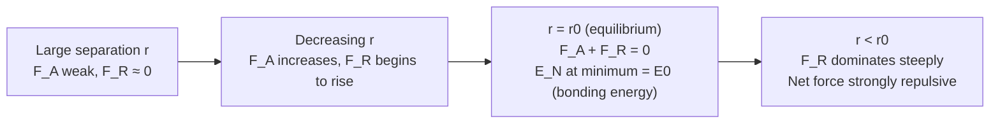

## Bond Energy and Interatomic Forces

### Fundamental Concept

The interaction between any two isolated atoms, as they are brought from a large separation distance to close proximity, is governed by two opposing forces: an **attractive force** and a **repulsive force**. The net force between the atoms, $F_N$, is the sum of these two contributions:

$$F_N = F_A + F_R$$

where $F_A$ is the attractive force and $F_R$ is the repulsive force (with sign conventions such that attraction and repulsion oppose one another).

### Attractive and Repulsive Forces

- **Attractive force ($F_A$)**: depends on the specific type of bonding (ionic, covalent, metallic, or secondary/van der Waals) and arises from the electrostatic or electronic interactions between the two atoms. This force dominates at relatively larger interatomic separations.
- **Repulsive force ($F_R$)**: arises at very small interatomic separations, primarily due to the overlap and mutual repulsion of the negatively charged electron clouds of the two atoms (a consequence of the Pauli exclusion principle), as well as repulsion between the positively charged nuclei at extremely close range. This force dominates at small separations and rises very steeply as atoms are pushed closer together.

Both $F_A$ and $F_R$ depend on interatomic separation distance, $r$. As $r$ decreases from a large value, the magnitude of $F_A$ increases faster initially, but as the atoms get very close, $F_R$ increases much more rapidly (and dominates) due to the steep repulsive interaction.

### Equilibrium Interatomic Spacing

At some specific equilibrium separation, $r_0$, the attractive and repulsive forces balance exactly, such that the net force is zero:

$$F_A + F_R = 0$$

This equilibrium distance $r_0$ (on the order of a few tenths of a nanometer, i.e., approximately 0.1–0.5 nm for many materials) represents the **equilibrium interatomic spacing** — the average distance separating the centers of two adjacent atoms under static conditions (e.g., at 0 K, ignoring thermal vibration). For many solid materials, $r_0$ corresponds approximately to the interatomic spacing found in the crystal lattice.

### Force-Energy Relationship

Force and potential energy are related; the potential energy between two atoms, $E_N$, is related to the net force by:

$$E_N = \int F_N \, dr = \int (F_A + F_R) \, dr$$

Correspondingly, the net potential energy is the sum of attractive and repulsive energy contributions:

$$E_N = E_A + E_R$$

At the equilibrium spacing $r_0$, the net potential energy $E_N$ is at a **minimum** — this minimum value is termed the **bonding energy**, $E_0$, and represents the energy that would be required to separate the two atoms to an infinite distance (i.e., to completely break the bond). Equivalently, $E_0$ is the magnitude of energy released upon forming the bond from initially infinitely-separated atoms. Mathematically, the minimum in $E_N$ occurs precisely where the net force is zero, since force is the negative derivative of potential energy with respect to separation distance:

$$F_N = -\frac{dE_N}{dr}$$

### Force-Separation and Energy-Separation Curves

The relationship between force, potential energy, and interatomic separation is classically represented by paired curves:

- On the **force-versus-separation curve**, $F_A$ and $F_R$ are plotted as separate curves along with their sum $F_N$; the point where $F_N$ crosses zero (where $F_A$ and $F_R$ curves intersect in magnitude) corresponds to $r_0$.
- On the **potential energy-versus-separation curve**, the curve for $E_N$ shows a trough (minimum) at $r = r_0$, with the depth of the trough below zero (the energy of fully separated atoms) equal to $E_0$, the bonding energy.

The following diagram illustrates the characteristic force-separation and energy-separation curve relationship:

### Significance of Bonding Energy Magnitude

The magnitude of the bonding energy $E_0$ and the shape (specifically, the curvature/steepness) of the energy-separation curve near its minimum are directly correlated with several important macroscopic material properties:

| Property | Relationship to $E_0$ / Curve Shape |
| --- | --- |
| Melting temperature | Materials with large (deep) bonding energies generally have high melting temperatures |
| Elastic modulus (stiffness) | A narrow, steep-sided ("deep and narrow") energy trough corresponds to a high elastic modulus, since a large force is required to change $r_0$ by a small amount |
| Coefficient of thermal expansion | A shallow, broad, and asymmetric ("shallow") energy trough corresponds to a high thermal expansion coefficient, since the asymmetry allows the average interatomic separation to increase substantially with increasing thermal (vibrational) energy |

[Inference] These correlations are generally well-established qualitative trends taught in materials science, though the precise quantitative relationship between curve shape and a given property also depends on crystal structure, bonding type distribution, and anharmonicity effects specific to each material system, so the curve shape should be understood as a useful conceptual model rather than a tool for precise numerical prediction of properties from first principles.

### Bond Energies Across Bonding Types

Bond energies vary substantially by bonding mechanism, which is consistent with the differences in melting temperature and mechanical behavior discussed in the sections on ionic, covalent, metallic, and secondary bonding:

| Bond Type | Approximate Bonding Energy Range |
| --- | --- |
| Ionic | ~600–1500 kJ/mol |
| Covalent | ~125–1150 kJ/mol |
| Metallic | ~68–850 kJ/mol |
| Secondary (van der Waals) | ~4–30 kJ/mol |
| Hydrogen bonding | Up to ~51 kJ/mol |

### Key Points

- Net force $F_N = F_A + F_R$; equilibrium occurs where $F_N = 0$ at separation $r_0$
- Net potential energy $E_N = E_A + E_R$ is minimized at $r_0$; this minimum magnitude is the bonding energy $E_0$
- $F_N = -dE_N/dr$, linking the force and energy curves mathematically
- Deep energy well → high melting point and high stiffness; shallow/asymmetric well → high thermal expansion
- This framework applies universally across ionic, covalent, metallic, and secondary bonding — only the specific form and magnitude of $F_A$ (and hence $E_A$) differ between bonding types

### Related Topics

- Ionic Bonding
- Covalent Bonding
- Metallic Bonding
- Van der Waals and Secondary Bonding
- Elastic Modulus and Stiffness
- Thermal Expansion of Materials
- Melting Point and Bonding Energy Correlations
- Atomic Structure and Electron Configuration